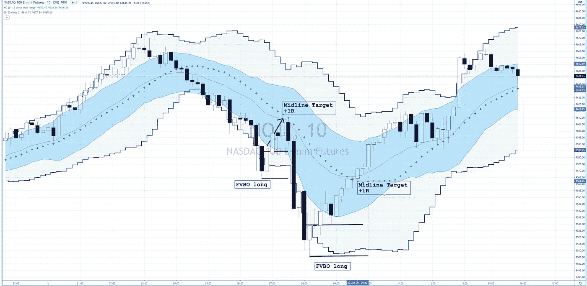
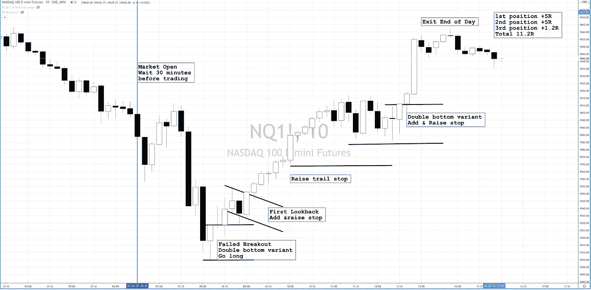

# 日交易牛市平静市场制度

> 原文：<https://medium.datadriveninvestor.com/day-trading-the-bull-quiet-market-regime-1972a6ddbe4f?source=collection_archive---------9----------------------->

这是我关注的焦点，当前的市场机制在任何时候都是如此。

我们将市场机制分为 6 个不同的机制，每个机制都有独特的特征。每个市场体系的特征给了我线索，让我知道在每个体系中什么样的策略表现最好。

我不会把今天所有的制度都罗列出来，让这篇文章比实际需要的要长得多，我会深入研究 **Bull Quiet。**

> 首先，牛市安静机制是所有机制中最容易交易的。几乎可以说，这是一个纪律最没用的政权。

首先，牛市安静机制是所有机制中最容易交易的。

*   止损对你的多头头寸没什么用
*   只是时间长
*   用任何借口长篇大论
*   使用任何借口来增加你的多头头寸
*   如果它对你不利，等待它结束
*   长一点，因为一周中的最后一个字母是 Y

我知道这有点荒谬，但这并不意味着这是假的。

让我们从日内交易开始。我还做了一个关于 RTY 美元交易的视频

[https://www .pol 花粉贸易. com/blog/day trading-rty-bull-quiet](http://email.c.kajabimail.net/c/eJwtjs1qwzAQhJ_GuhQL_UWJDjq4mEDPfYCw0qr2poqdKkqN375qKSyzMB-7M-gPB8TAyCuhhLBCy6bGccmddVqdhnEQr-PZHofOiMg_4QqBbkCZL6my2SejMICx0UFMYE4xIVoDHzpgsPqILPu51vuj00Onzm22beP3NWdaoKZaAGmZeFxvDYW8Tm0h7P9-X-reh2fO_deTWlz6Db5gyvSdyn4h9NJKJ6R2RrDi41zogWtjrev0V7I9ZtW_U00vb2OntG0H5gfd7E3U)

现在让我们看看日内交易 NQ 纳斯达克期货，如果你是一个非常有纪律的系统交易者，有两个 FVBO 多头设置 2/2 的+2R。

这是我喜欢的另一种交易方式，不使用严格的系统方法。这将是失败的突破反转，第一次回顾，并找到任何理由增加。

这就是所谓的价格行为交易。

这就是我日内交易多头的方法，而实际上我是日内交易。有许多交易者在牛市平静时成功地运用了这种价格行动风格。

第一次进场——失败的突破/双底变体使用我在持续盈利交易者课程中介绍的技术做多，学习如何进场和如何管理交易

第二次进场——“第一次回望”，这是反转底部后的牛市标志，我只是认为这是市场的第一次回望，看看它是否想从那里抛售或起飞。当价格突破这个回调时，胜率急剧上升，我在这里急剧加仓。

 [## 使用谷歌搜索趋势预测首次申请失业救济人数|数据驱动的投资者

### 几年来，我的重点一直是使用多种替代数据来预测宏观经济统计数据…

www.datadriveninvestor.com](https://www.datadriveninvestor.com/2020/03/25/using-google-search-trends-to-predict-initial-jobless-claims/) 

第三次进场——在下午盘整后，另一个双底变体再次出现，使用 CPT 课程中的技巧，我再次加仓。这是交易的最后阶段，也是利润最大化的阶段。你是在“用市场的钱”来增加一些利润。它很快，通常是一天中的最后一点。

如果你是一个喜欢做日内交易的交易者，这两个牛市安静机制的策略是印钞机。

你可以用非常有纪律的 FVBO 交易击中它，并获得非常高的+2R 胜率，或者你可以是有点价格行动类型的交易者，带着+11R 离开

或者你可以坐以待毙，连续做多几个月，在任何一天出现抛售、任何疲软或任何突破时增加仓位。又一次任何理由要长。