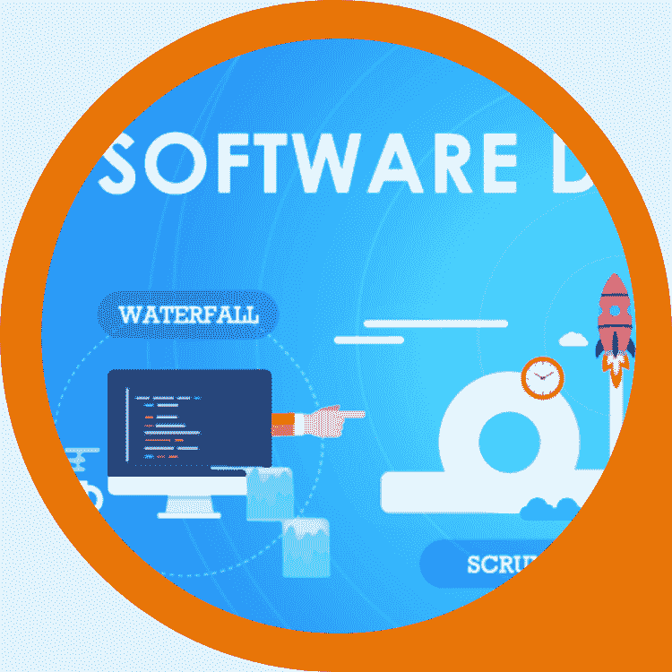

# DDI 将你与你所在行业的专业作家联系起来。

> 原文：<https://medium.datadriveninvestor.com/ddi-connects-you-to-writers-with-expertise-in-your-industry-2b8757e9fec6?source=collection_archive---------17----------------------->

## **DDI 英特尔| 9 月 7 日开始的一周**

# 家政

**我们正在向媒体之外扩张。**

当我们将您的文章发布到我们的[领先网站](https://www.datadriveninvestor.com/)时，它就有资格出现在 DDI 英特尔时事通讯中。让我们与全球 60，000 多名订户和观众分享您的顶级作品。

在大数据、人工智能、物联网、创业文化或技术相关领域有下一个大故事吗？请[寄给我们一份草稿](https://datadriveninvestor.com/mainsubmission)。

# DDI 媒体& DDI 写手来啦！

你可能已经注意到，在过去的几个月里，我们在这份时事通讯中尝试了相当多不同种类的内容。

像数据驱动型投资者这样的初创公司肯定会经历成长的痛苦，我们感谢所有与我们站在一起的人。我们非常感谢数百名作家和主题专家，他们为我们的出版物增加了巨大的价值。

我们即将发布几个项目，这些项目将彻底改变数据驱动投资者的步伐。

首先，进入 **DDI Media** ，这是一个为公司和专家提供的一站式数字市场，可以找到对他们的利基行业充满热情的作家。

通过 **DDI Writer** ，我们为专业作家提供的入职平台，我们正在充实人才库。当您联系 DDI Media 时，我们将为您匹配拥有您需要的专业知识和制作高质量内容的良好记录的作者。

不是每个人都是文字专家。

同样，在 Medium.com 等地打印内容的人通常不是为了写作而写作。他们带着动机发表文章，比如为文案或 SEO 合同争取客户。

其他人写作是为了展示他们的编程或摄影经验。他们不一定是最好的作家。

通过 DDI Media，我们帮助专家发展他们的声音，同时也确保作家的市场。

真正的作家，真正的人。没有 Fiverr 的统计数据，没有投资组合来证明他们有能力。随着在家工作的经济变得司空见惯，我们正在建立人们在互联网上互动的必要组成部分。

**让我们一起开始你的下一个大项目。**

最初，我们对 DDI 媒体的关注是基于写作的项目和 SEO。很快，我们将包括一系列其他选项，如图形设计。

**我们目前接受的项目包括:**

*   文章、白皮书、网络文案、搜索引擎优化(SEO)、电子书(取决于范围)、社交媒体内容创作和文案。

DDI Media、DDI Writer 和我们正在进行的各种其他项目将有单独的网页，我们将很快向公众公布。现在，请将问题发送到以下地址:

**members@datadriveninvestor.com**

如果您想注册成为主题专家(SME)作家，请发送主题为“DDI-Writer”的电子邮件

有关 DDI 媒体合同的所有咨询，请使用主题行“DDI-Media”

# DDI 编写器亮点

要想成为英特尔 DDI 和 Datadriveninvestor.com[的主角，请与](https://www.datadriveninvestor.com/)[一起提交此表格](https://datadriveninvestor.com/mainsubmission)。

**注意:**“作家集锦”部分最终将成为“会员之角”区域，我们将继续收集你们所有人的精彩贡献。

这个月，我们主要对 AMA 风格的提问、关于技术、商业和经济的深度评论以及与自我转变和企业家精神相关的强有力的个人故事感兴趣。

综上所述，我们希望建立一个专家社区，在我们的网络中进行合作并获得有偿合同。

让我们共同努力。要了解更多关于会员之角的信息，请向下滚动到末尾。

## [导致颠覆性趋势的客户行为](https://www.datadriveninvestor.com/2020/09/04/customer-behavior-leading-to-disruptive-trends/)

“随着世界正在收获第四次工业革命的好处，颠覆性技术也正在进化到最美好的阶段。”—巴拉克里希纳五世

## [成本最低&提高网络安全的最有效途径](https://www.datadriveninvestor.com/2020/09/04/the-lowest-cost-most-effective-path-to-better-cybersecurity/)

"对于强大的网络安全来说，最好也是最容易被忽视的行动，可能是成本最低的."—亚历克斯·帕纳吉迪斯

## 我们需要停止混淆社会项目和社会主义

“目前的这种态度并不新鲜——只是美国长期传统的延续。这一传统可以追溯到普利茅斯和詹姆斯敦。”—汤姆·坎彭尼

## [创业顾问委员会的来龙去脉](https://www.datadriveninvestor.com/2020/07/03/the-ins-and-outs-of-advisory-boards-for-startups/)

“如果一切都做得正确而谨慎，建立一个顾问委员会可以让公司利用行业领先思想的知识，而没有任命新董事带来的麻烦或麻烦。”—路易·莱霍特

## 在疫情期间筹款？创业最有效的 4 种方法

“在疫情时期推介一家初创公司的基本原则与在正常时期没有什么不同。事实上，有一个强有力的论据表明，应该将这场危机视为一个启动某些事情的机会。”—阿米特·加尔格

# 再来说说风险投资。

## 技术远见者

**你对未来有什么憧憬吗？**可能是一个应用程序、一项新服务或一个问题的独特解决方案？

需要具备特定技能的人，或者需要特定类型的资源或数据？

还是你项目的投资人？

让我们知道 DDI 能帮上什么忙——你可以发送一些基本信息到 ventures@datadriveninvestor.com 的*。*

## *交易算法向导*

*如果你有一个能产生稳定业绩的交易策略，请告诉我们。我们也许能为你的扩建提供资金。联系我们在 research@datadriveninvestor.com 的研究团队。*

**如果您和我们一样对 DDI 英特尔感到兴奋，请转告我们。如果还没有，可以* [*订阅*](https://data-driven-investor.ck.page/a258e80d70) *。**

**

## *[自动化已经准备好带领我们走出危机，并赋予人们权力——以下是如何做到的](https://www.datadriveninvestor.com/2020/06/23/automation-is-poised-to-lead-us-out-of-the-crisis-and-empower-people-here-is-how/)*

*“虽然自动化领域的投资肯定会因疫情而有所放缓，但该领域拥有巨大的潜力，可以带领我们走出经济危机，实现稳健复苏。”—路易·莱霍特*

**

## *[如何在创业公司建立销售团队](https://www.datadriveninvestor.com/2020/06/26/how-to-build-a-sales-team-in-a-startup/)*

*“在成长周期中的某个时候，你将不得不放弃一些控制权，并开始雇佣合适的人才来履行企业内的不同角色。”—弗朗西丝卡·波罗*

**

## *[软件开发流程:如何挑选合适的？](https://www.datadriveninvestor.com/2020/01/16/software-development-process-how-to-pick-the-right-process/)*

*"为了减轻公司面临的问题，它应该追求定制软件开发."—塔伦·纳加尔*

**

## *[播客:营销自助餐的新秘方](https://www.datadriveninvestor.com/2019/12/18/podcasting-a-new-secret-sauce-to-your-marketing-buffet/)*

*“不是每个人都有拍摄视频的技能和预算。因为视频需要大量的设备和专业人员来正确地传达视频的真正含义。这就是播客成为理想选择的地方。”阿肖克·夏尔马*

**

## *[简化路线图](https://www.datadriveninvestor.com/2020/05/28/a-roadmap-to-simplicity/)*

*"对我来说，美丽的设计、迷人的艺术或鼓舞人心的文学作品总是以简洁为共同点."卡斯帕·林德·克罗格*

**

## *[为什么包容性财富指数比 GDP 更能衡量社会进步？](https://www.datadriveninvestor.com/2019/03/08/why-inclusive-wealth-index-is-a-better-measure-of-societal-progress-than-gdp/)*

*"许多国家以失去自然资本为代价实现了 GDP 的增长."费萨尔·汗*

**

*[**比特币基础知识:比特币入门**](https://www.amazon.com/dp/B08FBP9W4Y) 将帮助你开启与所有加密货币之母的旅程。了解构成比特币的基本概念，深入研究该项目的历史，等等。*

# *会员之角*

*这是一个空间，供我们的贡献者提供他们在网络上的其他作品的简介或段落。*

*想在会员之角分享你的想法，或者你对《数据驱动的投资者》上的一个故事有了有益的回应？*

*向 members@datadriveninvestor.com 发送一条主题为“会员-英特尔”的消息。*

*我们将在这里以及我们的领先网站上发布您的文章，您也可以在新闻简报中加入简短的行动号召(CTA)。没有人会无缘无故地写作，所以不要羞于推销你的服务，只要你能为我们的读者提供价值。*

# *对我们媒体出版物订户的提醒*

*你们中的一些人可能已经订阅了 DDI 的媒体出版物时事通讯和主要网站的时事通讯。我们欣赏粉丝，但两个简讯是同一只野兽。*

*如果你在这种情况下，我们建议坚持使用领先的网站。你会注意到正确的一个缺乏媒体品牌。如果你有任何问题，给我们发电子邮件:members@datadriveninvestor.com*