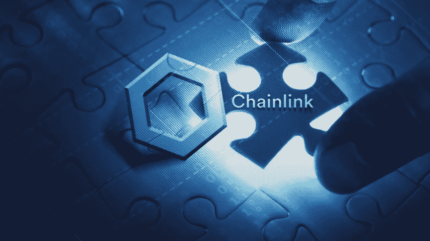
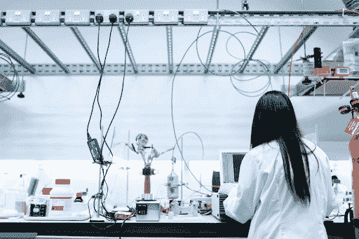
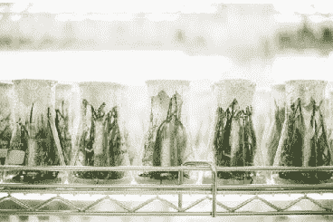
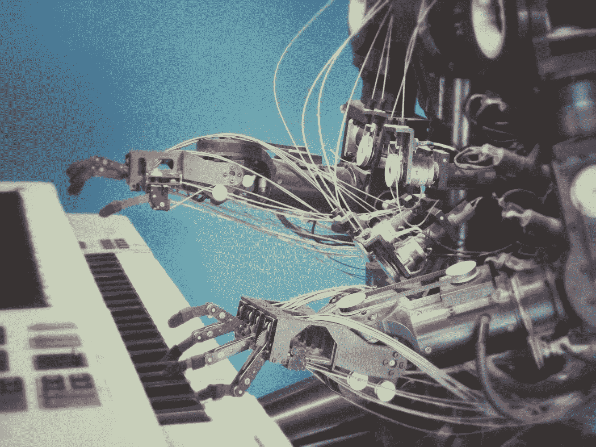

# DDI 重点——本周必读的 10 本书

> 原文：<https://medium.datadriveninvestor.com/ddi-highlights-the-10-must-reads-this-week-ff501b001cd0?source=collection_archive---------15----------------------->

## **DDI 投稿人集锦，8 月 15 日一周**

# 家政

**正在进行的项目:**

1.  **DDI 专家聊天程序:**一个协作市场，人们可以在这里与能够解决他们问题的专家聊天。你是专家吗？为你的时间和努力获得报酬！报名已经开始，[**跳上**](https://datadriveninvestor.com/expertchatregistration) **。**
2.  **【绝密】**想要提示？我们想奖励你的最佳表现。增加价值，获得价值，才有意义。

[*订阅 DDI 简讯*](https://www.datadriveninvestor.com/about/) *这样你就不会错过任何一个节拍。*

**最新 DDI 问题:**

*   [加密货币](https://medium.com/datadriveninvestor/aaaand-its-gone-706f05f8b254)
*   [市场&经济](https://medium.com/datadriveninvestor/executive-order-trumps-new-stimulus-tech-shake-up-f846d81d0239)
*   [技术](https://medium.com/datadriveninvestor/rocky-start-for-reels-global-tech-splinters-5g-gets-a-boost-33f9dc14662a)

# DDI 编写器亮点

每周我们都会为读者带来一些从 DDI 社区精选的故事。想让你的故事成为特色吗？[在这里提交你最好的](https://datadriveninvestor.com/mainsubmission)。

# 什么是“Oracle 问题”, ChainLink 如何解决它？

链环项目在区块链爱好者中引起了很大反响。除了价格猜测之外(费萨尔的文章发表时，LINK 的交易价格为 1.70 美元，在我们发送这份简讯时，超过了 17 美元)，**LINK 有什么用处？**

费萨尔·汗(Faisal Khan)讲述了 LINK 如何着手解决困扰智能合同的一个主要问题:坏数据。LINK 充当智能合约之间不同数据源(oracles)之间的桥梁，将垃圾从好的东西中分离出来。该公司已经取得了一些重大进展，赢得了令人印象深刻的客户。

Faisal 写道，“我们都很清楚，怀疑论者总是抱怨区块链项目的宣传太多，而真实世界的用例及应用太少。ChainLink 似乎也在跨越这个障碍。

## [**【阅读更多】**](https://www.datadriveninvestor.com/2019/06/15/what-is-the-oracle-problem-how-does-chainlink-solve-it/)

# 供应链:物联网如何传递真相

仓储不是一门精确的科学，但它可能是。

Josh Miramant 分享了对该领域专家的采访，以探索供应链 4.0 将如何通过机器人、人工智能、RFID、5G 和其他物联网技术的进步来变革每个行业。

创新供应链解决方案提供商 Tive 的首席执行官 Krenar Komoni 是使用先进传感器和 5G 跟踪技术的前沿人群之一。“额外的位置准确性让您可以精确定位每批货物，并在卡车离开 5 英里之前发送误放物品的通知，就像标准跟踪器一样。”

## [**【阅读更多】**](https://www.datadriveninvestor.com/2020/07/20/supp-lie-chain-how-iot-is-delivering-truth/)

# 为什么这个消息让你焦虑？

主流新闻标题被精心设计来吓唬我们。

现代新闻周期已经达到了现实扭曲的顶峰，焦虑水平正在飙升。更不用说，社交媒体的成瘾功能也于事无补。Dave Rauschenfels 解释了我们大多数人是如何陷入“末日滚动”的永久循环中的，以及这对我们的心理造成的影响。

“不确定性驱使人们不断搜索信息，试图重新获得控制权，”戴夫说。“但这些信息非但没有让我们重获控制，反而证实了我们的恐惧，并在恶性反馈循环中进一步加剧了我们的焦虑。”

## [**【阅读更多】**](https://www.datadriveninvestor.com/2020/07/31/why-is-the-news-making-you-anxious/)

# [剖析 STEM 中的性别差异](https://www.datadriveninvestor.com/2020/08/05/dissecting-the-gender-divide-in-stem/)

"**女性仅占 STEM 领域劳动力的 28%**。2020 年，STEM 劳动力不应该是这样的。”-拉曼迪普·塞尼

# 个性化:疲倦微笑的力量

“是时候了解更多关于人工智能的行为、能力和策略了。不是为了批评，而是为了不让它削弱我们的力量-诺伯特·比德日斯基

# 自由职业者拯救陷入困境的公司

“随着全球经济陷入困境，越来越多的经验丰富的人开始出手相救，因为各公司都在努力重新定位。”吉姆·卡扎曼

# [后疫情经济中一个重要的 GTM 变革策略](https://www.datadriveninvestor.com/2020/08/11/an-essential-gtm-change-strategies-in-the-post-pandemic-economy/)

**“疫情之前的商业模式可能会发生变化，以适应当前的形势。”**——巴拉克里希纳五世

# [是的，我们可以！SBIR 和 STTR 对美国小企业的资助](https://www.datadriveninvestor.com/2020/08/10/yes-we-can-the-sbir-and-sttr-grants-for-american-small-business/)

**“经济发展是统治人民，还是为人民服务？”苏珊·麦肯齐·安德森**

# [导致我们跌倒的自毁行为](https://www.datadriveninvestor.com/2020/08/10/self-sabotaging-behaviors-that-cause-us-to-stumble/)

“成功人士会找到抵消本能的方法。他们的行为是出于原则和纪律。”-布伦特·鲁普诺

# [创意如“种子”，创新如耕作](https://www.datadriveninvestor.com/2020/08/13/innovation-farm-and-a-pioneers-spirit-all-organization-and-you-need-to-still-have-a-say-in-the-future/)

“大多数公司认为创新是一种产品，而不是一个过程。这意味着**他们将大部分精力放在寻找“正确”的想法上，而不是建立将想法转化为对客户有价值的东西的过程**。-弗拉维奥·阿里贝蒂

# [AI 在你眼皮底下出奇的聪明](https://www.datadriveninvestor.com/2020/08/14/ai-is-surprisingly-smart-right-under-your-nose/)

"**营销人员不仅要关心，更要拥抱 AI。**——吉姆·卡扎曼

## 你应该知道这个:

# [多少钱会让你快乐？](https://www.datadriveninvestor.com/2020/01/23/how-much-money-will-make-you-happy/)

# 比特币到底是什么？

比特币被一些人誉为“数字黄金”，被另一些人誉为“纯粹的货币”，对许多人来说，它意味着许多东西。 [**比特币基础知识:比特币入门**](https://www.amazon.com/dp/B08FBP9W4Y) 帮助你开启比特币之旅。

这本书将帮助你对构成比特币的基本概念感到舒适，无论你是寻求了解还是准备亲自参与比特币。**了解比特币网络的关键特征**，解释如何将比特币从一个人转移到另一个人，深入研究**比特币的历史**，等等。