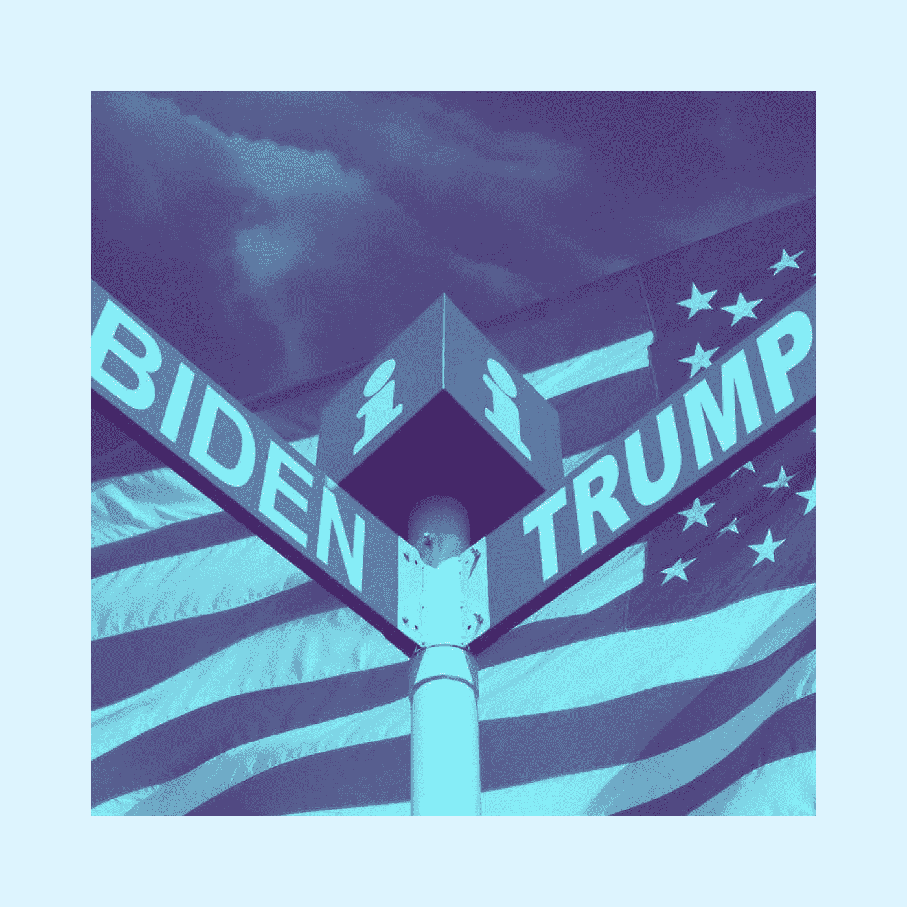
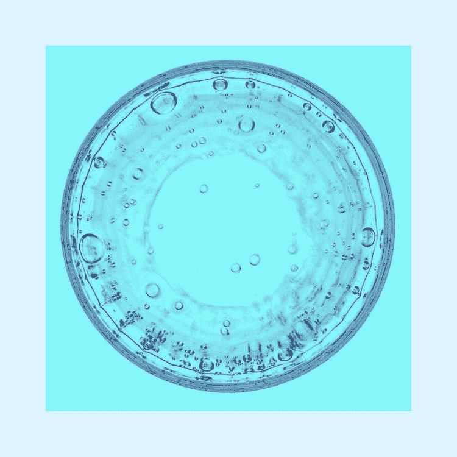
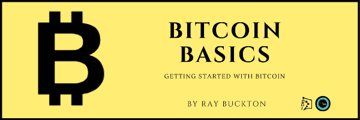

# 为您忙碌的周三准备的英特尔 10 大故事

> 原文：<https://medium.datadriveninvestor.com/ddi-intel-10-stories-for-your-busy-wednesday-7f53797504fd?source=collection_archive---------35----------------------->

## **DDI 英特尔| 9 月 2 日开始的一周**

# 家政

您对我们调查的回答非常有帮助。让他们来吧，我们想听听你的意见。

如果你还没有，[让我们知道你的想法](https://stoneba1992.typeform.com/to/gkpWMtS1)。

## **媒体很棒有很多原因，但是……**

当我们将您的文章发布到我们的[领先网站](https://www.datadriveninvestor.com/)时，它就有资格出现在 DDI 英特尔时事通讯中。让我们与全球 60，000 多名订户和观众分享您的最佳作品。

你在大数据、人工智能、物联网、创业文化或科技相关领域挖掘出了什么独特的东西吗？请寄给我们一份草稿。

# DDI 编写器亮点

如有可能在英特尔 DDI 和 Datadiveninvestor.com[上亮相](https://www.datadriveninvestor.com/)，请与[一起提交此表格](https://datadriveninvestor.com/mainsubmission)。

## 卡玛拉·哈里斯的经济政策到底有多有限？

“洞察 2020 年大选如何影响你的钱包或根本不动它。”亚历山大·拉戈

## 你以为你是谁？

“在我看来，国家不再是一个为全体人民的利益服务的宪法国家，而是作为一个公司运作，以私人实体的方式从许多人那里索取，给予少数人，并为自己的特殊利益服务。”苏珊·麦肯齐·安德森

## 诚实的安倍现在会怎么做？

“人人生而平等……”这句话写在纸上很好，但我们需要把它变成现实。不平等不能再保持现状，因为它正在把我们分开，这是错误的。”辛西娅·怀利

## 零售业的末日才刚刚开始

“我们看到的是‘免接触客户服务’的出现。它将使我们所知的零售业面目全非。”维克·纳皮尔

## 围绕 GPT 3 号的炒作是什么？

“随着 GPT-3 的到来，可以肯定的是，人工智能领域正在发生非凡的进步。”——拉曼迪普·塞尼

# 我们将“投资者”放在“数据驱动的投资者”中

## 技术远见者—

你对未来有愿景吗？可能是一个应用，一项新服务，或者一个问题的独特解决方案？

需要具备特定技能的人，或者需要特定类型的资源或数据？

还是你项目的投资人？

让我们知道 DDI 能帮上什么忙——你可以给 ventures@datadriveninvestor.com 发一些基本信息。

## 交易算法奇才—

如果你有一个能产生稳定业绩的交易策略，请告诉我们。**我们也许能为你的扩建提供资金**。联系我们在 research@datadriveninvestor.com 的研究团队。

如果您和我们一样对 DDI Intel 感到兴奋，请转告我们。如果还没有，可以[订阅](https://data-driven-investor.ck.page/a258e80d70)。

## [什么是数据目录，它如何使机器学习取得成功？](https://www.datadriveninvestor.com/2020/08/27/what-is-a-data-catalog-and-how-does-it-enable-machine-learning-success/)

"数据目录是你机器学习和数据分析的燃料."-乔希·米拉芒

## [区块链投票和美国大选](https://www.datadriveninvestor.com/2020/08/26/blockchain-voting-and-the-american-elections/)

“区块链投票的好处将大大减少选民的冷漠，甚至鼓励更多人投票。”-迪帕·拉玛钱德拉

## [低迷时期投资入门指南](https://www.datadriveninvestor.com/2020/05/01/a-beginners-guide-to-investing-in-a-downturn/)

"投资的关键是累积对我们有利的机会，一次一层."-尚卡尔·纳拉亚南

## [把美元变成硬币:久经考验的赔钱期权策略](https://www.datadriveninvestor.com/2020/04/24/turning-dollars-into-dimes-time-tested-options-strategies-for-losing-money/)

“交易最重要的部分是永远不要爆炸。确保不管发生什么，第二天都能回来交易。”泰勒·米查洛夫

## [完美的密码交易策略](https://www.datadriveninvestor.com/2020/08/31/the-perfect-crypto-trading-strategy/)

"没有游戏计划，你只是在赌博."-阿莫尔·加特

**当人们问“比特币如何运作？”我们推荐这本书。**

[**比特币基础知识:比特币入门**](https://www.amazon.com/dp/B08FBP9W4Y) 帮助你开启比特币之旅。了解构成比特币的基本概念，深入研究比特币的历史，等等。

# **会员之角**

没有这样的会员贡献，DDI 将一无是处。想在这里分享你的想法，或者也许你已经得到了一个有帮助的回应？ [*请填写这张表格*](https://datadriveninvestor.com/intelcontributor) *。*

## 一项取贫济富的政策转变

**作者:辛西娅·怀利**

我记得当我在乔治敦攻读经济学博士学位时，我的一个同学打电话给保罗·沃尔克，他只是拿起了电话。他向美联储主席询问了他当时的货币政策，以及最优惠利率超过 20%的事实。最优惠利率。他们聊了大约十五分钟，这个电话成了我们节目中的一个传奇…

[【继续阅读】](https://www.datadriveninvestor.com/2020/09/02/a-policy-shift-that-takes-from-the-poor-and-gives-to-the-rich/)

## **嘿，新闻评论去哪了？**

根据您的反馈，我们暂时搁置了大部分新闻聚合。然而，我确实在这里发布了一份每周市场、经济和加密新闻摘要:

[每周摘要|市场、经济和加密](https://medium.com/datadriveninvestor/weekly-wrap-up-markets-economy-crypto-f5ff96f9293f)

如果你们想要更多这样的内容，请给我们发电子邮件。

## **抬头，订阅者**

你们中的一些人可能已经订阅了 DDI 的媒体出版物时事通讯和主要网站的时事通讯。我们欣赏粉丝，但两个简讯是同一只野兽。

如果你在这种情况下，我们建议坚持使用领先的网站。你会注意到正确的一个缺乏媒体品牌。如果你有任何问题，给我们发电子邮件:members@datadriveninvestor.com