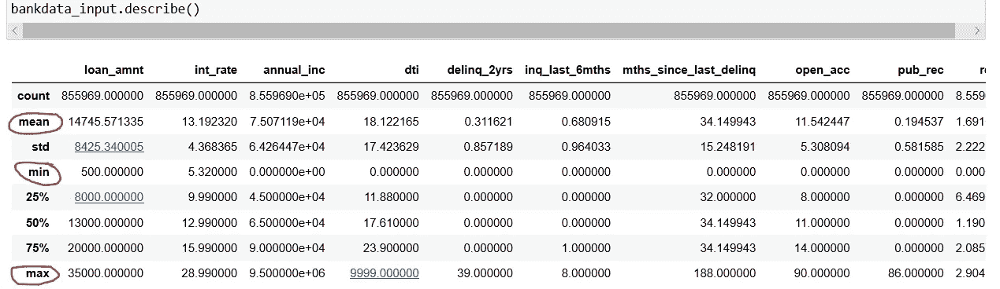
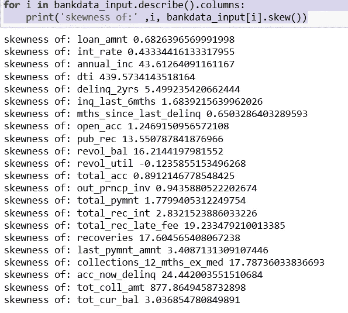
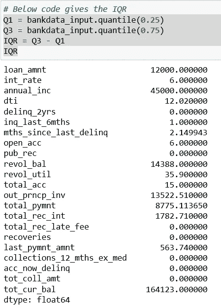
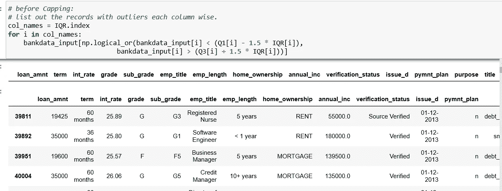
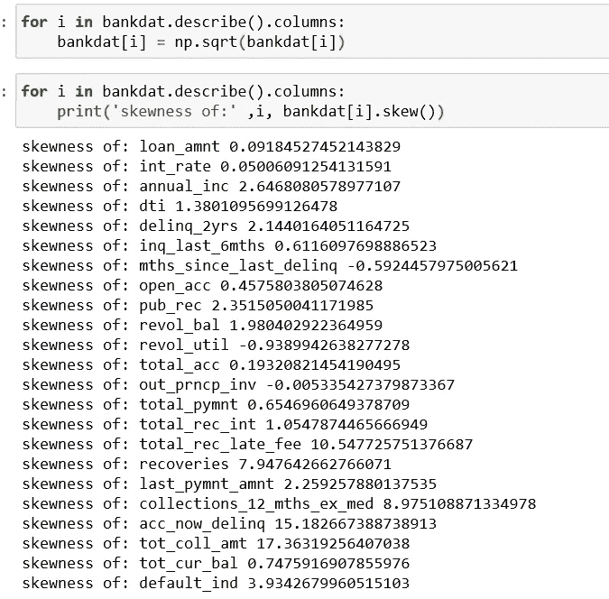
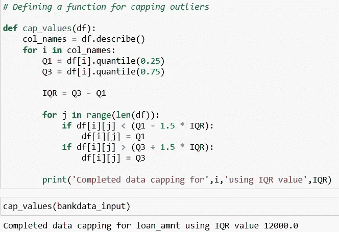

# 处理异常值。

> 原文：<https://medium.datadriveninvestor.com/dealing-with-outliers-90475e3535c2?source=collection_archive---------10----------------------->

## 在我们之前的文章 reg ' [outliers](https://medium.com/analytics-vidhya/outliers-in-data-and-ways-to-detect-them-1c3a5f2c6b1e) '中，我们概述了它们是什么以及检测它们的各种方法。

Photo by [Jeroen den Otter](https://unsplash.com/@jeroendenotter?utm_source=medium&utm_medium=referral) on [Unsplash](https://unsplash.com?utm_source=medium&utm_medium=referral)

众所周知，异常值确实会扰乱我们的分析，因为所有的统计测量，如均值、标准差和基于这些的所有其他统计推断，都对异常值高度敏感。

因此，我们有必要处理它们。

**所以，今天，我将深入探讨这个话题，并讨论处理异常值的各种方法。**

**先决条件:**我正在使用的数据集是‘XYZ corp _ bank lending’。(来源:Kaggle)。

在开始之前，我们已经了解了各种方法，如可视化技术(散点图、箱线图、直方图)、Z 分数、IQR、假设检验来检测异常值。

然而，我刚刚遇到了一些额外的简单方法来快速了解数据集中异常值的存在。

 [## 将定义 2020 年就业前景的五大数据科学和机器学习趋势|数据驱动…

### 数据科学和 ML 是 2019 年最受关注的趋势之一，毫无疑问，它们将继续发展…

www.datadriveninvestor.com](https://www.datadriveninvestor.com/2020/02/19/five-data-science-and-machine-learning-trends-that-will-define-job-prospects-in-2020/) 

其中之一是 **Df.describe()** 函数，该函数使用非常广泛，可以帮助我们很好地了解数据集中哪些要素可能存在异常值。

**df.describe()为我们提供了所有定量变量的统计测量。**

例如:在下面的截图中，每个特征的平均值、最小值和最大值给了我们一种直觉，知道它们中的哪些可能有异常值。

例如:列“dti”的平均值为 18.122165，最小值为 0.000000，最大值为 9999.000000，这清楚地表明最大值 9999.000000 是一个异常值。

**另一种检测异常值存在的方法是检查数据的偏斜度。**

一般来说，偏斜度应该在 1 到-1 之间，任何偏离它的变化都表明存在极值，也就是异常值，这也意味着数据不是正态分布的。

The above figure indicates that most of the features don’t have the skewness measure in the range of -1 to 1.

**最广泛使用的技术是 IQR 评分，任何不在(Q1-1.5 iqr)和(Q3+1.5IQR)范围内的都是异常值。**

下面的代码给出了数据集的 IQR 值。

现在，如果我们想列出可能是异常值的记录，以便我们可以交叉验证，下面的简单方法总是很方便。

因此，让我们看看异常值低于较低围栏(第一个四分位数-列的 IQR 的 1.5 倍)的记录，以及异常值高于较高围栏(第三个四分位数+列的 IQR 的 1.5 倍)的记录。

Gives us a glimpse of all the outlier records.

# 异常值处理。

既然我们已经认识到了具有异常值的特征，并且已经查看了具有可能极值的记录，现在是时候关注本文的主要议程了，即处理它们。然而，有多种方法可以帮助我们，如下所述。

*   如果我们知道异常值是被错误记录的，我们就可以丢弃它们。假设我们正在查看几个学生的数学成绩，我们发现一个学生的分数是 1000，而其他学生的分数都低于 100。因此，在这种情况下，我们知道 1000 输入错误，我们可以删除这个记录。
*   **我们还可以对倾斜的数据进行变换**或**，比如对特征**进行对数或平方根变换，以获得平衡分布。

然而，这种方法并不总是非常准确，因为它并没有公正地对待所有的特征。我尝试对我们的数据进行平方根转换，正如我们在下面看到的，一些列的偏斜度仍然在 1 以上，而偏斜度应该在-1 到 1 之间。

*   因此，我发现最有效、透明和简单的方法是用最接近离群值的四分位数来限制离群值。

例如:下围栏以下的异常值(第一个四分位数-列的 IQR 的 1.5 倍)可以用第一个四分位数代替。

并且可以用第三个四分位数替换较高围栏(第三个四分位数+该列的 IQR 的 1.5 倍)之上的离群值。

以上可以通过我下面使用的简单函数来实现:

The above function caps all the outlier records with either Q1(first quartile) or Q3(third quartile) based on their values.

现在，为了验证是否正确处理了所有异常值，我们可以在封顶之前和之后绘制箱线图，这是可视化异常值及其处理的最简单方法。

但是因为我在本文中使用了偏度来检测异常值，所以将使用相同的技术来重新检查异常值处理。

幸运的是，正如我们在下面看到的，几乎所有记录的偏斜度现在都在-1 到 1 的范围内，这表明我们已经成功地处理了异常值。

*   **我们还可以处理异常值**，用第 10 个百分位数替换较低围栏下方的，用第 90 个百分位数替换较高围栏上方的异常值。

因此，我想得出结论，有各种方法来处理这部分数据预处理，尽管选择最终取决于处理它的个人，这取决于数据类型、问题陈述和简单有效的适用策略。