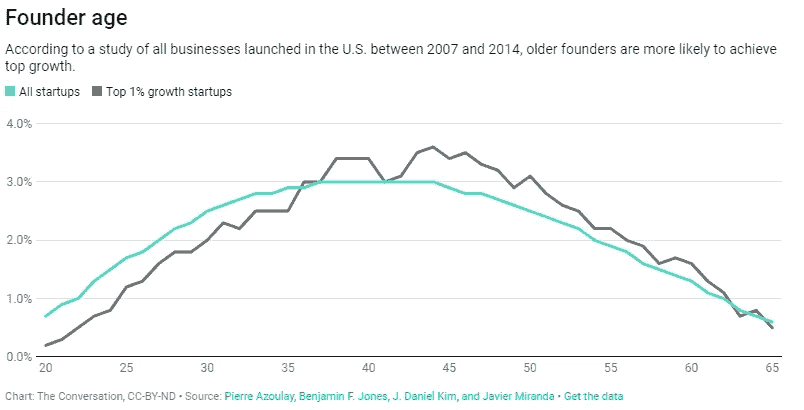

# 亲爱的有抱负的年轻企业家们，请小心

> 原文：<https://medium.datadriveninvestor.com/dear-young-aspiring-entrepreneurs-be-careful-8c673d5b2c5a?source=collection_archive---------5----------------------->

## 神话，漫画，媒体

媒体传播了一个神话——企业家通常都很年轻，而且“敢于冒险”或“寻求冒险”。你知道我说的漫画。你总是看到它。一个年轻的暴发户逆潮流而动，把小鸟变成了“男人”。他们被描绘成偶像破坏者或骑士，并且经常被描绘成傲慢的。去他妈的系统！我要开始我自己十亿美元的生意了！你会看到的！

听着，我明白。我们都喜欢失败者的故事。作为人类，我们倾向于宏大叙事。埃隆·马斯克(Elon Musk)从斯坦福大学(Stanford)的研究生项目退学，创办了他的第一家企业 Zip2，这有什么不让人喜欢的呢？听到像比尔·盖茨和马克·扎克伯格这样的人传承了哈佛的大学教育，自己创业，真是令人振奋。史蒂夫·乔布斯在创办苹果公司之前只在里德学院待了一个学期。他们不仅表现得很好，还成为了绝对的行业巨头。但是这些人是局外人，不是标准。他们做到了。你也可以！对吗？

## 把谨慎、教育和资源都抛到九霄云外？

无聊(现实)的事实是，大多数成功的企业家实际上都不是传统意义上的冒险家。称创业者*更合适。在其他条件相同的情况下，一个理性的人很少*选择*去冒额外的风险，即使这种风险看起来被巨大的回报所平衡。相反，成功的企业家采取 ***计算风险*** 。*

*有趣的是，大多数成功的企业家与那些获得过多媒体关注的名人创始人截然不同。统计显示，创办创业公司的最佳年龄实际上在 45 岁左右。如果你更深入地思考这个问题，这就变得有意义了。*

* [## 天才企业家有他们超能力的智力来源？数据驱动的投资者

### 看起来确实如此，所以让这些资源为你服务吧...都是成功的企业家——想想谢尔盖·布林和…

www.datadriveninvestor.com](https://www.datadriveninvestor.com/2020/04/08/genius-entrepreneurs-had-their-super-power-sources-of-intelligence/) 

他们实际上更有可能是受过良好教育的专业专家。他们中的大多数人在特定领域积累了大量的行业经验。他们往往拥有深厚而广泛的社会资本，这有助于他们的企业起飞。所有这些方面结合起来，产生了一个总体上更全面的个人，他对现实世界的问题有着深刻和可信的见解。

Source: MarketWatch

## 为什么企业家的刻板印象是危险的

这些刻板印象不仅不成熟、不准确，而且很危险。今天，忽视正规教育的价值会误导很多年轻人。它利用人们的梦想和情感来销售新闻消费。这是最糟糕的媒体——通过走捷径兜售白日梦。他们会通过扭曲定义“机会成本”的数学来引诱年轻的企业家——为什么要在大学里度过 4 年。到那时你可能已经是亿万富翁了！

鼓励任何年龄的人创业是一回事，鼓吹人们应该放弃大学在真空中追求自己的希望是完全不同的另一回事。那是不负责任的。

在大学期间，我一直在指导一些有抱负的企业家。我不知道他们中有多少人真的认为自己会成为下一个盖茨、扎克伯格、乔布斯或马斯克。即使他们能够成功，这些学生也不太可能达到这些高度。我不想扫兴，但人们必须面对现实。顺便说一句，一个潜在成功企业家的标志性技能是理解统计学。

但关键是，你不必成为下一个扎克伯格、盖茨或乔布斯。你仍然可以成为百万富翁，建立一个成功的企业。并且仍然解决有意义的问题以产生巨大的影响。还有，你不一定要退学。你是否决定全职从事你的事业应该取决于企业的状况。换句话说，仅仅因为你在它上面花了更多的时间并不保证你会使它更成功。但是如果你的创业已经开始，需要更多的时间，而你没有，那么当然，你可以考虑改变你目前的计划。

但即使这样，我想知道你是否必须退学。有很多选择。你可以雇帮手。你可以成为合伙人。你可以外包任务。你可以实现物流自动化。现在，我们比以往任何时候都更容易获得免费的工具和资源来帮助您加快业务发展。

## 正规教育很重要

如今，回避正规教育的价值已经成为一种时尚。风险投资家、Paypal、Palantir 和 Founders Fund 的联合创始人彼得·泰尔甚至捐赠了 10 万美元鼓励大学生辍学创业。但是几年后，[的结果却是喜忧参半](https://www.businessinsider.com/peter-thiel-fellowship-mixed-results-2015-2)。还有，Thiel 没有提到的是，他本人也是斯坦福大学的毕业生，既有哲学学士学位，也有法学学位。你真的认为当他继续创业时，这伤害了他吗？你不认为拥有哲学学位有助于训练他的思维结构吗？难道你不认为拥有法律学位可能会让他在筹资过程中更好地理解、分析和驾驭那些复杂的条款清单方面拥有优势吗？

虽然我不是说获得一个好的学位会让你成为一名伟大的企业家，但我是说接受正规教育没有坏处。更多的时候，你不会被置于一个二选一的境地，在获得大学学位和成功创业之间做出选择。如果是这样的话，我们会看到更多的微软、苹果等。我们没有。因为退学是 ***容易*** 。创业不是。

在很大程度上，正规教育是有帮助的。如今，我认为拥有大学学士学位是最低要求。上大学不仅仅是课堂作业。这是关于网络和认识其他聪明人。是关于交新朋友的。这是关于打开你的眼睛看世界，即使那个世界是一个更大的世界的泡沫。这是关于扩大你接触新思想和不同行业的人。也是关于成长。在大学里，你仍然会犯错误，但从长远来看，你会没事的。这是一个实验和探索的时代。你的余生都要工作！

大学也是你学习成长的地方。如今许多孩子过着受保护的生活。坦率地说，即使是大学也不足以帮助他们中的一些人摆脱发展停滞。在我看来，创业成功的 ***先行指标就是这个叫做*** 的东西。然而，成熟很难定义。这与年龄和知识无关。更像是智慧。有时候，它伴随着犯足够多的错误。其他时候，是关于你的经历有多丰富。成熟是很难定义的东西。但这是关于面对混乱时的镇定。这是关于在面临艰难选择时表现出良好的判断力。重要的是知道拒绝机会和抓住机会一样多。这也是关于知道什么是真正的风险。知道你到底是谁。你的局限在哪里？你有哪些差距？你将如何真正填满它们？你应该填吗？

## 理解风险的比例(不仅仅是绝对风险)

我向你保证，现实世界的经验是无可替代的。但就像我说的，你很少会被置于必须选择上大学还是创业的境地。因为时间有限，最终可能有一刻你不得不做出选择。但在你到达那一点之前，请全力以赴。接受教育。增加你的社会资本，玩得开心！你真的要做一个众所周知的数学计算，看看放弃一个或另一个是更大的机会成本。

这里有一个有趣的实验。如果彼得·泰尔要求你退出 10 万美元的资助，你会这样做吗？如果你的创业成功了——这是一个很大的假设——那就太棒了。但如果没有，你会付出什么代价？它耗费了你的时间。这使你的教育倒退了几年。找一份后备的工作不会那么容易。你需要迎头赶上。如果你成功了，彼得·泰尔会得到什么？他也变得富有。但如果你失败了，他会失去什么？$100,000?对于像他这样的亿万富翁来说，那是九牛一毛。他将同样的提议传播给大量的其他实验(学生)。他的实验中只有一个必须成功，才能从其他 99 个实验中收回失败的代价。同样的逻辑，你的保险计划是什么？你一次只致力于一家创业公司。你将如何恢复你失去的时间和精力？

现在，你看到了成本和收益的不对称。 ***你需要看看对你生活的影响比例。10 万美元对彼得·泰尔来说不算什么(或者至少很少)。但是你宝贵的两年大学生活不是你能轻易拿回来的。他也没有提到他已经成功了。你还有一辈子的时间去搞砸。那么…这个赌注对你来说真的是理性的吗？***

不要做别人的实验品。如果这些数字告诉了我们什么，那就是开始一项新的冒险永远不会太晚。所以，慢慢来，去接受你的教育。祝你成长愉快。

**进入专家视角—** [**订阅 DDI 英特尔**](https://datadriveninvestor.com/ddi-intel)*