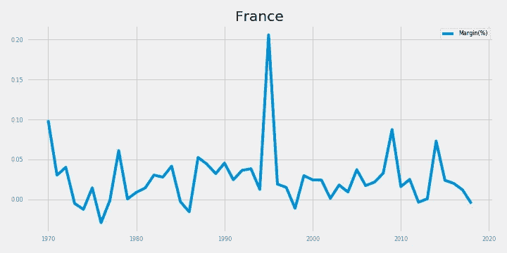

# 债务喂养的鸡会生臭鸡蛋

> 原文：<https://medium.datadriveninvestor.com/debt-fed-chicken-lay-rotten-eggs-e3cf870a2228?source=collection_archive---------12----------------------->

Source: Pexels

## 债务引擎的可持续性透视

债务是世界经济的引擎。我们所有人，尤其是经历过 2008 年危机的人，也知道过度负债是不好的。问题是，多少才算多？为了开始回答这个问题，让我们从一个你可能已经看过几次的图表开始，全球债务与全球 GDP(以美元计)之比。

Data Source: IMF

毫不奇怪，全球债务在过去 40 年里急剧膨胀。2018 年，中国的债务约为 208 万亿美元，而 gdp 为 80 万亿美元，债务与 GDP 的比率约为 2.6 倍。在此期间，我们经历了上世纪 80 年代的经济衰退、97 年的亚洲危机和 2008 年的债务危机，仅举几例。你可能会有充分的理由提出，既然我们在债务增加的情况下也挺过了市场困境，为什么债务应该是坏账呢？为了回答这个问题，我请当今最受尊敬的宏观投资者之一提供一些观点:

> “当信贷增长快于收入增长时，当债务增长快于收入增长时，这种情况不会持续太久。在某种程度上，你不能偿还(债务)，因为这是一个交付金钱的承诺。当那些钱不能——你不能上来——你就去杠杆化了。”—雷伊·达里奥，布里奇沃特联合公司的创始人。

相信他的话，现在让我们从不同的角度来看上面同样的数据:

Data Source: IMF

下图显示了全球 GDP 的同比变化与全球债务的同比变化。注意到什么了吗？每当债务变化率超过收入变化率时，GDP 就会收缩，两者之间会有轻微的滞后。

Data Source: IMF

为了使分析更简单，我在上图中绘制了债务增长率与 GDP 增长率的差异。正差异表明与收入增长率相比，债务增长率更高。

你可以看到，在 1987 年黑色星期一崩盘之前，这种差异一直为正，在 1997 年亚洲危机之前达到 9%的峰值，在 2008 年债务危机爆发时达到 5%。

 [## 投资区块链前要问的三个简单问题(也是一个困难的问题)|数据…

### 现在是了解区块链的最佳时机。不同货币之间的增长率，比如…

www.datadriveninvestor.com](https://www.datadriveninvestor.com/2020/03/12/three-simple-questions-and-one-difficult-one-to-ask-before-investing-in-a-blockchain/) 

还是不相信我？看看下面美国的 GDP 变化和债务变化的图表(在这种情况下是从 50 年代开始的),做出你自己的结论。

Source: IMF

希望你在这一点上不那么怀疑，但你可能会问，如果 2018 年利润率为负，有什么可担心的吗？

是的，自 2017 年全球债务创下历史新高以来，利润率有所下降，但随着新冠肺炎危机的爆发，情况发生了 180 度的转变。一方面，在新冠肺炎危机期间经济几乎完全瘫痪的情况下，政府别无选择，只能增加债务来拯救民众(希望首先是)和企业。另一方面，根据国际货币基金组织的数据，2019 年全球 GDP 已经在收缩，预计 2020 年将进一步收缩 3%。重点是，2019 年利差可能已经增加(假设由于大多数国家的利率相当低或不断下降，没有任何减少债务的动力)，2020 年可能为正。我们没有足够的历史数据来统计验证多少年的正负差异可能导致收缩或扩张，但对投资者来说，这表明现在是谨慎乐观的时候了。

然而，关键的一点是，当债务增长在相当长的一段时间内超过收入增长时，我们正在接近这一点，债务的负担变得不可持续，并最终导致经济困难。

对于投资者来说，首先，这可能意味着，与其利用最近的市场疲软，全押在世界 ETF 上，你应该遵循更谨慎的 40% — 60%的方法，看看目前的利润率在哪里(国际货币基金组织 2019 年的数据尚未公布)。其次，为了帮助你了解哪些地方可能安全，哪些地方可能有风险，我以名义货币编制了一份各国及其历史利润率的列表。我选择了 2020 年 GDP 预测值最高的 10 个国家，只是为了让你们了解一下世界的现状。

Data Source: IMF

投资愉快！

PS:数据分析和可视化(如果我们可以称之为可视化的话)是在 Python 上完成的。Github 代码可应要求提供。