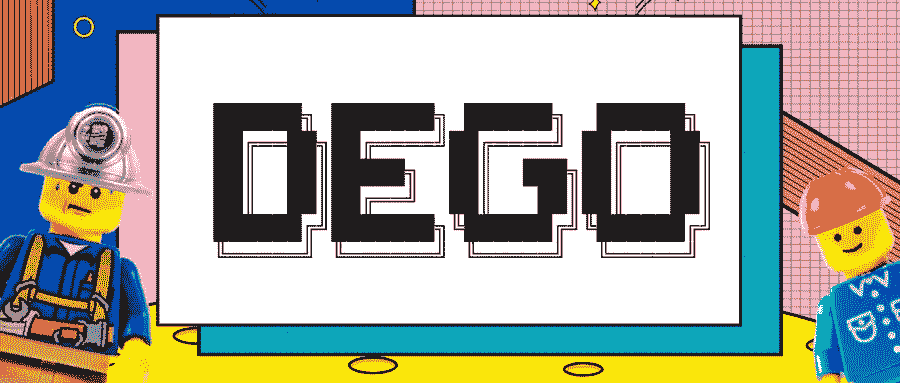

# 2020 年的分散融资:将高产农业引入 NFT 圈

> 原文：<https://medium.datadriveninvestor.com/decentralized-finance-in-2020-introduction-of-yield-farming-into-the-nft-sphere-caf8ca3cebc5?source=collection_archive---------8----------------------->

一种数字资产，想象一张神奇宝贝卡片，但它是数字的，它是一种可以被限制为可以“铸造”多少的东西，以保证像现实生活一样的有限供应。拿那些数字神奇宝贝卡，通过互联网交易，不用担心欺诈，因为它是经过验证的，存储在区块链上。你可以通过 DeFi 协议将 Charizard #52 接入手机(NFC)。虽然像这样的东西可能需要一段时间，但 NFTs 将带来人们谈论了很久的预期的“一切的令牌化”。

## DeFi 世界的乐高玩具

最近，DeFi 的兴奋点转移到了 NFT 市场，不仅可以拍卖和开采，还可以通过持有 NFT 来参与治理。 [**德戈。金融**](https://dego.finance/) 是 GameFi 的一次新奇探索。

Image from [Dego](https://medium.com/@dego_finance/introduction-to-dego-1c60e9fe5a01) Medium

随着游戏形式的东西越来越有吸引力，有了 Dego，个人或团体可以通过独特的方式获得稀有的数字收藏品，并将其所有权金融化。Dego.Finance 尤其引领了建立新的 dApps 和提高 DeFi 价值的机会。不过，要解释这个项目，首先需要参观许多其他开发项目。

 [## 完美的加密交易策略|数据驱动的投资者

### 如果你在交易游戏中已经有一段时间了，你可能听说过“支点”和“VWAP”前者听起来像…

www.datadriveninvestor.com](https://www.datadriveninvestor.com/2020/08/31/the-perfect-crypto-trading-strategy/) 

## 什么是 NFT？

**NFTs** (不可替换的令牌 **)** 是资产的令牌化表示，数字的或其他的。例如，它们似乎可以与稳定的硬币相比，但却被用来代替法定货币来代表不可替代的资产，如艺术品、房地产或收藏品。数字游戏，如 CryptoKitties 和分散的土地是这些代币的流行应用。

直到最近，NFT 还没有真正引起投资者的兴趣，因为 2020 年以太坊的所有流动性都被贷款、投资和风险管理所取代，我们现在称之为 DeFi。根据 NonFungible.com 的 NFT 数据资源，在 9 月的第一周，NFT 的收入接近 100 万美元，截至今天，这一数字进一步超过了 200 万美元。

这些天来，用户已经看到了很多 NFT 的倡议，并探索了不少独特的游戏，并从中获利。虽然 NFT 大部分仍然独立于 DeFi 生态系统，但这种将 DeFi 最热门的趋势整合到更简单的时尚中的独特整合让 Dego。因为他们试图建立一系列真正精心设计的举措来刺激市场增长。

## NFT 治理令牌

除了 10%的预售和 1%的空投，任何其他 DEGO 代币只能在获得 DEGO DAO governance 的批准后使用，这是一个值得注意的壮举，表明该公司对其代币的推广有着良好的意愿。久而久之，德戈。财务部门将寻求过渡到“一体行动，履行使命”模式，对未来的议定书决策进行分散治理。

## NFT 矿业公司

如平台所言，德高合约采用完全公平的分配制度，不存在私募或预采。作为一个由各种 DeFi 产品组成的生态系统，Dego。金融最初一直专注于其流动性挖掘。Dego 被认为是一个更可持续的生态系统，它有一个优化的算法，可以调整以奖励流动性提供者，这在 KuCoin 最近的一份报告中有很好的描述。

乍一看，你可能会认为这是继[食品代币主题](https://cointelegraph.com/news/dinner-is-served-here-s-what-defi-s-food-meme-tokens-bring-to-the-table)协议之后的又一次模仿。然而，在其他 NFT 产量农业交叉项目中，该平台采用了一种不同的公式来奖励流动性提供者，这种公式可以实现更分散和可持续的生态系统。此外，德戈创造了一个多元化的产品组合，不仅提供流动性挖掘，而且 NFT 拍卖，NFT 明廷，NFT 交易等。

## Dego 的未来之路

看到各种基于加密的产品在所有领域利用治理令牌来突出 Web 3.0 技术的最佳和最亮点，确实令人印象深刻。虽然该项目在加密市场掀起了一场风暴，其匿名团队已经快速执行了所有事情，但很少听说过 Dego 的用户。财务可能会立即探索新的项目并深入研究。虽然还不确定 NFT 治理是否会像 DeFi 治理一样受欢迎，但毫无疑问，这两者有着千丝万缕的联系。有了这个，当发行版在接下来的几个月里成功时，一定要密切关注这个项目。

为了跟上 Dego 的步伐，今天就在[推特](https://twitter.com/dego_finance)上关注他们或者查看[项目](https://dego.finance/home)！

## 访问专家视图— [订阅 DDI 英特尔](https://datadriveninvestor.com/ddi-intel)