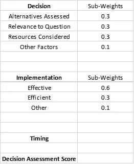
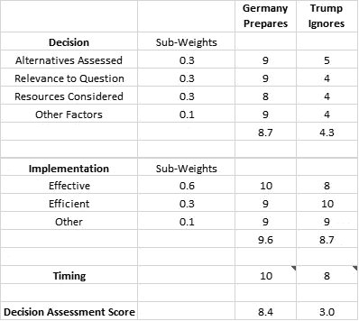
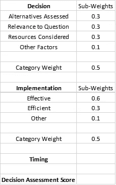

# 决策评估分数

> 原文：<https://medium.datadriveninvestor.com/decision-assessment-score-abd4f0666ec5?source=collection_archive---------13----------------------->

Photo by [Burst](https://unsplash.com/@burst?utm_source=medium&utm_medium=referral) on [Unsplash](https://unsplash.com?utm_source=medium&utm_medium=referral)

方法很重要。作为一名政治学毕业生，我被灌输了方法和本质的重要性。当我更年轻、更理想主义的时候，我反对方法的相对重要性，而支持本质。我说，无论什么方法都很重要，但如果忽略了本质，那就变得苍白无力了。在我大学教育的某个阶段，我从伊尔特·图兰那里学到了方法论，他也是我们科大的系主任。我承认这听起来并不鼓舞人心，但对我来说这是一个顿悟的时刻。

得了吧，方法论没用我几乎听到你说。如果你注意的话，你可能会想，让你跳起来的应该是政治理论。它被切断的原因就像回到了高中时代，在化学实验室里，有液体和说明书。从安全问题开始，到以与你的同学可比的方式实际完成实验，遵循这样的指导是有原因的。类似于物理实验室，政治有做事情的方式，这些方式与正在做的事情相关，但也有如何做的逻辑。

以议会程序规则为例。事情的处理方式有很大的不同——是通过小组委员会还是直接进入最终投票机构？提出修正案需要多少票？这项动议需要多少票才能通过？有上诉机制吗？它是如何实现的？政治是完全不同的，对于这样的程序有不同的方法选择。一个系统可以是高度集中和专制的，也可以是相对分散和包容的，但不改变本质，只改变实现的方法。

 [## 决策的移情设计方法如何工作|数据驱动的投资者

### 移情设计是一种产品设计方法，首先由多萝西·伦纳德和杰弗里·雷波特在哈佛大学提出

www.datadriveninvestor.com](https://www.datadriveninvestor.com/2018/07/18/how-the-empathic-design-method-of-decision-making-works/) 

所有决策的最终影响都受到决策质量和实施因素的影响。进一步产生影响的是时机方面。毕竟，如果比赛还在进行，由队中最好的前锋射门的决定是有意义的。事后计时会扼杀最佳实施的高质量决策。

想知道是否可以设计一个决策评估分数(“DAS”)，我坐下来设计了一个非常简单的公式，以便决策者在最终确定决策过程之前可以轻松使用它。我认为决策、实施和时机是计算 DAS 时最简单的关键因素。顺便说一句，我意识到当简化过程时；一个人可以专注于自己需求的关键因素。

为了说明这一点，考虑一种情况，在这种情况下，决策对你来说似乎非常清楚，而时机已经晚了。排除这两个因素后，实施质量将对 DAS 产生最大的影响，因为其他因素已经设置好了。虽然这种分析似乎是不言自明的，但是这种方法的目的就是让它变得显而易见。将流程分为决策、实施和时间安排；这一过程有助于指出不言而喻的事情，从而节省时间并专注于决策者可以影响的其他因素。我认为，在大多数情况下，决策者对实施指标的理解要比对决策质量和时机的理解更加清晰。

在我列出这个公式之前，我将首先声明我的终极怀疑，任何简化生活的公式都有内在的问题。因此，我们应该持保留态度，并仔细检查其相关性。除此之外，我认为它的用处在于提供一个可比较的框架来评估不同选择的可行性，或者分析可比较的行为者所做的决定。

在配方设计中，决策部分有 4 个子因素:

备选方案评估对决策过程进行评级，彻底评估手头问题的备选方案。

与问题的相关性查看答案与问题的相关性。因此，例如建议开车到没有合适道路的位置将具有低相关性。

考虑的资源侧重于分析决策与实施决策的资源之间的关系。

其他因素是添加替代项的插件。

实施部分有 3 个子因素，分别是:

有效，着眼于决策的有效实施。考虑到如果这是一个事前的情况，这个因素以及有效因素是一个估计。但是，如果你使用的方法是事后分析，那么这些因素将反映具体决策实施的实际结果。

查看资源使用情况的效率。

另一个是添加备选方案的插件。

DAS 1

虽然我已经使用了这种设计，但我鼓励您根据自己的需要更改输入组件和子权重，并尝试使用它们来适应您手头的问题。

因此，决策和实施子因素按照 1 到 10 的等级进行分级，每个子因素乘以各自的权重。子因素的总和产生决策和实施分数。最后的计算是通过将决策、实施和时间分数相乘得到 DAS。

我通过比较德国对冠状病毒的准备情况和特朗普 1 月份对该病毒的立场，用当前的一期来测试得分。虽然过于简单，但我想比较几年前为潜在的流行病做准备的决定和淡化风险的决定。

难怪特朗普的忽视是一个糟糕的决定。回想起来，我们有了这个答案。更有意思的是，特朗普的执行和时机都没那么差。请听我解释——实施着眼于决策部分的实施质量。所以川普忽略了看起来无知的实施有多好。如果在美国，所有的决策者都参与进来，有效性的 8 分可能是 10 分。在这一点上的 2 点削减是由于一些专家和当选官员出来反对他的事实。至于时机，德国准备着眼于完美准备决策的时机质量，即德国能够在事件发生前及时准备。至于特朗普忽视的问题，在特朗普对此事变得更加认真之前，时间安排有效地处理了短时间内的问题。对于这一决定，Timing 考虑了特朗普如何应对正在形成的持续危机。因此，即使淡化决策可能很糟糕，但这个决策的时机并没有落后于形势。原因很简单，这个决定是完全错误的。

DAS 1 有效地对决策、实施和时机给予了同等的重视。因此，其中一个方面的失败会严重影响最终分数，其他方面的进步将无法弥补。

有一次我复习 DAS 1，我就在想能不能有一个替代方案(完全符合本文的精神)。

DAS 2

在这个替代版本中，DAS 以不同的方式计算:

决策和实施得分按照 DAS 1 中的方法计算，并对每个子因素进行评估。

然而，每个类别都要乘以它的权重(注意，类别权重的总和应该是 1)。

然后将决策和实施得分相加，然后乘以计时。

请注意，DAS 2 仍然对德国提前准备的决定给予更高的分数，但特朗普方法的表现相对好于 DAS 1 公式。

原因有两个——一个是决策与执行同等重要，另一个更重要的因素是重视时机。请注意，DAS 1 在乘法中有 3 个部分，其中 DAS 2 的计时乘以组合的决策和实施分数。

实际上，我认为这两种方法都是有效的，这取决于用户的需求。比如说。如果时间与分析更相关，后一种方法更有用。

如前所述，可以随意改变标题和权重来满足你的需要。

最后，我将指出这一分析的综合启示。实际上，我和一群受人尊敬的同事一起参与了一个重要的招聘选择。通过这个过程，我试图量化一个新的团队成员对管理质量的影响，以及如何提高这种影响。在更哲学的层面上，穆斯塔法·瑟里夫·阿肯(Mustafa eref akn)的评论引起了我对行为经济学和决策制定的注意，他在这类问题上总是非常明智和好奇。他的评论让我想到(有争议地用一个我无法证明的假设)土耳其人和美国人对决策的思考方式有着深刻的不同。我推测，拥有分权制度和个人主义历史的美国人倾向于认为决策非常重要，足以用理论来研究它。另一方面，来自更中间派的威权背景的土耳其人往往不太关注决策机制，而更关注决策本身和决策的影响。

2020 年 4 月，伊斯坦布尔