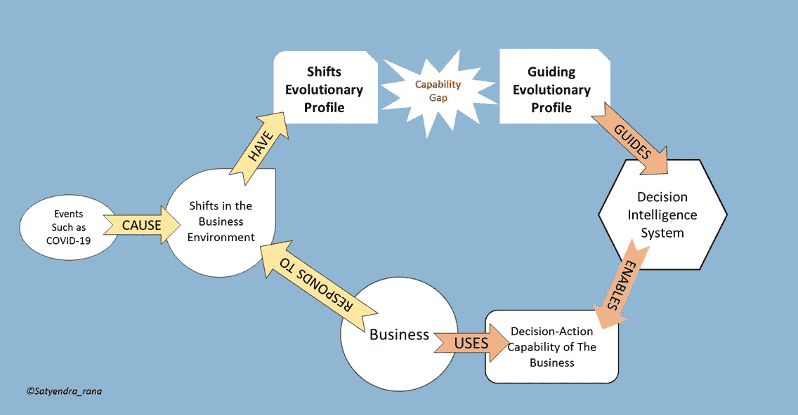
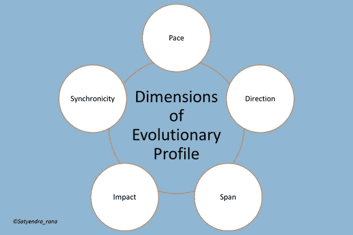
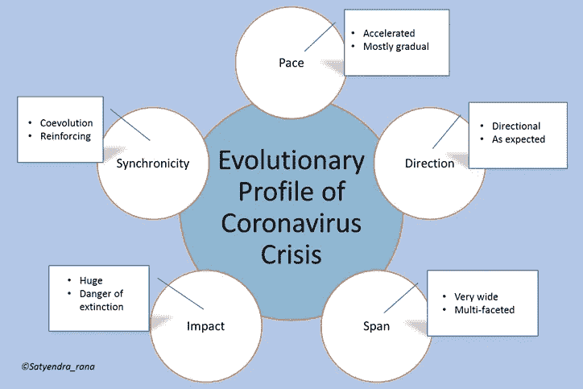

# 决策智能系统设计:我们能从冠状病毒危机中学到什么(下)

> 原文：<https://medium.datadriveninvestor.com/decision-intelligence-systems-design-what-can-we-learn-from-coronavirus-crisis-part-2-ff97557b4d37?source=collection_archive---------10----------------------->

本博客是一个多部分系列的第二部分，该系列研究了冠状病毒疫情对企业未来发展方向的影响，并从中吸取了重要的经验教训，以指导为快速发展的数字经济更好地设计决策智能系统。在 [*第一部分*](https://medium.com/@satyendra.p.rana/decision-intelligence-systems-design-what-can-we-learn-from-coronavirus-crisis-part-1-b1ddc7ad65a9) *中，我们回顾了预示商业未来的八个关键信号。这一部分分析这些信号，以指导业务所需的战略转移，从而制定最佳对策。*

# 第 1 部分回顾的信号

让我们从回顾第 1 部分中回顾的 8 个信号开始，这些信号是按照企业的五个发展维度组织的，即消费者、工作和员工、技术采用、管理思维和商业环境。

1.  ***按需经济成长时机成熟*** 。
2.  在家工作是长久之计。
3.  ***自由职业进入主流。***
4.  ***数字化转型加速。***
5.  大科技变得更大。
6.  ***AI 再获得一次机会。***
7.  ***企业风险管理正在进行一次大修。***
8.  ***全球供应链架构将面临巨大转变*** 。

这些信号涵盖了很多领域，但没有一个话题是新的。这些话题在业内已经酝酿了一段时间。这是否意味着企业已经具备了理解和处理这些信号的决策行动能力？如果答案是肯定的，那就没什么好学的，也不需要战略转移。

 [## 决策的移情设计方法如何工作|数据驱动的投资者

### 移情设计是一种产品设计方法，首先由多萝西·伦纳德和杰弗里·雷波特在哈佛大学提出

www.datadriveninvestor.com](https://www.datadriveninvestor.com/2018/07/18/how-the-empathic-design-method-of-decision-making-works/) 

但是，如果决策-行动能力存在差距，那么我们必须首先确定差距，然后找到缩小差距的方法。

# 决策-行动能力差距

当企业不能对商业环境的变化做出令人满意的反应时，决策-行动能力差距就存在了。图 1 通过引入进化概要的概念展示了这一点。

Figure 1: Decision-Action Capability Gap

1.  一个事件发生了，引起了商业环境的变化。
2.  企业感觉到了这些变化，并做出相应的反应。
3.  响应的质量和及时性取决于业务决策能力的成熟度。
4.  自动化决策智能系统使企业具备决策-行动能力。现代商业的复杂性要求计算机化的决策智能系统的支持，没有它，就不可能建立决策行动的敏锐度来处理像新冠肺炎这样的事件的短期和长期影响。
5.  决策智能系统的设计是由一个进化配置文件指导的，这个配置文件限制了系统能够或不能处理什么。让我们称之为决策智能系统的**引导进化轮廓**。
6.  商业环境的变化也有一个进化的轮廓。让我们把这种轮廓称为**转变的进化轮廓。**
7.  如果“转变进化模式”与“决策智能系统的指导性进化模式”有实质性的不同，那么决策-行动能力上限就显现出来了。

通过引入进化谱的概念，我们现在可以使用以下方法来确定冠状病毒危机暴露的缺口。

1.  通过分析提到的 8 个信号来确定“转变进化模式”。
2.  如果还不知道的话，确定你的决策-行动能力的“指导性进化轮廓”。
3.  比较两个档案，以确定决策行动能力的差距。

但是什么是进化轮廓，我们如何正式地描述和量化它。

# 进化轮廓的五个维度

演进概况的概念是捕捉由事件触发的商业环境中的转变的一般性质的手段。这个轮廓允许我们综合与决策智能系统设计相关的知识，而不会迷失在信号的描述细节中。

Figure 2: Dimensions of An Evolutionary Profile

对进化轮廓的描述包括捕获其在五个关键维度上的行为:**速度、方向、跨度、影响和同步性**。进化概况也作为描述情况的宏观环境，有助于重新校准决策智能系统。

## 节奏

设计用于处理较慢节奏的轮班的系统可能无法处理较快节奏的轮班，反之亦然。较慢的变化速度会给你足够的时间去理解它，并做出适当的反应，甚至包括忽略它。此外，处理突发变化的方法不同于处理连续变化的方法。

## 方向

一个事件可能会引起快速的来回摆动，最终稳定下来，但可能不会引起任何实质性的变化。如果波动在本质上是短暂的，人们可以忽略它们或者找到战术上的修正来减轻影响。如果改变是有方向的(比如积极或消极)，方向会引导你选择正确的反应。

## 跨度

跨度是衡量这种转变有多孤立或广泛的尺度。范围较小的变更，仅限于一个地点或一个部门，可以在本地处理。跨度更大的变化需要跨范围的多个决策者之间的协调。

## 影响

影响维度与风险或机会损失的量化相关。量化影响需要使用预测模型和模拟技术。此外，企业必须为效果建立阈值。根据预测影响的阈值，业务响应会有所不同。

更快的速度和更高的风险相结合，可能需要双管齐下的应对措施——一个是遏制眼前危险的战术，另一个是防止未来的风险。

## 同步

同步维度是当前实践中最被忽视的维度。它指的是多种趋势的共同进化，这些趋势要么相互加强，要么相互对抗。如果这种行为存在，孤立地处理个体趋势是不可能的。您还必须了解依赖关系是即时的，还是在可量化的时间滞后之后发生的。

# 描绘冠状病毒效应

对捕捉冠状病毒效应的八个信号的快速检查为我们提供了图 3 所示的“**转变进化曲线**”。

Figure 3\. Coronavirus Crisis Profile

如果你有一个决策智能系统，你知道它的指导性进化模式吗？这与图 3 中描绘的概要文件有什么不同吗？

决策智能系统有责任帮助企业以最佳方式应对冠状病毒进化等特征的变化。但是怎么做呢？

决策智能系统吸收冠状病毒危机教训的关键设计特征是什么？在本系列的下一部分，我们将讨论一些设计选择。