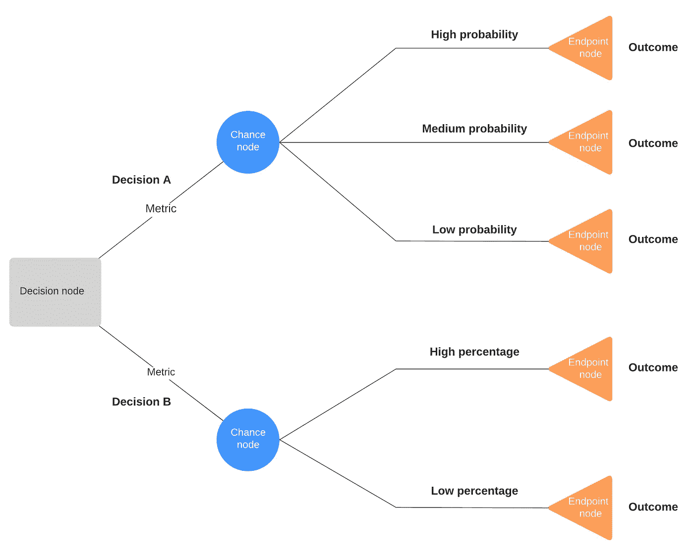
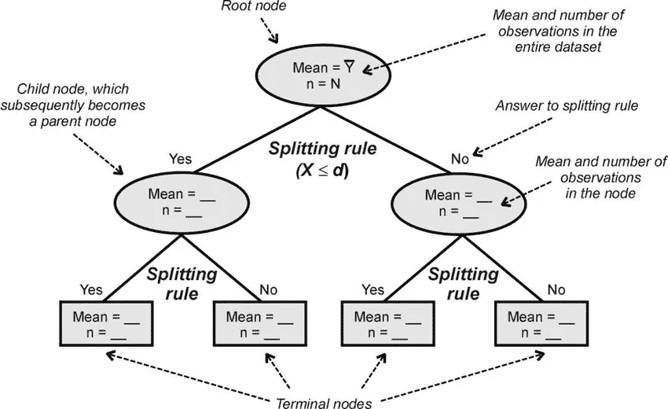

# 决策树和随机森林:Python 中的机器学习

> 原文：<https://medium.datadriveninvestor.com/decision-tree-and-random-forest-machine-learning-in-python-b62b7c82db87?source=collection_archive---------14----------------------->

决定，决定，决定…我们每天都在做无数的决定；不知不觉地或有意识地，有时不费吹灰之力就自动做到了，有时却为另一件事苦恼了几个小时。要是有一种方法能绘制出通往结论的路径就好了。

Sample Decision Tree

决策树是最流行和最强大的分类和回归工具之一。顾名思义，它是一个树状结构的流程图。正是决策树的这一特性使得它们易于理解和解释。

# 决策树的剖析

Image Source: [researchgate.net](https://www.researchgate.net/figure/The-General-Anatomy-of-a-Classification-or-Regression-Tree_fig1_5246556)

> 研究论文:[奥尔登，朱利安&劳勒，约书亚&波夫，N..(2008).没有眼泪的机器学习方法:生态学家入门。生物学季刊。83.171–93.10.1086/587826.](https://www.researchgate.net/publication/5246556_Machine_Learning_Methods_Without_Tears_A_Primer_for_Ecologists)

*   **根节点:**树结构的第一个节点就是根节点。
*   **父节点:**任何有子节点的节点称为父节点或内部节点。
*   **子节点:**给定节点的任何子节点称为子节点。
*   **叶节点:**没有任何子节点的节点是叶节点或终端节点。

# 构建决策树的算法

有几种方法可以建立决策树。算法的选择取决于数据中目标变量的类型。这些算法包括:

*   **ID3——D3 算法**
    的扩展，代表**迭代分割器 3** ，基本上意味着算法**在每一步重复地将特征**分成两组或更多组。这是一种自上而下的贪婪方法。仅用于带有名义特征的**分类问题**。
*   **C4.5—ID3**的继承者
    也称为**统计分类器**，c 4.5 是 ID3 算法的扩展。它比 ID3 有一些优势；能够**处理连续值和离散值**；**是否允许标记为*的缺失属性值***？；它**提供创建后的修剪**。
*   **CART —分类和回归树**
    CART 算法的结构类似于一系列跟进 **' *问题* '** 。我们基于这些“*问题*”来确定节点的分割。该算法对分类和回归问题都有效。结果是一个**二叉树**结构。
*   **CHAID —卡方自动交互检测器** 该算法可以处理名义数据、序数数据和连续数据。它会创建每个分类预测值的所有可能的交叉表，直到获得最佳结果，并且不可能再进行拆分。
*   **MARS —多元自适应回归样条
    T5**复杂非线性回归问题的算法**。该算法发现一组简单的**分段线性函数**，并在**集合中使用它们进行预测**。在某种意义上，该模型可以被视为线性函数**的**集合。**

# 属性选择度量

对于 N 个属性的数据集，我们必须定义一个条件来决定将哪个属性作为树的根节点或父节点。为了解决这个问题，研究人员研究并设计了一些解决方案:

*   **熵**
    它是随机性的**度量**。熵越高，就越难从信息中得出任何结论。
*   **信息增益**
    一种统计属性，衡量给定属性根据目标分类将训练样本分离的程度。当 ***IG* 高而熵**低时，选择一个特征。我们假设属性是**分类的**。
*   **基尼指数**
    与**分类目标变量**一起工作，并且只执行**二元分割**。基尼系数越高，表明同质性越高。它通常与**购物车算法**一起使用。我们假设**连续属性**。
*   **增益比**
    **C4.5 算法**使用增益比——信息增益的一种修改**减少其偏差**，通常是最佳选择。它克服了信息增益的缺点，因为它考虑了在进行分割之前可能产生的分支数量。
*   **方差减少**
    用于**连续/回归问题**。该算法使用**标准方差公式**作为分裂条件。
*   **卡方**
    **CHAID 算法**使用卡方方法分割特征。它也适用于**分类目标变量**。它可以执行两次或多次拆分。较高的卡方值表明子节点和父节点之间的差异具有较高的统计显著性。

# 从头开始实现决策树

> **注:**本例使用的数据集: [haberman.cs](https://github.com/itsDV7/Internity-Practice-Notebooks/blob/main/Day-09) v 来自 [Kaggle](https://www.kaggle.com/gilsousa/habermans-survival-data-set)

# 决策树的缺点

如果对决策树的增长没有设置约束，它们往往会使训练数据过拟合。如果没有约束，树可能会完全“记住”训练数据。这将为您提供 100%的训练数据准确性，但无法使用新数据提供这样的结果。

有两种方法可以消除过度拟合:

1.  修剪决策树。
2.  随机森林。

## 修剪决策树

Image Source: [edureka.co](https://cdn.edureka.co/blog/wp-content/uploads/2015/01/Decision_blog_animation_01-1.gif)

在修剪的时候，我们通过移除那些使我们的树过度拟合的树枝来修剪树，而不会降低精确度。这是借助于将原始数据集分割成测试训练数据，并根据从测试数据获得的准确度来优化树来完成的。

## 随机森林

Image Source: [towardsdatascience.com](https://towardsdatascience.com/why-random-forests-outperform-decision-trees-1b0f175a0b5)

随机森林是集成学习的一个例子，其中我们组合多个决策树以获得更好的预测性能。随机森林通常用“Bagging 法”——Bootstrap 聚集法来训练。Bagging 是一种元算法，旨在提高机器学习算法的稳定性和准确性。

*本文涵盖了各种决策树算法和其他参数的基本定义。建议对这些定义进行更多的搜索，并尝试使用不同的数据集。*

> 感谢阅读。
> 别忘了点击👏！