# 决策树模型构建指标详细解释

> 原文：<https://medium.datadriveninvestor.com/decision-tree-model-building-metrics-explained-in-detail-940eed167b06?source=collection_archive---------5----------------------->

## 了解如何计算用于构建决策树模型的指标

Photo by [Greg Rosenke](https://unsplash.com/@greg_rosenke?utm_source=medium&utm_medium=referral) on [Unsplash](https://unsplash.com?utm_source=medium&utm_medium=referral)

当你学习你的第一个数据科学机器学习算法时，我确信决策树是你学习的第一个模型之一。毕竟，这是迄今为止最简单也是最强大的模型。

为什么出名？我能想到几个原因；它们是:

1.  使用方便
2.  学习过程很快。
3.  人们可以解释这个模型(不像黑盒模型)
4.  它是许多著名机器学习模型的基础模型。

对于那些仍然不理解树模型的人，让我给你看一个简单的**决策树的例子。**

# 决策图表

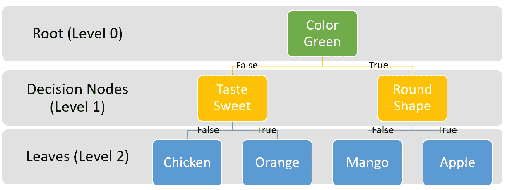

Decision Tree example| Image by Author

决策树是基于树的算法中每个变体的基础模型，它的工作方式如上图所示。直觉上，它看起来像一棵颠倒的树，根在上面，叶子在底部。

该模型通过创建一系列条件来从数据中得出一个结果，其中通过从序列的上部(根)向下直到到达底部(叶)来做出决策。例如，在上面的图像中，当“颜色绿色”为真时，我们将进入“圆形”决策节点；否则，我们就进入“品尝甜蜜”的决策节点。然后再走一步，直到我们到达底部(树叶)。

如果我做一个更简单的解释，**决策树是一个倒置的树，其中每个节点代表变量或特征，每个决策节点或分支代表一个决策，每个叶子代表一个结果或结果**。

决策树模型用于分类和回归问题，这意味着我们可以预测分类和连续结果，尽管不能同时预测两种结果。

我想到的下一个问题是，我们如何为每个节点决定哪些特性？我们如何决定这个特性是最好的？

我们可以使用一些算法指标来构建决策树，但是我们将只讨论两个最著名的指标；**基尼指数**和**熵和信息增益**指标。

这两种方法度量之间的基本思想是相似的。下面让我给你看一个例子。

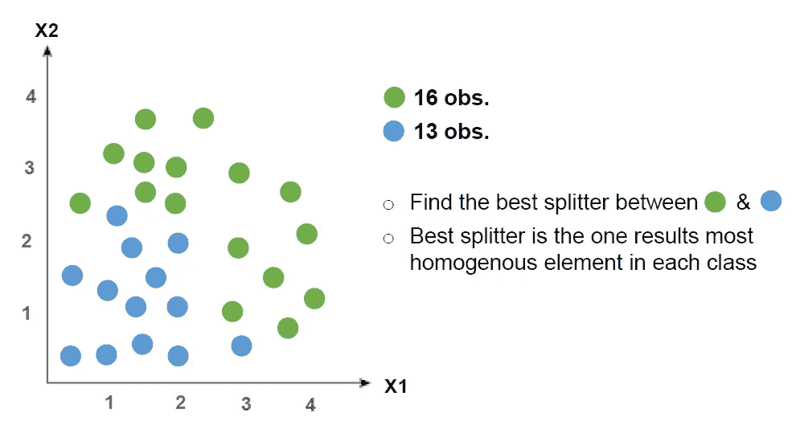

Image created by Author

我们有两个特征 X1 和 X2，其中绿色和蓝色是你要预测的类别。我们希望在决策树中找到最好的特征以及它们的值，以便最好地将绿色和蓝色类别分开。

但是什么是最好的分割器呢？最佳拆分器可以解释为在用于拆分时产生最同质(所有类别都相似)结果的要素和值。

那么如何计算同质性呢？这是我们使用我之前提到的指标的时候。

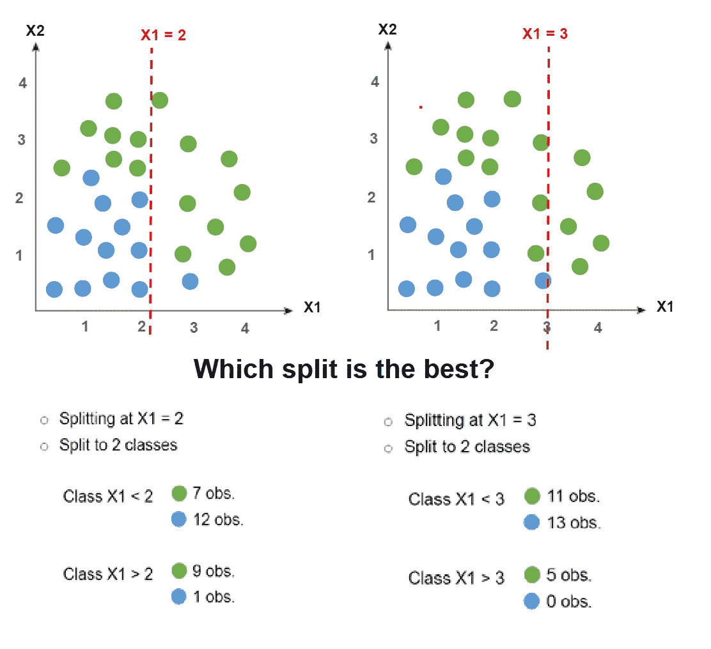

Image created by Author

## 基尼指数

先说**基尼指数**。基尼指数是一个分数，它通过划分的两组中各个阶层的混合程度来评估划分的好坏。基尼指数可以具有在**值 0** 和 **1 【T5，之间的分数，其中 0 是当所有观察值属于一个类时，1 是元素在类内的随机分布。在这种情况下，我们希望基尼系数尽可能低。**

基尼指数方程用下面的图像方程表示。

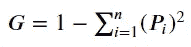

Gini Index|Image created by Author

在上面的符号中，Pi 是不同类(在上面的例子中，绿色和蓝色)的分裂结果的观察概率，n 是类的数量(在我们的例子中，是 2)。顺便说一下，上面的符号是一个**负和符号，**所以我们用减法代替加法。

例如，我们可以尝试计算 X1 的基尼指数<2 instances.

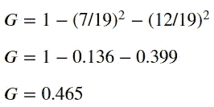

Image created by Author

The Gini Index for the X1<2 instance is 0.465\. Let’s try to calculate for every instance Gini Index.

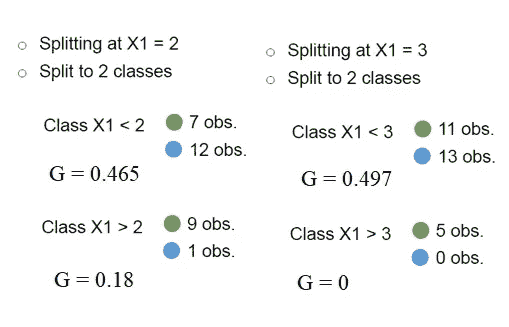

Image created by Author

To find the best splitter by Gini Index, we take the Gini Index weighted average for both instances and choose the lowest Gini Index.

In this case, X1 =2 weighted average Gini index is

((19/29) * 0.465 + (10/29) * 0.18) = 0\. 367

and X1= 3 Gini index is

((24/29) * 0.497+ (5/29) *0) = 0.412

We would choose X1 = 2 as the best splitter because it has the least Gini Index.

The steps are repeated until all the nodes have a Gini Index equal to zero (mean only one class found in the leaves), or until it reaches some criteria, we set to stop.

## Entropy and Information Gain

What is Entropy and Information Gain metrics? These metrics are two separate metrics that we use to build our decision tree but differ from the Gini Index.

As a starter, **熵**被定义为数据集内杂质或不确定性的度量。这意味着熵测量混合在数据中的类观察的数量。让我用下面的一个图像样本来展示给你看。

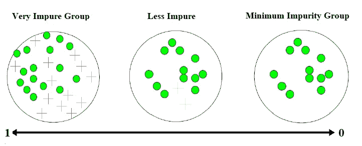

Image created by Author

当组不纯(类混合)时，熵将接近 1，但是当组纯(数据中只有一个类)时，熵将接近 0。

熵可以用下面的等式来表示。

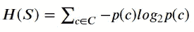

Image created by Author

其中 S 是数据集，p(c)是每个类的概率。

嗯，那什么是**信息增益**？该度量与熵相关，因为根据定义，信息增益是由特征分割之前和之后的熵差。换句话说，**信息增益测量分裂后杂质减少**。

信息增益可以用下面的等式表示。

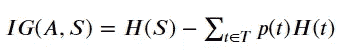

Image created by Author

A 是用于分裂的特征，T 是来自特征 A 中分裂的整个数据集子集，p(t)是数据子集 T 中的类的概率，H(t)是子集的熵。

信息增益测量分裂后杂质减少；这意味着我们想要的是最高的信息增益分数，因为最高的信息增益意味着分裂导致更同质的结果。

那么，根据这些指标，我们如何计算哪种功能可以提供最佳拆分器呢？我们需要完成几个步骤，我将在下面详细概述每个步骤。

首先，我们需要计算数据集的熵。让我们使用之前的示例数据集(16 个绿色和 13 个蓝色)来计算熵。

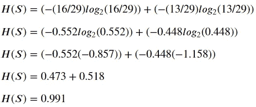

Image created by AuthorAfter

获取数据集熵后，下一步是测量分割特征后的信息增益。在上面的示例中，我们将 X1 = 2 和 X1 = 3 作为分割特征。让我们通过计算熵子集 X1 = 2 来测量信息增益。

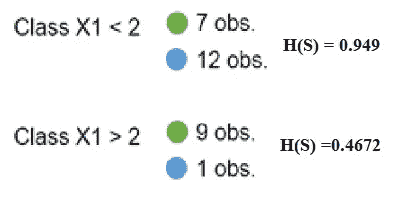

Image created by Author

我们已经获得了两个子集熵，但是我们仍然需要将我们的两个子集熵与子集概率相加，如果你还记得前面的信息增益方程的话。如果我们将所有数字放入信息增益等式，X1 = 2 时的信息增益为:

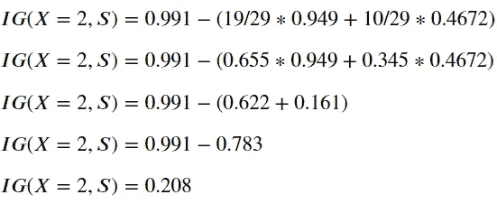

Image created by Author

利用 X1 = 2 特性作为分离器，我们将杂质减少了 0.208。接下来，我们还计算 X1 = 3 特征的信息增益。我现在要展示信息增益结果，X1 = 3 的结果是 0.168。因为 X1 = 2 具有最高的信息增益，这意味着我们选择 X1 = 2 作为我们的最佳分路器。

这些步骤一直进行到不再可能分离，或者一些标准停止了我们预先设定的计算(类似于基尼指数)。

无论如何，基尼指数、熵和信息增益度量都是在算法中用来创建决策树的度量。这两种算法都使用贪婪函数来查找最佳特征，这意味着数据集越大，查找时间就越长。

# 结论

决策树是分类和回归问题中最常用的机器学习模型之一。有几种算法可用于创建决策树模型，但决策树模型创建中著名的方法是应用:

1.  基尼指数，或
2.  熵和信息增益

这两种方法都测量用于分割的特征的杂质，但是方式不同。基尼指数计算二进制分裂杂质结果，信息增益衡量分裂结果前后的熵。

希望有帮助！

# 如果您喜欢我的内容，并希望获得更多关于数据或数据科学家日常生活的深入知识，请考虑在此订阅我的[简讯。](https://cornellius.substack.com/welcome)

> 如果您没有订阅为中等会员，请考虑通过[我的介绍](https://cornelliusyudhawijaya.medium.com/membership)订阅。