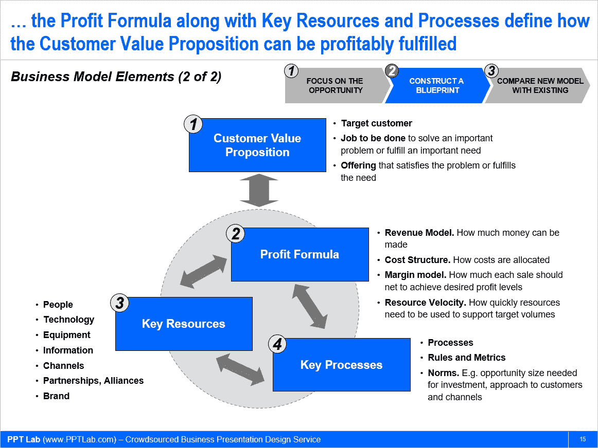

# 解构并创新你的商业模式

> 原文：<https://medium.datadriveninvestor.com/deconstruct-and-innovate-your-business-model-13ce84ff83a0?source=collection_archive---------9----------------------->

*注:本文由我的同事***原创发布。**

**

*商业模式是任何组织的公司战略的核心。它定义了公司如何创造、传递和获取价值。*

*大多数科技创业公司失败是因为缺乏可行的商业模式。即使对于已经建立了商业模式的企业，他们也经常需要重新审视和创新他们的商业模式。*

*为了理解成功商业模式的本质，首先，让我们看看它的 4 个核心组成部分:*

*   *[客户价值主张](https://flevy.com/business-toolkit/customer-value-proposition)，*
*   *利润公式，*
*   *关键资源，以及*
*   *关键流程。*

***客户价值主张***

*一个成功的公司帮助它的客户完成“工作”。做“工作”——这是企业为客户提供的“价值”。例如，谷歌帮助客户在网上查找信息。麦当劳帮助顾客快速廉价地满足油腻的胃口。Flevy 帮助客户找到他们工作所需的商业文件。*

*高客户价值主张与以下因素相关*

*   *工作对客户的重要性；*
*   *客户对市场上的备选方案满意度低；和*
*   *相对于其他选择，您的产品质量更高(或价格更低)。*

***利润公式***

*为客户提供巨大的价值是很好的，但是，作为一个企业，经济状况仍然需要对你有利。我们需要赚钱！这是利润公式。*

*利润公式是定义公司如何为自己创造价值，同时为客户提供价值的蓝图。利润公式由许多经济成分组成，包括:*

*   *收入模型*
*   *费用结构*
*   *利润模型*
*   *资产周转率和周转率*

*许多科技创业公司之所以失败，是因为它们的“商业模式”缺乏这个关键要素:利润公式。他们的目标是积累一个令人印象深刻的用户群，但没有一个切实可行的方法从用户身上获利。*

***关键资源和关键过程***

*一家公司必须能够接触到实现其价值主张和利润公式所必需的关键资源和流程。换句话说，关键资源和流程描述了如何为客户和公司本身创造价值。例如，对于一家咨询公司来说，关键资源是人，关键流程是与人相关的(如培训、招聘计划)。*

*关键资源是向目标客户提供价值主张所需的资产，如人员、技术、产品、设施、设备、渠道和品牌。它还必须有适当利用这些资源的关键流程。的关键流程通常以运营和管理流程为特征，这些流程允许他们以可重复和可扩展的方式交付价值。流程也可以采取策略、度量和文化的形式。*

**

*如前所述，即使有了具体的业务模型，也可能会有修改和创新的时候。所以，问题是…*

***什么情况下需要商业模式创新？***

*有五种情况经常需要商业模式创新。它们可以分为机会和需求。*

***机会 1:颠覆性创新***

*通过颠覆性创新解决大量潜在客户需求的机会，这些客户完全被排除在市场之外，因为现有解决方案对他们来说过于昂贵或复杂。*

***机会之二:新技术***

*通过包装新业务来利用新技术的机会，或者通过将经过测试的技术引入新市场来利用该技术的机会。*

***机会 3:关注未满足的需求***

*关注目前未得到满足的客户需求的机会。这在公司专注于产品或客户细分的行业中很常见，这导致他们越来越多地改进现有产品。*

***需求 1:低端颠覆者***

*抵御低端颠覆者的需求。也就是说，这些新进入者是低成本的利基参与者。*

***需求 2:改变竞争格局***

*应对不断变化的竞争基础的需要。不可避免的是，现在定义市场上可接受的解决方案的标准将随着时间的推移而改变，导致核心细分市场商品化。*

*通常，存在阻碍商业模式转变的障碍。障碍不一定是对改变商业运作方式的公开政治反对。相反，随着时间的推移，对核心商业模式的基本理解往往会消失在机构记忆中。这些被认为是制度性障碍，可能是财务、运营或战略性质的。*

*为了克服商业模式创新的制度障碍，许多公司决定推出独立的品牌或业务来采用新的商业模式。新实体最好设在一个完全独立的办公室。这样，它就不会被上级组织的任何习惯所束缚。*

*改变一个组织的商业模式是一个很大的变化。我们需要耐心——为了利益而耐心。成功的公司通常会在盈利的道路上修改他们的商业模式四次或更多次。*

*欲了解更多 [**商业模式创新**](https://flevy.com/browse/business-document/Business-Model-Innovation-136) ，请查看 [PPT 实验室](https://flevy.com/seller/pptlab)发布的[这份商业框架](https://flevy.com/browse/business-document/Business-Model-Innovation-136)。点击 可以查看更多 [**PPT 实验室的业务框架。**](https://flevy.com/seller/pptlab)*

# *想要在创新管理方面实现卓越？*

*获取知识，发展专业技能，成为创新管理专家。我们的框架基于领先的咨询公司、学者和公认的主题专家的思想领导力。[点击此处了解全部详情。](https://flevy.com/browse/stream/innovation)*

*为了保持竞争力和持续增长，我们需要不断开发新产品、服务、流程、技术和商业模式。换句话说，我们需要不断创新。*

*具有讽刺意味的是，我们发展得越快，创新就越难。大型组织往往是更好的执行者，而不是创新者。为了有效地管理创新过程，我们需要掌握创新的艺术和科学。只有这样，我们才能将创新作为竞争优势，而不是将创新视为潜在的破坏性威胁。*

*[在此了解我们的**创新管理最佳实践框架**。](https://flevy.com/browse/stream/innovation)*

*在 [**管理和企业咨询**](https://app.ddichat.com/category/management-and-corporate-consulting) **:** 中安排一个 DDIChat 会话*

* [## 专家-管理和企业咨询- DDIChat

### DDIChat 允许个人和企业直接与主题专家交流。它使咨询变得快速…

app.ddichat.com](https://app.ddichat.com/category/management-and-corporate-consulting) 

在此申请成为 DDIChat 专家[。
与 DDI 合作:](https://app.ddichat.com/expertsignup)[https://datadriveninvestor.com/collaborate](https://datadriveninvestor.com/collaborate)在此订阅 DDIntel [。](https://ddintel.datadriveninvestor.com/)*