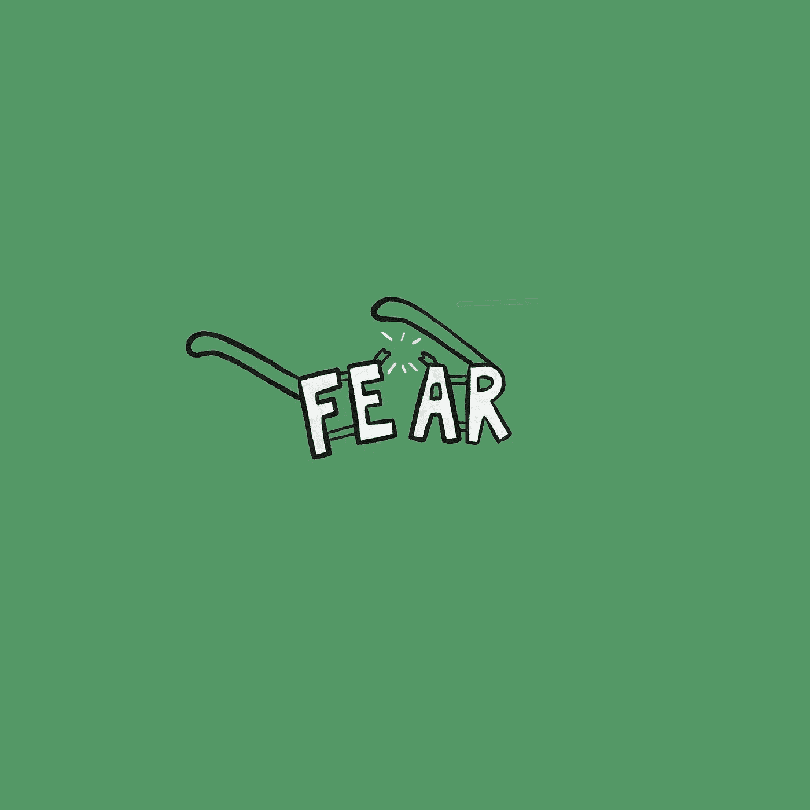
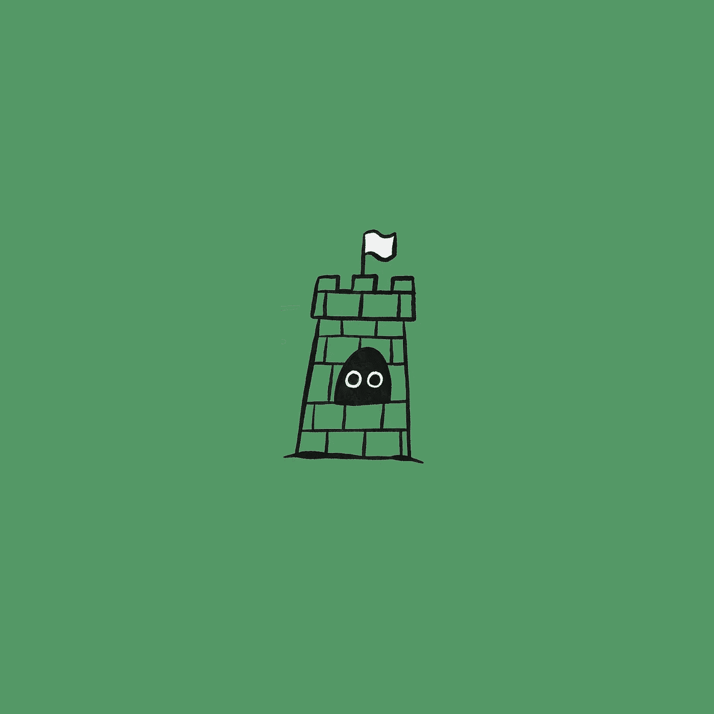
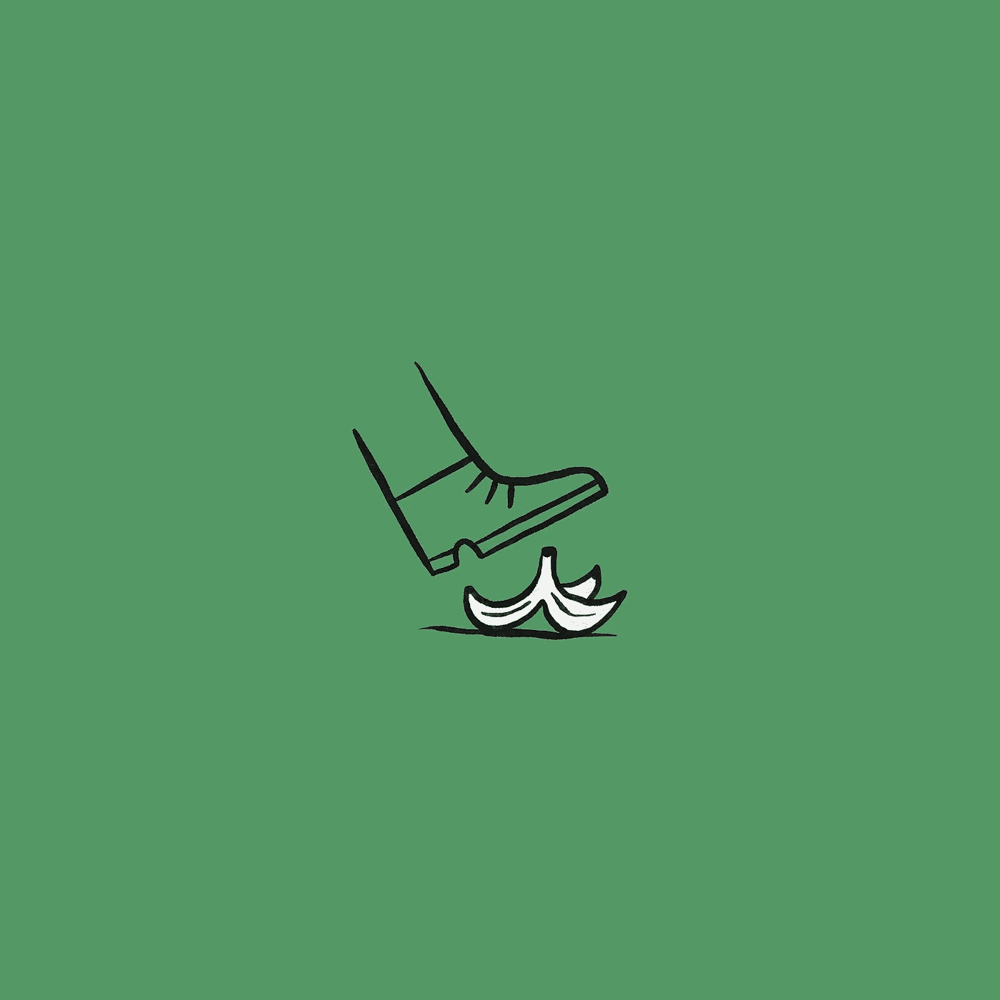
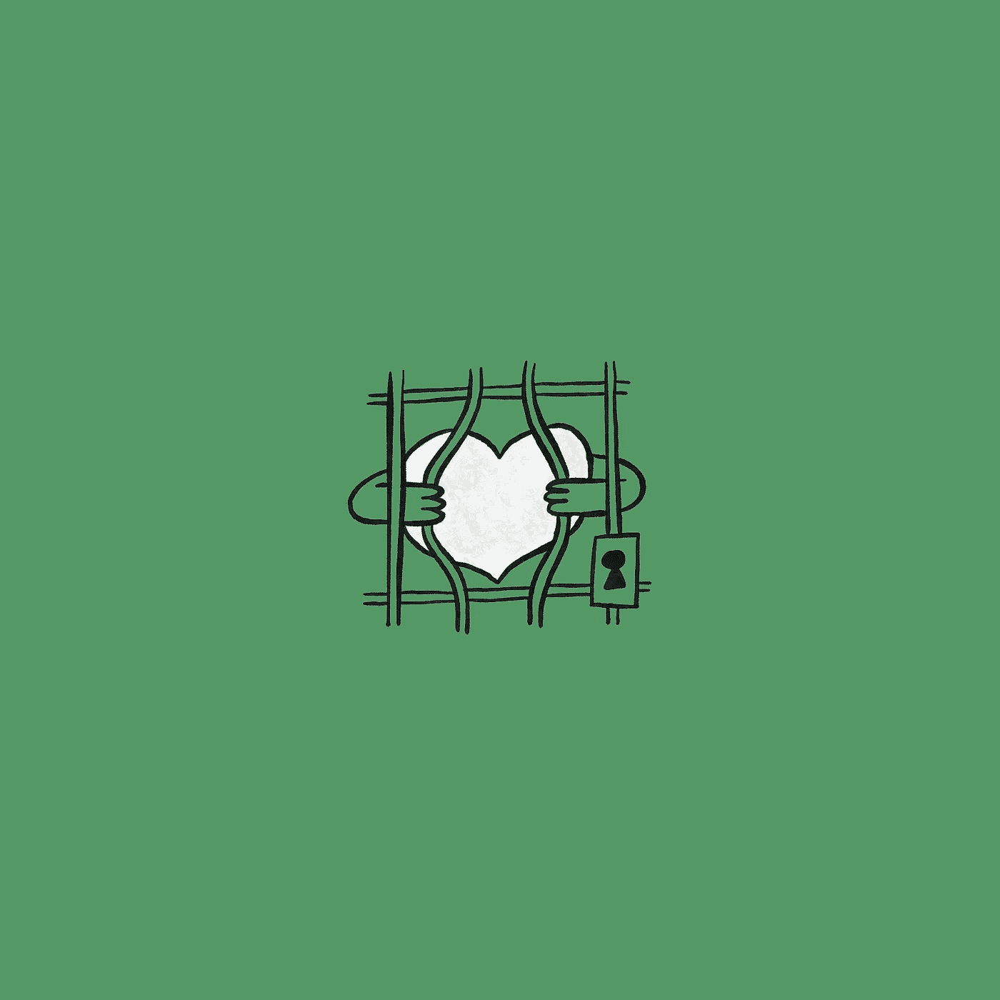
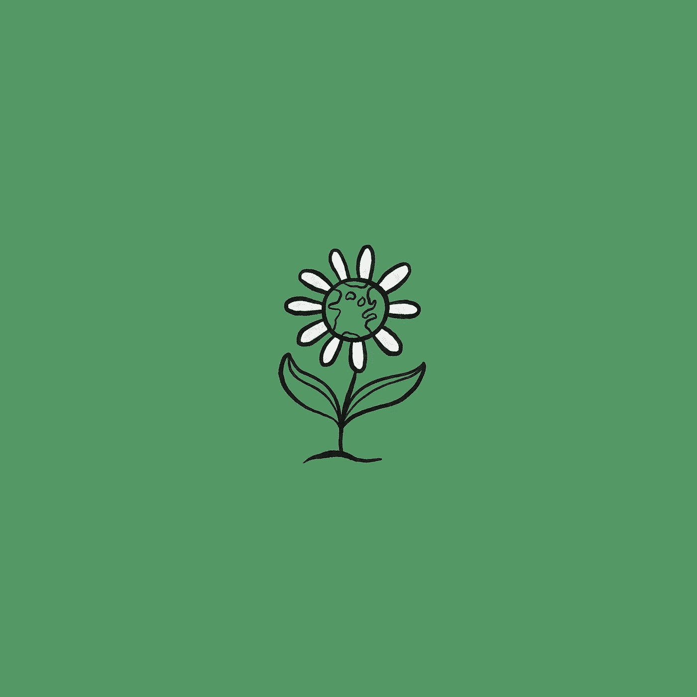

# 解构恐惧

> 原文：<https://medium.datadriveninvestor.com/deconstructing-fear-811d39480501?source=collection_archive---------12----------------------->

## 为了避免停滞，为了增加创造力。个人和集体

***亲爱的朋友们，堂兄妹们，***

有些事我需要告诉你。我发现这是一个简单而*的改变生活的真理*。我不知道你是否会有同样的感觉，但我希望你能敞开心扉继续读下去。

我很感动地告诉你:

恐惧是我们无法解决问题的原因。

我们都感觉到了；我们都看到了。我们很多人都抵制它。或者试着忽略它。这阻止了我们前进。如何说服整个文明摘掉他们不知道自己戴着的“有色眼镜”？如何让你相信恐惧限制了你感知、思考和决策的能力？

让我解释一下。请留在我身边；继续读。

Old, scratched, tinted glases that doesn’t let me see the world as it really is.

你能回忆起你害怕的时候吗？真的吓坏了？你还记得你的感知是如何变得敏锐的吗？你有保护自己的冲动吗？

恐惧塑造了我们对现实的感知。它塑造了我们的反应和行动。它的目的是保护我们。但这意味着它会让我们看不到我们不想看到的东西。当恐惧出现时，它会塑造我们的思想，产生看似合理的解释；它渗入我们的思想。这些解释支持恐惧的主要指令:*避免风险，避免变化，找到安全*。

恐惧贯穿了我们文明的 DNA。它塑造了我们的系统和机构。如果你仔细想想，它们是用来保护我们的，增加我们避免痛苦、苦难和死亡的机会。我们的祖先努力工作，让我们的家庭免受匮乏和他们所面临的威胁。他们这样做是为了我们。他们教我们这个来帮助我们生存，我们是幸存者。

With good intentions, we have built a fortress that blocks our growth.

今天，我们的物质进步在全球范围内创造了前所未有的富足。我们不再需要将他人视为威胁。如果我们用心去做，我们可以解决大部分的生存问题。相反，我们一直在犯同样的错误:战争、暴力、经济不公、环境破坏、腐败、不平等、不宽容。我们不断建立部落和分裂。我们将自己的观点两极分化，制造“他人”来对抗，制造他人来恐惧。总的来说，我们被恐惧麻痹了。

 [## 自由职业者拯救陷入困境的公司|数据驱动的投资者

### 在家工作对失业的上班族来说可能是新鲜事，但这通常是自由职业者的首选场所…

www.datadriveninvestor.com](https://www.datadriveninvestor.com/2020/08/10/freelancers-ride-to-the-rescue-of-struggling-companies/) 

但是新冠肺炎·疫情告诉我们，彻底的改变是可能的。我们以前所未有的方式在几天内成功阻止了交通和商业活动。这一次，我们对病毒的恐惧超过了对损害经济的恐惧。

我们需要害怕才能行动吗？*还是有别的办法？*

Who threw the banana peel? Opps! It was me.

我们需要承认，我们个人和集体的恐惧正在限制我们采取行动的能力。我们需要知道我们戴的是旧的有色眼镜，它现在已经失去了原有的功能。

今天是开始的好日子。**我们正在建设的新文明不支持标准化、大规模生产的公民**。它支持每个人的个性、宽容、包容、相互依存和机会平等。它为我们提供了安全，让我们可以无忧无虑地生活。

你还记得你的初恋吗？你觉得时间停止了吗？就好像你在一个泡泡里，你和你爱的人是唯一重要的人？你还记得你会为你爱的人做什么吗？

是的，这就是我们的祈祷和愿望的答案:一个更加公正的世界，有更多的和平和更少的痛苦。**减少恐惧，我们为更多的自由、更多的和平、更多的爱创造空间。**

即使我们抗拒改变，改变还是会发生。大坝迟早会垮掉，水还是会流的。

It is the balance of reason and emotion what will make us live authentic, free, lives.

姐妹们，兄弟们，让我们生活在不再恐惧的自由中。让我们重建支持我们的社区和国家的系统，以维持生命，而不是赚取优于他人的特权。

恐惧让我们彼此对立。爱让我们回到社区。

我们都能得到同等的满足、保护和培养。

当我们最需要行动的时候，恐惧使我们麻痹。让我们相信彼此，相信丰富的生活。让我们成为最好的自己。

这是我逐渐明白的。你也有这种感觉吗？你能走出恐惧进入信任吗？

你愿意和我一起建立一个更自由的文明吗？我知道一步一步我们可以走很长的路，但我不能独自完成。作为第一步，我正在建立一个社区，一份时事通讯，让那些想做一些积极事情的人留下来。[您可以点击此链接](https://deconstructingfear.substack.com)加入。

# 信用

由...所写

何塞·安东尼奥·莫拉莱斯

编辑和修饰者

[Chris Taylor](https://www.facebook.com/christaylor63/)

设计和插图由

[杰尼·格拉纳](https://twitter.com/breadzki)

I have faith, the change always happens with or without the supporters. I rather support!

最初由我发布，[此处](https://deconstructingfear.substack.com/p/do-you-want-to-live-in-freedom)。

## 访问专家视图— [订阅 DDI 英特尔](https://datadriveninvestor.com/ddi-intel)