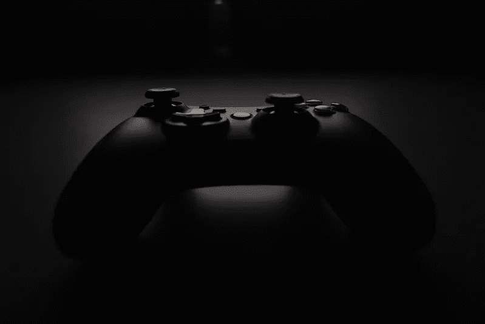
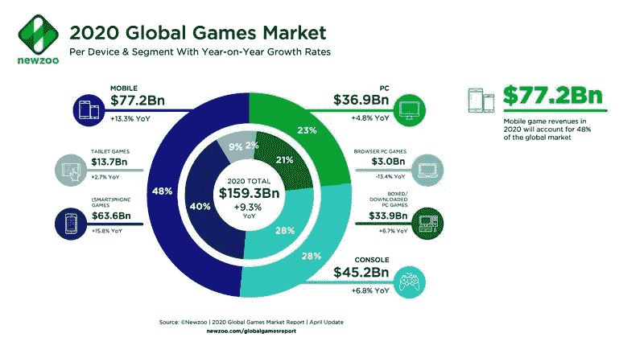
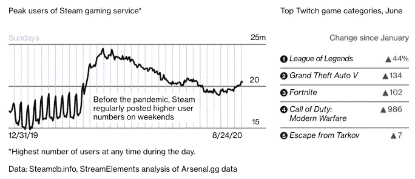
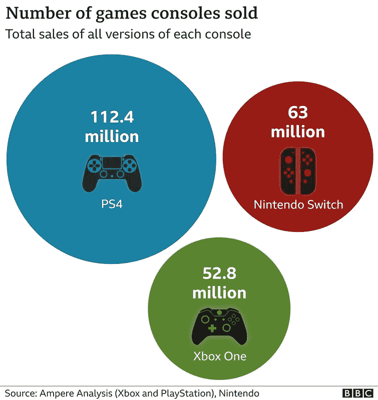

# 2020 年给我的旧 Xbox 360 除尘

> 原文：<https://medium.datadriveninvestor.com/dedusting-my-old-xbox-360-in-2020-75f0123c034d?source=collection_archive---------2----------------------->

我在 2010 年购买了我的第一台游戏机，当时微软推出了重新设计的 Xbox 360。尽管最初的 Xbox 360 是在 15 年前推出的，但在 5 年后的 2005 年 11 月，微软决定生产一款更轻薄的机型。它还包括一些重大改进，如内置 N-wireless 连接，45 纳米 CPU 和 GPU，以及内置 Kinect 端口——一种提前发布的运动传感系统。

*Photo by Rohit Choudhari on* [*Unsplash*](https://unsplash.com/photos/tk2_RBZq7RA)

直到那天，我一直喜欢在电脑上玩游戏。我最喜欢的游戏针对鼠标和键盘交互进行了优化，如*帝国时代*、*模拟城市 3000* 或*运输大亨*。我也喜欢在我的电脑上玩动作游戏，比如*毁灭战士*、*雷神之锤*或*古墓丽影*。有趣的是，我在大学期间不再经常玩视频游戏，当我买了 Xbox 360 时，我主要把它用作媒体盒。

随着网飞或 Hulu 等应用的发布，我的 Xbox 变得越来越重要，实际上成了我的娱乐设备。有了 Kinect，我不用抓着遥控器就能和电视对话；感觉我生活在未来，2012 年！Kinect 还允许我用手势控制电视，提供了一种类似电影《少数派报告》中看到的未来的体验。看它的预告预告片[这里](https://youtu.be/oq98_35sQko):

Kinect trailer

多年来，电视开始配备“智能”功能，如 WiFi 连接和媒体应用程序，这减少了我对 Xbox 360 的依赖。这台游戏机一直放在我的电视柜里，但它被废弃不用了，我最终也把它忘了。

然后，2020 年疫情冠状病毒来袭，我们发现自己大部分时间都呆在家里。家庭娱乐成为许多家庭的优先选择，游戏一直是娱乐的重要来源。根据新动物园的一份报告，它的收入将在 2020 年达到 1590 亿美元。

*Global Games Market Report,* [*Newzoo*](https://newzoo.com/insights/articles/newzoo-games-market-numbers-revenues-and-audience-2020-2023/) *May 2020*

同一份报告称，“游戏机游戏将同比增长 6.8%，达到 452 亿美元，拥有超过 7.29 亿玩家”。看到这些数字让我想起我在电视下面藏了一个游戏控制台，我决定在多年不碰它之后再启动它。

在一次不出意料的软件更新后，我发现 Kinect 仍然像第一天一样工作，Xbox 360 游戏商店仍然非常活跃。我可以下载并玩*侠盗猎车手 5* 、*古墓丽影的崛起*、*艾伦威克*、*赤色亡灵救赎*和*光环:致远星*。由于我经历的爬行速度，一些游戏如 *Alan Wake* 需要几天才能下载(我打赌我是这个星球上唯一一个为 Xbox 360 下载游戏的用户，我迫使微软从冷库中取出文件)，但流行的游戏如 *Red Dead Redemption* 可以更快地获得。

由于封锁、在家工作和社会距离规范，我的日子开始变得模糊起来。完成这些游戏给了我一种令人满意的进步感，最后我在过去 6 个月里玩的电子游戏比过去 10 年都多。我不记得今年七月发生的许多具体事件，但我记得完成 *GTA5* 的满足感。

*Video Game Numbers during the 2020 pandemic,* [*Bloomberg*](https://www.bloomberg.com/news/articles/2020-08-27/this-is-the-video-game-industry-s-coronavirus-pandemic-boom-in-charts)

我必须承认，我期望看到 Xbox 360 游戏中过时的图形，然而*艾伦·威克*对灯光和阴影的使用让我惊讶，而*红色死亡救赎*丰富的风景和华丽的日出让我惊讶。4K 分辨率和光线追踪是下一代游戏机将民主化的游戏方面，全世界的游戏玩家都渴望得到它们。尽管如此，Xbox 360 仍然能够以 1080p 的分辨率提供令人满意的游戏体验，并且能够漂亮地渲染图形，这是我购买它近十年来的事情。

自 2010 年以来，微软已经发布了 Xbox 的几个新版本，现在准备与 11 月 10 日发布的 Xbox Series X 竞争下一代游戏。几天后，索尼也加入了这场战斗，其 PlayStation 5 将于 11 月 12 日发布。索尼的 PlayStation 4 销量明显超过了微软的 Xbox One，但历史是否会在新游戏机上重演仍是一个悬而未决的问题。

*Gaming consoles sold as of September 2020,* [*BBC*](https://www.bbc.com/news/technology-54178375)

目前还不清楚谁将赢得下一代游戏机的竞赛，但随着这两个系统在所有主要零售商中售罄，未来几个月对游戏行业来说将是令人兴奋的。即将推出的游戏包括令人惊叹的图形和电影故事，新的游戏机将提供 500 美元可以买到的最佳图形性能。这是玩电子游戏的最佳时机。

你喜欢这篇文章吗？ [**订阅**](https://geekonrecord.com/subscribe/) **通过邮件获取新帖子。**