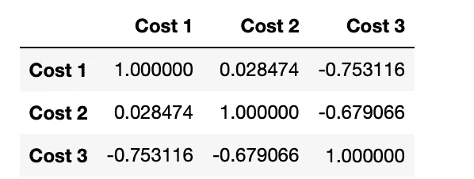
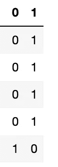

# 深潜多重共线性！

> 原文：<https://medium.datadriveninvestor.com/deep-dive-multicollinearity-7737754aae03?source=collection_archive---------17----------------------->

## 本博客旨在解释多重共线性概念，这在数据预处理中非常重要，而数据预处理又是数据科学或机器学习/深度学习的一部分。

[**Image Source!**](https://www.google.com/url?sa=i&url=https%3A%2F%2Fwww.i2tutorials.com%2Fdata-preprocessing-for-machine-learning%2F&psig=AOvVaw1Rc4FqhvhPd_kOiSTgZiRq&ust=1609341704595000&source=images&cd=vfe&ved=0CAIQjRxqFwoTCNju05q_8-0CFQAAAAAdAAAAABAP)

当今世界对数据科学大肆宣传，但可悲的现实是，由于这种宣传，大多数人都没有学习所需的实际概念，即使有人学习，也不是以正确的方式学习，也就是说，他们没有学习实际的使用案例。

在不知道一个流行语的实际概念的情况下，匆忙跟上这个流行语的问题使得真正理解它变得非常困难。除此之外，这种学习方式给社会/其他感兴趣的学生留下了非常坏的影响/印象。因为感兴趣的人会观察以错误的方式学习的学生的学习模式，他们也会倾向于做同样的事情。结果是，大多数人只是假装他们知道真正的概念，但实际上，他们只是匆匆一瞥。

要在这些技术中脱颖而出，拥有深入的知识必须是一个目标。现在，话虽如此，让我们开始主题“多重共线性”。

# 什么是多重共线性？

其含义在于单词本身，**共线性**表示(在数据集的上下文中)某些特征以某种方式彼此相关，& **多**表示不止一个。

当以上两个单数词组合起来&成为“多重共线性”时，表示多个特征相互关联。

如果某些特征无论如何都是强相关的，那么将会有多重共线性。

# 多重共线性是如何产生的？

**当数据集中存在一些要素时，可以完全推导出其他一些要素的值，那么肯定会存在多重共线性。**可能产生多重共线性问题的特征示例如下:

## 示例 1

考虑一个包含 3 列的数据集，一列是 1 到 50 之间的随机数，另一列也包含 1 到 50 之间的随机数，最后第三列包含从 100 减去两列值之和后得到的值。

很容易理解，如果我们在两件不同的东西上花了 100 英镑，那么第三列的值就很容易计算出来。这在这些列之间产生了很强的相关性。

> 注意:如果你不知道相关性，那么请阅读下面提到的关于相关性的博客。

 [## 数据科学中的协方差

### 本博客旨在解释协方差，这是数据科学中特征工程的一个非常重要的主题。在…

medium.com](https://medium.com/swlh/all-about-covariance-in-data-science-86ff0bcf44ca)  [## 数据科学中的皮尔逊相关系数

### 本博客旨在解释一种有效的方法来计算数据集特征之间的相关性，进而…

medium.com](https://medium.com/swlh/all-about-the-pearson-correlation-coefficient-in-data-science-84d7cb771db0) 

**Dataset! [Image by Author!]**

当您计算这些特征之间的相关性时，您将得到:

**Correlation among the features![Image by Author]**

在上图中，你可以看到(成本 1 和成本 3)，而(成本 2 和成本 3)高度相关。

 [## 一瞬间学会数据科学！？数据驱动的投资者

### 在我之前的职业生涯中，我是一名训练有素的古典钢琴家。还记得那些声称你可以…

www.datadriveninvestor.com](https://www.datadriveninvestor.com/2020/07/23/learn-data-science-in-a-flash/) 

## 示例 2

考虑到**性别**的特征，它是一个**分类变量**(名义分类变量)，因此，必须对其进行一次热编码，以使其适用于模型。编码后，它将被转换成包含 0 或 1 的 2 列。

由于任何一列的值都可以很容易地从另一列的值中导出(因为如果一列的值为 0，则可以理解为原始值/另一列的值为 1，反之亦然)，因此很容易理解为存在多重共线性问题。

请查看以下数据集和图像的图像，以便更好地理解:

**Gender Dataset![Image by Author]**

**Correlation among the features![Image by Author]**

> **从上图中可以清楚地看到，要素中存在 100%的多重共线性！**

# 重要提示！

如果只考虑 1 个因变量和 1 个自变量，则不会出现多重共线性。

# 多重共线性的弊端！

每当数据集中出现多重共线性时，如果该数据集直接用于训练模型，则训练的模型肯定不是最佳模型，在大多数情况下，模型将使用绝对错误的权重进行训练。

多重共线性导致虚拟变量陷阱的问题，要了解什么是虚拟变量陷阱，请点击下面的链接查看相同的博客。

 [## 虚拟变量陷阱深入！

### 本博客旨在解释与虚拟变量相关的问题，即虚拟变量陷阱。一切…

harshitdawar.medium.com](https://harshitdawar.medium.com/dummy-variable-trap-in-depth-8b562131dd58) 

# 多重共线性的代码链接！

 [## harshit dawar 55/机器和深度学习

### 包含关于使用 python 的机器和深度学习的惊人项目，以及完整的解释和所需的资源…

github.com](https://github.com/HarshitDawar55/Machine_And_Deep_Learning/blob/master/Important_Concepts_Explanation/MultiCollinearity.ipynb) 

我希望我的文章用所有深刻的概念和解释解释了与主题相关的每一件事。非常感谢你花时间阅读我的博客&，增加你的知识。如果你喜欢我的作品，那么我请求你为我的博客&鼓掌，关注我的 [***中***](https://harshitdawar.medium.com/)***&***[***GitHub***](https://www.github.com/HarshitDawar55)***！***

**进入专家视角—** [**订阅 DDI 英特尔**](https://datadriveninvestor.com/ddi-intel)