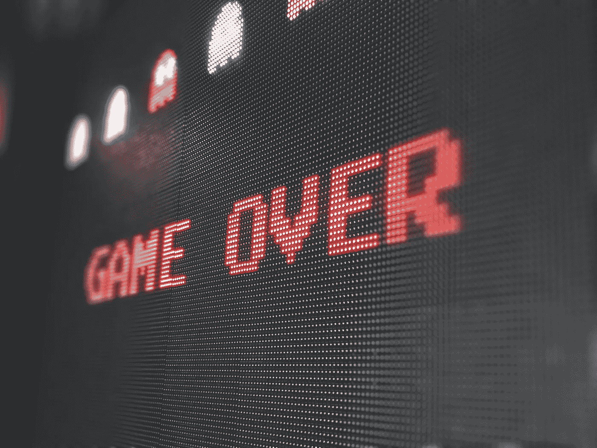
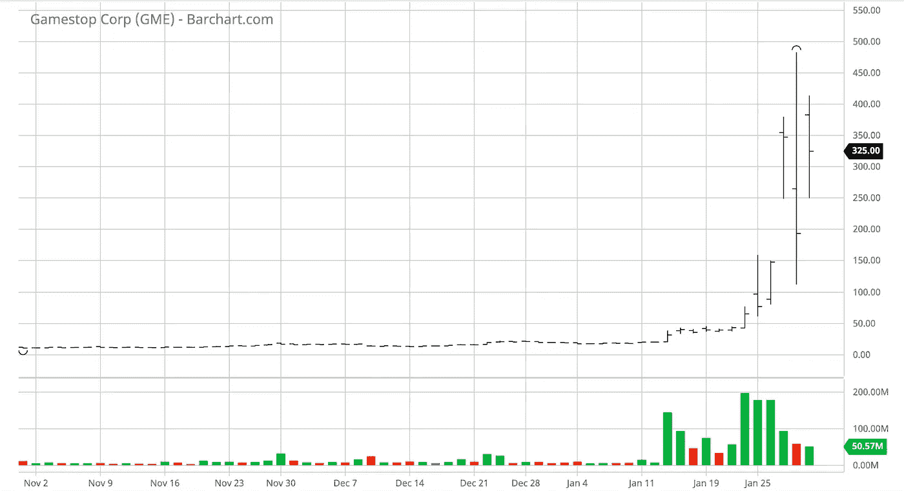

# 本质上，GameStop 的故事是马克思主义的叙述

> 原文：<https://medium.datadriveninvestor.com/deep-down-gamestops-story-is-a-marxist-narrative-d7b5b55d50f0?source=collection_archive---------7----------------------->

Photo by [Sigmund](https://unsplash.com/@sigmund?utm_source=unsplash&utm_medium=referral&utm_content=creditCopyText) on [Unsplash](https://unsplash.com/s/photos/videogames?utm_source=unsplash&utm_medium=referral&utm_content=creditCopyText)

## 而且它并不真的只适用于 GameStop

我怎么能开始写一篇主题是一群 Reddit 用户强烈震惊美国机构的文章呢——以至于纳斯达克首席执行官[因股票异常交易而提议暂停交易](https://www.youtube.com/watch?v=DyoKZQztDUE)?

这不禁让我想起了那次[金凯瑞在推特上与臭名昭著的意大利法西斯独裁者、现任政治家娅丽山德拉·墨索里尼的孙女发生争执。我们生活在这样一个世界。](https://www.independent.co.uk/arts-entertainment/films/news/jim-carrey-alessandra-mussolini-twitter-fascism-italy-a8848631.html)

尽管……如果一个加拿大电影明星和一个独裁者的孙女有理由成为社交媒体世仇的不太可能的二人组，美国金融机构和参与市场并受其影响的普通人却不是。它们是严格相关的。

**一点背景知识** : GameStop，一家因其已经下滑的业绩而闻名的公司，由于 Covid19 危机，其零售业务受到了更严重的打击，成为大型对冲基金押注其股票市场亏损的激进卖空策略的目标。这种操纵——导致了如此激进的卖空行为，以至于该公司[一度被卖空 102%](https://www.wsj.com/articles/gamestop-shares-surge-toward-fresh-record-ahead-of-opening-bell-11611579224)——并不适合那些在 r/WallStreetBets subreddit 等论坛上通过交换意见和建议而繁荣的个人小投资者。

这些人组织了一场真正的金融骚乱，并开始了熊市趋势，这使得 GameStop (GME)的股票价值暴涨，超过了上限——两周内 [+1，500%](https://www.cnbc.com/2021/01/27/gamestop-mania-explained-how-the-reddit-retail-trading-crowd-ran-over-wall-street-pros.html)。然而，这是整个故事的一个概括、简洁的版本，正是你需要通过这篇文章来理解为什么这个故事可能会危险地展现为来自当权派的家长式和不屑一顾的答案，这不会做任何事情，只会产生更多的仇恨，并使金融和政治领域已经非常两极分化的民粹主义辩论两极分化——不仅仅是在美国。

# 嘿，2008 年。你买了一件新衣服，是吗？

2020 年的零售危机和 2008 年的次贷危机一样吗？是也不是。但我们肯定不能不认为，去年的危机是一次打击，那些记得 2008 年危机的人，悲惨地经历了这场危机，父母失去了工作、房子和基本的生活资产，在 2020 年摆在我们所有人面前的缺乏未来面前，不能不感到绝望。

对于许多人来说，拥有稳定的工作、稳定的薪水、有房有车有狗的经典代际梦想已经不再可行。然而，新的赚钱方式已经形成:其中之一是投资，无论是股票、金属还是密码。

如今的千禧一代将投资视为他们在过去几年的危机中被剥夺的金融权力，他们比年长的(“业余”投资者)更了解金融事务，并对他们所做的投资抱有很高的期望——难怪如果市场不民主地关闭了他们，他们会变得个人化。

他们所看到的是，金融金字塔的底部，在市场“更大利益”的名义下，它的希望和未来再次破灭。市场应该只由专业人士占据，应该集中在极少数人手中，这阻碍了所有潜在的参与者进入一个应该是民主和自由的市场。

最新的消息是，Robinhood 和 Trading212 取消了购买新股票的选择权，这种“高权力”和大多数人之间的裂痕不禁加剧。我认为这就像认为知识会随着审查而消失一样，从历史上看，这种想法从来没有成功过。

在这里，我们有两个政党，我们可以同意或不同意，根据我们的政治观点，对这个问题的感觉，或任何东西。然而，不可否认的是，来自政府和私人平台的机构的这种反应只是加剧了一种注定会成为增长趋势的现象。一场真正的自下而上的革命。

GME in the last six months. I mean, come on…

# 马克思会感到骄傲的

也许这是我在加密金融方面的背景，但我不禁在这里看到了深刻的马克思主义叙事:呼吁赋予人民权力成为市场不可或缺的一部分，决定寡头体系不能与自由市场的概念共存，在一个被相隔仅十年的两次危机动摇的世界，分散和重新分配金融权力是必要的。

Coindesk 播客主持人[纳撒尼尔·惠特莫尔](https://twitter.com/nlw)的以下推文开门见山:

> 现在推特上有两类人:一类人绝对相信这是一个极其重要的文化转折点，另一类人还不明白这是一个极其重要的文化转折点。

另一个有趣的点是，像以前的许多革命一样，它肯定继承了以前尝试(如占领华尔街)的许多基本愤怒和论点，但它将它提升到了一个新的水平，即权力机构被直接打击和操纵，以发出一个切实的信息——这不仅仅是普遍的不当行为，我指的是对权力机构的实际操纵。

我想接下来要回答的唯一问题是:我们真的生活在一个自由市场中吗？如果我们这样做，当权派能接受竞争吗？

无论这次大型基金和交易所是否会措手不及，去中心化和金融赋权是这十年的新(迫切需要的)趋势，这一点都不令人惊讶。他们应该准备好迎接挑战。事实上，他们必须这么做。