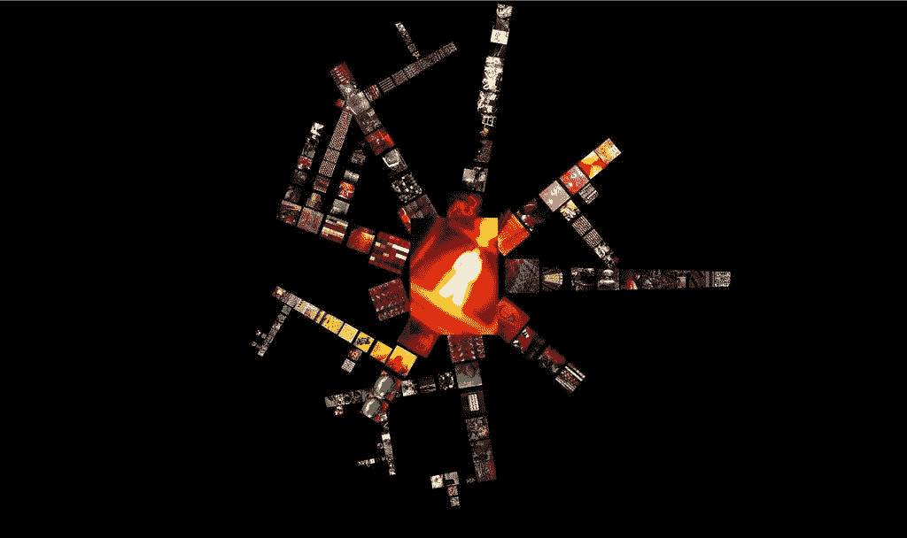
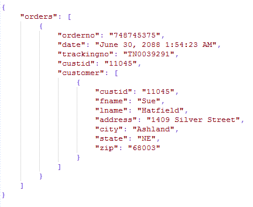

# 深度假货:你够人性吗？

> 原文：<https://medium.datadriveninvestor.com/deep-fakes-are-you-human-enough-9fefd0561526?source=collection_archive---------3----------------------->

> “数据是新的石油”

这种说法既荒谬又不符合事实，唯一正确的是数据，如果不是更有价值，至少和石油一样有价值。你上传的每一个字节的数据都增加了这个庞大的我们称之为互联网的东西。你的数据，不像大多数人想象的那样，不是条形图、图表和饼状图。

您的数据看起来更像这样:

你的搞笑帖子，你的 snapchat 图片，你的位置，你的兴趣。所有这些都存储在这样一个文件中。你的生活、兴趣、你在 twitter 上发出的想法，一切都以文件的形式存储在服务器农场的某个地方。很可能在美国的某个地方(谢谢亚马逊)。你分享的那张奶昔照片？是的，脸书把它藏在这样的地方。

 [## 今年值得关注的 5 大人工智能趋势|数据驱动的投资者

### 预计 2019 年人工智能将取得广泛的重大进展。从谷歌搜索到处理复杂的工作，如…

www.datadriveninvestor.com](https://www.datadriveninvestor.com/2019/02/19/artificial-intelligence-trends-to-watch-this-year/) 

像我这样的人(在一定程度上)可以获得这些数据来提取这些细节，并将其作为产品出售给其他人。数据就是这样。一种商品。数据无处不在。数据用于预测我应该给你看什么广告。我想灌输给你的想法，现在也可以用来分享你打死一只狗的假视频。

最后一个听起来很吓人吧？好了，这就是我今天要为你简化的。我想和你们谈谈 DeepFakes 和深度学习。我想简化一下深度学习和深度假货的概念。

Deepfakes 利用了所谓的深度学习。其中计算机被教导识别重复数据之间的模式。它学习这些模式的速度非常非常快。这种学习能力在视频和图像中被用来创造所谓的深度假。

Deepfake 可以是听觉的，也可以是视觉的。最简单的一个是面部交换(想想 snapchat 过滤器)。但是有一些很深的假音，会降低一个人的声音。让他们听起来像喝醉了。或者通过加速(不是快进)让他们听起来更有侵略性。

然而，最复杂的一个问题是人脸重现。其中一个人的面部表情被应用到目标人身上。大概是这样的:

你被枪击过吗？现在，证明这一点并传播它是可能的。这些工具可以在网上获得，无论您的技术知识如何，都很容易获得。

deepfake 的第一次使用发生在 2017 年，reddit 用户 deepfake 上传了一个与名人交换面部的色情视频。它显然不够成熟。但是人们担心这项技术带来的潜在威胁是可信的。

在印度，记者 Rana Ayyub 受到了精神创伤，因为她成为了一个深度假色情阴谋的受害者。你可以在这里阅读。

现在比以往任何时候都更容易将图像、视频和音频处理到足够高的质量，从而开始影响普通人的生活。

## 它是一种工具，被用作武器

Photo by [Markus Spiske](https://unsplash.com/@markusspiske?utm_source=medium&utm_medium=referral) on [Unsplash](https://unsplash.com?utm_source=medium&utm_medium=referral)

像所有工具一样，deepfake 作为一种技术有好处也有坏处。我在上面列出了一些坏处，但也有一些好处。大多在娱乐圈。基本的 deepfakes 已经被用来重现电影场景，与原始场景中的演员不同。

YouTube 上有一整个频道专门用来重现电影场景[、Ctrl+shift+face](https://www.youtube.com/channel/UCKpH0CKltc73e4wh0_pgL3g/featured)。该频道上传由不同演员出演的著名电影场景的混音。如[家独](https://youtu.be/2svOtXaD3gg)，[屋](https://youtu.be/wWCHuj_dsvQ)。你一定要去看看。

除了娱乐，Deepfakes 还被用于医疗保健，以创建足够真实的“假数据”，供其他人工智能程序识别脑瘤等模式。这是他们的基本流程。

> "*研究人员使用两组开放的大脑磁共振成像数据集来训练该系统——一组显示患有阿尔茨海默氏症的大脑，另一组显示患有肿瘤的大脑。生成的图像足够好，使用 10%的真实数据和 GAN 创建的其余数据的混合，在训练算法识别新图像中的肿瘤方面与由所有真实图像组成的数据集一样好。*”

你可以在这里阅读更多关于这一过程的信息: [Deepfakes for good:为什么研究人员使用人工智能伪造健康数据](https://www.fastcompany.com/90240746/deepfakes-for-good-why-researchers-are-using-ai-for-synthetic-health-data)

他们基本上采用了一点点“真实”的人类数据，训练一个人工智能系统根据真实数据创建“虚假”数据，然后他们使用这些数据的组合来检测体内的肿瘤。

这是一些科学的儿子。

这篇文章的基本观点是提高对这种技术的认识，认识到 deepfakes 的潜在危险及其优势。

最重要的是，它告诉你们去思考你们消费的所有音频和视频内容。持保留态度在分享一段向公众传播虚假信息的视频之前，先思考并核实。不要成为愚蠢的牺牲品。聪明对待你的数字档案。以下是美国前总统欧巴马和喜剧演员乔丹·皮尔的致辞。