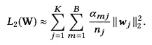

# 用于 CTR 预测的深度兴趣网络|论文评论、解释和实施

> 原文：<https://medium.datadriveninvestor.com/deep-interest-network-for-ctr-prediction-paper-review-explanation-and-implementation-6a47ffa8b90?source=collection_archive---------4----------------------->

CTR: Click-Through Rate Prediction

论文链接:[https://arxiv.org/abs/1706.06978](https://arxiv.org/abs/1706.06978)

**摘要** 本文深度兴趣网络点击率预测旨在改变传统的基于兴趣(用户旅程:点击、加入购物车、购买)获取用户嵌入的方法。在传统的嵌入& MLP 模型中，用户基于兴趣的嵌入被捕获并通过不同的汇集策略转换成固定长度的向量，主要通过总和/平均汇集，由于这存在信息损失。这种固定长度的向量成为了瓶颈。

本文旨在介绍一种从序列(多值)特征中学习的注意方法。在其上使用本地激活单元来获得候选项目(在纸质广告中)和历史项目(用户访问过的)之间的激活分数。用户嵌入是用户行为嵌入的加权和(其中权重是激活分数)。

Fig.1 Architecture

对于一个广告来说，用户兴趣的加权和方法极大地提高了模型的表达能力(*简而言之，对于每个广告来说，用户的兴趣嵌入将是不同的*)。

上面分享的机制只讲了用户的兴趣嵌入是如何计算的。在本文的后半部分**还讨论了两种技术:小批量感知正则化和数据自适应函数**，这有助于用数百个参数训练工业深度网络。

**简介**

在开始本文之前:-让我们讨论一下**为什么需要 CTR 预测？**

**最佳推荐系统是什么样的？**
推荐系统——根据用户的历史行为显示最相关的项目，并根据点击率对项目进行排名。

例如，在这篇论文中，阿里巴巴使用 DIN 模型来预测 CTR，以便根据用户的兴趣对相关候选广告进行排名/显示。

在**广告世界**中，使用的主要指标是:-
+ CPC —每次点击的成本
+ CPM —每 1000 次展示的成本
+ RPM —每 1000 次展示的收入
+ CPE —每次参与的成本(无论是用户 ATC 还是交易产品)

为了最大化收入和用户体验，广告在 eCPM 上排名—使用投标价格 X CTR(其中 CTR 指标是根据模型预测的 CTR)。

点击率预测对最终收入有直接影响，在广告系统和推荐中起着关键作用。

> 这篇文章主要强调了用户的固定长度向量是捕获用户多样化兴趣的瓶颈。它还解释了对于给定的候选产品/广告**，只有部分用户兴趣**会影响他/她的行为(点击/不点击)。例如:一个女游泳运动员会点击一个推荐的泳镜，主要是因为在她上周的购物清单上买了泳衣而不是鞋子。

基于这一思想:DIN 模型通过软搜索历史行为的相关部分来关注相关的用户兴趣，并采用加权和池来获得用户兴趣的表示。候选人广告。

**深度兴趣网工作:**

描述用户和广告的特征是广告系统的 CTR 建模中的基本元素。
**特征表示:-** 工业 CTR 预测任务中的数据多为多组类别形式，例如，[weekday=Friday，gender=Female，visited_cate_ids={Bag，Book}，ad_cate_id=Book]，通常通过编码转化为高维稀疏二进制特征。

Fig. 2 Feature Representation

Fig. 3 Statistics of feature sets used in the display advertising system in Alibaba. Features are composed of sparse binary vectors in a group-wise manner

基本模型通过总和/平均池合并这些表示，并给出一个固定长度的向量。

DIN:而不是用同一个向量来表达所有用户的不同兴趣。它自适应地计算用户兴趣的表示向量。候选广告。对于所用的加权总和汇集公式—

Fig4\. Local Activation Unit Equation

其中{e1，e2，…，eH }(如上图所示)是用户 U 的行为的嵌入向量列表，Va 是广告 A 的嵌入向量，这样，Vu(A)在不同的广告上是变化的。a()是一个前馈网络，输出作为激活权重(图 1)。除了两个输入嵌入向量之外，a()将它们的外积相加以馈入后续网络，这是帮助相关性建模的显式知识。

 [## 数据科学和软件工程哪个更有前途？数据驱动的投资者

### 大约一个月前，当我坐在咖啡馆里为一个客户开发网站时，我发现了这个女人…

www.datadriveninvestor.com](https://www.datadriveninvestor.com/2019/01/23/which-is-more-promising-data-science-or-software-engineering/) 

**加权池和策略将对激活分数较大的功能产生最大影响。**

Illustration of adaptive activation in DIN. Behaviors with high relevance to candidate ad get high activation weight.

**训练技巧**

1.  小批量感知正则化
2.  数据适应功能

对于具有数十亿用户规模的训练深度网络和具有大量稀疏输入特征的产品，使用上述两种方法来降低复杂性。

**小批量感知正则化:** L2 正则化被应用于参数，其减少了参数的量值，并因此降低了计算复杂度。L2 正则化应用于每个小批量。

Fig.5 L2 Regularization

其中 Alpha 为，在小批量 Bm 中至少有一个实例具有特征 id j。||Wj||是权重的平方和。

*L2 正则化:脊或套索正则化，主要通过降低参数系数的大小来帮助降低模型的复杂度。*

**数据自适应激活函数:** 激活函数主要有利于快速学习和降低消失梯度的可能性。

像 PReLu 或 Dice(本文中讨论的)这样的激活根据输入数据的分布自适应地调整校正点，输入数据的值被设置为输入的平均值。

Fig6\. Dice: Activation Function

其中 E[s]和 Var[s]是每个小批量中输入的平均值和方差，ε= 10^(–8)，α是可学习的参数，p(s)是控制函数，它控制 f(s)在(s) = s 和 f(s) = αs 的两个通道之间切换

Control Function of PReLu and Dice

**注意:**始终记住，PReLU 函数或 Dice 函数只能用于隐藏层

[ReLu vs 漏 ReLu vs PReLu](https://medium.com/@shoray.goel/prelu-activation-e294bb21fefa)

**PReLu 基本上就是 f(y) = max(0，yi) + a*min(0，yi)**

**结果&实验:**

论文随后讨论了他们执行的结果和实验。据观察，DIN 模型在特定候选广告(在阿里巴巴数据集)、评论(在亚马逊数据集)和电影评级预测(在 movielens 数据集)上的表现优于竞争对手模型(逻辑回归、嵌入&MLP、宽&深、PNN、DeepFM)。

关于数据集:

Statistics of Dataset used for experiments

**指标:**

我们如何定义一个特定的模型 CTR 预测离线和在线表现更好？

> 让我们看看谷歌广告如何工作，他们如何在他们的平台上排列广告。
> 广告商通过通用第二价格(GSP)拍卖对关键词进行竞价。排名得分(r)最高的投标人赢得拍卖:
> **【排名得分(r) = b p^(α)**
> 
> 其中 b 是出价金额，p 是估计的位置无偏 CTR，α是一个参数，称为点击投资能力。如果α>1，拍卖优选具有较高估计 CTR 的广告，否则，具有较高出价的广告。排名分数是通过每次点击出价成本加权的 CTR 来估计的。

上面的例子清楚地说明了一件事，如果我们在排名靠前的位置展示一个广告或一个商品，它很可能会获得更高的点击率。因此，CTR 预测应该是位置无偏的。

最好和最常用的 CTR 预测性能测量是 AUC:ROC 曲线下面积。

ROC 曲线是灵敏度(或 TPR)的图形描述，作为二元分类器(点击或不点击)的委托误差(或 FPR)随其阈值变化的函数。AUC 的计算方法如下:
按照模型预测得分的降序对记录进行排序
计算每个预测值的 TPR 和 FPR
绘制 ROC 曲线
使用梯形近似法计算 AUC
根据经验，AUC 是任何评分模型预测能力的良好而可靠的指标。

***AUC 计算:***

AUC Calculation

其中 n 是用户数，# impressioni 和 AUCi 是第 I 个用户对应的印象数和 AUC

TPR 和 FPR 价值告诉我们什么？
TPR——我们展示了多少用户感兴趣的广告，又有多少未能展示。
FPR——我们展示了多少用户不感兴趣的广告。

**结论**

DIN 旨在激活相关的用户行为，并获得用户兴趣的自适应表示向量，该向量随着不同的广告/候选项目而变化。
针对数十亿用户和产品的可扩展性，本文向我们介绍了两种技术，可进一步提高 DINs 的性能和训练复杂度。

下面是用户对 9 个不同类别的 100 种产品的可视化/热图。结果表明，DIN 可以在候选嵌入空间中形成一个多模态兴趣密度分布，便于某个用户捕捉他/她的不同兴趣。

Visualization of embeddings of goods in DIN. Shape of points represents category of goods. Color of points corresponds to CTR prediction value.

**参考文献:**

[https://arxiv.org/abs/1706.06978](https://arxiv.org/abs/1706.06978)

[https://chbrown.github.io/kdd-2013-usb/kdd/p1294.pdf](https://chbrown.github.io/kdd-2013-usb/kdd/p1294.pdf)

 [## ReLU 实用指南

### 开始使用和理解 ReLU，没有 BS 或花哨的方程式

medium.com](https://medium.com/@danqing/a-practical-guide-to-relu-b83ca804f1f7)  [## 深度学习的基础——激活函数以及何时使用？

### 概述激活函数是神经网络的构造块之一了解不同的激活…

www.analyticsvidhya.com](https://www.analyticsvidhya.com/blog/2020/01/fundamentals-deep-learning-activation-functions-when-to-use-them/)