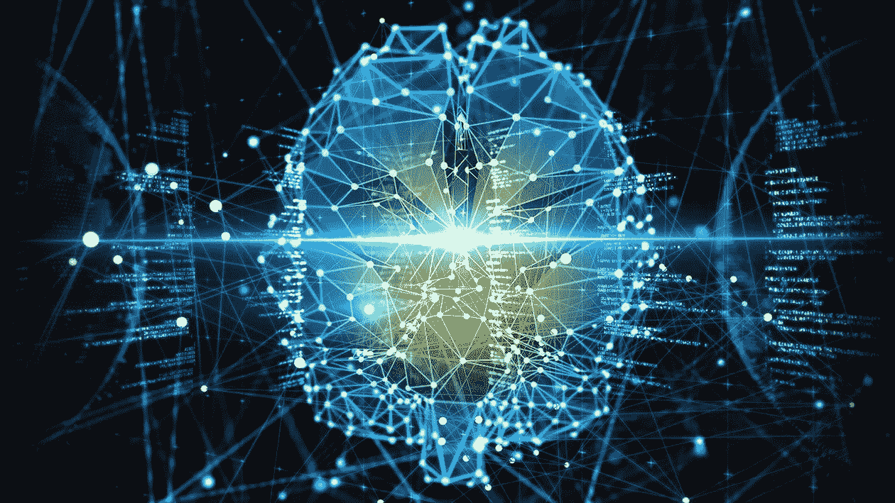
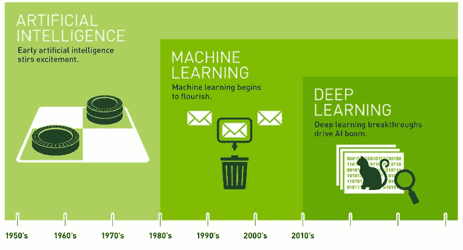
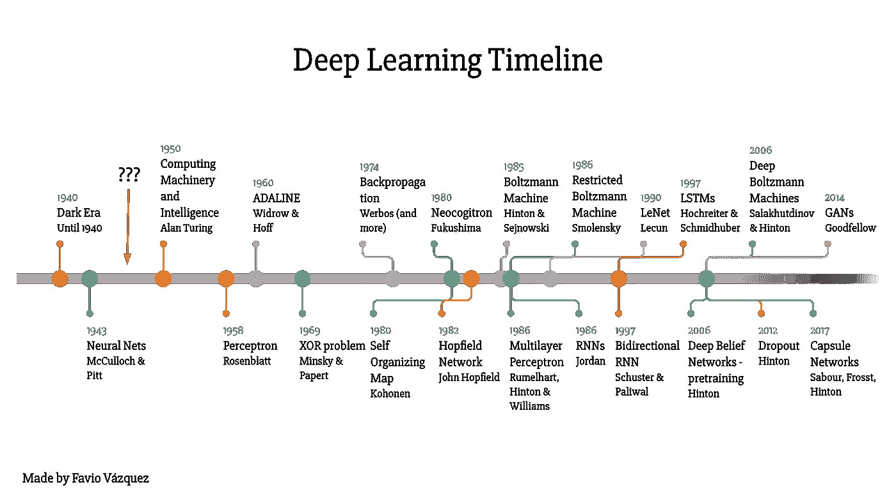

# 深度学习:全面介绍

> 原文：<https://medium.datadriveninvestor.com/deep-learning-a-comprehensive-introduction-6f9885b6ca1?source=collection_archive---------5----------------------->

## 让我们对当今最激动人心的科学领域有一个直觉

[https://criptotendencia.com/2019/12/04/deep-learning-es-utilizado-para-predecir-el-precio-de-bitcoin/](https://criptotendencia.com/2019/12/04/deep-learning-es-utilizado-para-predecir-el-precio-de-bitcoin/)

# 深度学习

欢迎您，数据爱好者！在第一个故事中，我们将讲述:

**深度学习介绍**

*   从机器学习到深度学习
*   历史关联
*   我们的工作环境:谷歌实验室
*   梯度下降

所以，没有进一步的行动，让我们投入进去吧！

# 深度学习简介

## 从机器学习到深度学习

[https://www.pinterest.es/pin/745134700823698580/](https://www.pinterest.es/pin/745134700823698580/)

在这一部分，我们将回答以下问题:

*   什么是深度学习？
*   它和机器学习有什么区别？
*   还有来自人工智能的？

**人工智能**

人工智能是让机器执行需要人类智能的任务。它可以分为两个领域:

*   AI 将军:它包括赋予机器我们所有的能力和感官。比如 C-3PO 或者终结者。但是不要担心，我们不期望在短期内出现类似天网的东西。
*   狭义 AI:它包括为机器提供执行某项任务的能力，如识别人脸、交通标志、语音等。正是在这一领域，目前正在取得巨大进展。

**机器学习**

机器学习是人工智能中的一个子领域。基本上，它包括使用大量数据来提取对人们有用的信息。

 [## 深度学习用 7 个步骤解释-更新|数据驱动的投资者

### 在深度学习的帮助下，自动驾驶汽车、Alexa、医学成像-小工具正在我们周围变得超级智能…

www.datadriveninvestor.com](https://www.datadriveninvestor.com/2019/01/23/deep-learning-explained-in-7-steps/) 

例如，假设我们有 NBA 的最新结果，我们希望能够预测湖人队对雄鹿队的下一场比赛的结果。

*   首先，我们需要分析和废弃数据，清理数据，删除不完整的条目，研究变量的分布，选择能够让我们尽可能准确地预测结果的特征或属性(特征工程)。
*   一旦我们明确了要使用的最佳特征，我们就需要为我们的数据集找到可能的最佳算法。

特征工程(特征的选择)部分，初看起来可能很简单，但却是最复杂和耗时的步骤，此外，还需要对所讨论的问题和特征提取技术有高度的了解。

这就是深度学习的用武之地。

**深度学习**

深度学习是机器学习的一个子领域，解决了上述特征选择的问题。深度学习，也称为分层学习，通过应用一种学习方法来识别数据中的细微模式，然后建立一个数学模型并将其集成为最终的分类器来实现这一点。

神奇的是，我们不再需要疯狂地寻找每个问题的最佳特征或属性，但这是由我们的算法自动完成的。

而这就是深度学习好坏的原因，它能够实现非常复杂任务的自动学习，但却是一个完整的‘黑匣子’。换句话说，我们不知道在学习过程中算法内部发生了什么。

> 这就是为什么尽管深度学习模型被证明是非常强大的，但它们尚未在整个行业中得到推广。当向组织的主管推销预测模型输出时，能够理解模型为什么做出这样的预测是关键。
> 
> 因此，目前，决策树和随机森林等机器学习算法比卷积神经网络或 GANS 更受欢迎。

最后，为了能够使用 ML 或 DL 技术，拥有大量数据是很重要的。此外，数据质量越高，我们的模型表现就越好。

让我们看看当今最具代表性的深度学习演讲者和教师对此有什么看法。

> “我认为人工智能类似于建造一艘火箭船。你需要一个巨大的引擎和大量的燃料。如果你有一个大的引擎和少量的燃料，你将无法进入轨道。如果你有一个小引擎和一吨燃料，你甚至不能起飞。要制造一枚火箭，你需要一个巨大的引擎和大量的燃料。”
> 
> 吴恩达(来源:连线)

**还有为什么要深度学习？**

深度学习之所以得名，是因为它使用一种连续的方法来转换数据，每一步都进行一次转换(它会变得更深入)，直到它按照我们想要的方式对数据进行区分或分类。

[https://ai.googleblog.com/2016/06/wide-deep-learning-better-together-with.html](https://ai.googleblog.com/2016/06/wide-deep-learning-better-together-with.html)

## 历史关联

[https://noeliagorod.com/2019/06/26/deep-learning-timeline/](https://noeliagorod.com/2019/06/26/deep-learning-timeline/)

很可能，你会认为 DL 和神经网络是刚刚出现的时尚。没有比事实更离谱的了！它们已经存在很长时间了。

第一个人工神经网络(ANN)建于 1958 年。问题是没有足够的计算能力来取得相关进展，直到过去几年，高性能 GPU 开始流行(谢谢游戏玩家:)。

自深度学习开始以来，它的主要里程碑是:

**1950** :艾伦·图灵创造了图灵测试
1952:亚瑟·萨缪尔创造了第一个可以一局接一局学习跳棋的程序
1956:马丁·明斯基创造了“人工智能”这个术语来指代这个新领域
**1958** :弗兰克·罗森布拉特设计了感知机，第一个人工神经网络。
**1967 年**:模式识别领域是随着“最近邻”算法的出现而诞生的。

接下来的时期被称为人工智能的冬天，在那里进步是如此之少，在时间上是如此之远，以至于这些领域的消失有一个很大的风险。

在 2006 年重新出现之前，一些最相关的事实是:

**1979 年**:史丹福手推车诞生，这是一个能够避开障碍物在房间里自动导航的机器人
**1981 年** : Gerald Dejong 介绍了机器学习的先驱“基于解释的学习”。计算机分析训练数据并创建规则以丢弃不太重要的数据
**1985 年** : Terry Sejnowski 发明了 NetTalk，一种能够像孩子一样学习发音的算法
**20 世纪 90 年代**:改变了机器学习范式:从面向知识到面向数据的方法。他们开始从大量数据中得出结论。
**1997 年**:深蓝首次击败卡斯帕罗夫。

自这一时期结束以来，机器学习和深度学习领域出现了令人难以置信的繁荣。

**2006** :深度架构出现，由 Geoffrey Hinton 创造为深度学习
**2011** : Watson IBM 在危险竞赛中击败人类竞争对手
**2012:**Geoffrey hint on 凭借深度神经网络赢得 ImageNet 竞赛
**2012:** Google X 创造 GoogleBrain，能够检测视频中的猫
**2014:** 脸书开发 DeepFace 仅比人类低 0.28%
**2014:**谷歌收购 DeepMind，这是一家英国公司，它创造了一种算法，能够简单地通过观看视频来学习玩雅达利游戏
**2015:** 埃隆·马斯克和萨姆·奥特曼创造了 OpenAI，以促进人工智能的良好使用
**2016:** 谷歌 DeepMind 首次在围棋比赛中获胜，获得了创造性的移动

# Google Colab

我们将在这些系列中使用的环境是 Google Colab。我们之所以选择它，是因为它易于使用和获取。任何拥有谷歌账户的人都可以创建一个笔记本并开始使用。

Google Colab 将同时成为我们的笔记本和 IDE，因为它允许我们利用免费的 GPUs NVIDIA K80(很棒吧？)，这将是我们执行和培训模型的地方。

要使用 GPU，我们需要做的是去编辑，在工具栏，然后笔记本设置，然后选择:Python 3 和 GPU。我们将保存这些设置，并准备编码！

# 梯度下降

使神经网络能够学习的机制是梯度下降。神经网络通过更新一系列权重来训练，训练越多，这些权重就变得越精确，从而获得更好的解决方案。

换句话说，神经网络是一种非常巧妙和强大的优化函数的方法。他们通过一种称为梯度下降的技术来实现这种优化，这在很大程度上允许我们用数百万个参数来训练网络，并能够在合理的时间内获得结果。

**什么是梯度下降？**

想象一下，我们在一座山顶上，我们想下来，但有无法穿透的雾，所以我们什么也看不见。

我们怎么下山？

[https://wallpaperaccess.com/snowy-mountain](https://wallpaperaccess.com/snowy-mountain)

一个解决方案是在四个可能的方向(北、南、东、西)中的每一个方向上迈出一小步，选择我们下降更多的方向，并在那个方向上迈出一步。

我们可以一次又一次地持续进行这个过程，然后我们会到达一个我们会发现自己在底部的点。

这种方法的问题是效率非常低，需要花费很多时间。一种更有效的方法是确定每个点的斜率，并且总是向最大斜率的方向移动。

这可以通过计算导数来实现。导数公式为:

函数的一阶导数衡量函数变化有多快，即它增长或减少了多少。所以我们能做的是计算每个点的斜率，然后继续降低斜率到最小值。

这个简单的机制是神经网络的核心。简而言之，梯度递减是一种优化算法，可以让你最小化任何函数(只要它是可微的，也就是我们可以计算它的导数)。

[https://www.pinterest.es/pin/572520171380230872/](https://www.pinterest.es/pin/572520171380230872/)

在实践中，梯度下降用于最小化成本函数，或神经网络在比较预测值和实际值时获得的误差。

它通过在每次迭代中一定程度地调整模型系数的权重来做到这一点，因此误差是最小的。由于 GPU 的当前能力，算法能够非常快速地执行这项任务，因此在非常短的时间内获得相当好的结果。

回到我们的山的比喻，目前的技术就像一双滑雪板，它们不仅让我们快速到达山的底部，同时也让我们玩得开心。

有几种梯度下降变化(普通梯度下降，批量梯度下降…)，但都是基于我们刚才解释的。

# 结论

一如既往，我希望你喜欢这个帖子，并且你已经学会了张量流的基础知识以及如何使用它**。**

*如果你喜欢这篇文章，那么你可以看看我关于数据科学和机器学习的其他文章* [*这里*](https://medium.com/@rromanss23) *。*

*如果你想了解更多关于机器学习和人工智能的知识* ***请在 Medium*** *上关注我，敬请关注我的下一篇帖子！*