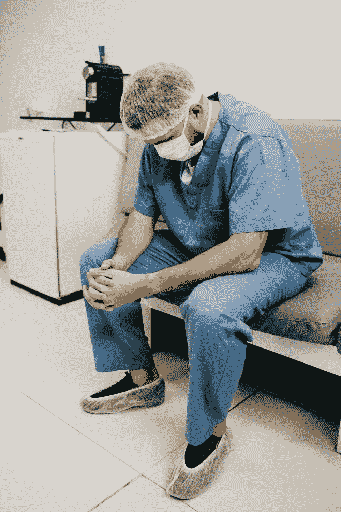
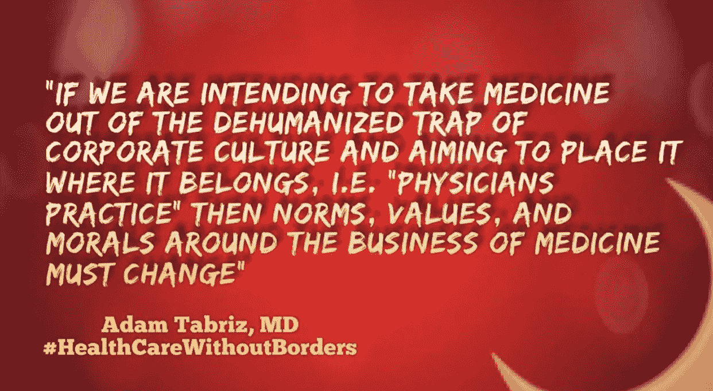

# 医生管理工作量增加时的深度学习

> 原文：<https://medium.datadriveninvestor.com/deep-learning-amid-increased-physician-administrative-workload-9692bb38a250?source=collection_archive---------7----------------------->

复制医师临床判断和征服医疗行业的特洛伊木马的缩影

[**本文原载于《数据驱动投资者**](https://www.datadriveninvestor.com/2020/11/27/deep-learning-amid-increased-physician-administrative-workload/) 。

Photo by [Michael Dziedzic](https://unsplash.com/@lazycreekimages?utm_source=medium&utm_medium=referral) on [Unsplash](https://unsplash.com?utm_source=medium&utm_medium=referral)

行政工作量是我们这个时代大多数医生所经历的众多负担之一。医生，尤其是那些独立执业的医生，必须比 10 年前付出 10 倍的努力才能获得相同水平的人均报销。关于“不恰当地”验证和设计电子健康记录系统(EHR)的这种趋势的至少一部分是涉及单个患者护理的日益增长的官僚主义。为了保持专注，我不打算讨论这种[日益增加的医师实践负担](https://physiciansfoundation.org/wp-content/uploads/2018/02/Physicians_Foundation_Future_of_Medical_Practices.pdf)的“为什么和如何”。然而，大多数熟悉当今医疗实践体系的读者都会承认，医生的职业倦怠是一个重大的医疗保健问题。

为了克服医生的倦怠并限制他们的管理工作量，各种机构和商业实体已经规定了大量的解决方案，其中许多至今仍未能产生任何有希望的结果。

# 降低医生职业倦怠的当前趋势

医生职业倦怠的原因是多方面的，减轻管理压力需要医生和组织以及中央和地方实施的项目共同承担责任。完成这样一项任务并不容易，因为它需要解决过程中的许多决定因素。医生职业生活方式的复杂性是后来现象的结果，然而这种表现并不总是巧合。想象一下，一家保险公司让医生对患者就诊或程序的索赔变得如此复杂。即使是医生一美元中的一美分的错误也可以为报销公司带来数十亿美元的损失。

Photo by [Jonathan Borba](https://www.pexels.com/@jonathanborba?utm_content=attributionCopyText&utm_medium=referral&utm_source=pexels) from [Pexels](https://www.pexels.com/photo/man-wearing-blue-scrub-suit-and-mask-sitting-on-bench-3279197/?utm_content=attributionCopyText&utm_medium=referral&utm_source=pexels)

现在，想象一家保险公司或任何利润驱动的公司试图解决医生因复杂的账单文书工作而造成的负担。

一个最突出的解决方案是实施一个自动化的创新实践管理解决方案软件，以减轻他们已经造成的负担；这包括政府管理。

# 人工智能在缓解医生职业倦怠中的作用

今天，使用人工智能(AI)和深度学习(DL)技术，各种医疗实践解决方案变得非常流行和方便。在人工智能在医疗保健领域的许多用途中，目前正在考虑的一个用途是减轻管理负担，从而减轻医生的疲劳。

人工智能和深度学习需要访问日常、原始但有价值的医生活动和患者数据。然后，利用为特定目的设计的预先编写的 DL 算法组，该系统调整一组功能或任务，否则医生将执行这些功能或任务。工程师们希望通过这种方法减轻医生的负担。

 [## 独立诊所的医生更容易倦怠

### 医生花两个小时在电子病历上输入数据，并为病人做其他行政工作

medium.com。](https://medium.com/@Adamtabriz/physician-burnout-falls-harder-on-independent-practices-e7dbf34f6506) 

使某些医疗实践活动自动化的概念是革命性的并且非常有用；尽管如此，人工智能并不总是止步于此。此外，一些人正在考虑创造所谓的机器人医生来取代医生。机器人医生学习临床技能也需要特定的算法。目前的算法并不完全透明，因此为深入了解医生的临床判断和能力提供了最佳机会。想象一下，机器人医生可以访问数十亿兆字节的临床实践数据，而无需人工智能技术和 EHR 系统的所有者支付额外费用。也就是说，在解决医生倦怠的同时，它也学会了如何像医生一样思考、诊断和治疗。

# 成为一名医生是一生的个人和经济承诺，但机器人医生免费得到它。

成为一名医生需要多年的努力和奉献。一个人必须学习、实践和接受指导，才能达到治疗病人的专业阶段。他们甚至不得不付费上学。

今天，机器人医生将在公司高管的帮助下进入医学院。但是这些公司不付钱给指导机器人医生的医生，也没有人问为什么！

人工智能正在获得医学学位，但机器人医生需要尽可能多的知识和数据。那么，有什么比把医生的倦怠作为主要借口更好的机会呢？在这样做的同时，收集大数据并应用深度学习来研究医生如何做出临床判断？

机器人医生需要深度学习的医师临床判断和诊断技能。对于机器人来说，获得临床技能的最佳途径莫过于在一个电子健康记录系统中生成医疗记录，该系统被垄断以使系统所有者受益。那么，企业至少不应该为使用这些数据付费吗？也许如果一个医生没有意识到他们失去了什么，那么它一定是好的！？

 [## 人工智能、深度学习和医疗实践|数据驱动的投资者

### 人工智能和深度神经学习的效用看起来可能是合法和有前途的，特别是…

www.datadriveninvestor.com。](https://www.datadriveninvestor.com/2020/06/24/disclosure-and-resolution-program-wont-prevent-physicians-from-practicing-defensive-medicine/) 

# 具有人工智能能力的实践管理系统在管理工作量方面是古老的特洛伊木马的体现。

除了原始临床数据之外，获得免费的临床判断是机器人医生成为医生所需要的。医生的倦怠和行政命令成为他们自己编造的“特洛伊木马”这一次，入侵者隐藏了人工智能算法，以征服终身医生的知识，而不是城市。在这种情况下，解决医生倦怠的方法是马。(比喻)

大多数医生没有意识到更好的 EHR 可能正在使用一种不所谓的完美算法。

 [## 为什么人工智能不会取代医生

### 同情、情感、移情都是治愈过程和医学治疗的重要部分。但是尽管你…

medium.com](https://medium.com/datadriveninvestor/why-artificial-intelligence-will-not-replace-the-physician-e1bfd469743b) 

让我们明确一点；人工智能和深度学习是有价值的工具，但只适用于透明和诚实的用户。除了上面所说的，机器人医生仍然是一个没有人情味的医生。此外，病人的信息是宝贵的，企业卡特尔是这样的临床数据。

医生、临床判断或思维过程(临床推理)使医生能够根据关于患者的客观和主观信息得出结论或做出临床决策，这些都是有价值的数据。这一有价值的商品被免费抢走，并在帮助医生减轻行政负担的借口下被用来对付医生。

Photo by [Photos Hobby](https://unsplash.com/@photoshobby?utm_source=medium&utm_medium=referral) on [Unsplash](https://unsplash.com?utm_source=medium&utm_medium=referral)

首先，医生不应该面对负担，既然他们面对负担，他们就应该为那些临床决策策略得到报酬。但不管保护患者的唯一方法是什么，我们都必须确保所有算法的透明度和问责制，并将数据所有权归还给其所有者。最重要的是，当所有需要的是授权患者、减少对医生的要求并确保分散的数据管理系统时，让政府负责指挥并让保险行业等实体指挥患者护理。

 [## 先进的技术结合人性化的服务可以缓解医生的职业倦怠

### 不同医疗机构的医生都面临着职业倦怠的风险。这是一个问题，政治家…

medium.com。](https://medium.com/datadriveninvestor/advanced-technology-combined-with-the-human-touch-can-ease-physician-burnout-6dc2fd25762e)  [## 现代个体医疗实践需要的不仅仅是一项技术

### 围绕医疗保健的官僚主义和不断增加的行政负担对任何医学专家来说都不陌生…

medium.com](https://medium.com/datadriveninvestor/the-modern-day-solo-medical-practice-needs-more-than-just-a-technology-ed5a23bfcf13)  [## 人工智能(AI)黑匣子

### 临床决策工具与医生临床判断的对比

medium.com](https://medium.com/illumination/artificial-intelligence-ai-black-box-59cb682b610e)  [## “医生的倦怠意味着两件事:第一，他们对自己的职业有多投入。

medium.com](https://medium.com/@Adamtabriz/physician-burnout-means-two-things-first-how-dedicated-they-are-to-their-profession-9d3a099833ff)  [## “医生职业倦怠的原因是多方面的，但最主要的原因是拒绝接受…

medium.com](https://medium.com/@Adamtabriz/the-cause-of-physician-burnout-is-multifaceted-but-the-main-reason-is-the-resistance-to-accept-f9a9d1fdbaf5)  [## “医生不会因为照顾病人而筋疲力尽，他们会因为照顾官僚机构而筋疲力尽…

medium.com](https://medium.com/@Adamtabriz/physicians-dont-burnout-taking-care-of-patients-they-burn-out-taking-care-of-bureaucracy-that-bd03569495f9)  [## 人工智能、深度学习和医学

### 积极的医生姿态将拯救医学艺术

medium.com](https://medium.com/datadriveninvestor/artificial-intelligence-deep-learning-and-medicine-ae0cdb7cb20) 

## 访问专家视图— [订阅 DDI 英特尔](https://datadriveninvestor.com/ddi-intel)