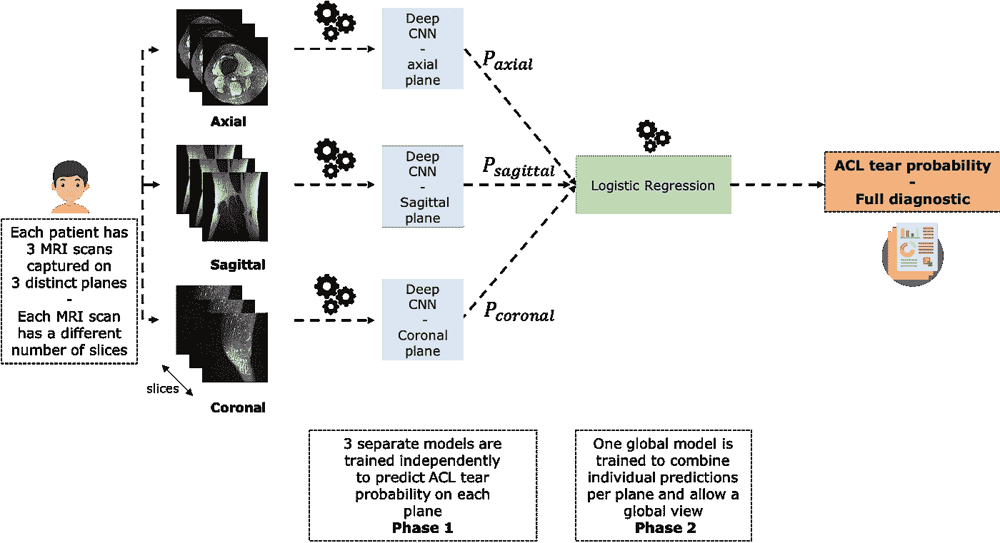
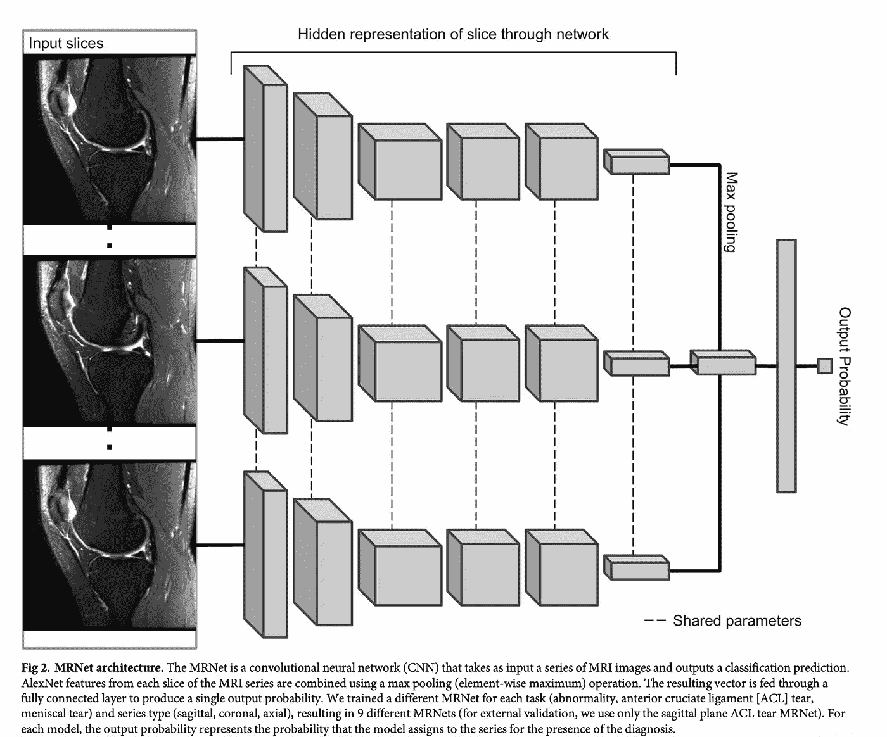
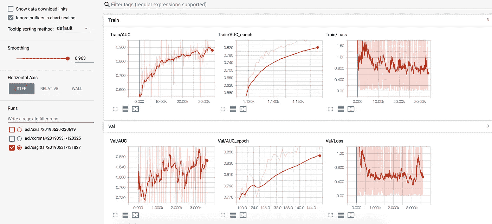

# 如何用 PyTorch 训练一个 MRI 分类器🔥

> 原文：<https://medium.datadriveninvestor.com/deep-learning-and-medical-imaging-how-to-provide-an-automatic-diagnosis-f0138ea824d?source=collection_archive---------1----------------------->

## 了解如何使用 PyTorch 训练高精度的 MRI 扫描膝关节损伤分类器

在这篇文章中，我们将建立和训练一个卷积神经网络，它可以从 MRI 扫描中检测和分类严重的膝盖损伤。我们将在 **PyTorch** 中实现它🔥来充分利用这个框架的功能。


Photo by [National Cancer Institute](https://unsplash.com/@nci?utm_source=unsplash&utm_medium=referral&utm_content=creditCopyText) on [Unsplash](https://unsplash.com/s/photos/medical?utm_source=unsplash&utm_medium=referral&utm_content=creditCopyText)

如果您不熟悉我们将使用的数据集，不要担心！你可以看看我以前的帖子。

[](https://towardsdatascience.com/deep-learning-and-medical-imaging-part-1-explore-the-mrnet-mri-dataset-of-knee-injuries-f519d063165) [## 深度学习和医学成像🚑—探索膝盖 MRI 扫描

### 了解如何在医学影像中应用深度学习。在本帖中，我们将探索膝关节磁共振扫描的 MRNet 数据集。

towardsdatascience.com](https://towardsdatascience.com/deep-learning-and-medical-imaging-part-1-explore-the-mrnet-mri-dataset-of-knee-injuries-f519d063165) 

## 在这篇文章结束时，你会学到一些东西💫

*   如何构建一个专门设计用于处理给定平面(轴向、矢状和冠状)MRI 扫描的卷积神经网络:我们将看到所选架构**如何考虑磁共振成像的 3D 特性**
*   如何实现一个**元模型**，它结合了三个 CNN 模型的预测，这三个 CNN 模型被单独训练以对每个平面上的 ACL 损伤进行分类
*   如何使用**迁移学习**和**数据增强**处理数据缺失
*   如何组织一个**端到端的训练管道**来加载和处理数据、训练、监控和评估模型

如果您阅读完本文，您应该对 ACL 撕裂分类问题及其检测有一个全面的了解。

> ***注意ℹ️:* 如果诊断膝盖损伤不是您特别感兴趣的医学任务，不要担心，您仍然可以将代码用于其他目的。**

# 1 —问题的提醒

这张图表总结了问题和我们要解决的方法:



Source: [ahmedbesbes.com](https://www.ahmedbesbes.com/blog/acl-tear-detection-part-2)

一个病人在三个不同的平面上进行三次 MRI 扫描:**轴向**、**矢状面**和**冠状面**。

对于这些飞机中的每一架，我们都要建立一个独立的模型。

这些网络中的每一个都将专门从给定的角度检测 ACL 撕裂。为了有一个在任何地方都表现良好的模型，我们将使用一个**堆栈操作将这三个模型组合成一个**元模型**。**

> 这种架构应该模拟放射科医生考虑单个患者的不同 MRI 扫描(在不同平面)的方式，以便做出可靠的诊断。

# 2 —模型架构:MRNet

现在让我们详细描述模型架构。我们将按原样使用它来为每架飞机训练一个模型。斯坦福团队将这个网络命名为 MRNet。

## 输入与输出

MRNet 是一个卷积神经网络，它将 MRI 扫描作为输入，输出撕裂概率(一个标量)。
一个输入 MRI 具有(s，3，256，256)的维数，其中 *s* 是 MRI 扫描中切片的数量。3 是每个切片的颜色通道数，256 是每个切片的宽度/高度。

## 预训练特征提取器

当 MRNet 将 MRI 作为输入时，切片首先通过基于预处理 AlexNet 的特征提取器。给定每个 MRI 的 *s* 个切片，结果是一个形状张量(s，256，7，7)。
注:(256，7，7)简单来说就是 AlexNet 最后一个卷积层得到的大小为 7x7 的一组 256 个特征图。

## 全球平均池层

然后，通过计算每个 7×7 正方形的平均值，将每个形状张量(256，7，7)简化为形状向量(256)。这个操作叫做**全局平均池。**现在输出的形状是(s，256)

## 最大池化

为了在将(s，256)形状的张量传递到分类部分之前将其转换为列向量，我们在切片之间应用了**最大池**。因此，我们得到一个形状向量(256，)。

## 全连接层

现在我们有了一个列向量，我们将它通过具有 ReLU 激活函数和 dropout 的完全连接的层。

下面的图表摘自斯坦福的论文，说明了这种架构。



Source: [PLOS Medicine](https://journals.plos.org/plosmedicine/article?id=10.1371/journal.pmed.1002699)

**关于这个架构的两点注意:**

*   鉴于 s 因患者而异，不可能批量堆叠成堆的 MRI。因此，我们将在训练中使用尺寸为 1 的**批次。这通常会引入损耗波动，但有一些技术可以克服这种波动。**
*   最好将切片并行通过 AlexNet，而不是顺序通过。

# 3 —培训程序

## 损失和优化器

使用 **Adam 优化器**通过最小化**交叉熵损失**来完成模型的训练。

## 不平衡数据

考虑到类的不平衡性质，实例的损失与该实例的类在数据集中的流行度成反比，以便更多地惩罚最不存在的实例上的错误。

## 数据扩充

在训练期间，使用反向传播算法对每个训练样本计算损失的梯度，然后在梯度的相反方向上调整网络的参数。

[](https://www.datadriveninvestor.com/2020/03/04/on-artificial-intelligence-and-surveillance-capitalism/) [## 人工智能和监督资本主义|数据驱动的投资者

### 大科技，总是现在:人工智能推动的大科技，已经使购物，搜索，在你的…

www.datadriveninvestor.com](https://www.datadriveninvestor.com/2020/03/04/on-artificial-intelligence-and-surveillance-capitalism/) 

在训练期间，一些**几何变换**被应用于输入 MRI。这些变换是标签不变的。它们旨在带来数据集中的多样性，增加模型的稳定性，同时降低其过度拟合的趋势。

我们将依次对每个输入 MRI 应用 3 个几何变换。

*   -25 到 25 度之间的随机旋转
*   -25 到 25 个像素之间的双向随机偏移
*   50%概率的随机水平翻转

**注意:数据增强是在核磁共振成像的所有切片上进行的。**

# 4 — PyTorch 代码结构

现在让我们把刚才看到的变成 PyTorch 实现。你可以在我的 Github repo 中找到代码:

[](https://github.com/ahmedbesbes/mrnet) [## ahmedbesbes/mrnet

### 这个知识库包含一个卷积神经网络的实现，该网络对特定的膝盖损伤进行分类…

github.com](https://github.com/ahmedbesbes/mrnet) 

代码被组织成三个文件。下面的图表总结了每个脚本的职责。


Source: [ahmedbesbes.com](https://www.ahmedbesbes.com/blog/acl-tear-detection-part-2)

## 1 —模型架构:model.py

这个模型很简单。我们将其定义为从 **torch.nn.Module** 类继承而来的名为 MRNet 的类。

在构造函数中，我们定义了三个对象:

*   预先训练的 AlexNet 模型
*   汇集层
*   作为分类层的密集层

在正向方法中，我们实际上编写了正向传递，即网络在计算预测之前对输入执行的操作。

下面我们来详细介绍一下:

*   这个方法接收 shape (1，s，256，256，3)的输入 x，因为正如我们前面所说的，我们正在处理大小为 1 的批
*   它通过“挤压”输入并将其形状变为(s，256，256，3)来移除第一维
*   now (s，256，256，3)是一个规则的张量形状，它可以被馈送到 AlexNet，后者随后产生形状(s，256，7，7)的特征
*   使用产生形状输出的全局平均汇集层来汇集特征(s，256)
*   汇集的特征在 256 维向量中被展平，该向量最终被馈送到输出标量值的分类器。注意，我们在这里没有使用 sigmoid 激活。sigmoid 运算被集成到损失定义中。

## 2-自定义数据集:dataloader.py

在这个脚本中，我们定义了一个自定义数据集对象，它在主程序中加载 MRNet 数据。

为了创建数据集，我们定义了一个名为 MRDataset 的类，它继承了类 **torch.utils.data.Dataset** 。

在 MRDataset 的构造函数中，我们定义了一组参数:

*   根目录:。/数据/
*   任务:前交叉韧带，半月板或异常。在本帖中，我们将重点关注 **ACL**
*   平面:矢状、冠状或轴向
*   train:一个布尔变量，表示我们是否正在处理训练数据(验证)
*   转换:一系列数据扩充操作。如果没有，则没有数据扩充
*   权重:每个类的自定义权重(默认为无):这用于调整损失函数。如果没有，将自动计算权重。

在构造函数的剩余部分，我们准备了对应于每个数据样本的路径、标签和权重。

在 **__len__** 函数中，我们返回数据的长度

在 **__getitem__** 函数中，我们返回 MRI 扫描。npy 文件，标签和重量后，应用较小的预处理和最终的数据增加。

## 3 —培训地点:train.py

这个脚本是应用程序的主要部分。它完成繁重的工作，并输出(即保存)训练好的模型。

简而言之，它是这样做的:

*   它导入 dataloader.py 来加载来自训练集或验证集的数据。
*   它导入 model.py 并在更新其权重之前实例化一个 MRNet 模型。
*   它在给定数量的时期内启动训练和验证循环。

如果我们跳过所有内容，看一下从终端调用脚本时执行的第一行代码:

```
if __name__ == "__main__":
    args = parse_arguments()
    run(args)
```

…我们将看到它首先加载命令行中给出的一些参数。

一旦参数被加载到 **args** 变量中，run 函数就开始执行。

无需深入细节，该功能首先创建一个文件夹，Tensorboard 将使用该文件夹来保存训练日志并可视化该课程的指标。

脚本每次运行时，都会创建一个新文件夹(以时间戳命名):

然后我们定义数据扩充管道

并实例化训练和验证 MRDataset。

这些数据集现在被传递到 Dataloader，这是一个方便的 PyTorch 对象，允许通过利用批处理、洗牌、多处理和数据扩充来有效地迭代数据。

现在我们实例化 MRNet 模型，并将其参数传递给 GPU。

我们定义了 Adam 优化器和学习率调度器。

我们举例说明了时期的数量和耐心，即在损失没有改善的情况下时期的最小数量。

现在是最精彩的部分，训练部分:

在每个时代，许多事情被执行:

*   我们使用 train_model 训练模型
*   我们使用 evaluate_model 来评估模型
*   我们打印 AUC 指标以及训练和验证数据的损失
*   我们让学习率调度器更新学习率
*   如果验证 AUC 提高，我们将模型检查点保存到磁盘
*   如果损失没有改善的时期数高于耐心，我们中断训练

现在让我们关注在每个时期调用的 train_model 函数。

以下是完整的代码:

让我们把它分成几块:

我们首先将模型设置为训练模式，然后将其传递给 GPU，并初始化包含预测、真实标签和每个单独样本的损失的列表。

然后我们遍历数据加载器:

在每一步:

*   单个 MRI 扫描及其相应的标签和重量被传递给 GPU
*   网络计算 MRI 扫描的正向传递，这导致预测
*   计算预测和真实标签之间的损失
*   损失的反向传播:梯度的计算
*   权重由优化器更新

在每个时期执行的剩余代码监控训练指标，并将它们记录到 Tensorboard。

# 5-结果:矢状面上前交叉韧带撕裂的分类

设置:Nvidia 1080 Ti 和 i7 8700K CPU。训练持续了大约 1 小时 11 分钟。35 个时代。

最佳模型保存在磁盘上，AUC 分数如下

*   **车次:0.8669**
*   **确认:0.8850**

可以在 Tensorboard 中查看每个时期和每个批次的 AUC 和损失:



Source: [ahmedbesbes.com](https://www.ahmedbesbes.com/blog/acl-tear-detection-part-2)

# 6 —构建全局 ACL 撕裂分类器

既然我们已经看到了如何在矢状面上训练 ACL 撕裂分类器，我们可以对其他两个平面遵循相同的程序。结果不相上下。

当这三个模型被训练并保存到磁盘上时，我们用它们来计算对每个样本的预测训练和验证。

在训练数据上计算的预测成为训练一个**逻辑回归的新特征。**

一旦训练了逻辑回归，我们就根据验证特征对其进行评估，即模型对验证数据的预测。

> **结果:我们得到的 AUC 为 0.95**

# 7 —想要改进模型？

显然还有改进的余地。事实上，您可以:

*   通过使用不同的预训练网络(VGG、ResNet、Inception)或者通过将 3 个平面组合成单个网络来构建新的架构
*   通过添加复杂的技术改进数据扩充
*   微调学习率或采用学习率调度方案
*   使用累积梯度来防止损失波动
*   训练更长的时间

# 总结:何去何从？

您刚刚学习了使用 PyTorch 中实现的深度卷积神经网络进行 ACL 撕裂分类。

现在是时候检查这个模型实际学到了什么。在下一篇文章中，我们将研究一种**可解释性方法**，这种方法可以突出显示在 ACL 断裂时激活的图像区域。我们将使用这种方法作为验证和增强诊断的支持。这也是一个有用的工具，允许放射科医生信任机器学习模型。

*原载于*[*https://www.ahmedbesbes.com*](https://www.ahmedbesbes.com/blog/acl-tear-detection-part-2)*。*