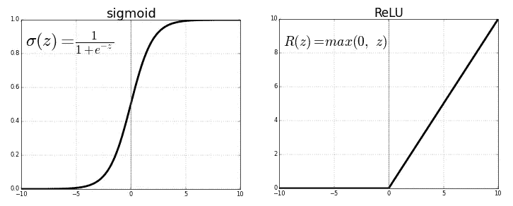

# 深度学习:人工神经网络(ANN)

> 原文：<https://medium.datadriveninvestor.com/deep-learning-artificial-neural-networks-ann-9eb56cf95be8?source=collection_archive---------1----------------------->

Image : TechRadar

# **深度学习:**

根据给定的定义。

> **深度学习**是人工智能(AI)中**机器学习**的一个子集，它拥有能够从非结构化或无标签的数据中**学习**的网络。又称**深度**神经**学习**或**深度神经网络**

# 深度学习中的类别:

深度学习可以大致分为三大类。

1.  人工神经网络也称为 ANN。
2.  被称为 CNN 的卷积神经网络
3.  称为 RNN 的递归神经网络。

# **人工神经网络(ANN) :**

人工神经网络是一种信息处理系统，它受到人类生物神经系统(如大脑)处理信息的方式的启发。

简而言之，ANN 研究的是人类大脑中神经元的概念。神经元(也称为神经元或神经细胞)是一种电可兴奋细胞，通过电信号和化学信号处理和传输信息。

image:visiblebody

***在安信息是从下面提层传递过来的***

1.  输入图层-接受数据集的输入要素
2.  隐藏图层-该图层负责对输入数据集执行各种操作。这些(隐藏层中的圆圈)被称为神经元。
3.  输出层-显示隐藏层执行操作的结果。

正如你在上面的图片中看到的，我们有三个输入特征输入 F1，输入 F2 和输入 F3，它们从输入层传递到隐藏层。

W1、W2、W3、W4、W5、W6、W7、W8 是分配给每个到隐藏神经元的连接的不同权重。这些权重对于优化我们将在下面详细讨论的模型起着至关重要的作用。

每个输入特征连接到隐层的所有神经元，隐层的输出连接到最终的输出层。

 [## 人工智能和“智力资源”的新领域|数据驱动的投资者

### “智力来源”是最近由赫尔辛基大学的研究人员开发的一项技术，它使用…

www.datadriveninvestor.com](https://www.datadriveninvestor.com/2020/06/19/artificial-intelligence-and-the-new-frontiers-of-brainsourcing/) 

# **人工神经网络中神经元的工作:**

每个神经元执行两个主要操作。

**操作 1** :包含所有权重乘以输入特征的总和，并在其上添加偏差。例如，在我们的线性回归中，我们使用下面的公式来寻找最佳拟合线 **y=m * x+c**

这里 m 是我们所有的权重，x 是我们所有的输入特征，c 是偏差。

这同样适用于所有其他神经元。

**操作 2 :**

Neuron 在**操作 1** 的输出上应用激活函数来转换值。

很少有著名的激活函数是 **Sigmoid** 和 **Relu** 。

Image :Towards Data Science

一旦每个神经元下的操作完成，神经元的输出连同新的权重一起被传递到输出层。

**下图中，**

隐藏神经元 HL_1 的输出是 O1，其与权重 W7 一起被传递到输出层，神经元 HL_2 的输出是 O2，其与权重 W8 一起被传递到输出层。

这个预测输出比如 OP1 与实际输出进行比较。

从**输入层到隐藏层再到输出层的整个信息流称为 1 正向传播。**

**损失函数:**当我们有单一预测产量时，我们将与实际产量进行比较并计算损失

**成本函数:**当我们有多个预测输出时，我们将与实际输出进行比较，并计算损失(通过对所有损失求和)

**反向传播**是当预测输出不等于实际输出时，通过使用优化器来更新权重以减少损失(达到全局最小值)的过程。几个著名的优化器是梯度下降，随机梯度下降，小批量 S.G.D .等。

image gradient descent: medium

**历元**:一次完整的正向传播和反向传播称为 1 个历元。

**结论**:人工神经网络对于获得良好的模型精度极其重要，通常在数据集中有数百万条记录时使用。我将在以后的文章中详细介绍每一层以及所有的激活函数和优化器。

希望你喜欢我的文章。请鼓掌👏(50 次)激励我继续写下去。

请写下您的疑问和意见，并分享您的反馈。

想要连接:

联系方式:[https://www.linkedin.com/in/anjani-kumar-9b969a39/](https://www.linkedin.com/in/anjani-kumar-9b969a39/)

如果你喜欢我在 Medium 上的帖子，并希望我继续做这项工作，请考虑在 [**patreon**](https://www.patreon.com/anjanikumar) 上支持我

**访问专家视图—** [**订阅 DDI 英特尔**](https://datadriveninvestor.com/ddi-intel)