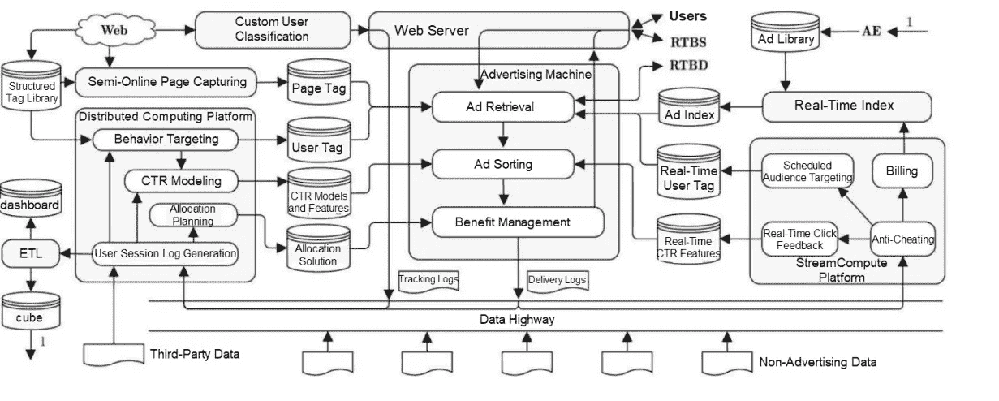

# 深度学习|大数据应用测试的开发

> 原文：<https://medium.datadriveninvestor.com/deep-learning-development-of-big-data-application-testing-46b031e6f52e?source=collection_archive---------23----------------------->

*由公知*

# 介绍

随着近年来数据计算和机器智能算法的出现，基于[大数据](https://www.alibabacloud.com/product/maxcompute)和 [AI 算法](https://www.alibabacloud.com/product/machine-learning)的应用日益普及，大数据应用也在各个行业不断涌现。测试技术作为工程技术的一部分，也在随着时代的发展而发展。在数据技术时代，如何测试和保证大数据应用的质量成为测试领域的难题。

本文描述了如何测试阿里巴巴人工智能中端、搜索、推荐和广告应用的技术和质量系统的质量。希望这篇文章能给你一些指导。欢迎您的评论和反馈。

# 一:前言

随着移动互联网和智能设备在过去十年中的出现，越来越多包含大量用户特征和行为日志的数据被存放在不同公司的应用平台上。通过统计分析和特征样本提取，对数据进行训练，生成业务算法模型。像智能机器人一样，这些模型可以准确地识别和预测用户的行为和意图。

如果把数据作为一种资源，互联网公司和传统公司有本质区别，因为他们不是资源的消费者，而是资源的生产者。他们在平台运营过程中不断创造资源，随着平台使用时长和频率的增加，资源呈指数级增长。平台使用数据和模型来提供更好的用户体验和更多的商业价值。2016 年，基于深度神经网络的 AI 围棋程序 AlphaGo 首次击败围棋世界冠军李世石。这个由谷歌旗下公司 DeepMind 开发的算法模型使用了围棋选手的所有历史象棋手册数据。

阿里巴巴的搜索、推荐、广告系统是典型的大数据应用场景(高维稀疏业务场景。)在谈论如何测试之前，我们需要了解平台处理数据的工程技术。搜索、推荐和广告系统具有相似的工程架构和数据处理过程，它们通常分为在线和离线系统。图 1 显示了一个在线广告系统的通用架构，它参考了刘鹏写的《计算广告》。离线系统处理数据并建立和训练算法模型，在线系统处理用户的实时请求。在线系统将使用离线系统训练的模型进行实时在线预测，例如点击率(CTR)评估。

用户在访问淘宝手机或其他 app 时，会产生大量的行为数据，包括浏览、搜索、点击、购买、评论、停留时长等。对行为数据、卖家的各种商品数据、广告客户的数据(如果涉及广告)进行收集、过滤、处理和特征提取，以生成模型所需的样本数据。样本数据在机器学习和训练平台上进行离线训练后，生成用于在线服务的各种算法模型，如深度兴趣进化网络(迪恩)、基于树的深度模型、大图上的表示学习、基于用户分类和兴趣的动态相似用户向量召回模型等。通常，在线系统使用与信息检索相关的技术，例如正向和反向数据索引和时间序列存储，以提供数据检索和在线预测服务。

在对上述维度的大数据进行深度学习后，搜索、推荐和广告系统以一千个人和面孔为特征。它们呈现不同的商品，并根据用户的请求推荐不同的自然和商业结果。如果用户的行为改变，用户可以在不同的时间点获得不同的结果。这些都归功于数据和算法模型。

*图 1:在线广告系统的通用架构*

# 二:大数据应用测试的六大质量领域挑战

在思考如何测试搜索、推荐、广告系统之前，首先要明确问题域，即需要解决哪些测试问题？我们的想法可以归纳为以下几个方面。

## 1.功能测试和验证

除了正常的请求和响应，我们还需要检查大数据的完整性以及搜索、推荐或广告系统的丰富性。搜索或推荐引擎的性能取决于它是否提供丰富的内容和多样化的回忆方法。算法造成搜索和推荐结果的不确定性，也给测试和验证带来麻烦。因此，数据完整性和不确定性验证是功能测试的关键点。

## 2.测试数据更新的及时性

众所周知，搜索或广告系统的在线计算引擎会因为卖家改变商品信息或广告商改变创作思路或投放计划而不断更新其内部数据。这些更新需要及时同步到交付引擎。否则，信息将会不一致或不正确。我们需要关注如何在一定的并发带宽和对数据更新的及时响应的情况下，测试和验证这些变化的及时性。

## 3.测试对数据请求作出回应的及时性

所有在线服务都要求低延迟。服务器端需要在几十毫秒内响应每个查询。然而，整个服务器拓扑由大约 30 个不同的模块组成。因此，测试后端服务的性能和容量非常重要。

## 4.验证算法效果

搜索、推荐和广告结果需要符合用户的需求和兴趣，以确保较高的点击率和转化率。然而，如何验证这样的需求和结果之间的相关性，如何测试算法效果，是一个有趣且具有挑战性的课题。

## 5.确保使用人工智能算法的在线系统的稳定性

离线发布前测试的目的是检查和接受代码。在这个过程中，缺陷被发现并纠正，以提高代码质量。在线稳定运行的目的是提高系统运行的稳定性。通过这种方式，可以使用技术 O&M 方法来提高具有普通代码质量的系统的高可用性和健壮性，并降低在线故障发生的频率和影响。这一部分也称为在线技术风险领域。

## 6.工程效率

这个方面是对前面几个方面的补充，是对整个工程 R&D 系统效率的补充。质量和效率是一对双胞胎，是一个硬币的两面。很难平衡这两者。在不同的产品开发阶段，是质量优先还是效率优先会有所不同。我们的工程效率旨在解决 DevOps R&D 工具链接问题，以提高 R&D 工程生产率。

这是大数据应用测试的六个主要问题领域。一些领域已经超出了传统的测试和质量范围。然而，这些都是大数据应用带来的独特的质量挑战。接下来我就说说这六个问题域。

# 三:大数据应用测试六大问题域的解决方案

## 1.人工智能应用的功能测试和验证

功能测试由三部分组成:端到端用户交互测试、在线工程功能测试、离线算法系统功能测试。

1.端到端用户交互测试

这一方面测试和验证搜索、推荐或广告系统的用户交互，包括在淘宝移动、天猫、优酷和其他 app 的买家端验证用户体验和逻辑特征，在广告主和卖家的业务平台验证业务流程逻辑，以及测试广告主的广告创意、投放计划制定、计费和结算。端到端测试保证了我们提供给用户和客户的产品质量。客户端测试技术和工具主要涉及端到端(原生或 h5) app 或 web UI 自动化、安全性、性能稳定性(猴子测试或崩溃率)、流量(弱网络)、功耗、兼容性、适配性。我们在集团其他团队的测试技术和开源技术体系的基础上做了一些改进和创新。例如，我们在自动化客户端测试中引入了智能富媒体验证，以完成图像比较、文本 OCR、本地特征匹配、边缘检测、基于关键帧的视频验证(组件动画和电影前广告)以及其他功能。这就验证了广告和推荐在客户端的所有呈现形式。除了常见的 API 服务级别测试之外，我们还使用了基于数据流量回放的对比测试方法来测试 Java APIs 和客户端 SDK。这种方法对 API、数据库、文件和流量的质量比较有很好的效果。对于端到端测试和验证，我们专注于 API 自动化测试，并且由于快速的 UI 迭代速度，仅对 UI 自动化执行简单的逻辑验证。全 UI 验证回归(功能逻辑和风格体验)手工测试。我们根据需要使用了一些外包测试服务。

2.在线工程系统测试

这个方面是系统功能测试的焦点。搜索、推荐和广告系统本质上是管理商品、用户、卖方和广告商维度的数据的数据管理系统。在线工程系统需要将大量数据以一定的数据结构存储到机器的内存中，以提供召回、评估和汇聚服务。这里，功能测试的基本原则是发送请求或查询字符串，并验证响应结果。在此基础上，使用了多种提高测试用例生成和执行效率的技术。我们将可视化和智能技术(包括智能案例生成、智能回归、故障智能归因、精确测试覆盖和功能 A/B 测试)集成到测试方法论中，以解决在线工程系统大规模异构功能测试案例编写成本高、调试困难和回归效率低的问题。搜索、推荐或广告系统的在线服务工程由 20 到 30 个不同的在线模块组成。测试这些在线服务模块需要花费大量时间。我们的主要优化目标是案例编写效率和回归运行效率。我们使用案例扩展和推荐技术以及遗传算法来动态生成有效的测试案例，并在案例执行阶段动态编排回归技术，极大地提高了在线模块的功能测试覆盖率。

此外，我们使用在线查询进行对比测试，以验证功能更改差异，并分析要发布的系统和在线系统之间的结果一致性和数据分布。这有助于我们发现系统中的任何功能问题。除了对比测试，我们还定期在线检查和监控最近的前 N 名查询，以监控功能，并在查询数据量达到一定水平时(例如，上周 80%的长尾查询)轻松验证引擎数据的完整性和多样性。最后，我们需要强调这方面的测试策略。算法逻辑，例如召回和分拣的服务逻辑很复杂，涉及不同的业务和细分模型。算法工程师设计逻辑。因此，他们也设计和执行算法逻辑的测试用例。只有他们知道模型的功能逻辑以及它们是如何改变的。有了在线调试系统，算法工程师就知道了在线运行算法和离线算法的逻辑差异，才能发布。因此，他们可以轻松地编写测试用例。测试工程师构建整个测试框架和工具环境，并编写和运行基本的测试用例。本文最后一章还讨论了考试政策的调整。

3.离线系统测试或算法工程测试

就数据处理而言，算法工程包括算法模型的建立、训练和发布。我们需要知道如何验证整个管道的特征样本和模型的质量，从离线过程到在线过程，包括特征提取、样本生成、模型训练和在线预测。因此，算法测试的重点包括以下内容:

*   样本特征质量评估
*   模型质量评估
*   在线模型评估服务的质量保证

前两个重点领域涉及数据质量和功能功效，将在第 4 节中介绍。各种数据质量指标用于评估质量。

我们将介绍最后一个重点，算法在线评测服务发布前的测试。它涉及到模型的最终服务质量，因此非常重要。这里我们对比了一个小样本线上和线下的分数，全面验证一个模块的线上质量。在发布一个模型来提供服务之前，我们需要测试和验证这个模型。除了常见的测试数据集，我们独立分离出一部分样本集，称为小样本数据集。我们比较了小样本数据集的在线和离线评分，验证了模型的在线服务质量。这种小样本评分提供了类似于灰度验证的能力。图 2 详细展示了小样本测试过程。

*图 2:小样本测试*

对于离线系统测试，我们进行了一些深入的研究，以保证深度学习和培训平台的质量，并遇到了以下挑战:

*   为深度学习平台上的潜在风险提供预警，因为复杂的场景可能会导致模型在集群中训练失败。
*   由于神经网络的局部最优和 Tensorflow Batch 的设计思想，确保模型每次训练都满足发布的质量要求。
*   验证大规模数据集和分布式系统下深度学习平台提供的各种深度学习特征的准确性。

对于上述挑战，我们提供了以下解决方案:

*   实验预跑:我们设计专门的模型和训练数据，15 分钟就可以训练出来。这有助于在大规模生产模型正式训练之前快速发现和定位训练平台问题。
*   模型验证:我们透明地将模型生成的中间数据指标(包括 AUC、神经元激活率和梯度的标准偏差)转移、处理和建模到不同的层，以监控生产模型质量。
*   基于模型的特征验证:我们设计样本格式并测试模型网络，以确保模型变量的理论值可以精确计算。然后，基于模型训练结果验证平台质量。

## 2.如何测试数据更新的及时性

本节主要包括以下内容:

1.测试发动机数据的实时更新链接

在实时更新链接中，首先从上游数据源或数据表(阿里消息中间件和离线数据表，如 TT、MetaQ 和 ODPS)读取数据。)然后由 StreamCompute 平台(阿里巴巴实时计算平台，如 Bayes 引擎、Blink)的实时计算任务对数据进行处理，生成引擎可接受的更新消息。收到此类消息后，引擎会更新数据。链接验证点包括:

*   数据正确性
*   数据一致性
*   数据及时性
*   数据并发性能

为了验证数据的正确性和一致性，我们使用了实时流数据比较和全数据比较。数据及时性依赖于计算平台的底层资源，以确保毫秒级的数据更新速度。为了验证更新的及时性，我们记录更新时间戳。为了验证整个链路的响应时间和并发处理能力，我们模拟了上行数据和复制流量。

2.测试模型的实时更新链接(在线深度学习)

最近两年，在线深度学习(ODL)应运而生，以获得实时行为的算法优势。用户的实时行为特征数据需要在模型中进行训练。在线服务模型将每隔 10 到 15 分钟更新和更换一次，最多保留 10 分钟用于模型验证。这是 ODL 带来的质量挑战。为了解决这个问题，我们使用了两种方法。

3.主要方法是建立全 ODL 环节的质量度量监控体系，即从样本构建到在线预测的环节，包括样本域度量和训练域度量的验证。

基于它们是否与效果相关联来选择度量。对于 CTR 评估，我们可以计算指标，如 AUC、GAUC 和 score_avg，并检查 train_auc 和 test_auc 之间以及 pctr 和 actual_ctr 之间的差异是否在合理的范围内。对于 train_auc 和 test_auc 的区别，检查是否出现过拟合。对于 pctr 和 actual_ctr 的区别，检查分数的准确性。另一个关键点是测试集的选择。我们建议您选择下一个时间窗口中的数据以及从过去一段时间(例如一周)的数据中随机采样的数据作为测试集。未来数据用于检验模型泛化性能，现有和综合数据用于检验模型是否偏离。这减少了部分异常测试样本对评估指标的不利影响。

4.除了度量系统，我们还设计了一个离线模拟系统，在模型发布之前，在模拟环境中模拟评分。

在离线测试环境中，在线服务的组件评分模块根据在线流量对需要发布的模型进行评分。如果在模型评分过程中出现任何错误，则该模型验证失败，并且不能发布。对于得分正常的模型，验证平均得分值和得分分布。前两种解决方案，加上样品和模型监控和拦截，可以显著降低 ODL 质量风险。

## 3.性能和压力测试

对于由在线和离线系统组成的 AI 系统，在线系统需要及时响应用户的实时访问请求。因此，在线系统的性能是本节的重点。离线系统的性能很大程度上取决于训练平台上计算资源的调度和使用。我们通常使用简单的源数据复制进行验证。在线系统性能测试包括读取和写入性能测试。实时更新链接及时性中引入了写性能测试。在这里，我们将介绍联机系统的写入性能和容量测试。

在线系统通常由 20 到 30 个不同的引擎模块组成。根据引擎模块中的数据和测试查询，性能测试结果会有很大差异。此外，在离线和在线性能测试环境中同步数据需要大量成本。因此，我们选择了一个在线生产集群来进行性能和容量测试。对于一个每秒可以处理几十万个查询的在线系统来说，很难精确控制并发查询。简单的多线程或多进程控制方法已经不能解决问题。我们使用爬山算法(梯度多次迭代爬山)来精确控制流量，数百台压力测试机器在后端运行，以逐步检测系统性能水平。

另一个方向是自动压力测试和无人值守实施，以自动顺利地完成整个压力测试过程，从在线自动基于场景的查询选择，到压力生成，再到自动均值漂移验证。加上集群之间的流量切换，可以在白天和晚上执行常规压力测试，这使得在线性能水平和瓶颈分析更加方便。

## 4.效果测试和评估

效果测试和评估是大数据应用算法的重要组成部分，因为算法效果影响搜索和广告业务的收益(收入和 GMV)。我们在这方面进行了大量投资，分为以下几个方面:

1.特性和样本的质量和功效评估

在特征质量(是否涉及数据和数据分布)和特征效果(对算法的价值)方面，我们确定了一些用于特征度量计算的重要度量，例如缺失率、高频值、分布变化和值相关性。在训练和评估过程中，大量的中间指标与模型效果有因果关系。对建模张量、梯度、权重和更新的系统分析可以帮助优化算法和定位问题。

此外，AUC 算法优化和分析了更多的评价指标，如 ROC、PR 和 distribution，可以综合评价模型效果。在过去的两年里，随着数据量的增加，我们在建模和训练过程中使用了数千亿个参数和数万亿个样本。图形深度学习也进入了百亿节点、千亿边的阶段。在数据海洋中，如何可视化特征样本和前面的度量已经成为一个难题。我们基于 Google 开源的 TensorBoard 做了大量的优化和改进，帮助算法工程师支持数据度量可视化、训练过程调试、深度学习模型可解释性。

2.在线流量实验

在一个算法项目正式发布之前，模型需要在实验环境中引入真实的在线流量来测试和优化效果。基于建立在 Google 分层实验架构上的第一代在线分层实验(“重叠实验基础设施更多、更好、更快的实验”，Google)，我们对并发实验、参数管理、参数间覆盖、实验质量保证、实验调试能力和实验扩展能力进行了大量改进。这显著提高了并发流量重用和安全性，有助于实现生产实验的真正目标。在在线实验平台上对真实流量进行了验证，有助于证明模型的效果和质量。

3.数据效果评估

数据效果评估包括相关性评估和效果评估。相关性是相关性模型的一个重要评估指标。我们评估搜索结果指标，以获得每个搜索结果的相关分数。具体指标包括客户满意度得分(CSAT)、净推广者得分(NPS)、客户努力得分(CES)和 HEART 框架。CSAT 值包括非常满意、中等满意、稍微满意、中等不满意和非常不满意。NPS 是由贝恩公司客户忠诚度业务的创始人 Fred Reichheld 于 2003 年提出的。NPS 用来衡量用户的推荐意愿，用来了解用户的忠诚度。CES 表示用户使用产品或服务解决问题的难度。核心框架源自谷歌，由快乐、参与、采纳、保留和任务成功组成。

为了评估数据效果，我们使用了数据统计和分析。在使用一个算法模型提供服务之前，我们需要准确地验证这个模型的服务效果。除了第一节描述的线上和线下比较，我们需要更多客观的数据指标。这里，我们使用了真实流量的 A/B 测试。5%的线上流量导入到一个模型中进行发布。然后，我们比较 5%的流量和基准桶的效果，并分析用户体验(相关性)、平台优势和客户价值维度的指标。根据用户的相关性评估结果、平台收入或 GMV 以及客户投资回报率，我们检查新模式对买家、平台和卖家的潜在影响，并提供必要的数据来支持业务的最终决策。当流量比率从 5%增加到 10%、20%和 50%时，可以检测到功能、性能和效果问题，这有助于进一步降低主要风险。这种方法集成了统计数据分析和技术，不同于本文中提到的其他技术方法。独一无二，效果更好。

## 5.在线系统稳定性

类似于其他总线的稳定性构建，我们使用三种发布措施(分阶段发布、监控和回滚)来解决代码、系统和模型发布过程中的质量问题。我们还使用在线灾难恢复演习、故障注入和演习以及攻击和防御演习(ADD)来提高在线系统的稳定性和可用性。我们是阿里巴巴开源混沌工程的孙悟空 C++版本的提供者。对于基于 AI Ops 和服务网格的 O&M 控制，我们尝试提供智能 O&M、透明数据分析、自动流量分流和自动扩展。随着 C++在线服务中服务网格技术的发展，我们预测开发服务系统将能够在不改变代码或配置的情况下知道业务应用的流量变化，从而确保流量调度和隔离。ADD 将被进一步开发、自动化和基于过程，成为实现混沌工程的标准格式。这部分还在起步阶段，没有实现的内容我就不多介绍了。然而，我们认为这是一个有希望的发展方向。它不同于传统的 O&M，而接近于谷歌的网站可靠性工程(SRE。)

## 6.人工智能应用工程效率

本节旨在提高测试和 R&D 阶段的效率。在这个方向上，我们构建 DevOps 工具链和整个 R&D 闭环使用的工具，包括开发、测试、工程发布、模型发布(模型调试和定位)、客户反馈(体验评估、众包测试、客户问题调试)。)在设想的 DevOps 场景中，开发人员可以使用这些工具独立完成需求开发、测试、发布和处理客户反馈。不过这个方向和测试关系不大，就不详细介绍了。

# 四:大数据应用测试的未来

介绍了大数据应用测试中几个主要问题领域的解决方案。在这一章，我将介绍我对大数据应用测试未来的一些初步判断。

## 1.基于工具的后端服务测试

我们相信后端服务测试在未来将不再需要专门的测试人员。开发工程师可以使用合适的测试工具来有效地完成测试任务。专门的测试团队将更加关注与用户交互相关的前端产品质量。与产品经理一样，专门的测试团队需要从用户的角度考虑产品质量问题。产品交付和交互验证是这一领域的重点。大多数服务器端测试可以自动化，许多服务级别验证任务只能自动执行。开发人员在 API 级自动化代码开发方面比测试人员有更强的能力。此外，如果开发人员进行测试，可以减少测试和开发人员之间的沟通成本，这在整个发布环节中占很大比例。此外，如第一章所述，算法工程师对服务逻辑有更清晰的理解。

所以我们希望后端测试可以由工程人员或者算法工程师独立完成。在这种新的生产模式中，测试人员更加关注测试工具 R&D，包括自动化测试框架、测试环境部署工具、测试数据构建和生成、冒烟测试工具发布，以及持续集成和部署。谷歌在用这种模式，我们今年也尝试了这个方向的转型。质量变革和效率提升的效果良好。作为中国互联网公司主导的第一份测试转型路线图，我们相信它能给你一些指导。尽管测试团队已经在这个方向上实现了转换，但是后端测试仍然是必需的，测试任务执行者已经换成了开发工程师。本文中提到的后端测试技术和方向仍然存在。除了效率工具之外，上一章第五节所描述的在线系统稳定性建设是后端服务测试团队转型的一个很好的方向。

## 2.生产测试(TIP)

这个概念是微软工程师在大约 10 年前提出的。就以下因素而言，TIP 是一种未来的测试方法:

1.  离线测试环境与真实的在线环境不同，或者需要高成本来消除这些差异。因此，测试结论不可信。使用最多的是性能或容量测试。后端服务拓扑结构复杂，许多模块是可扩展的，并且具有不同的数据，这极大地影响了性能测试结果。测试和生产环境之间的差异会导致不同的测试结果。目前，所有生产集群都以双活模式部署在不同的位置。在夜间或非高峰时段，单个集群可以承载所有流量请求，其他集群可以用于压力测试。这使得在线性能测试成为可能。最典型的例子就是阿里巴巴针对双 11 全球购物节的全链路压力测试。今年是以日夜模式完成的。
2.  许多真实的演练只能在在线系统中进行。例如，添加和故障注入以及钻取不能在离线测试环境中执行。
3.  无论是发布前的离线测试，还是发布后的在线稳定性建设，都是为了减少系统故障。如果我们整合这两个部分并进行优化以减少在线故障，我们可以极大地节省和利用人力资源。我们认为，线下测试和线上稳定性建设的融合将是一个趋势。这个领域叫技术风险防控。

## 3.智能测试技术

如图 3 所示，智能测试有不同成熟度的模型，包括人工测试、自动化、辅助智能测试、高度智能测试，类似于自动驾驶分类。机器智能是一种适用于不同测试阶段的工具。不同的算法和模型可用于测试数据和用例设计阶段、测试用例回归实现阶段、测试结果检查阶段以及多个技术风险领域，例如在线异常度量检测。智能测试是发展的产物，需要数字化。自动化测试是简单的数字化。没有数字化或自动化，就没有智能分析或优化的要求。

对于测试来说，一些简单的算法可能比复杂的深度学习或强化学习算法取得更好的结果。当使用复杂的深度学习或强化学习算法时，很难提取特征并建立模型和样本，并且无法获得运行测试的反馈。但是，使用最新的算法技术来优化不同测试阶段的效率是未来的一个方向。就像自动驾驶一样，高度智能的测试不成熟是因为测试数据不足而不是算法或模块不足。

*Figure 3: Intelligent Test Technologies*

经过近 10 年的持续发展，加上许多前辈的广泛努力，阿里巴巴的搜索、推荐和广告系统在许多细分领域都取得了良好的质量。本文中描述的方法集中在内部工具上。在未来，我们将逐步公开这些工具，以回馈社区。由于篇幅所限，我在这里没有详细阐述很多技术细节。如果想了解更多，可以跟着阿里巴巴技术质量团队的测试书*《阿里巴巴的测试之道》*(暂定名)电子工业出版社出版。本文描述的基于 AI 算法的大数据应用的测试记录在本书第六章。如果您想了解更多信息，欢迎您加入我们的团队或开源社区，在前面的领域进行进一步的研究和构建。

**访问专家视图—** [**订阅 DDI 英特尔**](https://datadriveninvestor.com/ddi-intel)

*本文观点仅供参考，不一定代表阿里云官方观点。*

# 原始来源:

 [## 深度学习|大数据应用测试的开发

### 阿里巴巴 Clouder 年 11 月 11 日 660 随着数据计算和机器智能算法在…

www.alibabacloud.com](https://www.alibabacloud.com/blog/deep-learning-%7C-development-of-big-data-application-testing_596881)