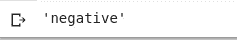

# 深度学习 LSTM 在 Tensorflow 中的情感分析。

> 原文：<https://medium.datadriveninvestor.com/deep-learning-lstm-for-sentiment-analysis-in-tensorflow-with-keras-api-92e62cde7626?source=collection_archive---------0----------------------->


## **简介**

情感分析是确定语言是否反映积极、消极或中性情感的过程。
分析顾客的情绪对企业有很多好处。例如。

*   一家公司可以根据客户的意见过滤客户的反馈，以确定他们在服务方面需要改进的地方。
*   一家公司可以通过监控顾客对其产品评论的情绪来轻松管理他们的在线声誉

在本教程中，我们将建立一个[深度学习](https://en.wikipedia.org/wiki/Deep_learning)模型，将文本分类为负面或正面。

## **要求**

*   *数据:* 所使用的数据是在 [Kaggle](https://www.kaggle.com/crowdflower/twitter-airline-sentiment) 上可获得的关于一家美国主要航空公司的推文集合。
*   [*tensor flow*](https://www.tensorflow.org)*1 . 15 . 0 版或更高版本，带 [Keras](https://www.tensorflow.org/api_docs/python/tf/keras) API*
*   *[*熊猫*](https://pandas.pydata.org/)*
*   *[*Numpy*](https://numpy.org/)*

## *数据准备*

*让我们看看数据是什么样子的:*

```
*import pandas as pddf= pd.read_csv('Tweets.csv', sep=',')
df.head(10)*
```

**

*Data preview*

****准备数据的步骤:****

*   *选择相关列:
    本项目需要的数据列是***airline _ sensation***和 ***text*** 列。我们正在解决一个分类问题，所以**文本**将是我们的特征，而 ***航空公司 _ 情绪*** 将是标签。*

*当输入是数字时，机器学习模型工作得最好。我们将把所有选择的列转换成它们需要的数字格式。*

*   *将 ***航空公司 _ 人气*** 列转换为数值类别:*
*   *将 ***文本*** 列转换为数字向量。(*稍后再详细介绍*)*

```
*#select relavant columns
tweet_df = df[['text','airline_sentiment']]*
```

**

*Selected relevant columns*

*我们需要将推文分为负面或正面，因此我们将过滤掉带有中性情绪的行。*

```
 *tweet_df = tweet_df[tweet_df['airline_sentiment'] != 'neutral']*
```

**

*Data without neutral sentiment*

```
*# convert airline_seentiment to numeric
sentiment_label = tweet_df.airline_sentiment.factorize()*
```

**

*调用**因式分解**方法会返回数字类别数组和类别索引。在这种情况下，指数 0 是积极的，指数 1 是消极的情绪。*

*[](https://www.datadriveninvestor.com/2019/01/23/deep-learning-explained-in-7-steps/) [## 深度学习用 7 个步骤解释-更新|数据驱动的投资者

### 在深度学习的帮助下，自动驾驶汽车、Alexa、医学成像-小工具正在我们周围变得超级智能…

www.datadriveninvestor.com](https://www.datadriveninvestor.com/2019/01/23/deep-learning-explained-in-7-steps/) 

## 为 NLP 准备文本:

正如我前面所说的，机器学习模型的输入需要采用数字格式。这可以通过以下方式实现:

*   给句子中的每个单词指定一个数字，并用它们各自指定的数字替换每个单词。
*   使用单词[嵌入](https://towardsdatascience.com/introduction-to-word-embedding-and-word2vec-652d0c2060fa)。这能够捕捉句子或文档中单词的上下文。

```
from tensorflow.keras.preprocessing.text import Tokenizer
from tensorflow.keras.preprocessing.sequence import pad_sequencestweet = tweet_df.text.values
tokenizer = Tokenizer(num_words=5000)
tokenizer.fit_on_texts(tweet)vocab_size = len(tokenizer.word_index) + 1encoded_docs = tokenizer.texts_to_sequences(tweet)padded_sequence = pad_sequences(encoded_docs, maxlen=200)
```

从上面的代码可以看出:

*   我们从数据框中获取实际的文本
*   用 5000 字的限制初始化记号赋予器。这是我们想要编码的字数。
*   我们调用 **fit_on_texts** 来创建单词和数字的关联，如下图所示。

```
print(tokenizer.word_index)
```


word index

*   调用 **text_to_sequence** 将句子中的单词替换为它们各自的关联数字。这将每个句子转换成数字序列。

```
print(tweet[0])
print(encoded_docs[0])
```


A tweet and it’s encoded version

从上面的结果中，你可以看到 tweet 被编码成一个数字序列。例如 ***到*** 和*分别转换为 **1** 和 **2** 。
查看上面的单词索引进行验证。*

*句子或推文有不同的字数，因此，数字序列的长度会有所不同。
我们的模型要求输入具有相等的长度，所以我们将不得不填充序列以具有选择的输入长度。这是通过调用长度为 200 的 **pad_sequence** 方法来完成的。
所有输入序列的长度将为 200。*

```
*print(padded_sequence[0])*
```

**

*Padded Sequence.*

# *建立模型*

*既然我们已经处理了输入。是时候建立模型了。*

```
*# Build the modelfrom tensorflow.keras.models import Sequential
from tensorflow.keras.layers import LSTM,Dense, Dropout,
from tensorflow.keras.layers import SpatialDropout1D
from tensorflow.keras.layers import Embeddingembedding_vector_length = 32model = Sequential()model.add(Embedding(vocab_size, embedding_vector_length,     
                                     input_length=200) )model.add(SpatialDropout1D(0.25))model.add(LSTM(50, dropout=0.5, recurrent_dropout=0.5))model.add(Dropout(0.2))model.add(Dense(1, activation='sigmoid'))model.compile(loss='binary_crossentropy',optimizer='adam', 
                           metrics=['accuracy'])print(model.summary())*
```

**

*Model Summary*

**

*Model Structure*

*这就是我们使用 LSTM 层的地方。该模型由嵌入层、 **LSTM** 层和稠密层组成，稠密层是一个以 sigmoid 为激活函数的全连接神经网络。*

*为了避免过度拟合，在层间和 **LSTM** 层添加了漏点。*

# *LSTM*

**

*source: [http://colah.github.io/posts/2015-08-Understanding-LSTMs/](http://colah.github.io/posts/2015-08-Understanding-LSTMs/)*

> *长短期记忆网络——通常简称为“lstm”——是一种特殊的 RNN，能够学习长期依赖性。它们是由[hoch Reiter&schmid Huber(1997)](http://www.bioinf.jku.at/publications/older/2604.pdf)提出的，并在随后的工作中被许多人提炼和推广。它们在各种各样的问题上表现得非常好，现在被广泛使用。*
> 
> *LSTMs 的明确设计是为了避免长期依赖问题。长时间记住信息实际上是他们的默认行为，而不是他们努力学习的东西！*
> 
> *【http://colah.github.io/posts/2015-08-Understanding-LSTMs/】来源 : [来源](http://colah.github.io/posts/2015-08-Understanding-LSTMs/)*

# *火车模型*

```
*history = model.fit(padded_sequence,sentiment_label[0],
                  validation_split=0.2, epochs=5, batch_size=32)*
```

**

*该模型经过 5 个时期的训练，验证准确率达到 92%左右。*

***注意:** *由于模型的随机性质，您的结果可能会略有不同，尝试运行几次，您将获得大致相同的验证准确度。**

# *测试模型*

```
*test_word ="This is soo sad"tw = tokenizer.texts_to_sequences([test_word])
tw = pad_sequences(tw,maxlen=200)
prediction = int(model.predict(tw).round().item())sentiment_label[1][prediction]*
```

**

*Prediction result*

*该模型用一个样本文本进行了测试，以了解它如何预测情感，我们可以看到它预测了句子的正确情感。*

*你可以在 Google Colab [这里](https://colab.research.google.com/github/paulkarikari/LSTM-sentiment-analysis-with-tensorflow-keras-api/blob/master/Tutorial_sentiment_analysis.ipynb)运行整个笔记本，或者在 [Github](https://github.com/paulkarikari/LSTM-sentiment-analysis-with-tensorflow-keras-api/blob/master/Tutorial_sentiment_analysis.ipynb) 查看整个笔记本*

***资源***

*   *[http://colah.github.io/posts/2015-08-Understanding-LSTMs/](http://colah.github.io/posts/2015-08-Understanding-LSTMs/)*
*   *[https://keras.io/examples/imdb_lstm/](https://keras.io/examples/imdb_lstm/)*
*   *[https://keras.io/layers/recurrent/](https://keras.io/layers/recurrent/)*

*在本教程中，您学习了如何通过 Keras API 在 Tensorflow 中使用深度学习 LSTM 进行情感分析。**