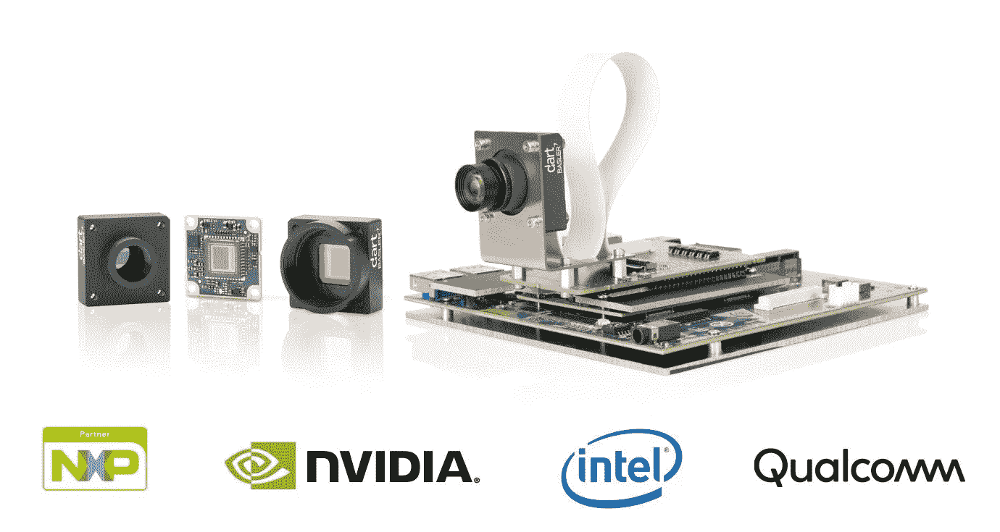
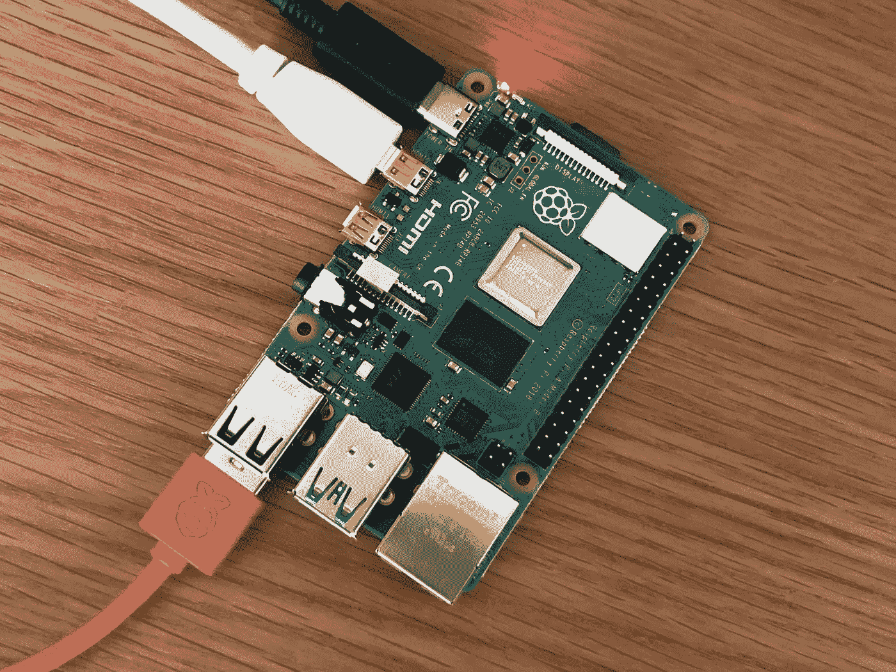
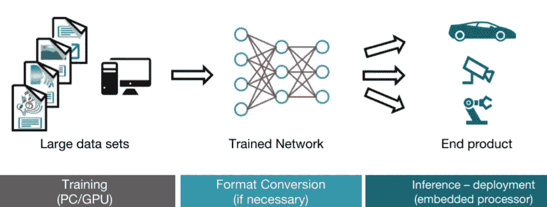
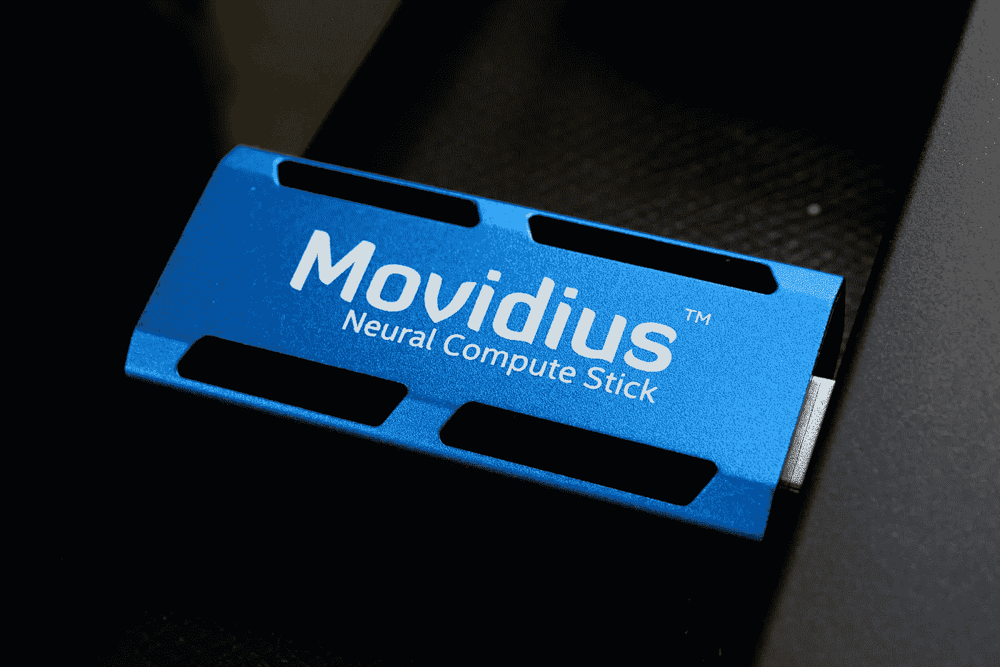

# 嵌入式设备上的深度学习

> 原文：<https://medium.datadriveninvestor.com/deep-learning-on-embedded-devices-5524d1fae0c4?source=collection_archive---------2----------------------->

不可否认的事实是，深度学习已经彻底改变了我们生活的许多专业和个人方面。

与传统的机器学习相比，深度学习提供了更高的准确性和多功能性，使产品能够表现得更加智能。

但是当涉及到这些深度学习模型的部署时，市场上通常没有更便宜或低功耗的选项。比如你如何在机器人、无人机或自动驾驶汽车上实现这些模型？

如今有一种趋势，从汽车到机器人的拾取和放置，一切都实现自动化。这不仅仅是自动化趋势。工业设备变得越来越“智能”，增加了状态监控和预测性维护的功能。

# 智能便携解决方案？树莓派不能处理这个吗？

Raspberry Pi 4

我们想要的只是一个便携的解决方案，不是吗？树莓派不会胜任这个工作吗？嗯，其实没有！至少不是一个人。

Raspberry Pi 没有足够的内存或 CPU 能力来从头训练这些类型的深度、复杂的神经网络。

事实上，树莓派勉强有足够的处理能力来运行它们或者我们所说的深度学习 [**推理**](https://software.intel.com/en-us/ai/inference) **。**这就是像英特尔的 Movidius NCS 和英伟达的 Jetson nano 这样的深度学习嵌入式设备的用武之地。

 [## 深度学习用 7 个步骤解释-更新|数据驱动的投资者

### 在深度学习的帮助下，自动驾驶汽车、Alexa、医学成像-小工具正在我们周围变得超级智能…

www.datadriveninvestor.com](https://www.datadriveninvestor.com/2019/01/23/deep-learning-explained-in-7-steps/) 

# 为什么要在云上使用嵌入式设备？

*   **隐私和安全:**数据可以存储在本地，避免开发私人算法和软件时的顾虑。
*   **无连接或互联网问题:**由于模型在设备上运行，因此无需发送和接收数据，减少了响应时间和带宽消耗，这在第三世界国家可能是一个主要问题。
*   **最小延迟和功耗:**现代加速器单元及其改进的架构显著降低了功耗(对于 Movidius NCS 为 1W！)并消除由于船上发生的一切而产生的延迟。

此后我们将讨论推理过程。

尽管有更多可用的解决方案，但由于我有在工业项目中使用它的经验，所以在本文中我将讨论 Movidius NCS。

Deep Learning Process.

# Movidius NCS 棒有什么帮助？

Intel’s Movidius Neural Compute Stick

[Movidius 神经计算棒](https://developer.movidius.com/) (NCS)由**英特尔**生产，可以在没有互联网连接的情况下运行。Movidius NCS 的计算能力来自其 [Myriad 2 VPU](https://www.movidius.com/myriad2) (视觉处理单元)——一种基于卷积神经网络(CNN)加速视觉计算的人工智能优化芯片。

基本上你可以把它想象成一个运行在 USB 上的 GPU(图形处理单元)。

它就像可以连接到低成本微控制器(如 Raspberry Pi 系列甚至 Ubuntu PCs)的 u 盘一样！

英特尔还提供 NCS SDK，支持深度神经网络的快速原型开发和部署。它会根据您的深度学习模型生成一个图形文件，您可以使用该文件在目标设备上进行推断。

实际上，我在 Raspberry Pi 上运行实时对象检测模型时发现了一些有趣的结果，

Results obtained by me when running a Real-Time Object detection model.

与只在 CPU 上运行相比，使用 NCS stick 时的性能提高了大约 90-100%。当您考虑整个最终流程时，这是一个巨大的进步。

[OpenVINO](https://software.intel.com/en-us/openvino-toolkit) toolkit 是一款免费的工具套件，有助于从框架优化深度学习模型，并使用推理引擎部署到英特尔硬件上。

NCS 支持 Tensorflow 和 Caffe 开箱即用，可以运行许多深度学习模型，如 SqueezeNet、GoogLeNet 和 AlexNet。

使用 NCS 包括三个步骤

*   在基于 GPU 的机器上训练模型
*   使用 NCS SDK 将模型转换成图形文件
*   利用图形文件在树莓 Pi 上推理模型

嵌入式设备的使用可以让深度学习推理变得多么简单和强大！

希望你今天学到了一些有趣的东西。

更多关于 NCS 和机器人深度学习的文章即将发布。敬请关注✌