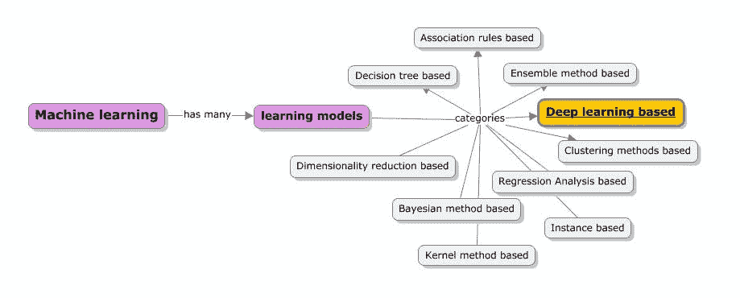
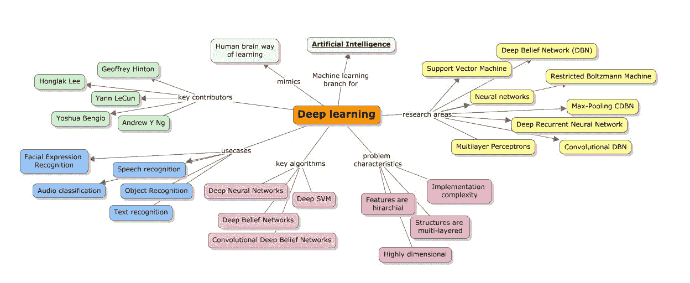
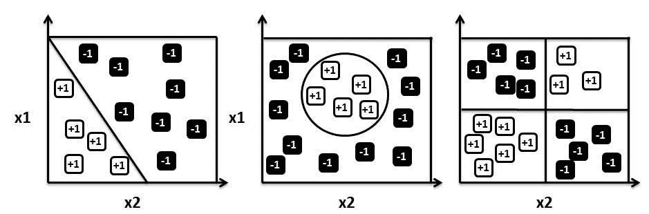
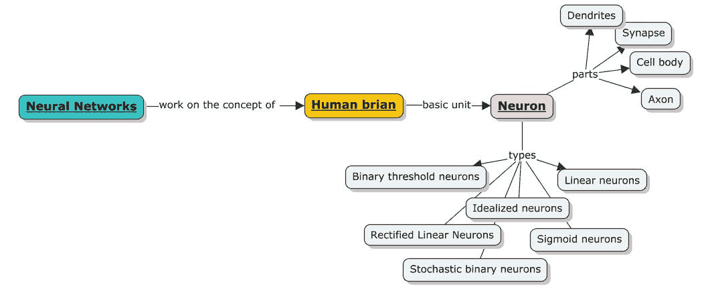
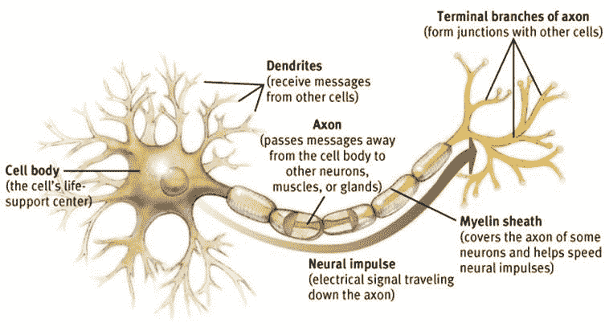
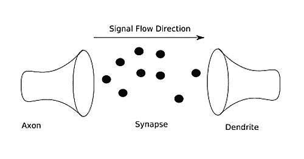
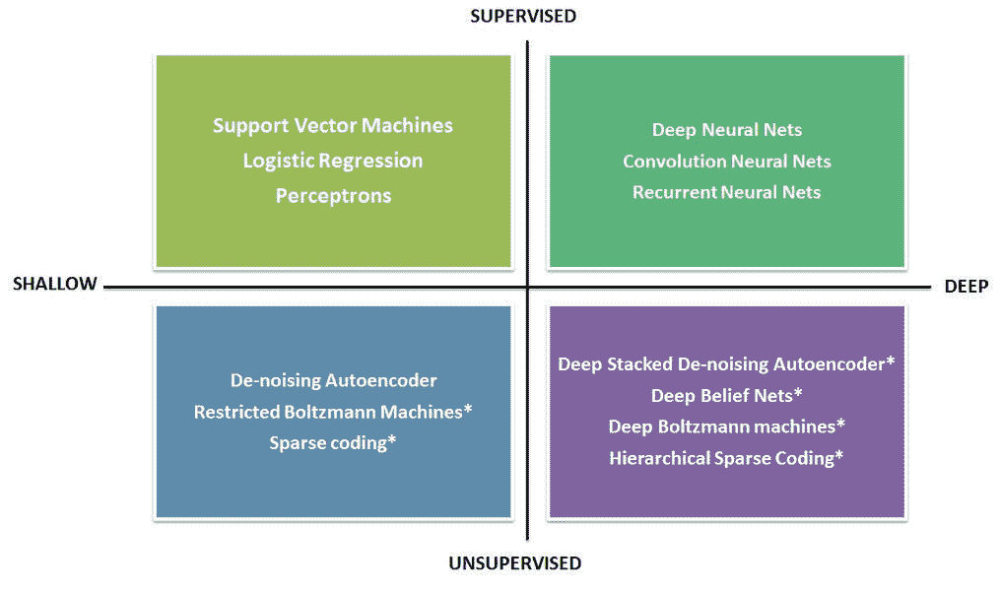
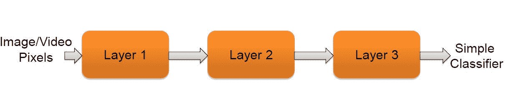
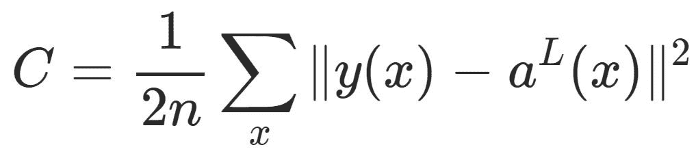
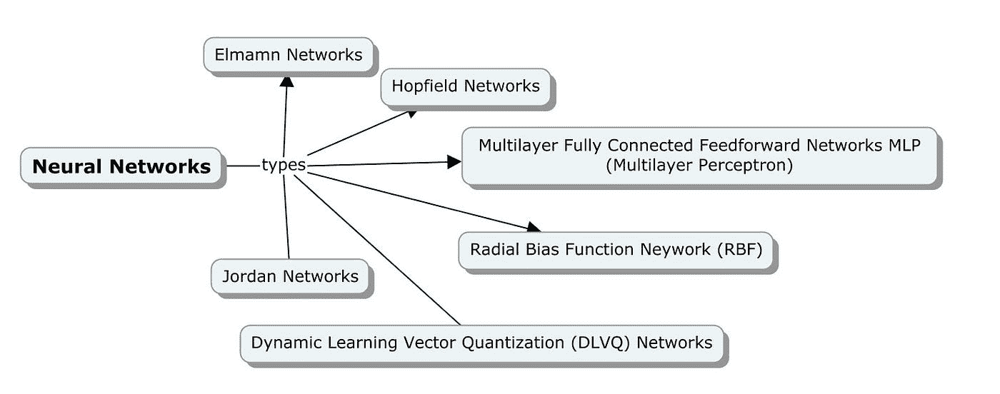

# 深度学习简化版

> 原文：<https://medium.datadriveninvestor.com/deep-learning-simplified-7949aeab5827?source=collection_archive---------5----------------------->

受到我之前关于强化学习和集成学习的“简化”博客系列的所有回应的鼓舞，我正在以一步一步的方式写这篇涵盖深度学习基础知识的博客。

这个博客的主要目的是从概念上加强对神经网络和相关深度学习技术的掌握。在一个复杂模式识别问题的帮助下，这篇博客涵盖了开发一个典型神经网络的过程，你将能够用它来解决一个类似的复杂问题。

这个博客系列的第一部分将简单地向你介绍什么是深度学习。以下图示展示了本书涵盖的所有学习方法，突出了本博客中学习的首要主题——深度学习。

让我们首先回顾机器学习的前提，并强化学习方法的目的和背景。正如我们所知，机器学习是通过使用观察数据建立模型来训练机器，而不是直接编写特定的指令来定义数据模型，以解决特定的分类或预测问题。在这种情况下，模型这个词只不过是一个系统。

 [## 深度学习用 7 个步骤解释-更新|数据驱动的投资者

### 在深度学习的帮助下，自动驾驶汽车、Alexa、医学成像-小工具正在我们周围变得超级智能…

www.datadriveninvestor.com](https://www.datadriveninvestor.com/2019/01/23/deep-learning-explained-in-7-steps/) 

程序或系统是使用数据构建的，因此看起来与手写的非常不同。如果数据发生变化，程序也会根据新数据进行下一级的训练。因此，它需要的是大规模处理的能力，而不是让一个熟练的程序员为所有可能仍然被证明是严重错误的情况编写代码。一些例子包括识别模式，如语音识别、对象识别、人脸检测等等。

> 深度学习是一种机器学习，它试图从给定的数据中学习突出的特征，从而试图减少为每一类数据(例如，图像、语音等)构建特征提取器的任务。).对于人脸检测需求，深度学习算法会记录或学习鼻子的长度、两眼之间的距离、眼球的颜色等特征。该数据用于解决分类或预测问题，并且显然与传统的浅层学习算法非常不同。

以下概念模型涵盖了深度学习的不同领域以及本博客所涵盖的主题范围。

我们来举个例子；如果我们基于两个因素来预测一个去餐馆的游客是否会回来——一个是账单金额(x1 ),另一个是他/她的年龄(x2)。当我们收集特定持续时间的数据并分析它的输出值时，输出值可以是 1(如果访问者回来了)或-1(如果访问者没有回来)。绘制时，数据可以采用任何形式，从线性关系到任何其他复杂结构，如下所示:

类似线性关系的东西看起来很简单，而更复杂的关系会使模型的动态变得复杂。参数θ能有一个最优值吗？我们可能不得不应用优化技术，在接下来的章节中，我们将讨论这些技术，比如感知器和梯度下降法等等。如果我们想开发一个程序来做到这一点，我们需要知道我们的大脑是如何识别这些数字的，即使我们知道，这些程序也可能非常复杂。

# 神经网络

神经计算是这项研究的主要兴趣，旨在了解并行计算如何在神经元中工作(柔性连接的概念)，并像人脑一样解决实际问题。现在让我们来看看人脑的基本核心单元——神经元:

# 神经元

人类的大脑是关于神经元和连接的。神经元是大脑的最小部分，如果我们取一个米粒大小的大脑，已知它至少包含 10000 个神经元。平均而言，每个神经元与其他神经元之间有大约 6000 个连接。如果我们观察一个神经元的一般结构，它看起来如下。

我们人类经历的每一种感觉，无论是思想还是情感，都是因为我们大脑中数百万个被称为神经元的细胞。由于这些神经元通过传递信息相互交流，人类感觉、行动并形成感知。这里的图表描述了生物神经结构及其组成部分:

每个神经元都有一个中央细胞体；正如任何细胞一样，一般来说，它有一个轴突和一个树突树，分别负责与其他神经元发送和接收信息。轴突连接到树突树的地方叫做突触。突触本身具有不寻常的结构。它们包含引发传递的传递分子，传递可以是正的也可以是负的。

神经元的输入被聚集，当它们超过阈值时，电尖峰被传输到下一个神经元。

# 突触

下图描述了突触的模型，说明了信息从轴突到树突的流动。突触的工作不仅仅是传递信息，事实上，它使自己适应信号的流动，并具有从过去的活动中学习的能力。

作为机器学习领域中的一个类比，传入连接的强度是根据其使用频率来确定的，因此决定了对神经元的影响。人类潜意识里就是这样学习新概念的。

此外，诸如药物或身体化学物质等外部因素也可能影响这一学习过程。

作为博客关于深度学习这一部分的结论，让我们总结一下学习在大脑中究竟是如何发生的。

1.  神经元与其他神经元或有时与受体进行交流。皮质神经元使用尖峰信号进行交流。
2.  神经元之间的连接强度会发生变化。它们可以通过建立和移除神经元之间的连接，或者通过基于一个神经元对另一个神经元的影响来加强关系，来获取正值或负值。产生这种长期影响的过程称为长期增强(LTP)。
3.  大约有 1011 个神经元的权重使得人脑可以比工作站更有效地进行计算。
4.  最后，大脑是模块化的；大脑皮层的不同部分负责做不同的事情。一些任务在一些区域注入比其他区域更多的血液，从而确保不同的结果。

在博客的这一部分，我们将覆盖更多关于 ANN(人工神经网络)的内容，首先是了解什么是人工神经元/感知机，然后是深度学习下的所有算法。

# 人工神经元或感知器

很明显，人工神经元从生物神经元中获得灵感，如前所述。人工神经元的特征如下:

1.  有一组从其他神经元接收到的输入在上下文中激活该神经元
2.  有一个输出递质传递信号或激活其他神经元
3.  最后，核心处理单元负责从输入激活产生输出激活

神经元的理想化是一个应用于建立模型的过程。简而言之，就是一个简化的过程。一旦简化，就有可能使用数学和相关的类比。在这种情况下，我们可以很容易地增加复杂性，并使模型在确定的条件下稳健。需要采取必要的谨慎措施，确保在简化过程中不会删除任何重要的影响因素。

# 一个例子

下面显示了一个使用多层感知器方法的人脸识别案例:

多个层将该图像作为输入，最后，创建并存储分类器定义。给定一张照片，每个片段着重学习照片的特定部分，并最终存储输出像素。

关于权重和误差测量的一些重要注意事项如下:

*   训练数据是学习神经元权重的来源。
*   误差度量或成本函数不同于回归和分类问题。对于分类，应用对数函数，对于回归，使用最小二乘法。
*   这些方法有助于通过使用凸优化技术(如下降梯度法)更新权重来检查这些误差度量。

# 反向传播算法

提出训练网络的主题，梯度下降算法帮助神经网络学习权重和偏差。此外，为了计算成本函数的梯度，我们使用一种称为反向传播的算法。反向传播在 20 世纪 70 年代首次被讨论，直到 20 世纪 80 年代才变得更加突出。已经证明，当采用反向传播算法时，神经网络学习要快得多。

在本章的前几节中，我们看到了基于矩阵的算法是如何工作的；类似的符号用于反向传播算法。对于给定的权重 w 和偏差 b，成本函数 c 有两个偏导数，它们是∂C/∂w 和∂C/∂b.

这里陈述了关于反向传播的成本函数的一些关键假设。让我们假设成本函数由下面的等式定义:

以下模型列出了不同类型的神经网络:

在下一篇博客中，我们将对每一种类型的神经网络进行更深入的探讨。快乐阅读

要了解更多关于深度学习的信息，请参考我下面的出版物:

 [## 实用机器学习

### 解决现代机器学习的现实世界的复杂性与创新，前沿，关于这方面的技术…

www.google.com](https://www.google.com/books/edition/Practical_Machine_Learning/WmsdDAAAQBAJ?hl=en&gbpv=1&printsec=frontcover) 

我以前的“简化”文章的链接在这里分享。

 [## 简化集成学习

### 根据我早先的博客“强化学习简化版”我收到了很好的反响，我现在有…

medium.com](https://medium.com/datadriveninvestor/ensemble-learning-simplified-868a99b6d945)  [## 强化学习(RL)简化

### 强化学习是最广泛采用的学习技术之一。这个博客试图简化…

medium.com。](https://medium.com/datadriveninvestor/reinforcement-learning-rl-simplified-87b4aa74b85b)