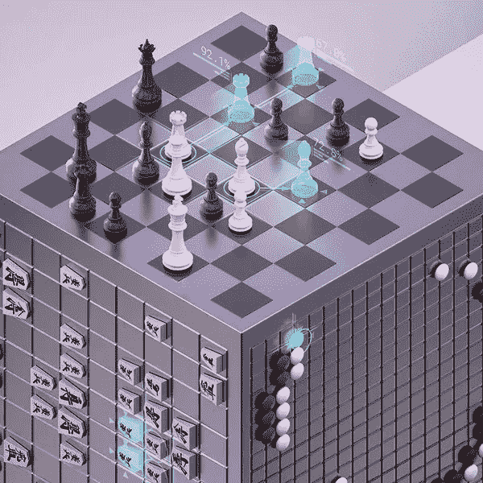
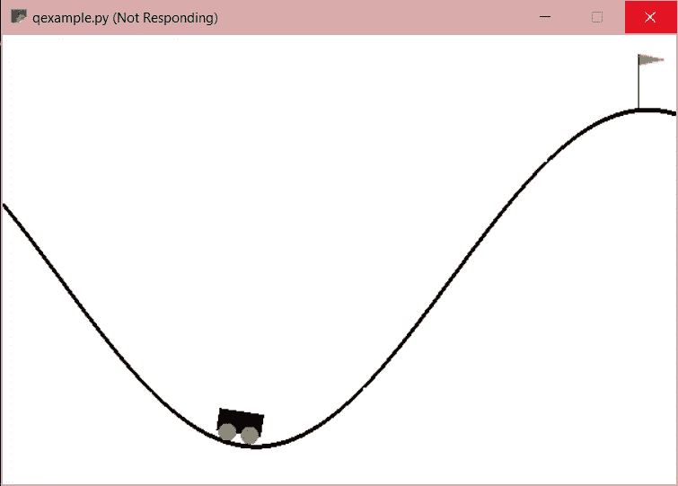
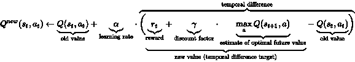
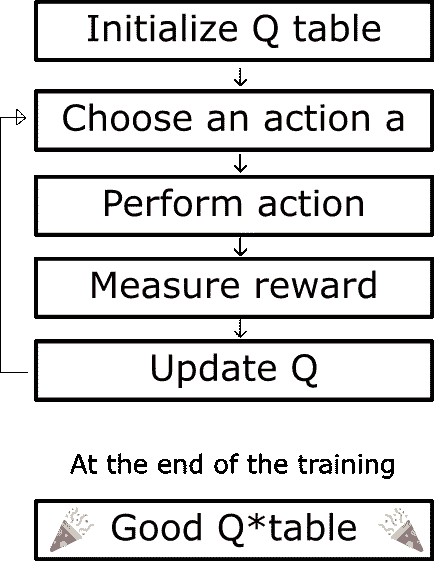
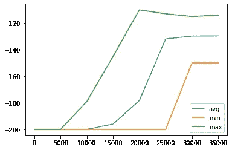

# 深度 Q 网络(1/2):计算机如何学习

> 原文：<https://medium.datadriveninvestor.com/deep-q-networks-1-of-2-how-computers-learn-a86ad2074df?source=collection_archive---------6----------------------->

## 深入了解经典 Q-Learning 及其工作原理。

人类是如何学习的？让我们想象一个孩子(这个例子摘自[托马斯·西蒙尼尼](https://www.freecodecamp.org/news/an-introduction-to-reinforcement-learning-4339519de419/)的一篇优秀文章)。

孩子走近壁炉。他们感到温暖舒适。`Reward += 1`

孩子想要更多的那种感觉——他们触摸壁炉。哎哟！`reward-= 1`。

现在孩子知道火是积极的(温暖舒适)，但不是用来触摸的(烧伤)。这个想法正是强化学习的工作方式，它正在做一些疯狂的事情。

 [## 今年值得关注的 5 大人工智能趋势|数据驱动的投资者

### 预计 2019 年人工智能将取得广泛的重大进展。从谷歌搜索到处理复杂的工作，如…

www.datadriveninvestor.com](https://www.datadriveninvestor.com/2019/02/19/artificial-intelligence-trends-to-watch-this-year/) 

AlphaGo 的继任者 DeepMind 的 [AlphaZero](https://deepmind.com/blog/article/alphazero-shedding-new-light-grand-games-chess-shogi-and-go) ，在没有任何人工输入的情况下，仅用了 4 个小时就超越了 Stockfish。这是**无模型**强化学习浪潮的一部分，就像人类的孩子一样，代理开始时没有任何人类输入，完全靠自己学习。

“Shedding new light on chess, Go and shogi”

RL 在已建立的有监督和无监督机器学习之间找到了一个绝对独特的领域。监督 ML(分类，支持向量机)是指给计算机提供带有特征及其各自标签的训练样本来进行训练。无监督 ML(聚类)本质上是当计算机没有被给定标记样本时。强化学习是更接近这个还是那个，还是它自己的领域？一旦我们完成了基础工作，我将回头再来讨论这个问题。

# 我被卖了！这到底是怎么回事？

在深入 Q-learning 之前，最好先了解一下什么是经典 Q-Learning。

让我们举一个简单的例子:

This is the environment MountainCar-v0 from OpenAI’s gym module for Python

这个“游戏”的目标是让汽车到达旗子那里，问题是汽车的引擎不够强劲，无法一次到达那里。首先让我们定义一些术语:

*   **代理**——“玩家”。它可以采取行动改变环境。
*   **操作** —代理可以与其环境交互的方式。
*   **状态** —关于环境当前状态的信息。
*   **奖励** —代理如何跟踪是否完成了目标。

让我们更深入地看看这个游戏。

# 山地汽车 2 —电动布加洛

在任何 RL 环境中，**代理人**根据环境的**状态**采取**行动**，这将试图最大化**奖励**(或最小化惩罚——我们很快会谈到这一点)。所以在这个例子中:

凭直觉，我们可以理解这个环境的目标——尽可能高效地到达旗帜。电脑是怎么知道的？每个时间步长产生-1 的奖励，达到目标产生 0 的奖励。代理有 200 个时间步到达旗子，然后游戏结束。这是最小化惩罚— **代理人试图获得最高可能的奖励值，**因此可以得出**最优行动将在最少的时间内将代理人带到标记处。**

> 好的，我明白了——我们到底要怎么做？

这通过使用**Q-表**来完成。Q-table 是一个演练或指南，它告诉代理在给定的状态下应该做什么。它包含环境中每一种可能的状态，并根据动作的数量分配 n 个 q 值。在这种情况下，对于环境中的每个状态，我们有 3 个 q 值(1 表示左，1 表示无，1 表示右)。代理参考这个 q 表，并且给定状态，它选择具有最高 q 值的动作。

Q-table 被随机初始化，并且每当它接收到奖励时，它所采取的所有动作的 Q 值使用一个公式相应地更新:

[This is… quite the formula](https://en.wikipedia.org/wiki/Q-learning)

我们来分解一下。

*   **学习率:**衡量算法放弃旧算法支持新算法的难易程度(值在 0 到 1 之间)。
*   奖励:代理现在得到的奖励。
*   **折扣系数:**衡量代理人对未来奖励相对于当前奖励的重视程度(值在 0 到 1 之间)。长期回报不确定，要打折扣；他们不应该打折扣太多，否则代理人会优先考虑短期回报，而不是长期的总体目标。
*   **Max Q:** 所有可能动作 *a* 的新状态(动作 *aₜ* 后)的最大 q 值。

函数 Q 接受某个状态-动作对，并从本质上给出该动作的“质量”。由此可见，我们的 Q 表只是我们的 Q 函数的所有输出的集合！在采取每个行动之后，这个 Q 表被更新。代理玩得越多，代理得到的奖励(负的或正的)就越多，我们的 Q 表就越优化。

# 用 Python 编写 Q 学习算法

对于这个项目，我使用了 [OpenAI 的 gym 模块](https://gym.openai.com/)，这是许多不同 RL 环境的开源集合(我还用它做了 Deep-Q-Network，敬请关注)。我用了我们已经用过的例子，山地车。这就是我们想要做的:

A great flowchart from [Thomas Simonini](https://www.freecodecamp.org/news/diving-deeper-into-reinforcement-learning-with-q-learning-c18d0db58efe/) explaining the structure of Q-Learning

Setting up imports and constants

> 那个`epsilon`值在那里做什么？为什么我们希望代理随机行动？

首先，代理在开始时会随机行动，因为 Q 表是随机初始化的。即使在 Q 表开始改善之后，我们仍然希望代理人去探索。**代理不应该停留在迭代和优化次优策略上**——它应该尝试探索和发现潜在的更好的策略。

当然，我们还是希望代理在某一点上进行优化；如果代理从不使用最优策略，那么找到最优策略又有什么意义呢？这就是为什么`epsilon`被设置为随时间衰减，在这种情况下`epsilon`达到 0 并在中间点停止衰减。

在这个例子中，我线性衰减`epsilon`，但是也有其他方式衰减`epsilon`！许多程序指数衰减它，但也有一些研究表明基于奖励的`epsilon`衰减更优越。基于奖励的衰减就像它听起来的那样:只有当代理得到足够好的奖励时才会衰减。这可以被认为是“责任”，当代理表现得更好时，我们允许它对自己的行为承担更多的责任。

> 现在我们必须初始化 Q 表，对吗？

不完全是。我们的桌子有多大？回想一下，状态有两个值:位置和速度。有多少种可能的状态？**无限多**。我们可以有速度 0，0.01，0.001，0.0001 等等。由于我们的状态信息是**连续的**(相对于离散的)，我们必须量化这些信息。这意味着我们必须将所有可能的状态分类到一定数量的桶中。这给了我们有限数量的可能状态。

Setting up our discrete observation space and defining a helper function to access it

现在我们初始化 q 表:

现在代理准备开始学习了！

这虽然乍一看很复杂，但实际上并没有那么复杂。循环是所有奇迹发生的地方。这是代理采取所有步骤并更新其 q 值的地方；每次环境结束时，我们都返回到`for`循环的顶部。这是代理采取行动、评估奖励并更新其 Q 表的地方。如果您需要更详细的了解，这里有文档！

> 早先那个庞大而笨拙的方程式在哪里？

Python 使其可读性显著提高:

不知道你怎么样，不过那个看起来比以前优雅多了:)

# 结果和总结

> 代理做的怎么样？

下面是经纪人报酬的图表(我决定拍 4 万集):

It looks like the max levels out at around 20000 episodes

这里有一张展示最佳代理的 gif 图:

Cool, isn’t it?

Q-learning 是一个强大的工具，但它完全是经典的。它没有使用任何强大的新工具(PyTorch、TensorFlow 等)。).它也不能有效地用于更复杂的任务，因为它们变得太复杂而不能以如此简单的方式建模。在我的下一篇文章中，我将谈论**深度 Q 网络**。

这里有一些事情需要思考:我们如何使用神经网络，并将其与 Q-learning 结合起来(提示:“苹果和橘子”)？

让我们回到引言中的问题:我们如何对 RL 进行分类？RL 初看起来与无监督的 ML 有一些相似之处:计算机没有任何带标签的例子，也没有大量带标签的训练数据来得出像神经网络一样的绝对函数逼近。

然而，它确实有相当多的训练数据，而且——这是关键——它有一个基于它获得的回报的表现指标。我没有为代理人提供许多不同情况下的最佳行动，但我提供了总体奖励，表明代理人的成功/失败。事实上，强化学习是独一无二的，不能轻易放置，在我看来，这是一个完全不同的领域。

# 关键要点:

*   强化学习是最大似然学中的一个新兴领域
*   RL 代理通过动作与它们的环境交互
*   奖励激励代理人采取某些行动
*   q-表代表了代理在给定状态下选择行动的“指南”
*   Q 表用 Q 函数的输出值填充
*   Q 函数看起来很复杂！但不是真的。
*   代理应该在早期采取随机行动(探索)，并在以后采取它发现的最佳行动(利用)
*   Q-learning 很酷，但是深度 Q-Learning 更酷。敬请关注。

# 在你走之前

*感谢阅读！如果你想看更多，你可以看看我的其他文章。我希望在接下来的几天里会有这个系列的第二部分。请随时到 dron.h.to@gmail.com 找我。注意安全！*