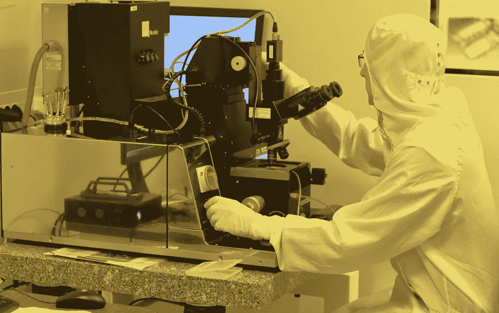

# 发展中国家的深度技术

> 原文：<https://medium.datadriveninvestor.com/deep-tech-in-developing-countries-61757ba17213?source=collection_archive---------3----------------------->

# 在山谷外思考

当我们谈论深度科技创业公司时，硅谷、波士顿、香港或新加坡的科技集群形象会立即浮现在我们的脑海中。似乎只有足够的资金、人才和关系才能将尖端科学发展转化为有效的创新业务。似乎没有其他地方有合适的环境和机构让这样一个系统充分发挥作用。大多数情况下，这是真的。但是完全吗？

深度科技创业作为一个成熟的行业和一种创新型企业是最近才出现的。我们甚至可以说现在正在形成。近几十年来，将生物学、材料科学、化学和数学领域的基础发现转化为成品的机会已经出现，即使是现在，整个深度技术领域仍然相对较小。许多高科技产业正在崛起，其中包括长寿、神经技术、表观遗传学、纳米技术、机器人技术。如果我们将此类业务与传统 IT 进行比较，那么它们似乎在各方面都更加复杂:R&D 成本更高，投资回收期更长，需要更多不同方向的专家，专业投资者更少，失败率更高，并且只有一些产品最终到达客户手中。即使是在各自行业取得了前所未有的惊人成就的领导者，如机器人领域的波士顿动力(Boston Dynamics)、人工智能领域的 DeepMind 或长寿领域的 Calico，也远未达到可以称之为稳定、增长和盈利的企业的水平，对此他们有很高的信心。

因此，即使是不完全位于发达国家先进集群中的创新 IT，与深度科技创业相比，看起来也是容易和可行的。那么，对于合成生物学或超材料行业，我们能说些什么呢？他们的“栖息地”应该更窄。当然，从尼日利亚到马来西亚，IT 企业现在在世界各地都有广泛的代表，但当谈到独角兽、新产业的出现、颠覆性项目时，一切仍然几乎完全局限于科技创业的经典领域。

但尽管如此，在我看来，发展中国家有几个重要的机会，至少在新兴的高科技产业中实现精确的突破。当我谈到这一点时，我主要是根据我与东欧创业基础设施互动的经验，并将其与我们在欧盟、英国和美国最发达国家观察到的情况进行比较。其他区域的具体情况可能不同，但是，可以得出许多类似的结论，例如，关于拉丁美洲或南亚国家。我将尝试用东欧的例子来说明发展中国家和他们的商业团体为了融入全球高科技社区必须解决什么问题，以及他们在这方面有什么机会。

# 机会之窗

一些事实对发展中国家有利。很难说这种情况会持续多久，在何种程度上是普遍独特的，但很可能发达国家之间的竞争压力迟早会抵消其中的许多优势。

我们将列出并讨论这些事实。

1.深度技术很难。

听起来没什么吸引力。但好消息是这对每个人来说都很难——包括来自波士顿和上海的家伙。当然，最好的科学中心吸引了最好的科学家，更不用说钱了，但是许多深度技术产业的不成熟造成了一种所有参与者都在开始的情况——富人和穷人，有经验的和新手都一样。如果你手里的牌不好，最好洗一下牌。除此之外，还有很多比科学集团更有前途的科学产业。实施具体项目所需的专家种类可能如此之多，以至于没有一个地方中心能够容纳所需数量的专家。换句话说:深科技领域的蓝海更广阔，但海水更冷。

2.在发达国家，深度技术经常受到法律禁止。

这很可悲，但却是事实。由于伦理考虑、游说、消费者保护法、来自宗教团体的压力，或者仅仅是由于科学素养水平低，许多研究甚至整个行业的发展都受到阻碍。一个经典的例子是干细胞和胚胎学。许多生物医学和生物技术领域，如遗传工程、神经技术和再生医学，可以同等或几乎同等地包括在内。人工智能也将受到影响，尽管程度较轻，但仍然意义重大。面对严格的隐私和数据保护法，许多培训营销算法的机会正在减少。当然，许多发展中国家也存在类似的障碍，但几乎总是政治意愿或政治文化的问题。如果愿意，政府可以相对容易地规避这些限制。至少，发达国家和发展中国家在这方面处于大致平等的地位，而对发展中国家来说，另一个事实是，许多发展中国家的政治进程要灵活得多。当然，这种灵活性是双向的。

3.经济、文化和社会都有一定程度的惰性。

从零开始创建一个东西通常比重建一个现有的系统要容易得多，不管它最初是多么高质量、先进和有效。关键是，在发达国家，传统技术产业发挥着显著更大的作用，它们深深地融入了社会，甚至融入了文化，向新的消费方式过渡可能会非常痛苦。移动银行在非洲国家的成功得到了广泛认可。为什么金融科技没有在更富裕、技术更先进的国家以这种方式发展，尽管它更方便、更便宜，而且在许多方面更安全？答案很简单:消费者已经太习惯传统银行业务了。发展中国家不必从传统技术转向新技术。

4.这是老生常谈，但却是事实:发展中国家的科学家要便宜得多。

这个事实是如此的微不足道，以至于通常都不会被提及，然而它的重要性不应该被低估。至关重要的是，科学家的工资差距通常比许多其他专家的工资差距要大得多。西欧的开发人员和科学家都可以获得 6000 欧元，而在东欧，开发人员可以获得 3000 欧元，科学家可以获得 300 欧元。因此，低价作为吸引高科技企业的一个因素，其重要性远远高于 IT。同样重要的是，劳动力成本是高科技行业的主要支出项目。当然，这种不平衡是暂时的:随着发展中国家高科技企业的增长，工资将会趋同。

5.发展中国家技术水平较低的竞争对手通常不会进行游说。

原则上没有汽车工业的地方，没有人反对生产电动汽车。发达国家科技企业的发展经常受到不太先进但强大的公司的阻碍，这些公司可以游说对创新竞争对手施加压力。例如，传统的育种者没有从农业中遗传工程方法的传播中受益。在许多发展中国家，创新企业甚至没有间接竞争对手:钢铁厂和零售店没有理由与航天火箭制造商竞争。

6.Deep tech 非常多样化。每个人都有足够的利基。

许多以知识为基础的行业中的每一个都是由大量不同的子行业组成的。通常，有许多不同的、彼此相对独立的方法来用科学解决同一个问题，不管是把人送上太空还是把寿命延长到 200 岁。即使在同一个子行业中，流程通常也有多个阶段，每个阶段都可以由单独的企业负责。这种专业化可以在国家和地区层面实施:例如，东欧发达的信息技术基础设施可以成为当地人工智能集群发展的极好帮助，而美国在墨西哥的生物技术资本可以使其成为有吸引力的再生医学中心。这就把我们带到了下一点。

7.在许多国家，IT 初创企业的主要风险基础设施已经准备就绪。

虽然发展中国家缺乏多种类型的机构投资者是一种现象，但 IT 创业公司筹集的风险资本基金和风险基础设施正在增长和扩大。而这正是小型知识密集型企业首先需要的资本类型。反过来，大型企业可以依靠全球机构投资者的资金。

8.对资本的竞争减少了。

发展中国家的高科技初创公司不必与众多近乎独角兽的传统风险投资公司竞争，这些国家普通小企业的前景往往太低，任何类型的投资者都不会感兴趣。当地投资者可能会被迫投资于高科技领域。

9.技术正在被去货币化、民主化和去物质化。

技术的指数级增长意味着成本更低，需要的材料更少，更多的人可以使用。DIY 车库正在变成顶级实验室。不再需要洛斯阿拉莫斯这样的国家战略中心来创造科学密集型产品。由于几乎任何深层技术都是数字化的或与数字化相关的，摩尔定律在其中起作用并导致相应的结果。

# 几个特定的场景

有一些具体的有条件积极的情景，根据这些情景，发展中国家的高科技产业的全球形势可能会发生变化。可能性并不仅限于此，但让我们看看几个选项作为例证。

*离岸技术*

如果某样东西在 A 国被禁止，那么在 B 国没有禁令就已经是一种竞争优势。这就是离岸金融公司的工作方式。但是离岸外包可以远远超出它最初出现的行业。

例如，发展中国家可以成为一种离岸生物技术。墨西哥已经在朝着这个方向前进。其他一些拉丁美洲国家也是如此。由于欧盟对该行业的限制，干细胞医学正在乌克兰发展。发展中国家可能成为在许多富裕国家被认为不道德的行业中自由研究的孤岛。因此，中国能够在基因工程和胚胎干细胞研究方面遥遥领先。

*跳跃*

为了发展最先进的工业，没有必要始终如一地经历先进国家经济发展的所有历史阶段。有些步骤可以跳过，对年轻的科技行业来说会更有用。做 AI 不需要有强大的化工行业。你不需要有一个最初高产的农业来转向转基因生物。事实上，技术尚未失去相关性但落后于现代的大型行业可能会非常僵化，并抑制该国的创新发展。

*马赛克特殊化*

即使发展中国家单独来看可能无法在整个高技术部门实现竞争力，但每个国家都有自己的专业化的区域技术创业生态系统可能能够做到这一点。我们可以观察到这种区域集群的雏形，例如，在东南亚，在机器人领域，一些国家将专门从事人工智能，其他国家则从事物质元素的生产。自然，这一战略假定国家之间不存在重大的贸易和投资壁垒，以及一定程度的政治一体化和协调。

*后勤住宅*

许多成功的西方 IT 公司在东欧都有后台。仅仅因为它更便宜，因为无形资产不会被偷走。即使不可能发展成熟的深度技术集群，发展中国家也可能局限于为知识密集型初创企业创建后台。当然，这将意味着产品附加值的很大一部分是在国外创造的，尽管如此，即使这样一种局部发展战略也能对国家的经济和社会发展产生深远的积极影响:外包信息技术专家构成了许多发展中国家中产阶级的基础。

*IT 整合*

我们多次在深度技术和 IT 之间进行类比。在这里，我们只是把这个过程进行到底。发展中国家知识密集型初创企业的发展可以按照扩展现有 IT 基础设施并在其上形成一种上层建筑的原则进行。鉴于许多高科技产品本质上是将信息技术应用于某些科学问题的结果，这种情况似乎很有可能发生。一个同样重要的作用是，信息技术领域现有的风险资本基金可以为发展提供主要动力。

# 为什么我们还不在那里？

当然，并非一切都如此美好。如果这顿午餐是免费的，它会被吃掉。如果有机会，但没有实现，那么在这条道路上一定会有某些障碍——障碍的程度几乎涉及每个国家。

让我们继续描述这些问题。其中一些是显而易见的，众所周知的:腐败、缺乏资本市场、缺乏法治、机构和商业文化发展水平低、政治和经济不稳定、贸易壁垒、内部市场小。其他问题更加具体，直接与高科技企业相关。让我们详细讨论一下。

1.科学家与风险投资基础设施的隔离。

作为一种现象，科学和商业之间的调解往往是不存在的，学术界的代表在商业管理方面既没有接受正式的培训，也没有接受非正式的培训。这不仅是经济问题，也是文化问题。

2.误解了研究与开发、发明与创新、科学与技术之间的区别。

任何需要智力努力的项目通常被称为科学密集型项目，甚至是科学项目。这造成了很多困惑，尤其是对来自发达国家的投资者而言。当一个传统的 IT 创业公司被定位为深度科技时，真正的深度科技创业公司就会受到它的影响。

3.无形资产附加物。

许多发展中国家的创新企业家往往非常害怕从事有形资产发挥重要作用的业务，因为这种业务更容易受到第三方非法活动的损害。

4.缺乏解决问题的文化。

创业公司的发展通常不是从发现问题和寻找可能的解决方案开始，而是从创造产品开始，然后他们试图调整产品以适应特定的市场。当然，这样的策略也有存在的权利，在任何市场和行业都可以开花结果，但不在问题和解决方案的框架内思考，就不是很有效。

# 要做的工作

上述可能性只能在政府或国家风险资本团体(如果有的话)一级实施，这大大增加了任务的复杂程度。一个单独的创业公司无法解决这些问题，然而，企业家们完全有能力创造讨论、筹集资金和游说的平台。大型机构投资者可以扮演一个重要的、甚至是决定性的角色。有时，一笔大型基金进入一个国家，就足以从根本上改变该国的科技政治气候。令人鼓舞的是，发展中国家的多样性是巨大的——至少其中一些国家应该能够抓住高科技企业繁荣带来的机遇。

然而，有些事情可以在企业家层面上完成。至少，每个人都可以通过回答以下问题来评估在自己国家的特定行业创建深度科技创业公司的前景:

*   你的国家典型的法律优势是什么？比如基因工程立法呢？干细胞呢？
*   有没有在世界舞台上有竞争优势的科学学校，机构？这可能是一个碳材料研究实验室或航空航天工程研究所。专业化可以很窄，但机构会是所在领域最好的。
*   这个行业的一个项目能在多大程度上融入该国现有的风险投资基础设施？企业家和 IT 投资者对它有多大兴趣？你能以 IT 风险投资的方式创业吗？
*   这个行业的成本趋势是什么？它们会呈指数下降吗？它们和摩尔定律有关系吗？
*   你能在什么发达市场工作？
*   为什么发达国家的竞争对手几年都追不上你，超过你？
*   有形资产在你的项目中的作用有多重要？

# 参考

丰富—创新，D. (2016)。建设创新文化。管理，59(6)，10–11。

塞法尔瓦伊，Z. (2020 年)。中东欧的机器人化:追赶还是依赖？。欧洲规划研究，28(8)，1534 年至 1553 年。

迪亚曼蒂斯，P. H .，&科特勒，S. (2016 年)。大胆:如何做大，取得成功，影响世界。西蒙与舒斯特平装本。

埃德斯特伦和克林格(2020 年)。欧洲高科技和风险投资的前景。

佛罗里达州 r . & Mellander，C. (2016 年)。创业城市的崛起:风险资本资助创新的地理变化。加州管理评论，59(1)，14-38。

Gompers，p .和 Lerner，J. (2001 年)。风险资本革命。经济展望杂志，15(2)，145–168 页。

i̇nce，女(2020)。纳米和微型卫星是“新空间”范式的支柱。航空航天技术杂志，13(2)。

李克福(2018)。人工智能超级大国:中国、硅谷和新的世界秩序。霍顿·米夫林·哈科特。

Mulvaney，p .，& Weiss，P. S. (2016 年)。纳米科学和纳米技术已经实现了吗？。

c .奥雷利亚纳(2003 年)。墨西哥投标生物技术。生物企业家，1–2。

罗森斯坦德，C. A. F. (2020)。选择、组合和培育数字深层技术生态系统。危机，7，10。

维达，P. (2016)。东欧国家生物技术投资的潜力:失去的机会。商业系统研究:促进创新和经济研究学会国际期刊，7(1)，16–34。

沃尔科特，S. M. (1999)。南方腹地的高科技:亚特兰大大都市的生物医药公司集群。成长与变化，30(1)，48–74 页。

Woźniak，e .，津尼，t .，& Twardowski，T. (2020)。农业生物技术:在欧盟使用转基因生物的法律和经济方面。生物经济促进可持续发展(第 21-41 页)。新加坡斯普林格。

Woźniak，e .，津尼，t .，& Twardowski，T. (2020)。农业生物技术:在欧盟使用转基因生物的法律和经济方面。生物经济促进可持续发展(第 21-41 页)。新加坡斯普林格。