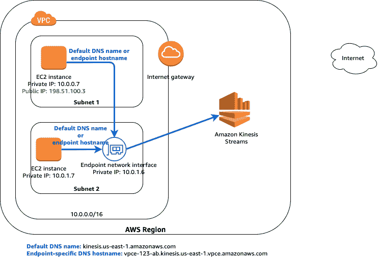
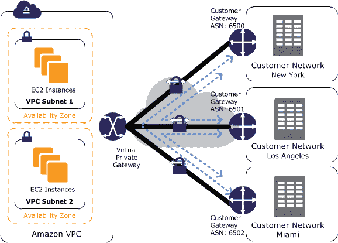

# 深入到 VPCs 和连接到 VPC

> 原文：<https://medium.datadriveninvestor.com/deepdive-to-vpcs-and-connections-to-vpc-2de3fb164d7c?source=collection_archive---------0----------------------->

亚马逊 VPC(虚拟私有云)能够完全控制 AWS 虚拟网络环境。亚马逊 VPC 的新功能会如何影响 AWS 网络基础设施的设计，甚至改变现有的架构？让我们探索 VPC 的新设计和功能，以及如何使用它们。

# 学习目标

*   了解所有网络服务以及何时使用每种服务
*   了解最新的更新以及每个更新的使用方法
*   如何让现有架构更上一层楼

Advanced VPC

上图给出了亚马逊 VPC 架构的概念。我们将看看这些组件和图中没有的运营商网关。

**VPC** 是一种区域级服务，您可以分配一个 cidr 地址范围。有多个可用性区域、公共子网和私有子网。我们可以在该地区 VPC 的可用区域中的这些子网内部署 ec2 实例。

VPC

AWS 服务有两种不同类别或类型的服务，即公共服务和私有服务。

VPC 内的任何东西都是**的私有物**，是你管理和控制的领域。

VPC 之外的任何东西一般都是**公开的**，除非你建立了一个到 s3、DynamoDB、Lambda、SQS、SNS 等服务的私有连接。所有这些服务都是公共服务。

Route Table

当我们在 VPC 内部通信时，我们实际上会使用分配给子网的**路由表**。路由表基本上能让你控制 VPC 内部发生的一切。交通可以交流的地方。路由是我们如何与其他事物沟通的关键。

互联网网关 (IGW)为我们提供公共服务和公共互联网。只需建立一条通往 IGW 的默认路径。当你有一个公共 IP 或弹性 IP 分配给一个实例，我们可以与所有这些公共服务和公共互联网通信。

NAT Instance

对于私有子网，我们可以通过 **NAT 实例**或 **NAT 网关**发送流量，而不是直接发送到公共互联网。那么 NAT 实例或 NAT 网关(是一种可管理的可扩展服务)具有与公共互联网通信的能力。

NAT Gateway

一个 **VPC 端点**支持您的 VPC 和支持的 AWS 服务之间的私有连接。由 AWS PrivateLink 支持的 VPC 端点服务。VPC 端点不需要互联网网关、NAT 设备、VPN 连接或 AWS 直连连接。VPC 中的实例不需要公共 IP 地址来与服务中的资源通信。您的 VPC 和其他服务之间的流量不会离开亚马逊网络。

VPC Gateway Endpoint

**VPC 网关端点**是一个网关，您在路由表中将它指定为去往受支持的 AWS 服务的流量的路由目标。目前，我们可以使用 VPC 网关端点私有地连接到 s3 和 Dynamodb。我们使用路由表中的前缀列表进行私密通信。VPC 网关端点就像 s3、dynamodb 和 VPC 之间的桥梁。VPC 网关端点是水平扩展、冗余且高度可用的 VPC 组件。它们允许 VPC 和服务中的实例之间进行通信，而不会给网络流量带来可用性风险或带宽限制。

VPC Interface Endpoints

一个**接口端点**是一个弹性网络接口，具有来自您的子网 IP 地址范围的私有 IP 地址，作为去往受支持服务的流量的入口点。接口端点由 AWS PrivateLink 提供支持，这是一种使您能够使用私有 IP 地址私下访问服务的技术。AWS PrivateLink 将您的 VPC 和服务之间的所有网络流量限制在亚马逊网络。您不需要互联网网关、NAT 设备或虚拟专用网关。

创建端点时，可以将端点策略附加到该端点，以控制对所连接的服务的访问。VPC 端点策略是在创建或修改端点时附加到端点的 IAM 资源策略。如果在创建端点时没有附加策略，则会为您附加一个默认策略，允许您完全访问服务。如果服务不支持端点策略，端点将允许对服务的完全访问。端点策略不会覆盖或替换 IAM 用户策略或特定于服务的策略(如 S3 存储桶策略)。这是一个独立的策略，用于控制从端点到指定服务的访问。您不能将多个策略附加到一个端点。但是，您可以随时修改该策略。如果您确实修改了策略，可能需要几分钟才能使更改生效。

在下图所示的示例中，在子网 2 中有一个 Amazon Kinesis 数据流的接口端点和一个端点网络接口。接口端点的专用 DNS 未启用。任一子网中的实例都可以使用特定于端点的 DNS 主机名通过接口端点向 Amazon Kinesis 数据流发送请求。子网 1 中的实例可以使用其默认的 DNS 名称，通过 AWS 区域中的公共 IP 地址空间与 Amazon Kinesis 数据流进行通信。

Private DNS for endpoint disabled

在下图中，端点的专用 DNS 已启用。任一子网中的实例都可以使用默认 DNS 主机名或特定于端点的 DNS 主机名，通过接口端点向 Amazon Kinesis 数据流发送请求。

Private DNS for Endpoint Enabled

**专用链接**将使您能够配置 SaaS 服务。您可以在 VPC 中创建自己的应用程序，并将其配置为基于 AWS PrivateLink 的服务(服务提供商 VPC)。其他 AWS 主体可以使用接口 VPC 端点创建从其 VPC 到您的端点服务的连接。您是服务提供者，创建服务连接的 AWS 主体是服务消费者。标记可用于端点服务，它们可通过区域内和区域间 VPC 对等或转接网关直接连接。

AWS Privatelink

在上图中，VPC B 的帐户所有者是一个服务提供商，在子网 B 的实例上运行一项服务。VPC B 的所有者有一个服务端点(vpce-svc-1234 ),该端点带有一个关联的网络负载平衡器，该平衡器将子网 B 中的实例作为目标。VPC A 的子网 A 中的实例使用接口端点来访问子网 b 中的服务

我们可能想要连接到我们自己的场所，所以我们将使用直接连接或 VPN。

您可以使用以下 VPN 连接选项将您的亚马逊 VPC 连接到远程网络和用户。

*   **AWS 站点到站点 VPN** :你可以在你的 VPC 和你的远程网络之间创建一个 IPsec VPN 连接。在站点到站点 VPN 连接的 AWS 端，虚拟专用网关或中转网关为自动故障转移提供两个 VPN 端点(隧道)。您在站点到站点 VPN 连接的远程端配置您的客户网关设备。

S2S VPN

您可以将站点到站点 VPN 迁移到 AWS 中转网关。[https://AWS . Amazon . com/about-AWS/whats-new/2019/04/migrate-your-AWS-site-to-site-VPN-connections-from-a-virtual-private-gateway-to-an-AWS-transit-gateway/](https://aws.amazon.com/about-aws/whats-new/2019/04/migrate-your-aws-site-to-site-vpn-connections-from-a-virtual-private-gateway-to-an-aws-transit-gateway/)

*   **AWS 客户端 VPN:** 这是一种基于托管客户端的 VPN 服务，使您能够安全地访问您的 AWS 资源或您的内部网络。使用 AWS 客户端 VPN，您可以配置一个端点，用户可以连接到该端点以建立安全的 TLS VPN 会话。这使得客户端能够使用基于 OpenVPN 的 VPN 客户端从任何位置访问 AWS 或内部的资源。

Client VPN

*   **AWS VPN CloudHub** 如果您有多个 AWS 站点到站点 VPN 连接，您可以使用 AWS VPN CloudHub 提供站点之间的安全通信。这使您的远程站点能够相互通信，而不仅仅是与 VPC 通信。VPN CloudHub 运行在一个简单的轴辐式模型上，您可以使用或不使用 VPC。如果您有多个分支机构和现有的互联网连接，并且希望为这些远程办公室之间的主连接或备份连接实施一个方便、潜在的低成本星型模型，则此设计非常合适。这些站点不得有重叠的 IP 范围。

VPN Cloud Hub

*   第三方软件 VPN 设备您可以使用运行第三方软件 VPN 设备的 VPC 中的 Amazon EC2 实例来创建到远程网络的 VPN 连接。AWS 不提供或维护第三方软件 VPN 设备；但是，您可以从合作伙伴和开源社区提供的一系列产品中进行选择

AWS **直连**通过标准以太网光缆将您的内部网络链接到 AWS 直连位置。电缆的一端连接到您的路由器，另一端连接到 AWS 直连路由器。通过此连接，您可以创建直接到公共 AWS 服务的虚拟接口(例如，到亚马逊 S3)或到亚马逊 VPC 的私有虚拟接口，绕过网络路径中的互联网服务提供商。AWS 直连位置提供了对与其相关联的区域中的 AWS 的访问。

Direct Connect

AWS Direct Connect + VPN，您可以将 AWS Direct Connect 专用网络连接与亚马逊 VPC VPN 相结合。AWS Direct Connect public VIF 在您的网络与公共 AWS 资源(如 Amazon 虚拟专用网关 IPsec 端点)之间建立了专用网络连接。下图说明了该选项。

Direct Connect + VPN

默认情况下，直接连接流量不加密。此解决方案将端到端安全 IPSec 连接的优势与 AWS 直接连接的低延迟和更高带宽相结合，提供了比基于互联网的 VPN 连接更一致的网络体验。

**Transit gateway** 是大约在 2018 年 11 月推出的服务。中转网关是一个网络中转中心，可用于互连虚拟私有云(VPC)和内部网络。中转网关充当区域虚拟路由器，用于虚拟专用云(VPC)、VPN 连接和内部之间的流量传输。

通过 AWS Direct Connect+AWS Transit Gateway+VPN，使用 AWS Direct Connect 上的公共 VIF，可以在您的网络和区域集中式路由器之间实现端到端的 IPSec 加密连接，该路由器是专用连接上的 Amazon VPCs 中转网关，如下图所示

Transit Gateway + Direct Connect + VPN

当您希望简化管理并最大限度地降低 IPSec VPN 连接到同一地区的多个 Amazon VPCs 的成本时，可以考虑采用这种方法，同时利用基于互联网的 VPN 上的专用连接的低延迟和一致的网络体验优势

**中转网关网络管理器**(网络管理器)使您能够集中管理围绕中转网关构建的网络。您可以跨 AWS 区域和内部位置可视化和监控您的全球网络。

您可以创建一个包括多个 AWS 区域中的中转网关的全球网络。这使您能够监控 AWS 网络的全局健康状况。在下图中，全球网络包括美国东部-2 地区的中转网关和美国西部-2 地区的中转网关。每个中转网关都有 VPC 和 VPN 附件。您可以使用网络管理器控制台查看和监控转接网关及其附件

Transit Gateway Monitor

**AWS 直连网关**是属于同一个 AWS 账户的一组虚拟专用网关和专用虚拟接口。直连网关是一种全球可用的资源。您可以在任何地区创建直连网关，并从所有其他地区访问它。

AWS Direct Connect+AWS Transit Gateway，使用 transit VIF 附件到 Direct Connect gateway，使您的网络能够通过专用连接连接多达三台区域集中式路由器，如下图所示。

Transit Gateway + Direct Connect Gateway + Direct Connect

*   *** AWS Transit Gateway Connect * ***Transit Gateway Connect 提供了一种将 SD-WAN 基础设施集成到 AWS 的本地方式。它可以帮助您将 SD-WAN 扩展到 AWS，而无需在 SD-WAN 网络虚拟设备和 AWS 中转网关之间设置或管理 IPsec VPNs，从而降低集成的复杂性、总体成本并显著降低运营开销。**AWS 中转网关连接* *([https://docs.aws.amazon.com/vpc/latest/tgw/tgw-connect.html](https://docs.aws.amazon.com/vpc/latest/tgw/tgw-connect.html))

[https://d 2908 q 01 vomqb 2 . cloudfront . net/5b 384 ce 32d 8 cdef 02 BC 3a 139d 4 CAC 0a 22 bb 029 e 8/2020/12/10/tgw-high-level-architecture-fig-1-v1 . png](https://d2908q01vomqb2.cloudfront.net/5b384ce32d8cdef02bc3a139d4cac0a22bb029e8/2020/12/10/tgw-high-level-architecture-fig-1-v1.png)

您可以创建中转网关连接附件，以便在中转网关和 VPC 中运行的第三方虚拟设备(如 SD-WAN 设备)之间建立连接。连接附件支持通用路由封装(GRE)隧道协议以实现高性能，并支持边界网关协议(BGP)以实现动态路由。创建连接附件后，您可以在连接附件上创建一个或多个 GRE 隧道(也称为连接对等体),以连接传输网关和第三方设备。您通过 GRE 隧道建立了两个 BGP 会话来交换路由信息。这两个 BGP 会话是为了冗余。

连接附件使用现有的 VPC 或 AWS 直接连接附件作为基础传输机制。这被称为运输附件。中转网关将来自第三方设备的匹配 GRE 数据包识别为来自 Connect 附件的流量。它会将任何其他数据包(包括来源或目的地信息不正确的 GRE 数据包)视为来自传输附件的流量。

****AWS Transit Gateway 设备模式* ***([https://AWS . Amazon . com/blogs/networking-and-content-delivery/simplify-SD-wan-connectivity-with-AWS-Transit-Gateway-connect/](https://aws.amazon.com/blogs/networking-and-content-delivery/simplify-sd-wan-connectivity-with-aws-transit-gateway-connect/))

***VPC 对等**是两个或更多 VPC 之间的网络连接。这使您能够使用私有 IPv4 地址或 IPv6 地址在它们之间路由流量。任一 VPC 中的实例可以相互通信，就好像它们在同一个网络中一样。您可以在自己的 VPC 之间创建 VPC 对等连接，或者与另一个 AWS 帐户中的 VPC 建立对等连接。VPC 可以位于不同的区域(也称为区域间 VPC 对等连接)。

VPC Peering

您不能在具有匹配或重叠 IPv4 CIDR 块的 VPC 之间创建 VPC 对等连接。

No Peereing vith Overlapping CIDR

你不能有传递对等。在 VPC A 和 VPC B (pcx-aaaabbbb)之间以及 VPC A 和 VPC C (pcx-aaaacccc)之间有一个 VPC 对等连接。VPC B 和 VPC C 之间没有 VPC 对等连接。您不能通过 VPC A 将数据包从 VPC B 直接路由到 VPC C

No Transitive Peering

要在 VPC B 和 VPC C 之间直接路由数据包，您可以在它们之间创建单独的 VPC 对等连接(前提是它们没有重叠的 CIDR 块)。

你不能通过网关或专用连接进行边缘到边缘的路由。

No Edge to Edge Routing

例如，如果 VPC A 和 VPC B 是对等的，而 VPC A 具有其中任何一个连接，那么 VPC B 中的实例就不能使用该连接来访问连接另一端的资源。同样，连接另一端的资源也不能使用该连接来访问 VPC B

一个**运营商网关**有两个用途。它允许特定位置的运营商网络的入站流量，也允许运营商网络和互联网的出站流量。没有通过运营商网关从互联网到波长区域的入站连接配置。运营商网关支持 IPv4 流量。

Carrier Gateway

运营商网关仅适用于在波长区域中包含子网的 VPC。运营商网关在您的波长区域和电信运营商以及电信运营商网络上的设备之间提供连接。运营商网关执行波长实例的 IP 地址到来自分配给网络边界组的池的运营商 IP 地址的 NAT。运营商网关 NAT 功能类似于互联网网关在一个地区的功能。上图演示了如何创建一个子网，以便在特定位置使用电信运营商网络中的资源。你在这个地区创造了一个 VPC。对于需要在电信运营商网络内的资源，您可以选择进入波长区域，然后在波长区域内创建资源。AWS 波长使开发人员能够构建向移动设备和最终用户提供超低延迟的应用程序。

Advanced VPC

**VPC 流量日志**是一项功能，可让您捕获进出 VPC 网络接口的 IP 流量信息。您可以为 VPC、子网或单个网络接口创建流日志。您可以确定进出网络接口的流量方向。流量日志数据发布到 CloudWatch 日志或亚马逊 S3，可以帮助您监控流量，诊断过于严格或过于宽松的安全组和网络 ACL 规则。流日志数据是在网络流量的路径之外收集的，因此不会影响网络吞吐量或延迟。您可以创建或删除流日志，而不会对网络性能产生任何影响。

VPC Flow Log

在上面的示例中，您创建了一个流日志(fl-aaa ),它捕获实例 A1 的网络接口的接受流量，并将流日志记录发布到亚马逊 S3 存储桶。您创建了第二个流日志，它捕获子网 B 的所有流量，并将流日志记录发布到 Amazon CloudWatch 日志。流日志(fl-bbb)捕获子网 b 中所有网络接口的流量。没有流日志捕获实例 A2 的网络接口的流量。

**流量镜像**是亚马逊 VPC 的一个特性，可以用来从亚马逊 EC2 实例的弹性网络接口复制网络流量。然后，您可以将流量发送到带外安全和监控设备，用于:

*   内容检查
*   威胁监控
*   解决纷争

Traffic Mirroring

安全和监控设备可以部署为单个实例，也可以部署为带有 UDP 监听器的网络负载平衡器后面的一组实例。流量镜像支持过滤器和数据包截断，因此您可以使用自己选择的监控工具只提取感兴趣的流量进行监控。以下是流量镜像的关键概念:

*   目标—镜像流量的目标。
*   过滤器—定义在流量镜像会话中复制的流量的一组规则。
*   会话—描述使用过滤器从源到目标的流量镜像的实体。

最后是全球加速器。它基本上允许你在 VPC 的边缘位置摆放东西。 **AWS Global Accelerator** 是一项服务，您可以在其中创建加速器，为本地和全球用户提高应用程序的可用性和性能。Global Accelerator 通过 AWS 全球网络将流量导向最佳端点。这提高了全球用户使用的 internet 应用程序的可用性和性能。

Global Accelerator

Global Accelerator 是一项全球服务，支持多个 AWS 区域中的端点。默认情况下，Global Accelerator 为您提供了两个与加速器相关联的静态 IP 地址。(或者，不使用 Global Accelerator 提供的 IP 地址，您可以将这些入口点配置为您自己的 IP 地址范围内的 IPv4 地址，并将其引入 Global Accelerator。)静态 IP 地址是来自 AWS 边缘网络的任播，并且在多个 AWS 区域中的多个端点资源上分发传入的应用流量，这增加了应用的可用性。端点可以是位于一个 AWS 区域或多个区域的网络负载平衡器、应用负载平衡器、Amazon EC2 实例或弹性 IP 地址。Global Accelerator 使用 AWS 全球网络，根据运行状况、客户端位置和您配置的策略将流量路由到最佳区域端点。该服务对运行状况或配置的变化做出即时反应，以确保来自客户端的互联网流量始终被定向到运行状况良好的端点。

Accelerated Site-to-Site VPN

您可以选择启用站点到站点 VPN 连接的加速。加速站点到站点 VPN 连接(加速 VPN 连接)使用 AWS Global Accelerator 将流量从您的内部网络路由到离您的客户网关设备最近的 AWS 边缘位置。AWS 全球加速器优化了网络路径，使用无拥塞的 AWS 全球网络将流量路由到提供最佳应用程序性能的端点。您可以使用加速 VPN 连接来避免在公共互联网上路由流量时可能发生的网络中断。

当您创建加速 VPN 连接时，AWS 会代表您创建和管理两个加速器，每个加速器用于一个 VPN 隧道。您不能通过使用 AWS 全局加速器控制台或 API 来查看或管理这些加速器。

*最初发表于*[*【https://github.com】*](https://github.com/ealtili/Blog/blob/master/AWS/DeepdivetoAdvancedVPCDesigns.md)*。*