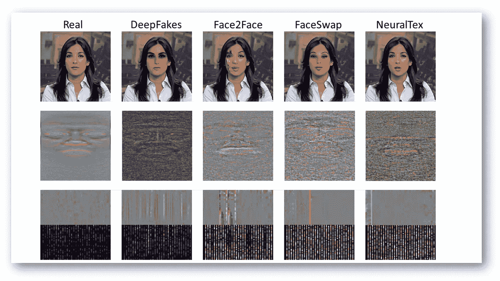
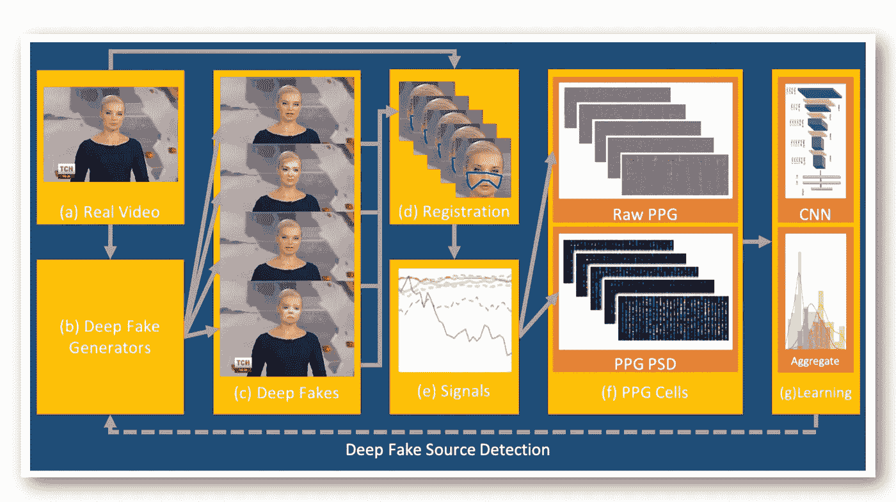
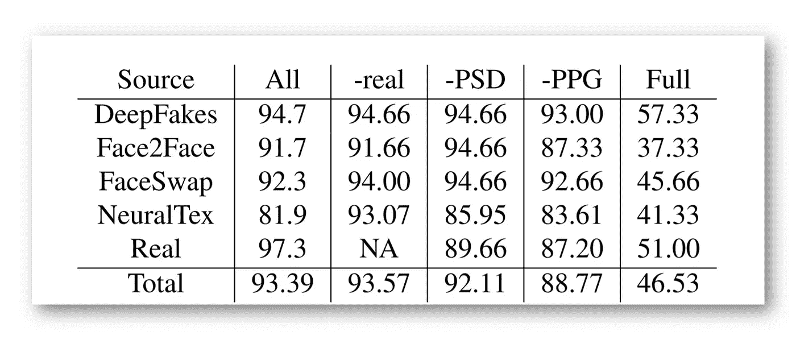

# 通过心率预测检测深度假货

> 原文：<https://medium.datadriveninvestor.com/deepfakes-detection-by-heart-rate-prediction-d96d8843a14b?source=collection_archive---------17----------------------->

## 深度学习

## 深度假货的心是怎么跳动的？一种基于生物信号解释残差的深度假货检测新方法

PPG Cells. Example frames per ω = 64 windows (**top**), and their PPG cells (**bottom**) consisting of raw PPG and PPG PSD, of a real video (**left**) and its deep fakes per generative model (**rest**). Source: [Arxiv](https://arxiv.org/pdf/2008.11363.pdf)

宾汉普顿大学 和 [*英特尔公司*](https://www.intel.com/content/www/us/en/homepage.html) 的研究人员开发了一种通过预测心跳来识别 [deepfakes](https://en.wikipedia.org/wiki/Deepfake) 的模型。分类器使用[光电容积描记图](https://en.wikipedia.org/wiki/Photoplethysmogram)数据来识别虚假视频。该模型中的一个重要假设是，它学习识别使用一组公开可用的架构生成的 deepfakes。这限制了该模型在实际应用中的使用。

该方法以 97.27% 的准确率**检测出虚假视频，以 93.39%** 的准确率**检测出 deepfakes 的生成模型。**

# DeepFakes 问题

deepfakes 近年来越来越受欢迎。人工生成的名人视频被用于各种目的，从社交媒体图像的过滤器到政治宣传和虚假新闻。这就使得对 deepfakes 的识别方法的研究成为一个热门领域。

# 该方法背后的思想

研究人员分析了来自 [**生成 GAN 模型**](https://medium.com/dev-genius/write-your-first-generative-adversarial-network-model-on-pytorch-7dc0c7c892c7) 的残余物，并试图将它们与生物信号联系起来。所提出的用于对 deepfake 视频进行分类的框架能够识别由可用模型之一生成的虚假视频及其来源。

 [## 在 PyTorch 上写下你的第一个生成性对抗网络模型

### 使用两个模型的例子构造生成性对抗神经网络(GANs)的详细说明…

medium.com](https://medium.com/dev-genius/write-your-first-generative-adversarial-network-model-on-pytorch-7dc0c7c892c7) 

该模型从接收一个真实视频作为输入的几个生成网络开始。真实视频和生成的 deepfakes 然后被馈送到注册模块的输入端。在这个阶段，模型提取感兴趣的面部部分，这些部分跟踪光电容积描记图的生物信号。

最后一个模块是一个分类器，它通过一个演示来预测视频类别。如果模型预测了一个 deepfake，那么它预测了用于生成的模型的最可能的架构。

**Method Overview**. From real videos (**a**), several generators (**b**) create deep fakes with residuals specific to each model (**c**). Our system extracts face ROIs (**d**) and biological signals (**e**), to create PPG cells (**f**) where the residuals are reflected in spatial and frequency domains. Then it classifies both the authenticity and the source of any video (**c**) by training on PPG cells and aggregating window predictions (**g**). Source: [Arxiv](https://arxiv.org/pdf/2008.11363.pdf)

在[消融研究](https://stats.stackexchange.com/questions/380040/what-is-an-ablation-study-and-is-there-a-systematic-way-to-perform-it)中，对真实视频的检测有 7.64%的增长，这证实了功率谱的主要贡献:真实视频中生物信号的时空相关性在深度赝品中没有被保留，因此在真伪检测中有用。

 [## 医生管理工作量增加时的深度学习|数据驱动的投资者

### 行政工作量是我们这个时代大多数医生所经历的众多负担之一。医生，尤其是…

www.datadriveninvestor.com](https://www.datadriveninvestor.com/2020/11/27/deep-learning-amid-increased-physician-administrative-workload/) 

与利用生成器架构或最后层进行残差分类的其他源检测方法相比，作者可以容易地扩展到新的模型，而不需要模型规范或假样本的真实对应物。

Ablation Study. Video source detection accuracies without reals, without PSD part of PPG cells, without biological signals, and on full frames (not only faces). Source: [Arxiv](https://arxiv.org/pdf/2008.11363.pdf)

# 原始文件

# 对深度学习感兴趣？

*如果您觉得这篇文章有帮助，请点击💚或者👏按钮或分享关于脸书的文章，这样你的朋友也可以从中受益。*

**访问专家视图—** [**订阅 DDI 英特尔**](https://datadriveninvestor.com/ddi-intel)