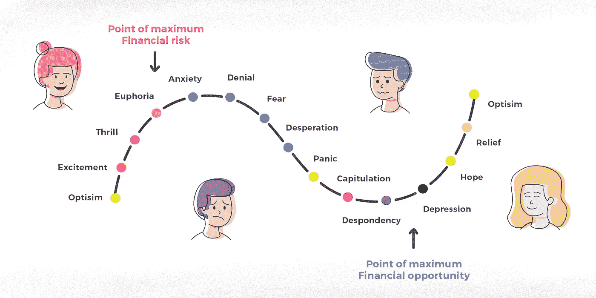

# 轻松战胜恐惧和贪婪

> 原文：<https://medium.datadriveninvestor.com/defeating-fear-and-overcoming-greed-with-ease-a1181411b50d?source=collection_archive---------13----------------------->

Illustration 1: Psychological trading cycle

对大多数人来说过高和高风险的东西通常会上涨，而看起来低和便宜的东西通常会下跌—威廉·奥尼尔。

**网络泡沫**，也被称为互联网泡沫，是 90 年代末美国市场过度投机的一个巨大例子。一段时间的增长和互联网的采用导致了与之相关的股票的强劲上涨，尤其是那些拥有**的股票。com** 作为后缀。尽管这导致了交易者投资组合的增长，但也让他们渴望在任何给定的价格下建立新的头寸。强劲的上涨趋势持续了一段时间，交易者忽略了市场指标，主要关注这个领域，直到泡沫破裂。

 [## 害怕，非常害怕...为什么菲亚特害怕数字货币是正确的|数据驱动的投资者

### 本文的目的是为我们最近(以及即将到来的)欧盟 H2020 拨款中的一个部分提供额外的视角…

www.datadriveninvestor.com](https://www.datadriveninvestor.com/2019/03/04/be-afraid-be-very-afraid-why-fiat-is-right-to-fear-digital-currency/) 

自那次事件以来，还出现了其他一些不太为人所知的泡沫，我们都曾参与其中，无论是摇摆头寸还是盘中交易，结果都是短暂盈利和持续亏损。股票市场是一系列情绪的产物，从开盘到收盘，作为交易者，我们经历了一系列的情绪，这些情绪最终指导我们的决策，而不是逻辑思维。驱动交易决策并统治市场的两种主要情绪是恐惧和贪婪。它不仅对交易者的投资组合有影响，而且对经济也有深远的影响。

在这篇文章中，我们将探讨如何战胜恐惧，克服贪婪，同时也看看能帮助我们客观交易的新时代平台。但首先，让我们通过挖掘我们总有一天会陷入的各种陷阱，来更深入地了解股票市场中的人类心理。

# **从众行为**

通常，当我们打算跟随趋势时，我们最终会跟随股票的大众情绪。当我们看到市场上有很多多头时，我们倾向于买入，当空头领先时，我们倾向于卖出，而我们自己没有做任何研究。从长远来看，这可能会导致不利的交易，导致更积极的交易来弥补损失。业内专家通常称之为羊群行为。为了避免成为这种趋势股的牺牲品，我们应该将我们的交易模式具体化，建立一个长期有效的交易系统。

# 恐惧陷阱

当一只股票持续亏损时，市场集体变得害怕进一步亏损。对股市的恐惧通常是熊市或更糟的衰退的前兆。在低谷期，恐惧开始于否认和后悔，最终变成绝望。在这种情况下，交易者以过度亏损结束了他的投资组合。这被称为恐惧陷阱。避免恐惧陷阱的最好方法是在交易时设置止损，并接受预先确定的、计算好的有限损失。

# 贪婪的影响

我们大多数人都想快速致富。牛市为你铺好了合适的地毯。交易者不太在乎承认发生的损失，但更担心错过的机会(害怕错过)，在牛市中，当前的利润让交易者贪婪，在预期过高利润的情况下，在高位推动更多的购买，导致不利的结果。

应对这个市场的更明智的方法，不是成为混乱的上涨行情的一部分，而是采取新的入场策略，而是在每次交易中获得较低但预先确定的利润，方法是设定目标利润出场，并保持可持续的策略。

# 外卖食品

既然我们已经了解了市场情绪是如何影响我们的逻辑推理的，让我们也来探索一下新时代的交易工具是如何克服上述倾向的。

**1。不断发现和学习:**就像学习驾驶汽车一样，不断的尝试和错误，伴随着不断前进的动力，将使我们掌握这门手艺的诀窍。我们必须花足够的时间阅读和研究，我们也可以考虑订阅，向我们介绍最适合我们的预测试策略。

**2** 。**回溯测试数据:**一旦我们清楚地了解了哪种策略最适合我们的风险偏好并迎合我们的财务目标，我们就必须回溯测试同样的策略，以检查它的有效性和盈利能力。回溯测试的基本概念是，如果股票在过去表现良好，那么它在未来也很可能表现类似。

**3** 。**设置并忘记:**一旦我们完成了分析，我们就应该设置止损位和止损位，并忘记头寸，而不是摆弄多个交易。这不仅提高了交易的质量，也有助于交易者维持交易纪律。

**4。纸贸易来试水。**票据交易不仅没有资金风险和压力，还能培养自律交易的习惯，增强交易者的信心。它为交易者提供了足够的机会来彻底了解交易的技巧。

**5。建立一个系统，并坚持下去。**最后但同样重要的是，我们如何管理您的情绪并坚持我们的交易模式将在很大程度上影响投资组合的盈利能力，我们应该避免选择市场时机，而是等待能够收获我们预期结果的交易。

以上可以在 [**streak.world**](https://streak.world/) 的帮助下轻松完成，而无需使用一行代码，简化快速回溯测试策略，并发现帮助我们轻松学习和探索预测试策略的选项。在下一篇文章中，我们将看到如何调整平台来克服交易障碍。

**访问专家视图—** [**订阅 DDI 英特尔**](https://datadriveninvestor.com/ddi-intel)