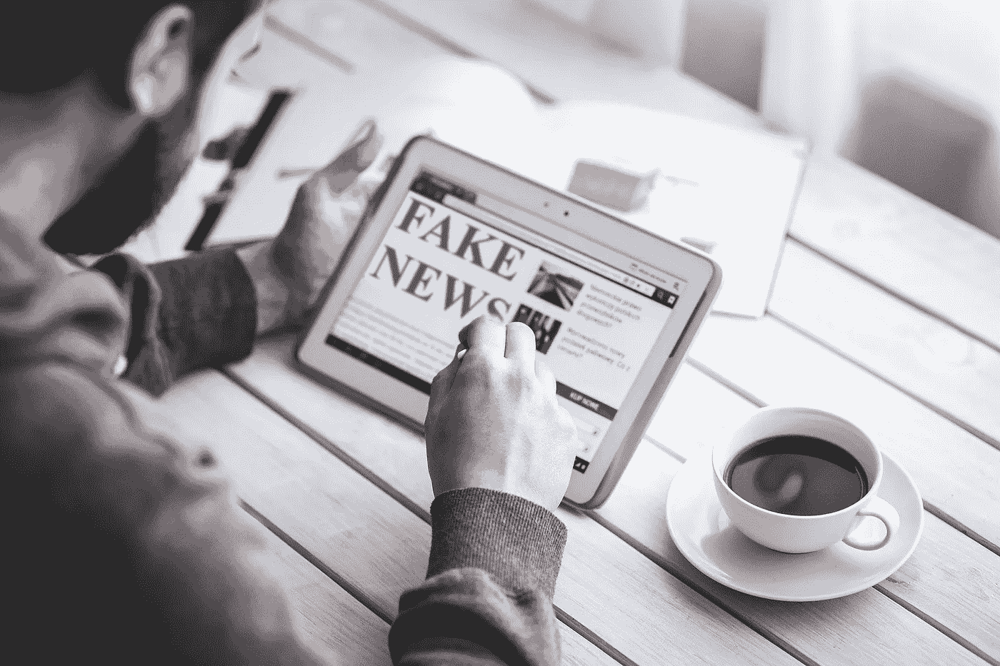

# 通过神经科学保护自己免受误传

> 原文：<https://medium.datadriveninvestor.com/defending-yourself-from-misinformation-via-neuroscience-d2d98a090243?source=collection_archive---------11----------------------->

每当你听到一件事被重复的时候，当你听到它被重复的时候，感觉更真实。换句话说，重复使任何陈述看起来更真实。所以你听到的任何事情，每次再听一遍都会感觉更真实。

你看到我在那里做了什么吗？上面三个句子都传达了同样的信息。然而，每当你读到下一句话时，感觉越来越真实。像我这样的认知神经科学家称之为“[虚幻真理效应](https://www.sciencedirect.com/science/article/abs/pii/S1053810019301977)”

回过头来回忆一下自己读第一句话的经历。这可能让人感到奇怪和不安，也许还带着愤怒的语气，比如“如果事情重复发生，我不会再相信了！”

读第二句话并没有激起如此强烈的反应。相比之下，你对第三句话的反应是温和的。

为什么？因为一种叫做“认知流畅”的现象，意思是我们处理信息有多容易。我们在生活的各个领域容易受到欺骗，包括假新闻和错误信息，这在很大程度上与认知的流畅性有关。

不幸的是，这样的错误信息会影响 T2 的重大选举。幸运的是，我们可以[采取一些措施来](https://www.amazon.com/Pro-Truth-Practical-Putting-Politics/dp/1789043999)处理错误信息，让我们的公共话语和政治体系更加真实。

# 懒惰的大脑

我们的大脑很懒。处理信息的努力越多，我们就越不舒服，越不喜欢和不信任它。

相比之下，我们越喜欢某些数据，对它越满意，我们就越觉得它是准确的。我们直觉上的这种感觉是我们用来判断真假的。

然而，不管你听到多少次，你应该相信你的直觉，跟随你的直觉，这个建议是错误的。在评估你没有[专家级知识](https://ieeexplore.ieee.org/abstract/document/6447634)的信息时，你不应该[相信你的直觉](https://disasteravoidanceexperts.com/nevergut)，至少当你不想搞砸的时候。结构化的信息收集和决策过程[帮助我们避免](https://onlinelibrary.wiley.com/doi/abs/10.1002/bdm.486)跟随直觉时犯下的无数错误。当专家不依赖这样的决策辅助工具时，他们也会犯严重的错误。

这些错误的发生是由于学者们称之为“认知偏差”的心理错误虚幻的真实效应是这些精神盲点之一；总共有[100 多个](https://en.wikipedia.org/wiki/List_of_cognitive_biases)。这些精神盲点影响着我们生活的所有领域，从健康、政治、人际关系，甚至购物、T21。

# 认知流畅性和虚幻真理的危险

在没有外界干预的情况下，我们自己已经犯了很多错误。保护自己免受那些知道如何操纵我们的人的伤害尤其困难。不幸的是，错误信息的传播者擅长利用我们的认知偏见让我们购买假新闻。

考虑一下虚幻的真实效应。我们对它的脆弱性源于我们的大脑如何处理新的刺激。我们第一次听到新的东西时，很难在心理上接受。它必须与我们现有的知识框架整合，我们必须建立新的神经通路来实现这一点。这样做让我们懒惰的大脑感到不舒服，所以我们听到的说法对我们来说似乎难以下咽。

下一次我们听到同样的事情，我们的大脑不需要建立新的路径。它只需要沿着之前建造的路走下去。诚然，这些道路只不过是新铺设的小径，很少有人使用。沿着新建立的神经路径行进很难，但比你的大脑不得不铺设那条路径要容易得多。因此，这种说法更容易让人接受。

每一次重复都扩大和加深了踪迹。每次你听到同样的事情，感觉更真实、更舒服、更直观。

它对看起来不太可能的信息有效吗？[科学说是](https://link.springer.com/article/10.3758/s13423-019-01651-4)！研究人员发现，虚幻的真实效应强烈适用于不可信和可信的陈述。

如果你更了解呢？当然，先验知识阻止了这种虚幻的真理！不幸的是没有:即使你知道得更多，[研究表明](https://psycnet.apa.org/buy/2015-38275-001)你仍然容易受到这种认知偏见的影响，尽管比那些没有先验知识的人要少。

可悲的是，倾向于更精细和复杂思考的人——如果你正在读这篇文章，可能就是你——更有可能[陷入虚幻的真理效应。你猜怎么着:更复杂的思考者比不复杂的思考者更容易陷入被称为偏见盲点的认知偏见，即你忽略自己的认知偏见。因此，如果你认为认知偏差，比如虚幻的真相效应，并不适用于你，你很可能是在欺骗自己。](https://www.sciencedirect.com/science/article/abs/pii/S1053810019301977)

 [## 理性背后的非理性|数据驱动的投资者

### 传统经济理论将理性定义为智人的固有特征。简单来说…

www.datadriveninvestor.com](https://www.datadriveninvestor.com/2020/07/13/the-irrationality-behind-rationality/) 

这就是为什么错误信息的提供者依赖于重复同样的事情。他们知道，尽管检查事实，他们的重复会动摇人们，甚至是那些认为自己无懈可击的人。事实上，相信自己无懈可击会让你更容易陷入这种和其他认知偏见，因为你不会采取必要的措施来解决它们。

# 其他重要的认知偏差

你还需要注意哪些认知偏差？如果你听说过任何认知偏差，你可能听说过“[确认偏差](http://psycnet.apa.org/buy/1998-02489-003)这是指我们倾向于以符合我们先前的信念、直觉、感觉、欲望和偏好的方式寻找和解释信息，而不是事实。

再一次，认知流畅性应该受到指责。对于我们已经拥有的信息，尤其是我们有强烈情感的信息，建立神经通路要容易得多；如果我们需要根据新的信息改变我们的想法，那么打破既定的神经通路要困难得多。因此，我们转而寻找容易接受的信息，那些符合我们先前信念的信息。反过来，我们会忽略甚至主动拒绝不符合我们信念的信息。

此外，我们受教育越多，就越有可能参与这种主动拒绝。毕竟，我们的聪明给了我们更多的方法来反驳那些与我们的信念相悖的新信息。这就是为什么[的研究表明](https://www.pnas.org/content/114/36/9587)你受教育程度越高，你的信仰就越会围绕带有宗教或政治价值色彩的科学问题极化，比如干细胞研究、人类进化和[气候变化](https://www.nytimes.com/interactive/2017/11/14/upshot/climate-change-by-education.html)。你可能在哪里让你的智慧妨碍了事实？

我们的大脑喜欢通过故事来解释世界，这意味着解释性的叙述以清晰简单的方式将原因和结果联系起来。这样的故事对我们的认知流畅是一种安慰，因为我们的大脑不断寻找以一种易于处理的方式解释我们周围世界的模式。这导致了“[叙事谬误](https://www.gpb.eu/wp-content/uploads/2019/06/The-Narrative-Fallacy.pdf)”，即我们不顾事实，听信听起来令人信服的叙事，尤其是如果故事符合我们的倾向和情感。

你有没有想过为什么政客会讲这么多故事？你在电视上看到的广告或网站上的视频广告讲述了非常快速的视觉故事，这种广告怎么样？销售人员或者募捐者怎么样？当然，有时他们会引用统计数据和科学报告，但他们会花更多的时间来讲述故事:简单、清晰、令人信服的叙述，这些叙述似乎很有意义，能拨动我们的心弦。

现在，有一件事是真的:这个世界没有意义。这个世界并不简单、清晰、引人注目。这个世界是复杂的、令人困惑的、矛盾的。当心简单的故事！寻找复杂、混乱和矛盾的科学报告和高质量的统计数据:它们比容易处理的故事更有可能包含真相。

# 修复我们的大脑

不幸的是，知识只能微弱地保护我们免受认知偏见的影响；这很重要，但远远不够，正如我前面提到的关于虚幻真实效应的研究所揭示的那样。

我们能做什么？你可以使用决策辅助策略来解决认知偏差，不仅可以保护自己免受错误信息的侵害，还可以克服破坏我们民主的错误信息浪潮。

最有效的策略之一是养成一种习惯，自动[考虑你听到的任何主张的替代可能性](https://psycnet.apa.org/doiLanding?doi=10.1037/0022-3514.69.6.1069)，尤其是你觉得舒服的主张。由于我们懒惰的大脑的默认设置是避免质疑要求，这需要努力思考，它真的有助于发展一种反对这种默认的精神实践。

特别要怀疑[没有任何额外证据的重复主张，这些主张倾向于你的立场，利用了虚幻的真相效应和确认偏差。确保通过](https://mdsoar.org/handle/11603/12914)[可靠的事实核查机构](https://www.poynter.org/ifcn/)对它们进行事实核查，而不是因为感觉良好和正确而接受它们。

另一个有效的策略是培养一种特别质疑故事的思维习惯。每当你听到一个故事，大脑就会进入倾听和接受模式。请记住，挑选故事来支持叙述者想要推进的任何立场是非常容易的。相反，寻找全面的硬数据、统计证据和同行评议的研究来支持你的观点。

更广泛地说，你可以在[ProTruthPledge.org](https://www.protruthpledge.org/)签署誓约，对支持真理誓约的十二个以真理为导向的行为做出个人承诺。所有这些行为都源于认知神经科学和行为经济学在该领域的研究，称为去偏见，这是指[违反直觉，令人不舒服，但有效的策略，以保护自己免受认知偏见](https://disasteravoidanceexperts.com/12-mental-skills-to-defeat-cognitive-biases/)。同行评议的研究表明，做出支持真实的承诺对于[改变人们的行为](https://link.springer.com/content/pdf/10.5210/bsi.v27i0.9127.pdf)变得更加真实是有效的，无论是在他们自己的陈述中还是在[与他人的互动中](https://jspp.psychopen.eu/article/view/856)。

这些快速的思维习惯将解决我们大脑倾向于接受错误信息的最根本的缺陷。

# 关键外卖

> 你可以通过考虑不同的解释、怀疑重复、做出支持真理的承诺来保护自己免受错误信息的影响……>[点击发推](https://twitter.com/intent/tweet?url=https%3A%2F%2Fdisasteravoidanceexperts.com%2F%3Fp%3D6680&text=You%20can%20protect%20yourself%20from%20misinformation%20by%20considering%20alternative%20interpretations%2C%20being%20suspicious%20of%20repetition%2C%20and%20taking%20the%20Pro-Truth%20Pledge%20&via=Dr_gleb_tsipursky&related=Dr_gleb_tsipursky)

# 需要考虑的问题(请在下面分享您的答案)

*   你认为你最容易受到哪些认知偏见的影响？
*   您打算使用哪种技术来处理错误信息？
*   根据阅读这篇文章，你将采取哪些后续步骤？

*图片来源:*[*Pixabay.com/memyselfaneye*](https://pixabay.com/photos/fake-news-hoax-press-computer-4881486/)

— -

**Bio** :国际公认的思想领袖，被称为灾难规避专家，[Gleb Tsipursky](https://disasteravoidanceexperts.com/glebtsipursky/)博士的使命是通过制定最有效的决策策略来保护领导者免受被称为认知偏差的危险判断错误的影响。作为一名畅销书作家，他最著名的作品是《T4》*《永远不要跟着感觉走:先锋领导者如何做出最佳决策并避免商业灾难* (职业出版社，2019 年)、《我们之间的盲点:如何克服无意识的认知偏见并建立更好的关系 (《新先驱》，2020 年)和《韧性:适应并计划新冠肺炎冠状病毒疫情 (《变革者图书》，2020 年)他发表了 550 多篇文章，接受了 450 多个知名媒体的采访，如[*Inc .*](https://www.inc.com/entrepreneurs-organization/a-behavioral-scientist-explains-why-your-swot-analysis-is-dangerously-flawed.html)[*企业家*](https://www.entrepreneur.com/article/348115)[*CBS 新闻*](https://www.cbsnews.com/video/study-says-taking-a-small-break-from-facebook-might-be-good-for-your-mental-health/)[*时代*](http://time.com/4257876/wounded-warrior-project-scandal/)[*商业内幕*](https://www.businessinsider.com/disaster-expert-companies-should-face-coronavirus-with-pessimism-2020-3)[*政府官员*](http://www.govexec.com/excellence/promising-practices/2017/03/heres-why-your-gut-instinct-wrong-work-and-how-know-when-it-isnt/136104/)[他的专业知识来自于作为](https://disasteravoidanceexperts.com/NeverGut/)[避灾专家](http://disasteravoidanceexperts.com/)的 CEO，20 多年的[咨询](https://disasteravoidanceexperts.com/consulting/)、[辅导](https://disasteravoidanceexperts.com/coaching/)、[演讲和培训](https://disasteravoidanceexperts.com/speaking/)。这也源于[作为一名行为经济学家和认知神经科学家在学术界超过 15 年的](http://disasteravoidanceexperts.com/research)。通过 Gleb[at]DisasterAvoidanceExperts[dot]com、Twitter[@ Gleb _ tsipursky](https://twitter.com/Gleb_Tsipursky)、insta gram[@ dr _ Gleb _ tsipursky](https://www.instagram.com/dr_gleb_tsipursky/)、 [LinkedIn](https://www.linkedin.com/in/dr-gleb-tsipursky/) 联系他，注册他的免费[明智决策者课程](https://disasteravoidanceexperts.com/newsletter/)。

*原载于* [*避灾专家*](https://disasteravoidanceexperts.com/defending-yourself-from-misinformation-via-neuroscience/)

**访问专家视图—** [**订阅 DDI 英特尔**](https://datadriveninvestor.com/ddi-intel)