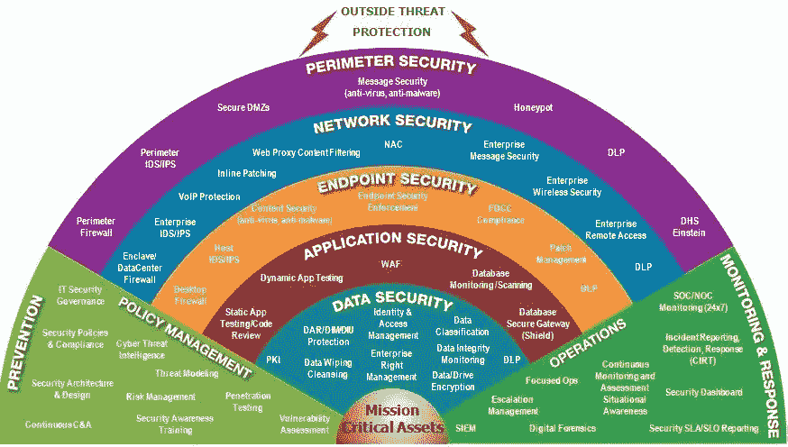
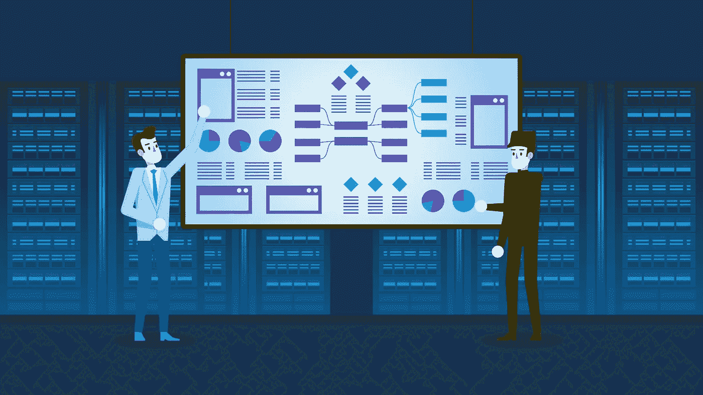
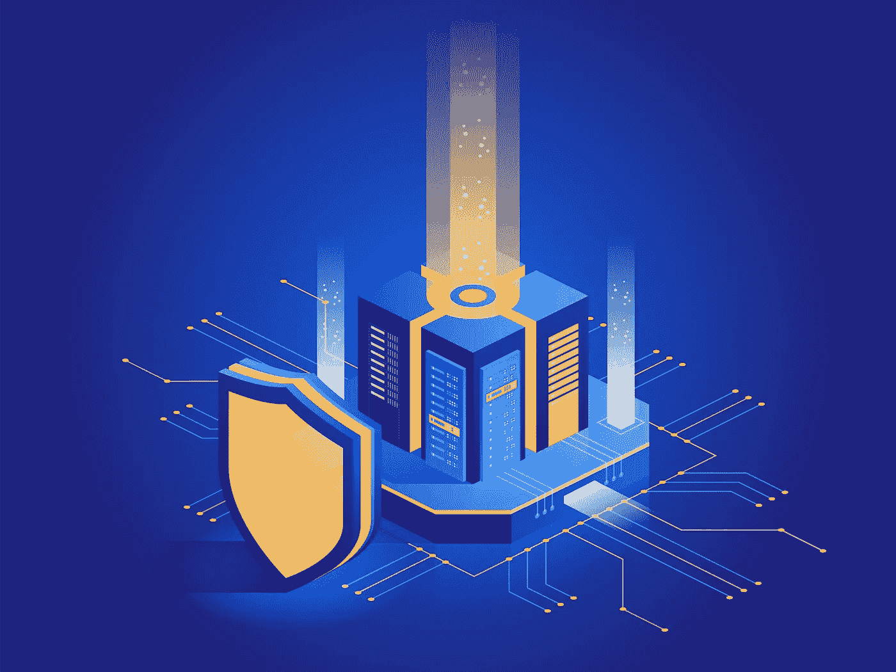

# 纵深防御

> 原文：<https://medium.datadriveninvestor.com/defense-in-depth-d6c070eac12d?source=collection_archive---------2----------------------->

## 这个想法是，窃取数字资产并造成破坏的安全层越多，突破这些防御就越难。深度防御的基本概念仍然可行，但需要适应不断发展的计算机技术和威胁。

深度防御是一种网络安全策略，它使用许多分层的冗余防御来保护自己免受各种威胁，如网络攻击、网络间谍和勒索软件攻击。当一个安全检查失败时，下一个安全层在另一个潜在的网络攻击之前阻止了潜在的网络攻击。

术语“纵深防御”用于描述包括技术使用的多层安全架构。其理念是将技术组件与良好的安全管理实践相结合，以创建保护层来降低攻击和入侵的风险。

Source: Michael Fisher

最初，纵深防御是一种军事战略，旨在敌人反击之前减缓其前进速度。反击网络安全是最近的发展，因为信息安全系统在很大程度上是被动的。为了挫败入侵者，建立了安全屏障，但是当入侵者突破屏障时，在损害发生之前有更多不同的屏障要绕过。

这个想法是，窃取数字资产并造成破坏的安全层越多，突破这些防御就越难。纵深防御的基本概念仍然可行，但需要适应不断发展的计算机技术和威胁。跟上当前趋势和不断变化的漏洞是一项具有挑战性的任务。这必须是信息安全团队的主要目标。

不断寻找对策来提高防御能力的公司意识到，攻击涉及多种利用。它们使用多种安全措施，这些措施增加了复杂性，并导致可被攻击者利用的漏洞。这种多层方法降低了特定漏洞或利用成功的可能性，从整体上提高了系统的安全性，并显著降低了网络安全风险。

防御的概念更进了一步，认识到最终保护所需的宏观控制，包括网络的物理、技术和管理方面。

 [## 认知网络安全|数据驱动的投资者

### 随着网络攻击的规模和复杂性增加，人工智能(AI)有助于资源密集型安全…

www.datadriveninvestor.com](https://www.datadriveninvestor.com/2020/06/30/cognitive-cyber-security/) 

例如，包括防病毒软件和防火墙在内的终端保护仍然是完整安全的关键要素，但深度防御是指在威胁到达终端之前，使用高级安全工具的组合来保护关键数据。在纵深防御中，您应该将这些措施中的每一个都视为一个独立的步骤，单独执行，技术和非技术安全措施相互重叠，当在战略上一起使用时，会产生比单个组件更大的影响。近年来，防御策略经历了重大的实施，因为网络安全方法本身不再足够。

在纵深防御中，几个安全级别超越了人员、程序和物理安全，并适用于整个信息技术(IT)基础设施。额外的终端和应用安全级别可阻止破坏网络安全框架的威胁。

此外,“纵深防御”策略为入侵检测技术的实施提供了天然的空间。它通常被称为“城堡防御”，因为它类似于城堡中使用的安全防御技术，在攻击城堡之前，敌人必须首先克服城堡外围的几个障碍。

经验丰富的攻击者可以通过一切必要的手段成功突破安全措施。纵深防御也是一种安全风险管理方法，它定义了当一个级别无法捕获安全攻击时，下一个级别如何捕获它们。多个级别提高了环境的整体安全性，并显著降低了安全违规的可能性。

这种思维模式用于覆盖广泛的领域，其中一些在需要时是故意多余的。这种逐层深入的防御不仅确保了信息的完整性，还确保了信息本身的机密性，从而成倍地提高了防御的安全性。

相反的深度防御原则被称为安全性的简单性，它基于这样一个原则，即太多的安全措施会导致问题和漏洞，从而被攻击者利用。

简而言之，深度防御是一种使用多种安全措施(硬件、软件和网络级保护，包括专有技术控制)来保护信息完整性的策略。如果防御线被破坏，还有一层额外的防御来确保威胁不会从裂缝中溜走。它创建了一个被称为薄弱、易受攻击和易受攻击的区域，并使用对策来保护重要资产。深度防御或分层安全在当今世界也很重要，数据中心和定义它们的软件是当时的通用语言。

## **引用来源**

*   [https://www . fair warning . com/blog/the-6-elements-every-financial-institution-needs-for-defense-deep-security/](https://www.fairwarning.com/blog/the-6-elements-every-financial-institution-needs-for-defense-in-depth-security/)
*   [https://www . csoonline . com/article/3268066/how-important-deep-defense-be-as-the-line-between-security-layers-blur . html](https://www.csoonline.com/article/3268066/how-important-defense-in-depth-will-be-as-the-lines-between-security-layers-blur.html)
*   [https://www . computer world . com/article/2579776/what-it-take-to-develop-defense-in-deep . html](https://www.computerworld.com/article/2579776/what-it-takes-to-develop-defense-in-depth.html)
*   [https://smb.avast.com/answers/defense-in-depth](https://smb.avast.com/answers/defense-in-depth)
*   [https://rasoolirfan . com/2018/02/05/cyber-security-defense-in-depth-strategies/](https://rasoolirfan.com/2018/02/05/cyber-security-defense-in-depth-strategies/)
*   [https://www . imper va . com/learn/application-security/defense-in-deep/](https://www.imperva.com/learn/application-security/defense-in-depth/)
*   [https://www.upguard.com/blog/defense-in-depth](https://www.upguard.com/blog/defense-in-depth)
*   [https://vaibhavgujral . com/2020/02/28/azure-defense-in-depth-security/](https://vaibhavgujral.com/2020/02/28/azure-defense-in-depth-security/)

## 访问专家视图— [订阅 DDI 英特尔](https://datadriveninvestor.com/ddi-intel)