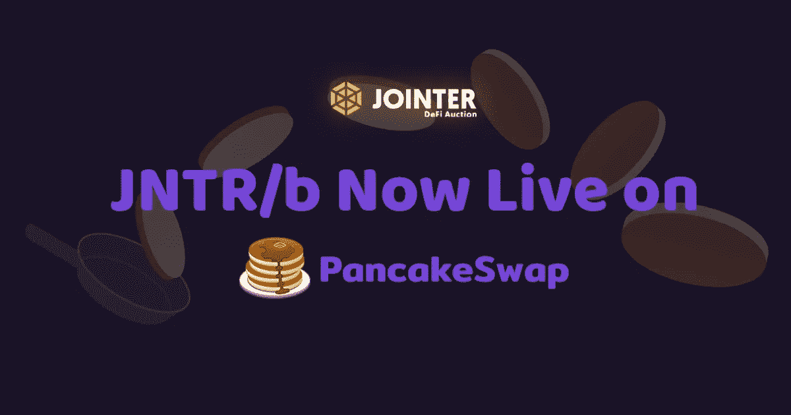
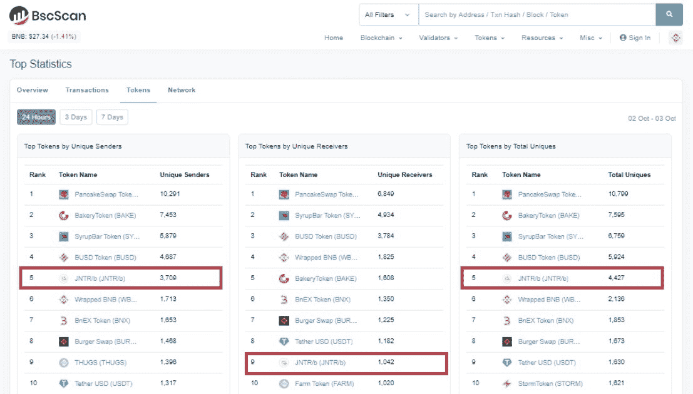
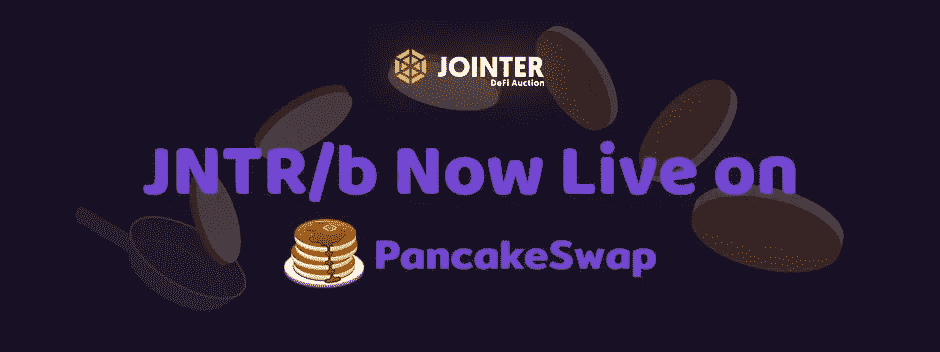
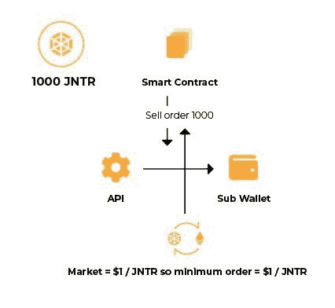

# DeFi 警报:Jointer 的 JNTR/b 火箭 160 倍于 PancakeSwap

> 原文：<https://medium.datadriveninvestor.com/defi-alert-jointers-jntr-b-rockets-160x-on-pancakeswap-b69d8303cf0b?source=collection_archive---------7----------------------->

## 世界上第一个商业地产 DeFi token 也在币安智能链的每日交易量中排名前 5

[https://exchange.pancakeswap.finance/#/swap](https://exchange.pancakeswap.finance/#/swap)

JNTR/b 的推出使得 PancakeSwap 上的独特令牌持有者在不到 24 小时的交易中增加到超过 4，427 人。JNTR/b 的池价格从 0.001 美元 USDT 开始，并看到了 0.16 美元以上的高点，实现了 160，000%的收益。

[Jointer](https://jointer.io/) 利用区块链创建了一个基金的基金联合经济，同时提供不相关的回报、多样化和无限的流动性。辛迪加经济由世界上第一个正在申请专利的多层储备系统驱动，该系统有助于每天增加公司的估值，同时防止价值下降，无论市场波动或任何操纵。这种联合经济系统可以应用于许多行业，包括保险、风险投资等等。Jointer 的第一个用例将是商业房地产。

除了 Draper Venture Network inclusion 之外，Jointer 久负盛名的咨询小组还包括诺贝尔奖获得者、美国证券交易委员会前主席、纳斯达克前副主席、Visa 创始人、美国国务院前首席经济学家、CIS 创始人、雅虎首席财务官、比特币原型的联合创始人以及其他杰出人士。

# JNTR/b 是什么？

JNTR/b 是一个完全分散的桥接令牌，旨在提供流动性并增加对 Jointer syndication 生态系统的访问。由于 JNTR/b 是分散的，它有能力在分散的交易所上市，并参与分散的融资池和互换，如 BurgerSwap、PancakeSwap 和 BakerySwap。

[JNTR/b](https://bscscan.com/token/0x78e1936f065fd4082387622878c7d11c9f05ecf4) 不要求持有人像 JNTR 一样被列入白名单。

JNTR/b 0x78e1936f065fd4082387622878c7d11c9f05ecf4

## JNTR 是什么？

JNTR 是币安智能链之上的金融工程分散协议层，作为独家支付方法开发，以促进 Jointer 股票(JNTR/STOCK)和债券(JNTR/ETN)的交易，并为 JNTR/b 和 JNTR/e 桥提供流动性。

每次投资者通过每日拍卖或 SmartSwap 直接购买 JNTR 时，JNTR 的面值都会根据流动性储备的计算结果发生变化。面值具有指数回报潜力和低风险，为房地产和密码市场的波动提供了不相关的对冲。

虽然投资者可以随时将 JNTR/b 换成 JNTR，但他们必须被列入白名单才能持有 JNTR。要进入白名单，投资者必须通过 KYC /反洗钱以及潜在的资格认证。

 [## DeFi 正在蓬勃发展，但对这位黑仔 DApp |数据驱动的投资者有一些警告

### 加密货币可能在 DeFi(去中心化金融)找到了一个杀手 DApp。它开辟了加密货币的空间…

www.datadriveninvestor.com](https://www.datadriveninvestor.com/2020/09/22/defi-is-booming-but-there-are-caveats-to-this-killer-dapp/) 

# JNTR/b 与其他池配对有何不同？

结合 JNTR 的 JNTR/b 的创建是去中心化金融的游戏改变者。该解决方案被 Techkrest 称为[解决池风险](https://techkrest.com/2020/09/30/first-commercial-real-estate-defi-jointer-solves-pool-risk/) s。

*   有限的初始供应
*   所有团队和早期投资者都被限制进入资金池
*   套利机会
*   刻录中继令牌

# 有限的初始供应

JNTR/b 开始供应 1，000，000 个令牌，并空投到币安智能连锁社区。空投不会给 Jointer 团队的任何成员或任何早期投资者。

正在进行中，只有通过 [SmartSwap](https://smartswap.jointer.io/) 与 JNTR/b 交换 JNTR/b 时，才能生成 JNTR/b。JNTR 由 SmartSwap 锁定，JNTR/b 直接向投资者发行。

一旦 JNTR/b 通过 [SmartSwap](https://smartswap.jointer.io/) 换回 JNTR 或 JNTR 桥令牌，它就会被烧毁。

# 所有团队和早期投资者都被限制进入资金池

团队成员和早期投资者尚未收到任何 JNTR/b 铸造的代币。此外，通过智能协定，他们被限制使用他们为 JNTR/b 预先创建的 JNTR。

虽然初始投资者将拥有 JNTR，但所有预先设定的 JNTR 中有 50%被锁定 10 年。此外，向投资者发布的 JNTR 将永远保留在 JNTR 网关之后。这意味着投资者无法进入资金池或以低于面值的价格出售代币。

*预制的 JNTR 网关*

为了满足早期投资者和长期 JNTR 持有者的需求，Jointer 将限制所有预先设定的 JNTR 的 100%。预先设定的 JNTR 不得直接参与二级市场或流动性池。卖单通过网关智能合约发出，该合约利用 API 与二级市场互动。使用算法，网关仅发出与市场需求和流动性储备中 JNTR 面值一致的订单。在拍卖的前 90 天，gateway 不得下达任何卖出订单，以刺激强劲的市场需求。

# 套利机会

SmartSwap 将始终尊重 JNTR 的面值，该面值来自 Jointer 的多层储备。这意味着无论 JNTR/b 和其他桥令牌的波动性和价格如何，SmartSwap 都将尊重金融工程和受保护的 JNTR 价格。

因为 [SmartSwap](https://smartswap.jointer.io/) 尊重来自 Jointer's Reserve 的 JNTR 价格，这意味着投资者可能有 JNTR/b 和 JNTR 之间的套利机会。

此外，与 JNTR/b 在流动性池中的交易价格相比，JNTR 通过拍卖提供的每日折扣为 50%以上，这可能会产生套利机会。投资者可以以 50%的折扣购买 JNTR，然后以 JNTR 面值交换 JNTR/b，在流动性池中出售，创造了另一个套利机会。

# 刻录中继令牌

Jointer 将烧掉分散池中的所有中继令牌，而不是从中继令牌中获利。这就保护了用户在交易后不会被公司变成鲸鱼。

燃证在此:[https://bscscan . com/tx/0x bdef 2 a 1341543 e 39 c 88 EC 1d 923 Fe 1a 1 a 5842 a 55058504 Fe 684524439d 65 ff 5 e 1](https://bscscan.com/tx/0xbdef2a1341543e39c88ec1d923fe1a1a5842a55058504fe684524439d65ff5e1)

# 如何购买 JNTR/b？

投资者可以通过 PancakeSwap、SmartSwap 等互换池或使用 JNTR 获得 JNTR/b。

1-[煎饼掉期](https://exchange.pancakeswap.finance/#/)合同地址:0x78e 1936 f 065 FD 4082387622878 c 7d 11 c 9 f 05 ECF 4

[2-智能交换](https://smartswap.jointer.io/)

3-使用 [JNTR](http://jointer.io/)

# 如何购买 JNTR？

投资者可以通过三种方式购买 JNTR 资产:

1.  通过每日 [Jointer DeFi 拍卖](https://jointer.io/)以潜在的 50%折扣；
2.  通过二级市场交易；或者
3.  通过 [SmartSwap](https://smartswap.jointer.io/) 实现零费用或差价

## 访问专家视图— [订阅 DDI 英特尔](https://datadriveninvestor.com/ddi-intel)