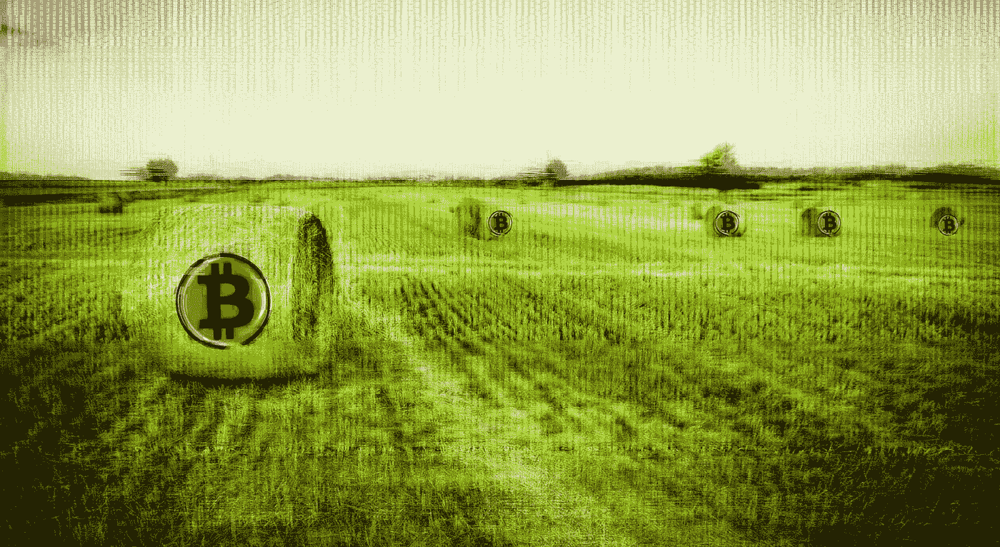

# DeFi 基于最好的东西——比特币建立了激励模型

> 原文：<https://medium.datadriveninvestor.com/defi-has-modelled-incentivization-based-on-the-best-bitcoin-d0842497bade?source=collection_archive---------17----------------------->

*DeFi 继续通过激励性参与获得散户和机构投资者的关注，这是比特币持续成功的关键之一。*

*照片由*[彼得·克莱纳](https://unsplash.com/@nepumuk?utm_source=unsplash&utm_medium=referral&utm_content=creditCopyText) *上* [*下*](https://unsplash.com/s/photos/yield-farming?utm_source=unsplash&utm_medium=referral&utm_content=creditCopyText)

与 2020 年的大多数人不同，去中心化金融(DeFi)今年表现非常好，成为区块链领域最引人注目的创新之一，价值超过 122.7 亿美元[锁定在该领域](https://defipulse.com/)(基于 DeFiPulse 跟踪的 44 家提供商)。

DeFi 的成功有几个因素，但就像一首令人怀疑地想起披头士的热门歌曲一样，狂热似乎是基于一个熟悉的激励主题——就像比特币一样，但这一次是农业，而不是采矿。

[收益农业](https://cointelegraph.com/explained/defi-yield-farming-explained)通过向 DeFi 协议提供稳定的流动性，让投资者获得回报，从而吸引了加密投资者的注意力。在功能上，产量农业类似于为比特币采矿设计的创新(也是著名的成功)公式，为积极支持生态系统的活跃成员提供长期激励和回报。在 DeFi yield farming 的案例中，用户也因积极参与而获得类似的奖励，通过购买和持有平台原生代币获得收益。

尽管 DeFi 对中央金融构成了威胁，但随着世界各地更多的交易所将 DeFi 代币加入其可交易资产篮子，对 DeFi 代币的需求也在增长。

NDAX.io 是最新一个加入 DeFi 的交易所，宣布支持 Chainlink(链接)给[加拿大加密投资](https://ndax.io/blog/article/canadian-crypto-exchange-brings-stablecoins-defi-canada)受众。NDAX.io 总裁、首席执行官兼创始人 Bilal Hammoud 表示，“2020 年已经成为机构采用比特币、Stablecoins 和去中心化金融的一年……这为零售和机构投资者提供了接触新加密产品的机会，同时保持了使用加拿大监管平台的安全性。”(披露:我过去曾与 NDAX 签约。)

长鹏“CZ”首席执行官赵[承认，当他的公司推出他们自己的 DeFi 计划——币安智能链，同时保持他们作为世界上交易量最大的交易所的地位时，存在矛盾](https://www.coindesk.com/binance-ceo-defi-cannibalize-crypto-exchange)和蚕食自己业务的可能性。赵说:“我总是更担心是否有用户使用我们的产品。商业模式总是有多种选择，所以关键是要打造有用的东西。”

一些加密投资者仍然认为 DeFi 是一个未经测试的高风险概念， [DeFi Pulse 最近宣布了一个风险分级系统](https://decrypt.co/45027/defi-pulse-now-grades-decentralized-finance-risks)，称为 DeFi Pulse 经济安全等级，用于衡量协议破产的风险。

DeFi 花了三年时间来建立势头，但在超过 100 亿美元的投资下，许多新协议正在试图抓住加密投资者的想象力。当然，随着时间的推移，绝大多数努力都会失败或巩固，但基于参与的收益承诺继续推动用户的热情参与。

***贾斯汀·罗伯蒂*** *拥有媒体和美术背景，20 多年来一直为财富 500 强和媒体、游戏、消费科技、移动科技、金融科技和区块链的初创公司撰写和做公关/营销。他写关于技术、媒体和网络文化的文章。他是区块链广告公司* [*的公关总监。*](https://zage.io/?ref=hackernoon.com)