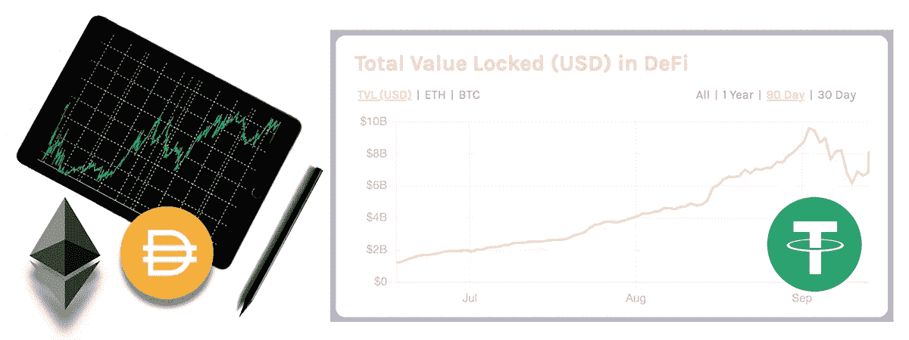
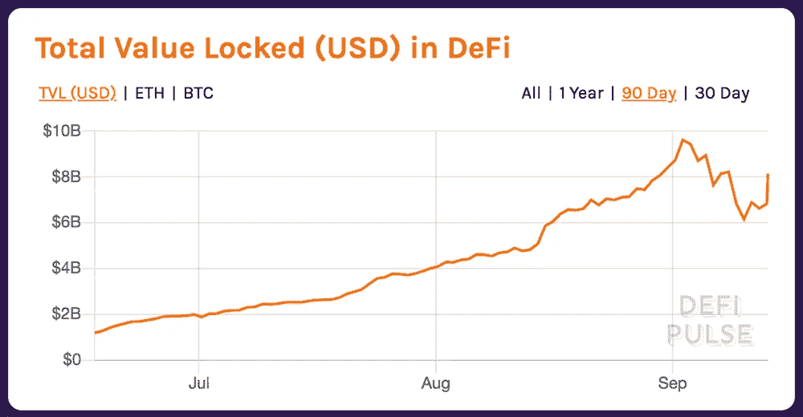
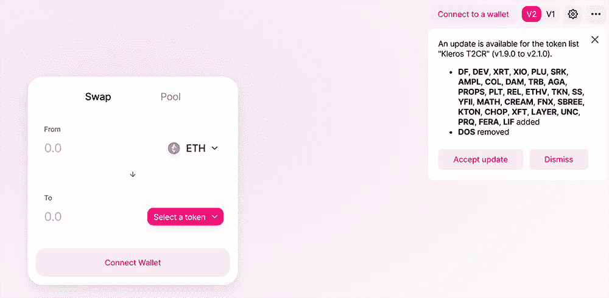
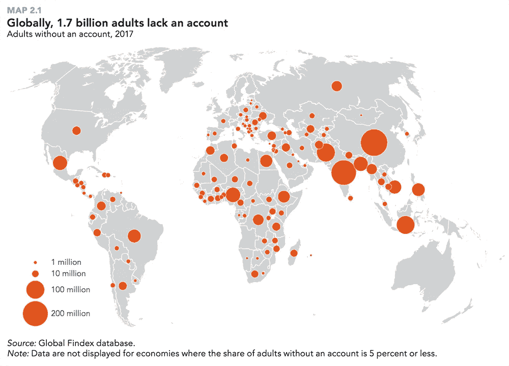

# DeFi 正在蓬勃发展，但对这位黑仔 DApp |数据驱动的投资者有一些警告

> 原文：<https://medium.datadriveninvestor.com/defi-is-booming-but-there-are-caveats-to-this-killer-dapp-data-driven-investor-991c72cff0f?source=collection_archive---------22----------------------->



The DeFi Boom Is Bringing Purpose To The Ethereum Blockchain

[加密货币](https://www.datadriveninvestor.com/glossary/cryptocurrency/)可能找到了杀手锏 [DApp](https://www.datadriveninvestor.com/glossary/decentralized-application/) ，在 **DeFi(去中心化金融)**。开启了 2020 年 9 月初总估值锁定在 8.11 亿美元的[加密货币](https://www.datadriveninvestor.com/glossary/cryptocurrency/)空间，最高 9.605 亿美元(来源: [**DeFi Pulse**](https://defipulse.com/) )。DeFi 为贷款、融资和交易提供了一种替代性融资工具，不需要传统金融中常见的文件和票据。银行会要求新开户者提供他们的[](https://www.datadriveninvestor.com/glossary/know-your-customer/)****(**[**了解你的客户**](https://www.datadriveninvestor.com/glossary/know-your-customer/) **)** 的信息，以及关于就业、薪水和资产的个人资料。DeFi 没有这样的要求。它是一个用于分散融资的开放协议，这是使用它的主要好处。**

**受欢迎的 DeFi DApps 包括 Uniswap、向往。金融，Bancor，Maker，Aave 和曲线金融。与早期的分散式应用相比，DApps 现在更加用户友好。它可以通过一个连接了数字[钱包](https://www.datadriveninvestor.com/glossary/wallet/)的网络浏览器进行访问。用户不需要注册账户或注册个人信息。用户还可以通过使用 [**公钥密码**](https://en.wikipedia.org/wiki/Public-key_cryptography) 的数字钱包完全控制他们的资金。**

****

***90 day DeFi locked value in smart contracts (Source DeFi Pulse)***

# **DeFi 的美丽**

**当你不需要任何文件就能获得贷款时，为什么贷款人会信任你？在 DeFi 中，它是关于抵押的数字资产。平台(如制造商、卡瓦等。)，理论上是去中心化的，需要你的数字资产押金作为抵押。这种加密货币可以像[](https://www.datadriveninvestor.com/glossary/ether/)****(**[**乙醚**](https://www.datadriveninvestor.com/glossary/ether/)**)**[**wBTC**](https://coinlist.co/help/what-is-wrapped-bitcoin-wbtc#:~:text=Wrapped%20Bitcoin%20(WBTC)%20is%20an,seamlessly%20via%20their%20CoinList%20wallet.)**(裹着** [**比特币**](https://www.datadriveninvestor.com/glossary/bitcoin/)**)**用令牌[](https://www.datadriveninvestor.com/glossary/token/)*****配对*它被存入一个**智能合同** t，并在 [**以太坊**](https://www.datadriveninvestor.com/glossary/ethereum/) [区块链](https://www.datadriveninvestor.com/glossary/blockchain/)网络上执行(大多数情况下)。用户支付 [***气***](https://www.datadriveninvestor.com/glossary/gas/) ***费***[***交易费***](https://www.datadriveninvestor.com/glossary/transaction-fee/) ，并通过协议方式将自己的抵押物存放在[交易所](https://www.datadriveninvestor.com/glossary/exchange/)换取代币。这个令牌通常是以一个稳定币的形式出现的，无论用户想要做什么，都可以立即使用。********

**去中心化的平台不受任何人控制。它应该是交流的促进者，即 **DEX(分散的** [**交流**](https://www.datadriveninvestor.com/glossary/exchange/) **)** 。有不同的类型，包括 **AMM(自动做市商)**锁定**流动性池**中的流动性代币，为各种市场提供最佳收益率，称为**流动性提供者**。这些平台就像银行，但是没有集中的治理和权力。它们是*无信任*和*无许可*，因此任何用户都可以参与，只要他们有一个允许在区块链上访问他们令牌的数字钱包。**

****

***The UI to Uniswap’s decentralized exchange.***

**用户甚至不需要通过背景调查或执行申请贷款的所有常规步骤。只要你有数字资产可以抵押，你就把它提供给平台，你就可以根据超额抵押率(x/y)获得金额。如果你认为你是在用你的资产换取低于其价值的东西，这听起来可能不对。您根本不会丢失您的数字资产。相反，你可以根据你对数字资产的借贷比率(因平台而异)借钱。你从平台上得到你的资金和代币。**

```
**For example, let us say that on the DeFi platform you want to collateralize your digital asset token BCT.****The rate or ratio is 75%.****For every $1.00 of BCT you have, you can borrow $0.75 from it.****If your total BCT is valued at $1,000 the amount you can borrow is:****A (Amount)
r (Rate)
P (Collateral Value)****A = rP = 0.75(1000) = 750****To get your collateral back, you have to pay the borrowed amount A plus a fee to the platform (e.g. burning fee)****If the fee (f) is 450 then the total amount (T) a user has to pay back to reclaim their digital assets is:****T = f + A = 450 + 750 = 1200**
```

**你可以自由地用你从抵押品中获得的资金做任何你想做的事情。要收回您的数字资产，您必须偿还所借的金额和费用。这也烧掉了一个平台令牌，增加了令牌持有者的价值。然后，该担保品被返还给用户。这种融资方式允许用户在借用数字资产的同时保留他们的数字资产。如果用户没有能力偿还借款，平台将清算存放的抵押品。**

# **德班克**

**DeFi 平台可以被认为是一种去中心化银行的形式。它们就像任何银行一样，无论是实体银行还是数字银行。主要区别在于，这些平台不需要任何注册或个人信息。你只需要一个数字钱包。好的一面是，它为没有银行账户的 T2 人提供了金融服务，据世界银行估计，这一群体有 17 亿成年人。碰巧的是，[没有银行账户的人确实可以上网，大部分是通过他们的智能手机。*互联网是您访问 DeFi 服务*即 DeBanks 所需的一切。](https://www.datadriveninvestor.com/glossary/unbanked/)**

****

***The total number of unbanked adults around the world (Source World Bank/Global Findex)***

**对于那些没有适当文件的人来说，获得金融服务的困难是显而易见的。许多人没有像驾照、护照和全职工作这样的要求。典型的银行需要客户的个人信息以及这些文档。就提供服务而言，这造成了更多的金融排斥，而不是包容。这些人中有许多人无法申请银行账户，因为他们不符合这一模式。最低存款额需要和收入证明一起提交，比如账单和工资单。不幸是，缺乏这些文件可能成为获得银行账户和利用金融服务的障碍。**

**与一些银行相比，加密抵押贷款实际上可能更便宜。由于 DeFi 刚刚起步，没有长期的跟踪记录证明从平台贷款比去当地银行或合作社好得多。对于非抵押贷款，用户将不得不通过有利率的分期付款来偿还金额。分期付款时，随着时间的推移，费用会高得多。**

# **理论与现实不同**

**专家为 DeFi 描绘了一幅美丽的图画。然而，它无论如何都不是完美的，仍然有需要改进的地方。去中心化、开放获取和无障碍进入都是积极的。DeFi 提供的是一个自动化的金融系统，它剥夺了银行和其他金融机构提供资金的特权。虽然这在理论上行得通，但必须进行现实检验。那些承认仍然存在问题的人是正确的，不应该因为他们的观点而被驳回。**

*   ****智能合约漏洞** — [安全是 DeFi 最严重的问题之一](https://cointelegraph.com/news/figuring-out-whos-to-blame-for-defis-persistent-security-issues)。早在以太坊的早期，一个聪明的合同黑客导致了第一个[道](https://www.datadriveninvestor.com/glossary/decentralized-autonomous-organization/)的陨落。那个事件导致了[硬叉](https://www.datadriveninvestor.com/glossary/hard-fork/)创造了以太坊和以太坊经典。某些 DeFi 项目已经曝光，像 [**山药**](https://cointelegraph.com/news/how-one-line-of-code-destroyed-yam-defi) 。开发人员忽略了代码中的错误，这会带来灾难性的后果。DeFi 开发人员必须考虑的是智能合同审计和严肃的网络安全测试，以使用户对他们的平台更有信心。**
*   ****滑脱** — [稳币滑脱](https://www.coindesk.com/makerdao-defi-dai-broken-peg)是一个随着刀和他们的戴代币而变得明显的问题。当 peg 改变数字资产的价值时，会发生滑移，从而影响稳定点数的价值。这会导致 [**非永久性损失**](https://finematics.com/impermanent-loss-explained/) 给用户，影响流动性提供者的收益。像 [**曲线金融**](https://compound.curve.fi/) 这样的项目试图[解决](https://www.datadriveninvestor.com/glossary/address/)这种低风险稳定的货币交易问题。**
*   ****治理**——尽管加密领域的用户讨厌 ***集中化*** 这个词，但如果你进一步观察一些项目，就会发现它并不像我们想象的那样分散。当数字资产与法定货币挂钩时，它并不完全由市场决定，而是由中央银行决定。一些 DeFi 项目也可能对持有更多令牌的人产生更大的影响，从而允许某些用户在数字治理方面比其他人有更多的发言权。虽然治理是必要的，但它必须与社区达成一致，而不仅仅是有利于少数令牌持有者。否则，这将更像是一个数字寡头垄断。这一体系的问题将会像传统金融领域一样，充斥着滥用和操纵。顶层的人会享受好处，而底层的人会受苦。**
*   ****泡沫** —分析师的仔细观察表明 [DeFi 是一个大泡沫](https://cointelegraph.com/news/defi-bubble-still-growing-fast-data-from-twitter-analyst-shows)。当它爆发时，如果动机只是短期的而不是长期的，许多人将会得到 ***的回报。如果事情没有崩溃，DeFi 找到更多的采用来维持流动性，那么它可以证明批评者是错误的。问题在于加密货币市场的不可预测性。新闻和谣言可以迅速改变事情。一些业内人士，如 Messari 首席执行官 Ryan Selkis 认为，当泡沫破裂时，加密交易员将会被击垮。这就好比玩**[**更大的忽悠理论**](https://www.investopedia.com/terms/g/greaterfooltheory.asp)**。DeFi 空间将有利于那些来得早的人，因为他们可以倾倒在那些来得晚的人身上。DeFi 似乎只是一个等待更多用户的地方，直到那些早来的人可以倾倒和收集他们的收入。这就是为什么用户必须深入查看他们将资产放入的 DeFi 流动性池，并确保他们有一个缓解计划，以防情况变得糟糕。*********
*   ****高风险——当你把钱投入高风险投资时，你或许应该买保险。DeFi 在很大程度上就像在满是鲨鱼的海里游泳，希望能活下来。存放数字资产时没有保险单。如果你的资产随着时间的推移而贬值，这就是一个问题，智能合约可以清算你的资产。将资金投入 DeFi 的最高风险之一是开发商的[退出计划](https://news.bitcoin.com/sushiswap-founder-reportedly-exit-scams-as-sushi-token-price-tanks/)，就像 SushiSwap 所发生的那样。另一类风险是 [**黑天鹅事件**](https://www.investopedia.com/terms/b/blackswan.asp) ，这是不可预测的市场扰乱者，具有严重的影响。这些事件会严重冲击代币的价格。用户必须考虑这些风险，并寻找一个可以减轻这些风险的平台。****
*   ******合规** —当你是一个赚钱的平台，却不与任何政府和司法机构分享(例如税收)，这肯定会导致监管机构的审查。DeFi 不符合 KYC、 [AML](https://www.datadriveninvestor.com/glossary/anti-money-laundering/) 和 ATF(反恐资金)等金融法规，因为它不要求用户注册或提供任何个人信息。如果平台没有真正去中心化，这本身就会成为一个问题。这就是比特币基地和币安等数字交易所不能被视为真正的 DeFi 平台的原因，因为它们出于合规目的收集用户信息。进入 crypto 的大部分用户通常是从类似数字交易所(如比特币基地)的入口进入的，这些交易所受到监管，需要用户帐户注册和 KYC 数据。如果 DeFi 平台因为违规而被关闭，那将是灾难性的。只要它们是分散的，它们就可以规避监管，因为没有实体可以声称拥有平台的所有权。****

# ****摘要****

****对 DApp 开发商来说，DeFi 既是一个创新的想法，也是一个不受监管的高风险融资项目。有人说这是 2017 年 ICO 的一样的[新加密炒作。许多就像科学实验一样，被测试是否有效。必须有一个平衡来解决常见的问题，如滑动和非永久性损失。对附属类型的更多支持和针对数字治理的社区驱动的](https://www.coindesk.com/defi-ico-boom-regulators-circling)[共识机制](https://www.datadriveninvestor.com/glossary/consensus-mechanism/)可以帮助管理协议，作为改进流程的一部分。平台代码中对更多自动化分散协议的需求有助于提高 DeFi 领域的效率。****

****DeFi 对以太坊有利，因为流动性池中用于配对的代币是与 ETH 的 [ERC20](https://www.datadriveninvestor.com/glossary/erc20/) 代币。2020 年 7 月至 9 月期间，ETH 的价格随着 DeFi 项目市值的增加而上涨(来源 [**Coinmarketcap**](https://coinmarketcap.com/currencies/ethereum/) )。ETH 在 7 月 23 日以 262.39 美元的开盘价(30，733，019，165 美元市值)开始飙升，直到 9 月 3 日达到 440.24 美元的峰值(43，370，721，326 美元市值)，然后下跌。DeFi 很可能是区块链以太坊需要为 ETH 和 ERC20 令牌带来更多用例的杀手 DApp。****

****为了维持这些流动性生态系统，必须有稳定的代币和资产流动。向 DeFi 领域注入更多流动性的一种建议方式是通过[**【CeFi】**/**DeFi 合作**](https://cryptonews.com/news/get-ready-for-cedefi-while-crypto-ceo-warns-of-a-defi-bubble-7683.htm)**【cede fi】**。像币安这样资助或支持 DeFi 项目的集中交易所已经在这样做了。CeFi 还可以作为 DeFi 服务的桥梁，帮助满足法规要求。这可以带来更多创新的种子基金 DeFi 服务，但如果这些新的金融工具得不到任何支持，它也可能是一个即将破裂的泡沫。CeDeFi 只是改善 DeFi 领域的一种方式，并不是问题的绝对解决方案。对于普通用户来说，现在是在 DeFi 领域变得更加理性的时候了，不要陷入可能导致巨额损失的“快速致富流动性陷阱”。****

*******注意:这不是理财建议。在做出投资决定之前，请做好自己的调查，核实事实。*******

********

*****原载于 2020 年 9 月 22 日 https://www.datadriveninvestor.com*[](https://www.datadriveninvestor.com/2020/09/22/defi-is-booming-but-there-are-caveats-to-this-killer-dapp/)**。******