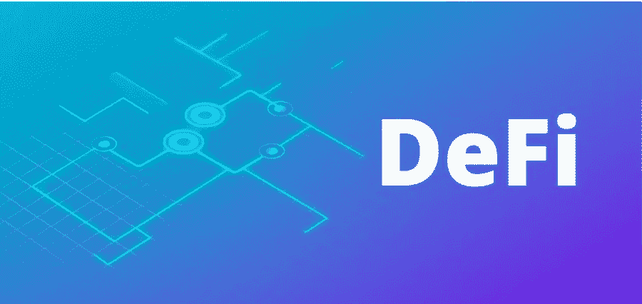
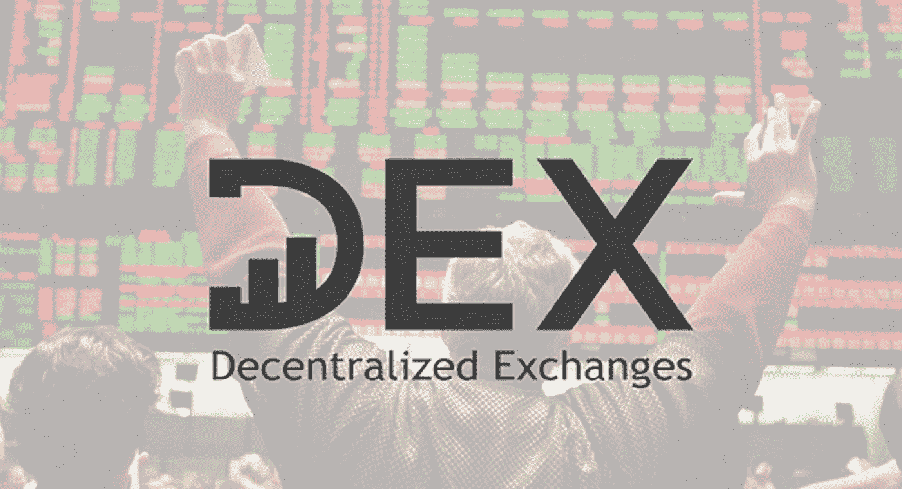
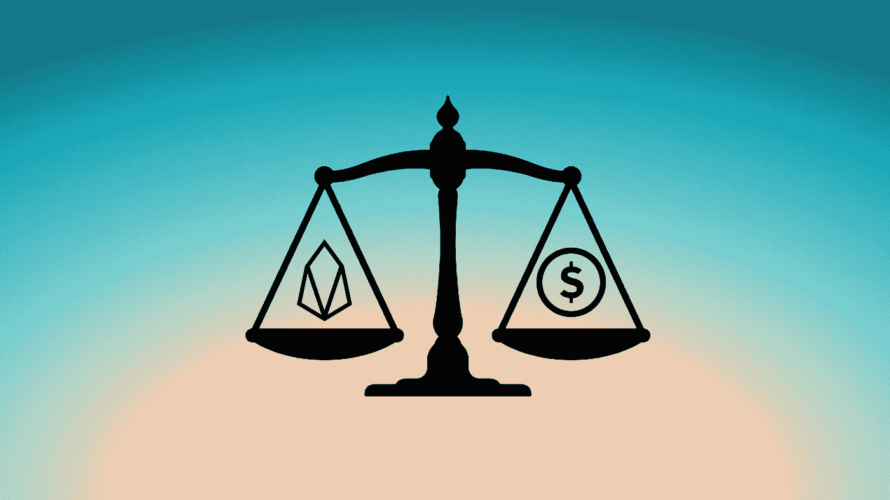

# Defi:金融服务的革命(带音频)

> 原文：<https://medium.datadriveninvestor.com/defi-revolution-in-financial-services-fc1288ee603?source=collection_archive---------9----------------------->

金融服务是由银行部门提供的商业服务，涵盖了各种各样的资金管理行业，包括信用合作社、银行、信用卡提供商、保险公司、会计事务所、消费金融公司、股票经纪公司、对冲信托、个人经理人和几家政府支持的公司。

中央政府发行日常货币，为我们的经济提供动力，并被所有行业使用，如政府和银行。因此，他们有权监控和调节市场上这种货币的流通和供应。我们还将自己储蓄的所有权交给银行等众多金融实体，希望获得更好的回报。令人担忧的是，由于所有的管理和基金都是集中的，危险也是核心问题。集权财政；对公司或组织的信任。

Defi 也称为分散金融。建立在网络上的数字货币、协议、智能合约和 dApps 是去中心化金融的一部分。以太坊平台是 DeFi 应用程序的主要选择，因为它简单且不断发展。在协议中，有信任。数学中的信任比错误信念中的信仰更大。Defi 让您可以控制自己的资产。尽管许多新时代的银行和金融科技企业致力于为客户提供更多的渠道，但你相信他们会管理自己的资产。由于权力下放和区块链技术，Defi 旨在确保您的财产的完全所有权。许多金融软件开发商经常通过分散交易使用开源交换协议。因此，所有人都可以安全地存储、交换和投资他们的储蓄，并获得比传统金融体系更大的利润。你有充分的财务杠杆，没有中间人来处理你的资产。
如果我们接着总结；任何一个有互联网连接和加密钱包的人现在都可以使用许多金融服务。

定义的风险类型= >

1.  金融风险:投资者通常用本币平均通胀率、无风险收益率等统计数据和指标来衡量投资前景。无风险利率是指投资者可以从一项尽可能提供最接近保证回报的投资中获得多少。由于缺乏详细的历史证据和基准，无法按常规方式确定 DeFi 的投资概率。
2.  程序性风险:程序性保护承认消费者应该采取措施保护自己的财产。开发者可能会让他们的应用程序尽可能安全，但某些安全功能依赖于用户采取某些预防措施，如多因素身份认证和硬件钱包。存储或使用加密货币的最佳实践包括:不披露存款，使用智能手机、浏览器或其他更开放形式的钱包中的“移动”纸质或硬件钱包，使用多因素身份认证，将“储蓄”资金分开存储在冷存储中。
3.  技术风险:这包括由应用程序运行所需的硬件和软件故障引起的错误。
4.  智能合约漏洞面临着相对较高的风险，因为智能合约是相对较新的创新，对其进行审计的最佳实践还处于起步阶段。

集中交易所；

1.  承担保管风险。
2.  我们的财务信息是共享的。
3.  他们将借出我们的资金。

分散交易所；

1.  最小的保管风险。
2.  我们的数据是保密的。
3.  我们控制着自己的资金。

集中的马厩；

1.  需要一个可信的保管人。
2.  不足循环。
3.  还有，假货市场量是有的。
4.  正如我们在系绳骗局中看到的。

分散的稳定社区；

1.  最小的保管风险。
2.  透明度高。
3.  为恶性通货膨胀提供了真正的解决方案。
4.  市场价值的稳定性。

一些现实生活中的用例是= >

1.  ABRA——一种加密货币钱包，使用比特币区块链来保存和跟踪各种货币的存款。
2.  hapo alim——这家以色列银行与微软合作，建立一个区块链基础设施来处理银行担保。
3.  马士基——航运和运输联盟宣布了区块链解决方案提案，以简化海上保险。
4.  实体—支持智能合同的形成，当网络协议确定条件已经满足时，智能合同开始生效—支持在各方接受(例如)需求已经满足时进行电子转账。
5.  augar——支持开发基于区块链的预测市场，以便在分散的环境中交易衍生品和其他金融工具。

希望你喜欢。

希望得到积极的回应。

请关注我的@Medium 简介 [Yash Kamal Chaturvedi](https://yashkamalchaturvedi.medium.com/)