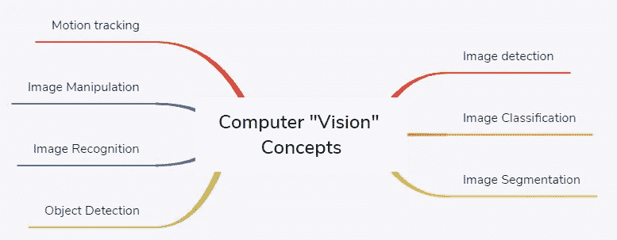
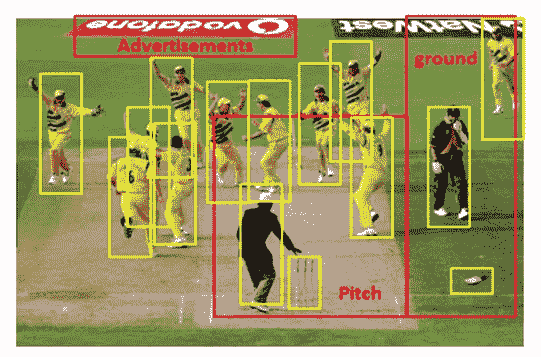

# 在“计算机视觉”中定义“视觉”

> 原文：<https://medium.datadriveninvestor.com/defining-vision-in-computer-vision-38ed2a045eef?source=collection_archive---------8----------------------->

**计算机视觉**也称为**视觉**是计算机科学中最近的前沿领域，它处理使计算机、设备或机器，一般来说，能够**看到**、**理解**、**解释**或**操纵**所看到的东西。

计算机视觉技术实现深度学习技术，并且在少数情况下还采用自然语言处理技术作为分析从图像中提取的文本的自然步骤。

随着深度学习的所有进步，图像分类、对象检测、跟踪和图像处理等构建功能变得更加简单和准确，从而为探索更复杂的自动驾驶汽车、人形机器人或无人机等自动应用开辟了道路。

通过深度学习，我们现在可以操纵图像，例如将汤姆·克鲁斯的特征叠加到另一张脸上。或将一张图片转换成素描模式或水彩画模式。我们可以消除图片的背景噪音，突出重点，甚至用颤抖的手也能拍出稳定的照片。我们可以估计物体的接近程度、结构和形状，也可以估计表面的纹理。通过不同的光线或相机曝光，我们可以识别物体并认出我们以前见过的物体。

在计算机视觉中，通过说“*使计算机* ***见*** ”，我们的意思是使机器或设备能够处理*数字视觉数据，其范围可以从传统相机拍摄的图像到位置、视频和任何数据的热强度图的图形表示，甚至更广。*

*通过上述定义的阐述，我们可以看到计算机视觉应用在我们的日常生活中变得无处不在。我们现在可以考虑在视频中找到一个物体或一张脸，这可以发生在实时视频馈送中，理解视频中的运动和模式，增加或减少图像的大小、亮度或清晰度。*

**

*为了理解什么构成了计算机视觉，让我们看看下图:*

**

*虽然我们是第一次看到这张照片，但我们可以看出这是一只运动蟋蟀的照片。这是澳大利亚队和南非队之间的一场比赛，澳大利亚队赢了。整体气氛是一种庆祝，一些球员的名字可以通过识别他们的面部特征或通过阅读印在他们球衣上的名字来命名。*

*我们观察到的信息对于计算机视觉应用来说是复杂的，这可能是一组多重推论。现在让我们将整个人类驱动的解释映射到机器的视觉过程。*

*1.首先，我们观察像草地/地面、人、板球设备广告、运动服这样的物体。这些对象然后被分组到类别中。这个提取信息的过程被称为“**图像检测和分类**”。*

*2.在高层次上，有一个地面和一个球场，虽然很难准确地指出边界，但根据图像内物体的占用情况进行标记是可能的，这个过程被称为“**图像分割***

*3.更进一步，我们可以获得更智能、更小的边界，帮助识别图像中的特定人物和物体。这可以从每个潜在的独特对象周围标记的小方框中观察到，如下图所示。*

**

*4.现在，在每个盒子里，可以有人或不同的板球相关的物体。下一步，我们可以检测并标记每个盒子里装的东西。这个过程叫做**物体检测**。*

*5.进一步延伸，我们可以仔细观察这些人，具体来说就是检测人脸，并通过"**人脸识别**过程准确确定玩家是谁。我们还可以观察到每个人都有不同的身高和体型。*

*6.刻在球员球衣背面的名字可以成为确定球员身份的另一个来源。**光学字符识别** (OCR)基于手写识别过程可以识别形状和线条，并推断出字母或字符。*

*7.根据队服的颜色，我们可以推断出这是什么类型的比赛，是什么球队在比赛。再次识别像素的颜色是“**图像检测和处理**过程的一部分。*

*8.在玩游戏的过程中，可以跟踪球的运动，并且可以计算或确定球撞击球棒的速度。也可以确定球可能采取的路径。一些重要的计算，如有多少球发球击中了球场上的什么位置，都可以计算出来。这可以通过一个名为“**运动跟踪**的过程来实现。*

*9.存在这样的情况，当球员击球时，确定他/她是“在内”还是“在外”取决于他/她的腿的位置。为了准确地确定这一点，需要分析此时由不同摄像机从不同角度拍摄的图像，以识别球员腿部的准确位置。这一过程被称为“**图像重建**”，其中从同一对象在不同角度的不同断层投影来重建对象。*

*要了解更多信息并使用 open CV 亲自编写代码，请阅读我的计算机视觉书籍:*

* [## 使用 OpenCV 学习计算机视觉

### 使用 OpenCV 库和 Python 构建计算机视觉的实际应用。这本书讨论了不同的…

www.google.com](https://www.google.com/books/edition/Learn_Computer_Vision_Using_OpenCV/-WmVDwAAQBAJ?hl=en&gbpv=1&printsec=frontcover)*