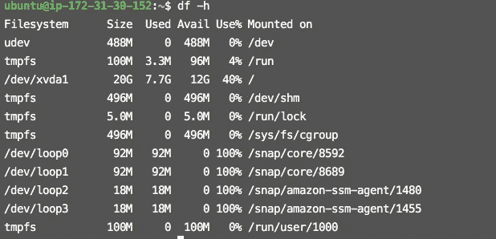
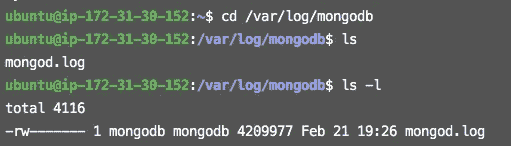
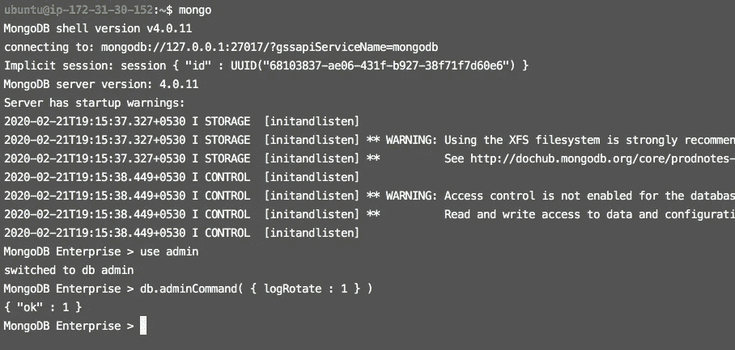
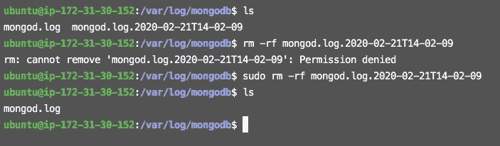

# 删除或清空 MongoDB 日志文件

> 原文：<https://medium.datadriveninvestor.com/delete-or-empty-mongodb-log-file-e6f838b66838?source=collection_archive---------0----------------------->


Photo by [Joel Filipe](https://unsplash.com/@joelfilip?utm_source=medium&utm_medium=referral) on [Unsplash](https://unsplash.com?utm_source=medium&utm_medium=referral)


有时我们的数据库服务器变得缓慢，没有任何原因或错误。那一次我们的思维陷入了错误，我们不认为这可能是导致这个问题的其他原因。这可能是因为大型日志文件导致内存满。

[](https://www.datadriveninvestor.com/2019/03/25/a-programmers-guide-to-creating-an-eclectic-bookshelf/) [## 创建折衷书架的程序员指南

### 每个开发者都应该有一个书架。他的内阁中可能的文本集合是无数的，但不是每一个集合…

www.datadriveninvestor.com](https://www.datadriveninvestor.com/2019/03/25/a-programmers-guide-to-creating-an-eclectic-bookshelf/) 

日志写入对于任何应用程序跟踪历史都很重要。但是当日志文件变大时，可能会导致磁盘空间问题。特别是对于数据库服务器，这可能会导致性能问题，因为数据库需要连续地写入一个大文件。通过安排定期的日志轮换，我们可以主动避免这种情况，并将日志文件大小保持在预定的阈值以下。让我们开始研究如何解决这个问题。

## 步骤 1:-检查您的服务器内存

通过`ssh`命令进入你的服务器。然后通过下面的命令检查内存。

```
$ df -h**OutPut:-** Filesystem      Size  Used Avail Use% Mounted on
udev            488M     0  488M   0% /dev
tmpfs           100M  3.3M   96M   4% /run
/dev/xvda1       20G  7.7G   12G  40% /
tmpfs           496M     0  496M   0% /dev/shm
tmpfs           5.0M     0  5.0M   0% /run/lock
tmpfs           496M     0  496M   0% /sys/fs/cgroup
/dev/loop0       92M   92M     0 100% /snap/core/8592
/dev/loop1       92M   92M     0 100% /snap/core/8689
/dev/loop2       18M   18M     0 100% /snap/amazon-ssm-agent/1480
/dev/loop3       18M   18M     0 100% /snap/amazon-ssm-agent/1455
tmpfs           100M     0  100M   0% /run/user/1000
```



在这种情况下，内存占 40%。

## 步骤 2:-检查独白的文件大小

进入`**mongodb**` 文件夹，运行以下命令检查大小。

```
$ cd /var/log/mongodb
$ ls -l
```



## 步骤 3:-循环日志文件

在循环中，它生成新的 mongod.log 文件，并将旧数据保存在另一个文件中。因为我们需要旧的日志来进行分析以及其他许多原因。在 MongoDB 中，日志不会自动旋转，所以我们需要手动旋转它。通常，MongoDB 服务器的日志大小取决于配置的信息级别和配置的慢速日志。

通过运行以下命令进入 mongo shell。

```
$ mongo
```

通过运行以下命令旋转日志。

```
> use admin
> db.adminCommand( { logRotate : 1 } )**OutPut:-**{ "ok" : 1 }
```



**步骤 4:-删除旧日志**

现在，进入`**mongodb**` 文件夹，通过`ls`命令检查文件。你会看到两个文件，一个是新的 mongod.log 文件，另一个是`mongod.log.date`，旧的日志都在这个文件里。现在，您可以删除该文件。



这是解决服务器速度慢的方法之一。

***欢迎在评论区提出任何问题或疑问，或者你可以在脸书上 ping 我。***