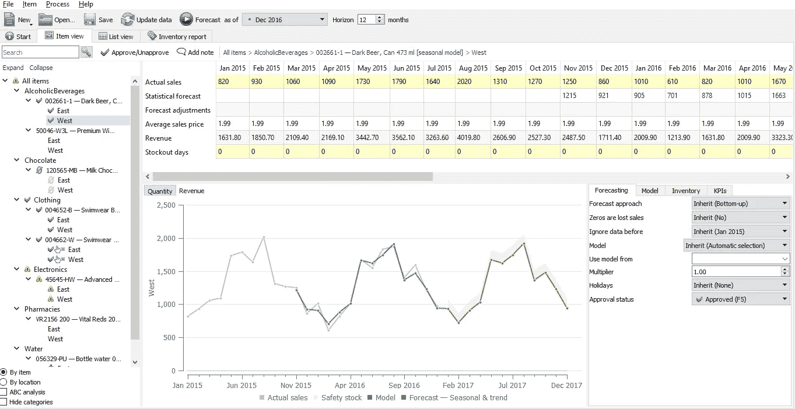
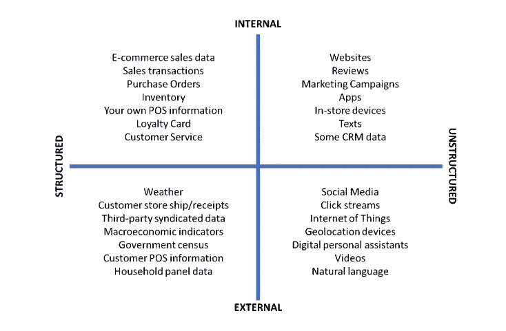
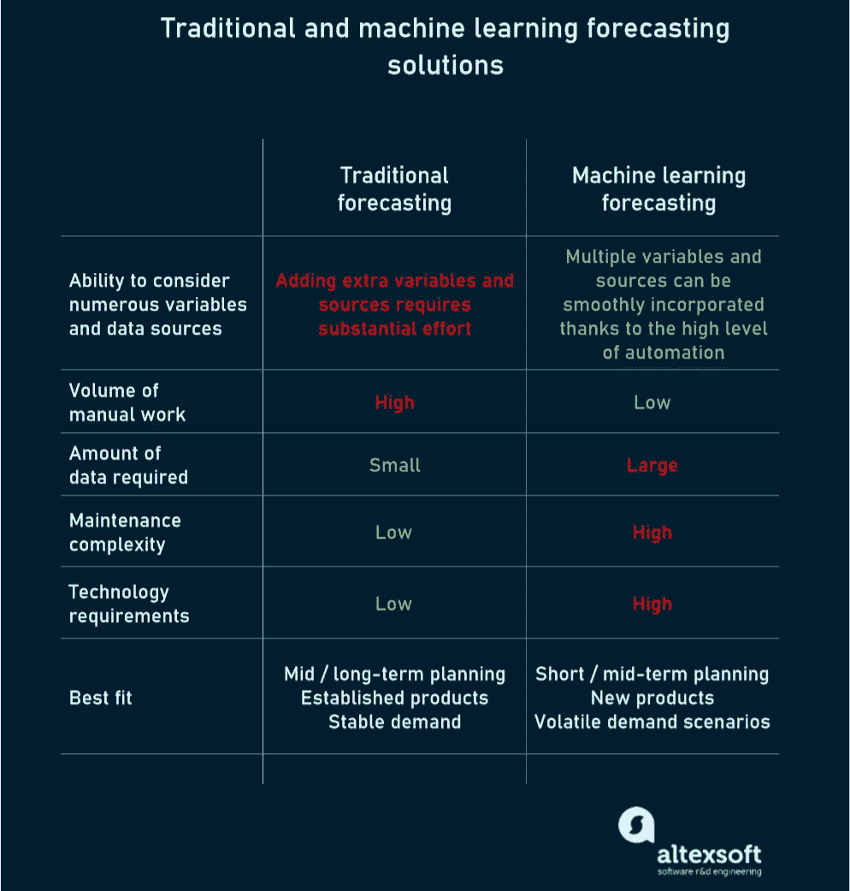
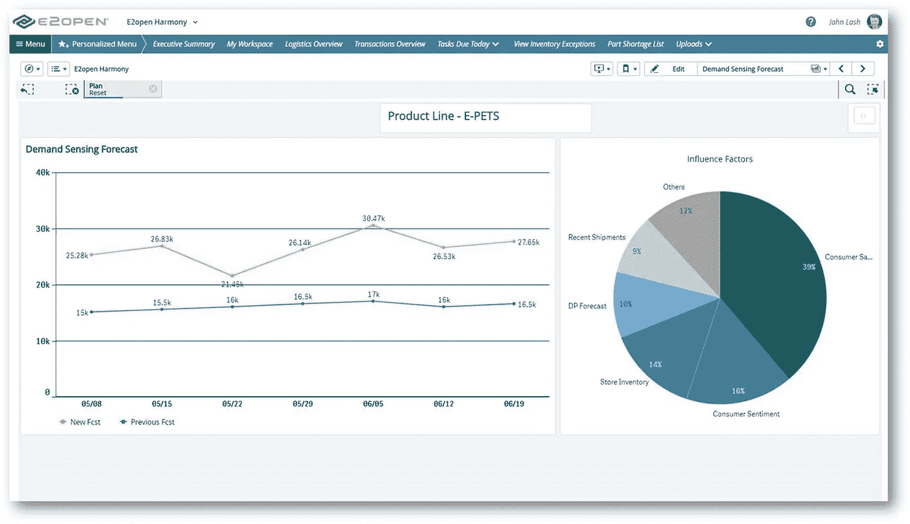
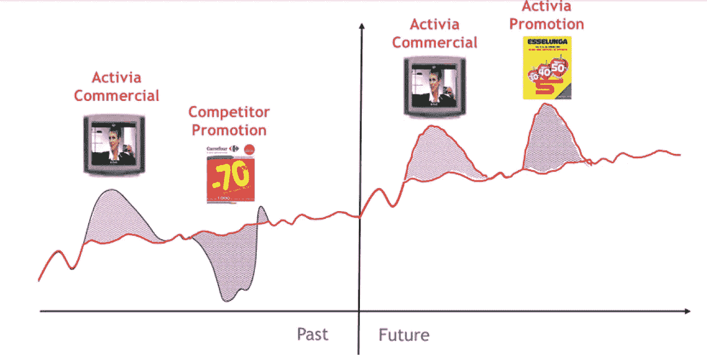

# 需求预测方法:使用机器学习和预测分析来预测销售的未来

> 原文：<https://medium.datadriveninvestor.com/demand-forecasting-methods-using-machine-learning-and-predictive-analytics-to-see-the-future-of-137b2342f6c4?source=collection_archive---------0----------------------->

企业高管最大的痛点是什么？全球最大的 IT 研究公司 Gartner 给出了明确的答案:需求波动。从天气波动到社交媒体影响者的帖子，有太多因素影响买家，导致他们频繁改变主意。

更糟糕的是，重塑客户意图的事情发生得非常意外。比如，想想十几岁的气候活动家格里塔·图恩伯格。她因环境原因拒绝乘坐飞机引发了“飞行羞耻”运动，导致瑞典航空乘客数量下降了百分之五。

没有魔杖可以预测像“图恩伯格效应”这样的场景。但是有技术可以提高需求预测的准确性。老实说，它永远不会 100%精确，但它可以精确到足以帮助你实现你的业务目标。

 [## DDI 编辑推荐:5 本让你从新手变成专家的机器学习书籍|数据驱动…

### 机器学习行业的蓬勃发展重新引起了人们对人工智能的兴趣

www.datadriveninvestor.com](https://www.datadriveninvestor.com/2019/03/03/editors-pick-5-machine-learning-books/) 

在本文中，我们将研究高级预测方法的能力，并概述它们当前的局限性。

# 预测在需求和供应计划中的地位和作用

**需求预测**是对产品或服务未来可能需求的估计。该术语经常与*需求计划、*互换使用，但后者是一个更广泛的过程，始于预测，但不限于预测。

**需求规划**，根据商业预测与规划研究所( [IBF](https://demand-planning.com/) )应用“预测和经验来估计[供应链](https://www.altexsoft.com/blog/supply-chain-management-software/?utm_source=MediumCom&utm_medium=referral&utm_campaign=shares)中各点对各种物品的需求。”除了进行估计，需求计划员还参与库存优化，确保所需产品的可用性，并监控预测和实际销售之间的差异。

需求计划是许多其他活动的起点，如仓储、运输、[价格预测](https://www.altexsoft.com/blog/business/price-forecasting-machine-learning-based-approaches-applied-to-electricity-flights-hotels-real-estate-and-stock-pricing/?utm_source=MediumCom&utm_medium=referral&utm_campaign=shares)，尤其是旨在满足需求并需要客户预期需求数据的供应计划。

这里，我们再次回到预测。尽可能接近现实是提高整个供应链效率的关键。你如何达到尽可能高的精确度？答案取决于业务类型、可用资源和目标。让我们比较一下现有的选择:传统的统计预测，机器学习算法，结合两种方法的预测分析，以及作为支持工具的需求感知。

# 传统的统计预测——有利于市场稳定，不利于变化

传统的统计方法(TSM)已经存在了很长时间，并且仍然是预测过程中的主要方法。与上个世纪相比，唯一的区别是所有的计算都是由现代软件自动完成的。例如，您可以在 Excel 中为销售和趋势创建[时间序列预测](https://www.altexsoft.com/blog/business/time-series-analysis-and-forecasting-novel-business-perspectives/?utm_source=MediumCom&utm_medium=referral&utm_campaign=shares)。

**数据来源。为了预测未来，统计学利用过去的数据。这就是为什么统计预测通常被称为*历史预测。普遍的建议是收集至少两年的销售数据。***

**为什么要用它。传统预测仍然是最流行的销售预测方法，这是有原因的。通常，基于统计技术的需求规划解决方案可以与 Excel 和现有的企业资源规划(ERP)系统无缝集成，而无需额外的技术专业知识。最先进的系统可以考虑季节性和市场趋势，并应用多种方法来微调结果。**

**要考虑的事情。**统计预测准确性的一个重要前提是稳定性。我们假设历史会重演:两三年前发生的情况会再次发生。这远非事实。完美无缺在理想世界中，统计方法往往无法预见客户偏好不合逻辑的变化，也无法预测市场饱和何时发生。

*A statistical forecasting software dashboard. Source:* [*GMDH Streamline*](https://gmdhsoftware.com/demand-planning-software)

**最适合。**总而言之，自动化统计预测为以下方面提供了令人满意的准确度:

*   中长期规划，
*   享有稳定需求的成熟产品，以及
*   预测总需求，而不是预测单个库存单位(SKU)的销售。

投资更复杂的技术有商业意义吗？我们将在下一节中尝试澄清一些事情。

# 用于需求规划的机器学习—以增加复杂性为代价的高级准确性

一方面增加的计算机能力和另一方面增加的需求波动性为更广泛地使用[机器学习](https://www.altexsoft.com/whitepapers/machine-learning-bridging-between-business-and-data-science/?utm_source=MediumCom&utm_medium=referral&utm_campaign=shares) (ML)来设计预测创造了先决条件。

**数据来源。**机器学习建立在统计模型的基础上，利用额外的内部和外部信息源进行更准确的数据驱动预测。ML 引擎可以处理结构化和非结构化数据，包括过去的财务和销售报告(历史数据)、营销民意调查、宏观经济指标、社交媒体信号(转发、股票、关注者激增)、天气预报等。

*Data sources for demand forecasting with machine learning. Source:(Institute of Business Forecasting and Planning ).*

**为什么要用它。**机器学习应用复杂的数学算法来自动识别模式，捕捉需求信号，并在大型数据集中发现复杂的关系。除了分析大量信息，智能系统还不断地重新训练模型，使它们适应不断变化的条件，从而应对波动性。这些能力使得基于 ML 的软件能够在复杂的情况下产生更准确和可靠的预测。

*更准确*到底是什么意思？将机器学习添加到现有系统的公司报告说，预测可靠性增加了 5%到 15 %(高达 85%甚至 95%)。除此之外，您的团队不再需要耗时的手动调整和重新校准。

**要考虑的事情。**要利用机器学习解决方案，你需要足够的处理能力和真正大批量的[高质量数据](https://www.altexsoft.com/blog/data-quality-management-and-tools/)。否则，系统将无法学习并生成有价值的预测。

此外，请记住软件维护和结果解释方面的额外复杂性。虽然 ML 机制在没有人类干预的情况下得出结论，但这取决于现场技术专家来确定应该向模型提供什么特征，它们中的哪些对输出有最大的影响，以及为什么模型会产生某种预测。

以上所有因素都增加了你在设备和人力资源上的支出，所以最好确保准确度提高 5%所带来的收入能够弥补相应的支出。

**最合适。**机器学习明显优于传统统计学的情况包括:

*   中短期规划，
*   多变的需求模式，
*   快速变化的环境，以及
*   新产品发布。

*Comparison between traditional and machine learning approaches to demand forecasting.*

# 需求预测的机器学习解决方案

正如你所看到的，使用机器学习伴随着一些权衡。根据规划范围、数据可用性和任务复杂性，您可以使用不同的统计和 ML 解决方案。

## 预测销售分析:模拟未来

与统计方法相结合的机器学习最常见的企业应用是**预测分析。**它不仅可以评估需求，还可以了解销售的驱动因素以及客户在特定条件下可能的行为。

为了帮助您发现未来可能发生的事情，预测分析软件会执行以下一组操作:

*   汇总来自不同来源的历史和新数据，包括 ERP 和客户关系管理(CRM)系统、销售点(POSs)、传感器、客户需求研究、社交媒体、营销调查；
*   清洗数据；
*   确定哪种预测算法最适合您的产品；
*   建立预测模型，以确定可能的结果并发现各种因素之间的关系；和
*   监控模型以衡量其业务成果并提高预测准确性。

预测分析工具使企业能够将公司信息与重要的经济指标、促销活动、天气变化以及其他影响客户偏好和购买决策的因素结合起来。它有助于发现新的市场机会，并对未来需求产生更细致的洞察。

**主要缺点。**预测分析不是最简单的技术，因为它涉及复杂的机器学习算法。此外，它旨在生成至少一个月的预测，并不适合，也不意味着设想更近的未来。

当涉及到更短的周期和每日粒度时，需求感知工具开始发挥作用。

## 需求感知:管理实时变化

**需求感知**是规划流程中一个相对较新的概念，它利用机器学习来捕捉购买行为的实时波动。许多专家不认为它是一个独立的预测方法，而是一种调整现有预测的方法。也就是说，这项技术对在快速变化的市场中运营的公司有很大帮助。

需求感应解决方案从 POS 系统、仓库和外部来源提取每日数据，通过与历史模式进行比较来检测销售额的增加或减少。该系统自动评估每个差异的重要性，分析影响因素，并对短期计划进行调整。

*A demand sensing software dashboard, capturing a change in demand in the short term, and showing factors that cause the fluctuation. Source:* [*E2Open*](https://www.e2open.com/intelligent-applications/demand-sensing/)

据报道，采用需求感应可以将近期预测误差降低 30%到 40%。它使公司能够快速应对客户需求的突然变化，并有助于构建数据驱动的供应链。当然，你不能仅仅基于这种技术来做所有的决定，因为它对中长期规划不起作用。但是它可以作为传统预测方法的一个有价值的补充。

**主要缺点。**需求感知严重依赖机器学习算法，继承了 ML 的所有优点和缺点。它需要强大的计算能力、海量数据和一个大型预建模型库。最重要的是，一些高度敏感的模型可能会发送错误的信号，所以你需要人的逻辑来分析需求感知引擎产生的结果。

# 机器学习何时最适合需求规划:成功的用例

并非每个企业都需要昂贵的机器学习解决方案来制定可靠的需求计划。但是，当你面临一个高度不稳定的环境，或者没有历史数据，或者必须考虑大量的变量时，对更智能技术的投资将会带来巨大的回报。下面，我们将考虑机器学习为预测过程带来最大价值的典型场景。

## 新产品介绍(NPI)

传统的预测需要两到五年的销售数据来保证可接受的准确度。对于新产品，您没有销售历史。尽管如此，你不能忽视预测需求，因为它驱动着多个重要的过程，从采购到[物流管理](https://www.altexsoft.com/blog/business/logistics-management-systems-how-warehouse-transportation-and-distribution-software-work/?utm_source=MediumCom&utm_medium=referral&utm_campaign=shares)到营销支持。

除了市场研究和收集专家意见之外，预测上市最常见的方法是找出具有相似特性和[产品生命周期](https://www.altexsoft.com/blog/business/product-life-cycle-how-to-extend-your-product-market-presence/?utm_source=MediumCom&utm_medium=referral&utm_campaign=shares)曲线的前辈集群。考虑到其他相关信息来源，如网络分析和社交媒体，机器学习算法可用于从大量非结构化数据中提取特定模式，找到相似之处并进行预测。这需要更高程度的准确性，并将创建预测所需的时间从数天减少到数小时。

## 生命周期短的产品

在一些行业，公司每隔几个月就更新一次产品组合，这使得预测任务变得更加困难。例如，时装公司每年至少推出两次新产品，服装应该很快售出，为下一个系列腾出空间。在这种情况下，需求评估过程必须包括检查流行趋势、季节性和其他外部因素，以及与之前系列相关的历史数据。

机器学习已被证明在如此复杂的场景下是有效的，全球品牌 Luxottica 的经历说明了这一事实。世界上最大的眼镜行业公司[使用机器学习](https://finstock.co.za/pdfs/Resources/E%20Book/eBook_EN_Retail.pdf)来预测对每年增加到其系列中的 2000 种新款式的需求。由于智能引擎分析了过去发布的数据并发现了常见需求行为的模式，制造商将其销售预测的准确性提高了 10%——对于大量快速过时的产品来说，这是一个显著的提高。

## 天气敏感产品

天气变化会引发显著的需求波动，尤其是季节性产品(从泳装、雨伞到毛皮大衣)、化妆品、食品和车辆。机器学习算法可以帮助企业检测和测量气象因素对销售的影响，通过预测分析，您可以为不同的场景建立“假设”模型。

这种方法允许供应商和零售商有效地应对与天气相关的当地需求的起伏。来自 ML 预测采用者的报告显示，考虑天气影响(例如，冬季异常高温)可以将单个食品的预测准确率提高[5%到 15%](https://www.relexsolutions.com/machine-learning-in-the-context-of-retail-demand-forecasting/),将产品组的预测准确率提高 40%。

公司开展了数以千计的消费促销活动，旨在推动销售。唉，不同的调查显示，这些事件中有 20%到 50%未能产生明显的需求增长。此外，美国最大的市场研究公司尼尔森控股公司的一项研究表明，[59%的贸易促销没有达到收支平衡，或者换句话说，导致了额外的费用而不是利润。具有讽刺意味的是，](http://viz.nielsen.com/tradepromotionperformance/)[59%](https://www.gartner.com/en/documents/3587241)出现在 Gartner 的一份报告中，这是指仍然使用电子表格来计划促销和预测其影响的公司数量。

显然，没有改进的技术，公司很难对昂贵的营销活动做出可靠的预测。原因？晋升的结果取决于隐藏在大量原始数据中的众多因素，这些因素之间有着复杂的关系。幸运的是，机器学习可以应对这项具有挑战性的任务，这已被世界上最大的酸奶制造商达能证明。由于使用了机器学习引擎，这家乳业巨头见证了促销预测错误减少了 20 %,销售损失减少了 30%。

*Due to machine learning, Danone achieved better accuracy in forecasting the impact of commercials and promotions on demand. Source:* [*Transart*](https://www.transart.ro/en/customer-channel-management/)*.*

总的来说，促销可预测性的增强带来了两个直接的好处。首先，他们防止营销团队在没有回报的活动上花费太多的钱。其次，它们导致更精确的库存管理，消除库存过多或不足的风险。

## 要分析的变量太多

这是影响预测准确性的最常见问题。高度可变的环境、驱动购买行为的数十个因素、涉及的多种数据类型—所有这些因素往往使需求规划过于复杂，无法用简单的工具成功执行。

供应链的高度复杂性、短期需求激增和高错误成本(人命关天)促使英国国家卫生系统(NHS)的血液和运输部门从电子表格和手动数据库转移到具有增强预测能力的 ML 燃料规划系统。它使医院能够在不降低服务质量的情况下，将血液积压造成的浪费减少 30 %,并能够对潜在的短缺做出快速反应。*如果超市货架上没有酸奶，那真是不幸。如果医院里没有血，后果是非常不同的，*”一位 NHS 高管解释了为什么要大力投资先进的解决方案。

# 人脑仍然很重要

预测需求是一项具有挑战性的任务，它仍有很大的改进空间。最近的一项研究表明，不到 30%的商业交易被准确预测到。

如前所述，采用机器学习工具可以在某种程度上缩小预期和现实之间的差距。但这并不意味着每个公司都应该立即转向复杂的智能技术。您可以从对现有系统进行小的改进开始，这些改进将解决传统方法难以解决的问题。例如，使用机器学习模块在短期规划中进行数据驱动的改变，而将长期预测留给老派统计。

无论你的预测解决方案有多聪明，关键的决定仍然取决于人力资本。您需要行业专家来定义在您的预测模型中应该考虑哪些因素。人类逻辑仍然需要评估数字大脑产生的结果的相关性，并根据常识和深入的领域专业知识做出最终结论。这就是为什么 ML 驱动的需求计划系统通常包括一个协作平台，允许不同的专家参与预测过程。只有充分利用人工智能和人类智能的优势，你才能看到并为你的企业规划更美好的未来。

*原载于 AltexSoft tech 博客“* [*需求预测方法:利用机器学习和预测分析来看销售的未来*](https://www.altexsoft.com/blog/demand-forecasting-methods-using-machine-learning/?utm_source=MediumCom&utm_medium=referral&utm_campaign=shares)