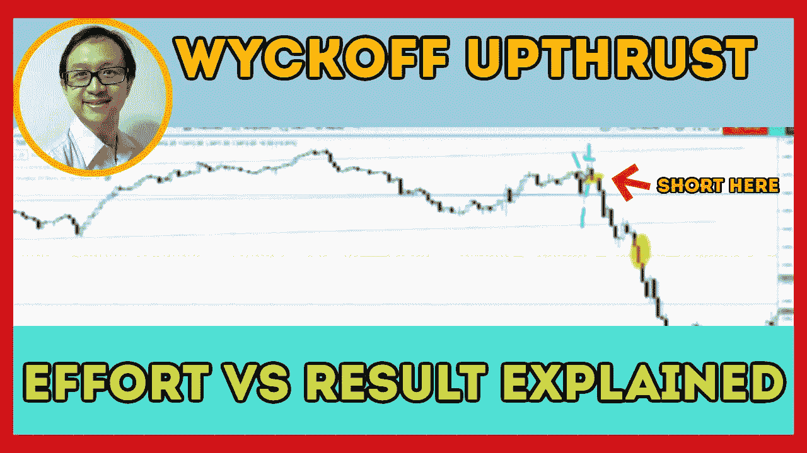

# 如何用这种成交量形态交易威科夫上涨(95%的交易者不知道这一点)

> 原文：<https://medium.datadriveninvestor.com/demand-was-spotted-in-s-p-500-plus-how-to-trade-up-thrust-with-effort-vs-result-6e834d127726?source=collection_archive---------10----------------------->

通过解释这种交易量(供给和需求)模式，找出如何交易威科夫向上突破。

观看视频，了解 2020 年 9 月 7 日交易时段标准普尔 500 指数期货的**每日市场分析。在这段视频中，我将向大家展示上一个交易日的市场回顾，以及三分钟内的潜在交易回顾(包括进场、出场及其背后的原理)。此外，我还会谈到四大指数，如纳斯达克、道琼斯、罗素 2000 指数和标准普尔 500 指数。展望未来，我将涵盖偏见，要注意的关键水平，我稍后的交易计划。**

如果你还没有看我的[每日市场分析视频](https://youtu.be/SPxmczIqjCQ)，为了更好地了解市场回顾和交易回顾。

**偏向** —中性(日内交易)；看涨(长期)

**关键水平** —阻力:3487–3560；支持:3400，3340

**潜在设置** —反转时在 3400 或 3340 附近看多。

# 资源

**每周市场展望&最佳交易建议**直达您的收件箱:[https://www.tradeprecise.com/](https://www.tradeprecise.com/)

**专业免费**制图平台:创建账户→[www.TradingView.com](https://bit.ly/2U2Femd)

**非美国居民？** ( **马来西亚、新加坡**、澳洲、纽西兰、欧洲等……):[点击此处，当您存入新币 2000 元](https://ji.hn/sgtiger)时，即可获得**免费股票(价值 100 美元++ &老虎经纪的欢迎礼物**

美国居民？[点击此处，当您存入 1500 美元](https://ji.hn/ustradeup)时，就有机会在 TradeUP 上获得一份**免费的 AMZN 股票(价值 3000++美元** ) & **欢迎礼物**

**从媒体获取无限文章** —加入以下:[https://priceactiontrading.medium.com/membership](https://priceactiontrading.medium.com/membership)

# 进一步阅读

 [## 麦当劳、SBUX、百胜将从威科夫的积累中突围

### 自 2021 年 2 月中旬行业轮动展开以来，餐馆和酒吧行业一直很有弹性

medium.datadriveninvestor.com](/mcd-sbux-yum-set-to-breakout-from-wyckoff-accumulation-1ebbe5f8e7b)  [## 趋势反转交易策略(有效)——标准普尔 500 日交易

### 了解如何使用这种有利可图的趋势反转交易策略，以最小的风险抓住底部。

medium.datadriveninvestor.com](/a-trend-reversal-trading-strategy-that-works-s-p-500-day-trading-193443c731d2)  [## 凯西·伍德警告市场即将调整——标准普尔 500 价格走势分析

### 在 2020 年 12 月 18 日对彭博的采访中，方舟投资公司的首席执行官兼首席信息官凯西·伍德警告说…

medium.datadriveninvestor.com](/cathie-wood-warns-market-correction-soon-price-action-analysis-on-s-p-500-7e621e013310) 

Photo by Author — Ming Jong Tey

Photo by Author — Ming Jong Tey

披露:如果您点击本文中的链接进行购买或开立账户，并将所需金额存入推荐的经纪人账户，我们将免费为您赚取佣金。

免责声明:本演示中的信息仅用于教育目的，不应作为投资建议。