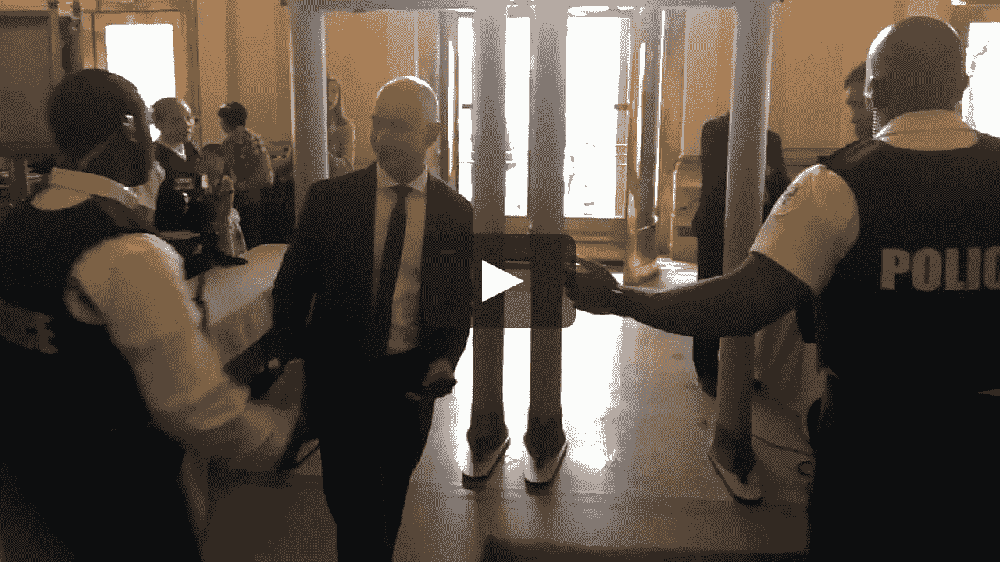

# 民主在亚马逊消亡:为什么特朗普和贝佐斯不是如此奇怪的政治伙伴

> 原文：<https://medium.datadriveninvestor.com/democracy-dies-at-amazon-why-trump-and-bezos-are-not-such-strange-political-bedfellows-5001a26be27c?source=collection_archive---------11----------------------->

Trump and Bezos actually share a powerful anti-democratic vision. vimeo.com

最近，普利策奖得主、《华盛顿邮报》记者菲利普·拉克(Philip Rucker)和卡罗尔·莱昂尼希(Carol Leonnig)发表了他们对唐纳德·特朗普总统任期的评估，试图走出新闻循环，并“评估”他的政府在全国的“反响”。书名为【T2:一个非常稳定的天才:唐纳德·j·特朗普(Donald J. Trump)对美国的考验，这本书一幕接一幕地讲述了特朗普的无能，将自身利益置于对国家福祉的关注之上，以及普遍缺乏任何道德指南针或学术严谨性。

正如德怀特·加纳在[为*纽约时报*撰写的评论](https://www.nytimes.com/2020/01/16/books/review-very-stable-genius-donald-trump-philip-rucker-carol-leonnig.html)中描述的那样,“它读起来像一个恐怖故事，一个近乎滑稽的不道德故事。这就好像作为零号病人的总统咬了一名助手，慢慢地，一口一口地，整个国家失去了智慧和指南针。”

这是一个令人信服的故事，对美国人来说，我们在众议院举行的弹劾听证会上以及现在美国参议院正在进行的审判中目睹的情况似乎证明了这一点。

 [## 另一场精心策划的全球经济危机正在逼近？如果我们的数据经济可以帮助它|数据…

### 我们的 DApp 的开发，称为 DECENTR，目前正与我们的 R&D 同步进行，作为我们即将到来的…

www.datadriveninvestor.com](https://www.datadriveninvestor.com/2019/03/06/another-engineered-global-economic-crisis-looming-not-if-our-data-economy-can-help-it/) 

腐败透顶的富商特朗普正在摧毁民主，为了自己的私利和个人利益，将国家的福祉和安全置于风险之中。

然而，我们不应该让非常必要的弹劾过程的戏剧性事件分散我们对美国民主更世俗的威胁的注意力，这些威胁似乎已经在美国生活中得到广泛接受，但对美国人民和我们所谓的政治理想的危害不亚于特朗普的总统任期。

作为我所谈论的一个例子，以亿万富翁杰夫·贝索斯和他的亚马逊帝国为例，顺便说一下，他的亚马逊帝国包括《华盛顿邮报》。

《华盛顿邮报》的警告口号当然是“民主在黑暗中消亡”

这种情绪肯定是温暖而模糊的，甚至阐明了自由媒体在维护我们的民主中的崇高使命和作用。

杰夫·贝索斯的美元慷慨地促成了这一使命。

但他用一只手“给予”的东西(毕竟这是一笔生意)，他用另一只手拿走了，这凸显出民主原则在整个美国社会的应用极其有限。

我们能把一种在实践中限制民主权利的政府形式称为民主吗？

例如，贝佐斯的亚马逊最近威胁要解雇公开反对公司环境政策的员工。

正如安妮·帕尔默本月早些时候在美国消费者新闻与商业频道报道的那样，员工们报告称，亚马逊关于员工对外交流的政策已于去年 9 月更新，现在“要求员工在任何公共论坛上以员工身份谈论亚马逊时，必须事先获得批准。”

亚马逊员工促进气候公正[发推文回应](https://www.cnbc.com/2020/01/02/amazon-threatens-to-fire-employees-who-speak-out-on-climate-change.html)对员工言论自由的压制:

> *在气候紧急时期，世界将如何记住杰夫·贝索斯？他会不会利用他巨大的经济实力来帮忙？请转告*[*@亚马逊*](https://twitter.com/amazon) *和*[*@ JeffBezos*](https://twitter.com/JeffBezos)*:我们的世界着火了&急需气候领导力。停止让发出警报的员工保持沉默。*

当然需要强调的是，亚马逊对其工人言论的压制并不违法，当然也不是唯一的。

换句话说，美国人在工作场所不享有民主权利。美国法律允许在你工作的时候否认第一修正案的权利，正如我之前为 *PoliticusUsa 所写的。*

因此，正如目前我们国家的法典所设想的那样，最神圣的民主原则只在部分时间里适用于美国人的生活。问科林·卡佩尼克。

当你每周工作 40 到 60 个小时的时候，请知道民主被搁置了。在你打考勤卡之前，请把你的权利放在你的柜子里。

有时甚至更糟。

还记得朱莉·布里克曼(Juli Briskman)吗？她是 Akima 公司的营销主管，是一家政府承包公司，她因为骑自行车时撞翻了特朗普总统的车队而被解雇。她根本没在上班。因为她被拍了照，而且照片发表后大受欢迎，她向公司表明了自己的身份，并立即被叫到一个房间，因违反行为准则政策而被解雇。显然，她没有权利随心所欲地表达自己，即使是在工作场所之外，也不会对她的就业产生影响。

民主在工作场所消亡了，当然在亚马逊也是如此，和许多公司一样，工人们组织工会的努力遭到了强烈的抵制。像[塔吉特](https://www.youtube.com/watch?v=eTPx1Lh7ZuQ)和[沃尔玛](https://www.youtube.com/watch?v=ONKkoiszVSs)等，亚马逊制作了[自己的反工会视频](https://www.youtube.com/watch?v=nESQX_qTZzA)作为员工培训的一部分。

工会组织集体组织工人并协商他们的权利和报酬，是工人在工作场所拥有发言权的主要和真正唯一的手段，他们在工作场所花费了大量的生命为我们共同生活的世界做出贡献。

贝佐斯和特朗普有很长的敌对历史，因为他们在他们的规模上争吵。。。银行账户。

特朗普基本上挫败了五角大楼的一份合同，这份合同似乎注定要给亚马逊，但最终却给了微软。

[特朗普经常攻击《华盛顿邮报》](https://www.forbes.com/sites/sergeiklebnikov/2019/11/15/trump-vs-bezos-amazon-challenges-pentagon-contract-amid-ongoing-feud/#3699abcf7918)*为贝佐斯的游说团体(尽管，不可否认，他确实报道批评亚马逊)。*

*但最终，特朗普和贝佐斯以及美国大部分企业站在了一起，反对民主，支持美国寡头。*

*事实上，特朗普对贝佐斯的攻击在某种程度上是不真诚的，纯粹是作秀，比如他批评亚马逊没有缴纳足够的税款。谁支持并签署了大幅削减公司税率的法案？哦，对，没错:川普。*

*不要让人说话。让钱和私有制在决策上有最大的发言权。*

*或许弹劾听证会和审判将激活美国人民的民主意识，不仅理解特朗普的恐怖秀，还理解我们文化和社会中旨在阻止和摧毁民主的更广泛努力。*