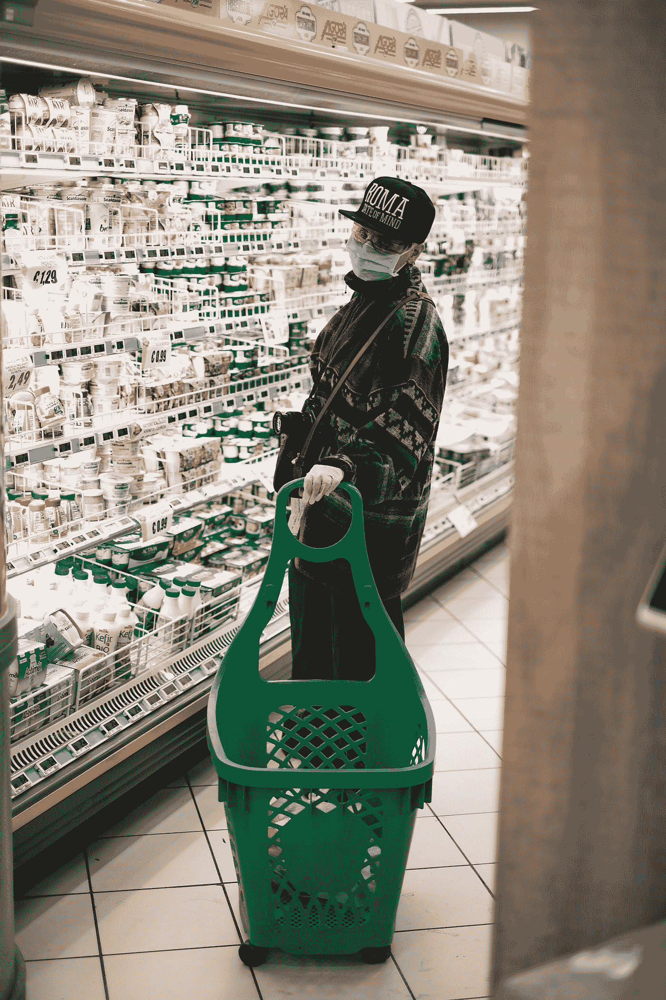
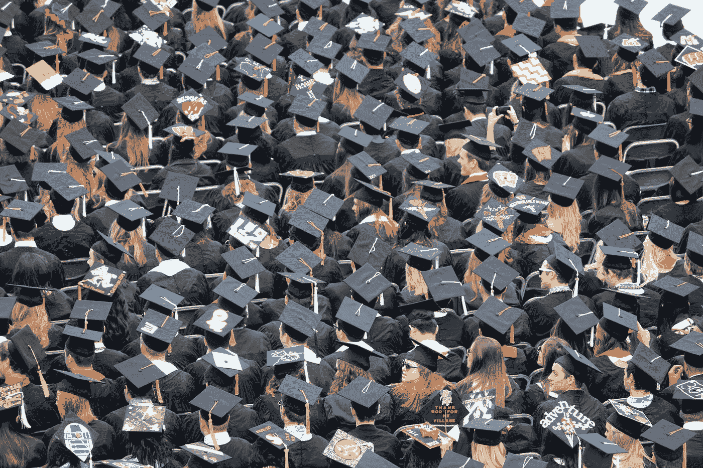

# 民主和市场在疫情之下

> 原文：<https://medium.datadriveninvestor.com/democracy-free-enterprises-and-pandemic-d564f46bda15?source=collection_archive---------18----------------------->

## 政治

Photo by [Giuseppe Argenziano](https://unsplash.com/@geppi?utm_source=medium&utm_medium=referral) on [Unsplash](https://unsplash.com?utm_source=medium&utm_medium=referral)

在权力、资源分配、性别平等、教育和职业等方面安排不平等的环境中，民主政治有望清除各种限制，并使人们能够平等地参与经济、政治和社会活动。用拉古拉姆·拉扬的话来说，“民主必然是心软的，而市场和自然则不是；政府行动已经/必须*不可避免地扩大以填补这一空白”。它捕捉了“受影响的世界”中的当前情绪。自由市场使经济民主化，因为它们带来了经济自由，并通过将它们转化为数百万人更强有力的政治声音而拓宽了民主的视野。

*(has)在引号中被改为(must ),因为动作尚未展开。然而，它必须很快。

> 疫情正使我们远离民主。公众对政府和企业越来越不信任，这是显而易见的。这场危机给本已不确定的时代增加了更多的不确定性。在这个变化的时代，人们越来越不能容忍变化。

虽然我们不能有一个只向少数人倾斜的系统，但同样有效的是，如果民主不是支持他们，而是给他们施加压力，企业就不能有效地工作，即使是纯粹以利润为导向的企业。我们比以往任何时候都更需要创新者，他们能够设计出分散风险的方法，将经济带回正轨。但恰恰相反，我们在这场危机中目睹的情况与此截然相反。

*像这次危机之前的所有危机一样，私营部门受到的冲击最大。*

当然，我并不是说政府应该放任他们，允许他们过度自由，承担过度风险，破坏消费者和政府的感情。我只是说，对经济学和市场原则的敌视是没有道理的，也不能完全拒绝。此外，必须谨慎地激励和抑制私营部门，以避免不必要的后果。市场和政治压力的过度需要得到控制。政治必须利用企业来帮助国家走出当前的危机。

 [## 对有商业头脑的投资者有用的行为经济学概念|数据驱动的投资者

### 在《美国企业》、《高斯统计》、《我们周围世界的确定性解释》和《理性…

www.datadriveninvestor.com](https://www.datadriveninvestor.com/2020/07/09/helpful-behavioral-economics-concepts-for-the-business-minded/) 

*在做上述事情时，需要深谋远虑和审慎，因为私营部门的目标与政府的目标不同，这可能反映了意图和结果之间的差距。如果我们要避免这种情况，就需要做出更长远、更少意识形态、更勇敢、更痛苦的选择。*

对于常规的**时间**我们需要的是，

**适度自由的市场+自由流动的金融+合适的政治结构**

疫情危机提供了一个与其他金融危机略有不同的故事，因为金融动荡只是一个后果，是由更重大的健康危机引起的。尽管如此，它与 2007 年的经济危机有许多相似之处，事情正在变得糟糕，就像每次金融危机一样。

对于**大流行，**我们需要:

**适度自由的市场+自由流动的财政刺激+金融+合适的政治结构+科学和事实支持的公共政策。**

谁是*其他* ***危机的*** *易替罪羊？* **外国移民和非法移民**。当人们无法逃避时，这种情况发生的可能性更大，因为政府也没有对他们的问题做出回应，他们看到自己的未来很黯淡。他们视其为威胁。由于移民没有/不能投票，不能表达自己的意见，也不能保护自己，所以他们很容易成为猎物。但它们对经济至关重要，因此不能轻易放弃，原因如下:

a.移民:他们为任何发达国家的公民都不愿做的工作提供服务。

b.**外籍工人**:他们拥有**“技能和专业知识”**，这是任何特定的地理位置(大多数发达国家)本身无法提供的。

我们必须找到更好的、真正的解决方案，而不是找替罪羊。

> ***“寻找替罪羊是所有狩猎探险中最容易的”***
> 
> ***德怀特·戴维·艾森豪威尔。***

> 这场危机的确是系统性的，但它也产生于特定的人物和机构，来自国内和国外，来自像你我这样的公民。我们不能为自己脱离社交媒体的自私个体开脱。

虽然许多压力增加了经济负担，如贸易不平衡、卫生基础设施赤字和金融繁荣，但这一次是经济体之间的相互依赖造成了灾难。我们可以通过财政刺激、资本注入和救助的组合来克服其中的一些困难。但从长远来看，我们必须永久性地解决问题，以避免面临类似甚至更大的危机。我们必须有更透明的金融系统、更多的数据隐私和不受阻碍的基本收入，尤其是在这种健康危机期间。

Photo by [Good Free Photos](https://unsplash.com/@goodfreephoto_com?utm_source=medium&utm_medium=referral) on [Unsplash](https://unsplash.com?utm_source=medium&utm_medium=referral)

托克维尔人口政策对受教育程度较低的人来说是一个诱饵，因为他们更重视自己的国籍身份。另一方面，受过良好教育的人将他们的自尊和身份[【1】](#_ftn1)与他们的职业联系在一起，因此可以在问题上被说服并被科学说服。

同样的一个例子:

观察到的情况是，特定人群以及领导人都表示厌恶戴口罩。这是一个典型的例子

a. ***人口政策*** :领导人试图捕捉民众(所谓民族主义者)的情绪。

b. ***不利参与民主*** :它可能发生在两种情景 1。当它是来自上面(来自政府)的强迫，人们不同意它，这看起来不像美国巴西这样的国家的情况。2.当人们披着民主的外衣，为不正当的理由要求他们的权利和自由时。它看起来更适合我刚才提到的两个国家。

> 我们需要更好的选民，因为他们为民主定下了基调。他们需要更好地了解情况、参与和奉献，就像他们希望政府做到的那样。他们可以讲道理，因此政府方面更容易做出艰难的选择。我们需要更多勇敢的科学家、医生、专家和研究人员，他们说他们必须做什么，什么是什么，不要受到任何压力，那些不畏缩说皇帝确实没穿衣服的人。

[【1】](#_ftnref1)(科利尔公司)

**访问专家视图—** [**订阅 DDI 英特尔**](https://datadriveninvestor.com/ddi-intel)