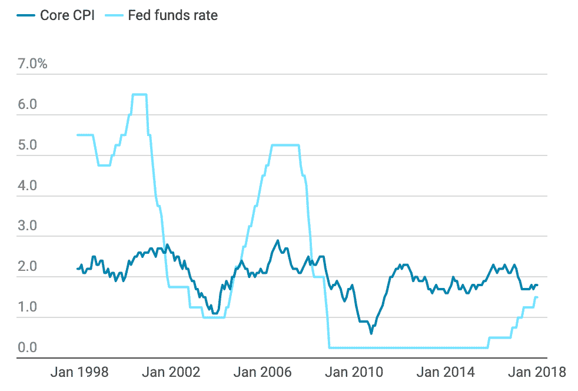
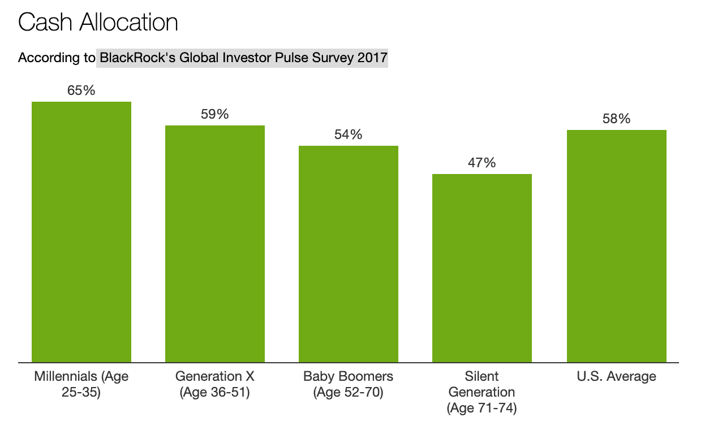
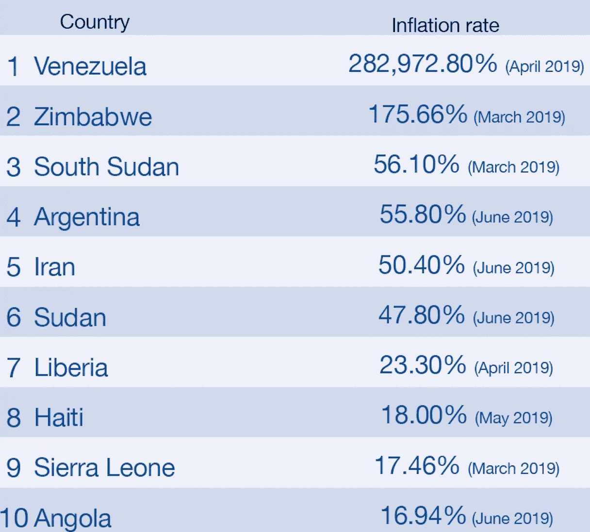

# 金融机会的民主化

> 原文：<https://medium.datadriveninvestor.com/democratization-of-financial-opportunity-78e4eeef87a4?source=collection_archive---------12----------------------->

## *并非所有的投资机会都是平等创造或分配的*

随着全球化的加速，投资者看到他们可以利用的机会类型显著增加。从衍生品、艺术、风险资本到其他领域，投资一直是一个充满活力的领域。不幸的是，虽然这些机会可能是新的，但对谁可以获得这些机会的旧的、武断的限制仍然存在。

世界各地的政治和结构性问题仍然阻碍许多投资者参与最佳投资机会。这是一个多方面的问题。作为案例研究，我们将重点关注美国市场，以突出其中的一些方面，但同样的想法也适用于大多数发达经济体。

# **持续的低利率限制了投资机会**

首先，在发达市场，自 2008 年衰退以来持续的人为低利率支撑了公开市场的资产价格，因为廉价资本寻求储蓄或债券市场无法获得的收益率。这对那些投资于公共股票的人来说是个福音，而对那些持有储蓄资金的人来说则是个灾难。

**Figure 1: CPI vs Fed rates over 20 years (**[Investopedia](https://www.investopedia.com/ask/answers/12/inflation-interest-rate-relationship.asp))

来自美国美联储[的官员预计](https://www.ft.com/content/84a1b13c-b2a3-11e9-8cb2-799a3a8cf37b)长期利率将停留在 2.5%，剔除 2%的通胀影响后，投资者的实际回报率仅为 0.5%。相比之下，2000 年代中期和 90 年代的实际利率接近 3-4%(图 1)。

**Figure 2: Cash Allocation By Generation (**[**BlackRock**](https://www.investopedia.com/news/millennials-are-risk-averse-and-hoarding-cash/)**)**

实际上，近十年的低美联储利率实际上意味着负的实际(通胀后)储蓄率。这对年轻一代，特别是千禧一代产生了显著影响，他们中的大多数人都厌恶风险，经历了 2008 年的衰退，选择囤积现金而不是投资(图 2)。

老一代人和那些有投资手段的人利用低利率获得了越来越大的优势。资本洪流将公共股票市场推至历史高点，仅在 2019 年，标准普尔 500 指数和纳斯达克指数就上涨了 25%。这意义重大，尤其是考虑到过去十年的平均回报率为

13.8%.与股市一样，截至 2019 年年中，美国整体经济[官方](https://www.cnbc.com/2019/07/02/this-is-now-the-longest-us-economic-expansion-in-history.html)记录了历史上最长的扩张期，极大地丰富了那些拥有其中一部分的人。

然而，超过 50%的美国人没有股票，因此没有分享收益。T4 最富有的 1%的美国人现在拥有的财富相当于中产阶级和中上层阶级的总和。这种金融机会的集中已经转化为按年龄和财富等级划分的极度财富不平等。

# 私人机会变得越来越有吸引力，但只对富人开放

第二，随着公共资产价格上涨和储蓄率保持在低位，提供诱人收益的投资选择变得更加有限，导致资本提供者急于在私人市场寻找选择。

顾名思义，私募市场是排他性的，充满了各种障碍，如高投资下限、法律认可和长锁定期，这些都限制了散户投资者的参与。

房地产、风险资本或对冲基金等另类投资的最低投资额通常在 10 万美元以上，这完全超出了普通投资者的投资范围。除了最低限额之外，尤其是在美国，只有合格的投资者才能投资另类投资。要成为合格投资者，你需要拥有至少 100 万美元的净资产，或者年收入超过 20 万美元。这意味着大多数美国人在法律上被排除在某些投资之外，根据 SEC 的估计，这些投资占美国人口的 96%。

这些结构性限制使得另类投资发行者筹集资本的成本很高，也限制了公众对许多投资的参与。

# **新兴市场的投资者被排除在全球投资机会之外**

阻止许多投资者参与最佳投资机会的第三个因素是地理因素，这超出了进入私人市场的问题。到目前为止，我们只谈到了发达经济体缺乏金融包容性；在新兴市场的同行中，金融包容性的缺乏甚至更加明显。

新兴市场投资者的财富主要是因为高通胀的负面影响而缩水的。此外，由于资本管制等监管因素或高跨境支付成本等结构性金融问题，他们被排除在有前途的投资机会之外。

[World Economic Forum, Trading Economics](https://www.weforum.org/agenda/2019/08/inflation-deflation-venezuela-global/)

委内瑞拉和辛巴威的经济在今年被恶性通货膨胀摧毁，目前的年通货膨胀率分别高达 10 000%+ 和 [500%+](https://www.fin24.com/Economy/Africa/long-qeues-form-in-harare-as-zimbabwe-releases-new-bank-notes-coins-20191112) 。如果你想从新兴市场撤资，跨境支付的平均成本可能[远高于汇款金额的 10%](https://www.worldbank.org/en/news/press-release/2019/04/08/record-high-remittances-sent-globally-in-2018) ，这严重限制了这些市场的全球投资机会。

新兴市场严格的资本管制也限制了当地投资者的投资选择。资本管制主要被政府用来限制资本外流和管理外汇汇率。中国可能是限制性资本管制最著名的例子，公民每年只被允许向国外转移 5 万美元，并被拒绝向海外汇款，原因很模糊，比如年龄太大。最近，控制变得更加严格，限制购买外国财产或保险。这使得投资者高度暴露于当地经济的表现，几乎没有机会分散他们的财富。

由于新兴市场的投资选择有限，加上高通胀、汇款成本和限制性资本管制的影响，许多投资者转向数字资产作为投资选择也就不足为奇了。南非、尼日利亚和加纳的全球加密资产拥有率最高，分别为 10.7%、7.8%和 7.3%。赚取回报和保护资本的愿望使新兴市场投资者面临不必要的风险。

这三个方面的最终结果是，一整类投资者被系统性地排除在金融机会之外。在其他有害影响中，这加剧了日益加剧的不平等，因为这实际上允许富人变得更富，同时剥夺了其他人受益的机会。

# **面向全球新投资者的新投资平台**

然而，我们 Invictus Capital 认为，这些投资者(来自发达市场和新兴市场)不应因地理或财富障碍而被排除在这些投资机会之外。

我们建立了一套令牌化的基金产品，通常只提供给高净值或机构投资者。我们的基金代表了广泛的另类投资资产类别，包括私人信贷、风险资本、数字货币和能源基础设施。通常情况下，由于高最低限额和多年锁定等因素，这些类别排除了大多数投资者的参与。我们寻求通过我们的投资平台来改变这种模式。

我们使用基于区块链的层和简单直观的用户界面开发了我们的平台。这种结合为我们的社区提供了无与伦比的好处:

*   **即时入职。**我们的平台面向全球投资者，唯一简单的要求是互联网连接和浏览器。投资者入职是完全自动化的，可以在几分钟内完成。
*   **24/7 流动性**。传统基金的认购和赎回可能需要几天甚至几周时间。使用智能合约，我们为投资者提供了在几小时内赎回投资的能力，而不是几天。
*   **无最低投资额**。我们已经促成了数百笔不到 10 美元的小额投资进入投资产品，这些投资产品通常只有极其富有的人才能获得。
*   **透明度。**传统资产管理公司依靠中央托管人来管理资产持有。区块链允许个人持有自己投资的钥匙，并增加了一层额外的公共透明度，使投资者能够跟踪可用代币的数量及其持有人。

这种功能对于实现金融服务的包容性、民主性至关重要。在我们最近与我们的社区开展的一项调查中，我们收到的反馈反映了这些好处。

主要发现是:

*   74%的受访者表示不信任银行或当地投资机构。
*   80%的投资者倾向于进行本币以外的投资；
*   50%投资于我们的基金，以保护储蓄免受当地通货膨胀的影响。遭受恶性通货膨胀的地区的投资者依赖于不以当地货币计价的投资，以保护资本价值。

我们的平台通过以极低的成本提供全球投资机会，为打破传统资产管理行业提供了一个强有力的机会。根据德勤的一项研究，区块链理工大学可以减少高达 80%的基金管理费。

我们在利用这一转变方面具有独特的优势，迄今为止，我们已经开发了基于区块链的平台，并推出了 5 只令牌化基金。我们的社区由来自 15 0 多个国家的 15 000 名散户投资者组成，他们在多个基金中累计投资超过 4000 万美元，帮助我们引领通往更具金融包容性的世界的道路。我们希望通过跨多个资产类别提供更多创新产品来扩展这一愿景。

今天，未来的一瞥就在眼前——有了 Invictus Capital，你只需一部智能手机和一个互联网连接，就可以在世界任何地方积累财富，我们希望借此向弥合全球金融平等的巨大差距迈进一步。

要了解更多，请访问 Invictus Capital [网站](https://invictuscapital.com/)或我们的社交渠道: [Telegram](https://t.me/invictus_capital/) 和 [Discord](https://discordapp.com/invite/QwaFrxX) 。

*亲切问候，
尼克&*[*无敌资本*](https://www.invictuscapital.com/) *团队*