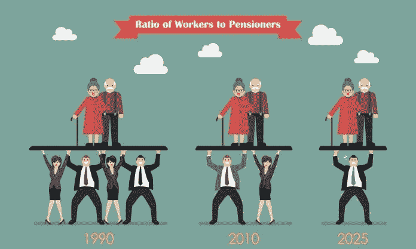

# 人口经济学:研究消费和储蓄模式的变化

> 原文：<https://medium.datadriveninvestor.com/demographic-economics-studying-the-changing-patterns-of-consumption-and-saving-491c1b03cd53?source=collection_archive---------24----------------------->

## 从根本上说，一个经济体总收入的很大一部分是由消费和储蓄模式构成的，这种消费和储蓄模式受到该国人口老龄化和不断变化的人口结构的高度影响。

整个世界是一个舞台，所有的男男女女不过是演员而已。

这就是威廉·莎士比亚如何在世界和舞台、演员和演员之间创造了一个无与伦比的类比。巧合的是，即使是现代经济学也将男性和女性视为“理性参与者”。

但是，所有的“玩家”对经济的贡献是一样的吗？如果不是，那么我们如何将他们分类？这个问题的答案是非常主观的，取决于一个人的研究领域是什么，或者一个人试图定义和从中得出什么。

要研究一个经济体的消费和储蓄模式，首先必须按照经济活动对整体人口进行分类。这就形成了两个群体——工作年龄人口和非工作年龄人口。工人或独立人士被归类为 15 至 65 岁年龄组的人。剩下的人包括不工作或受抚养的人口，即 15 岁以下和 65 岁以上的人。这种 T2 分类被人口学家广泛使用。

 [## 如果资本主义失败了，那么还有什么选择呢？数据驱动的投资者

### 在当前政治领域的修辞之旅中，我们都可以面对面地接触到流行词汇，如…

www.datadriveninvestor.com](https://www.datadriveninvestor.com/2020/03/16/if-capitalism-is-a-failure-then-what-is-the-alternative/) 

这种依赖必然是金钱上的，因为可以简单地根据收入能力来分配群体。非工作人口没有就业，对收入没有贡献，但消费水平高。新生儿需要产前护理和及时免疫，这是相当昂贵的。随着他们的成长，学校教育和医疗保健是重要的支出领域。然后是昂贵的高中学费。在 15 岁之前，当他们可以就业时，他们被称为依赖者。另一部分受抚养人是退休的老年人。这些孩子需要和他们小时候一样多的照顾。但是，在这种情况下，退休基金和养老金可以充当储蓄；但是它们不足以支撑他们可能会经历的慢性病或大手术。

在消费方面，这些依赖者走极端了。为了支持他们，工人阶级开始发挥作用。毕竟，他们是自己孩子的父母或者(和)他们年迈父母的孩子。一项广泛的研究表明，非受抚养人的消费与收入的比率要低得多，而且他们往往储蓄更多。这些储蓄由家属消费使用。储蓄增加的另一个原因是预期寿命的延长，因此为未来储蓄会导致他们现在减少消费。

迄今为止，非受抚养人是主要储户，受抚养人是主要消费者。

更进一步说，经济学一如既往地提供了一个合理的理论。人口转变理论提供了一个类似的框架来看待这个问题。它明明白白地说，非发达国家出生率高，死亡率高；发展中国家出生率高，但死亡率较低；发达国家的出生率和死亡率都很低。

我们可以说，随着国家的发展，由于家庭的生育选择，出生率没有那么灵活。缺乏适当的社会保障和保险市场，导致更多的人出生，以便有更多的手去工作和获得最低工资。相反，随着医疗保健的可及性和可负担性的提高，死亡率会降低。这使得这个国家有大量的工作年龄人口，从而有大量的劳动力供应。

随着一个国家的发展，其死亡率降低，它观察到不可避免的人口激增。因此，随着高储蓄导致高投资，经济和人口一起增长。这种高投资带来了更好的基础设施、服务和就业机会，从而增加了人口对劳动力的需求。所以人口增长可能根本不是一个坏问题！它有利于进一步投资，甚至使经济拥有更多的人力资本。

> 也就是说，它甚至增加了人口对经济资源的负担。然而，如果充分利用其潜力，它可能会创造一个“*人口红利*，而不是“*人口灾难”*。

没有印度和中国的比较，这样的分析是不完整的。显而易见的原因是，这两个国家在形成时期都经历了人口激增，并因其人口红利而成功地保持了增长。据说，印度的人口增长将持续到 2030 年，如果有明智的人口政策，它可以利用这一点成为人口红利。政策制定者应考虑为教育政策、卫生政策、劳工政策以及银行和保险设施奠定坚实的基础。

甚至农作物保险也能极大地改善农村农民的生活。同样，老年社会保障将有助于穷人不要认为他们的未来会像现在这样暗淡。它将以稳定的方式确保降低出生率，因为对儿童的依赖将会减少，而且可以简单地避免在儿童成长时期的支出。

另一方面，在中国，我们现在看到更多的老年人口。一部分功劳归于臭名昭著的独生子女政策。然而，他们利用当时巨大的人口潜力，发展了广泛的制造业和服务业主导的经济。现在，他们被要求用不断增长的依赖人口来维持它。

这引起了严重关切。当人们变老时，他们会变得懒惰吗？它们确实增加了大量消费，并从储蓄中提取了大量资金，否则储蓄本可以成为一项投资。两个经济问题在这里可以很自然地被识别出来，一个是赚钱养活自己的能力下降，另一个是对公共卫生保健设施的利用增加。老年人健康状况的恶化导致支付更高的保险费和在药品上的大量支出。这种巨大的支出完全取代了收入，通常被称为收入替代。比以往任何时候都高的预期寿命只会让老年人的情况变得更糟。

或者，它们甚至在衡量一个经济体的发展参数方面发挥积极作用。公共卫生设施和保险覆盖面越好，预期寿命就越长。养老金和养老基金越好，老年人的消费前景就越好。各种关爱老年人的服务覆盖面越广，老年人的生活方式就越好。所有这些与建设新的道路、桥梁、购物中心和办公场所同样重要。

否则，老年人将被遗忘；*没有牙齿，没有眼睛，没有味道，没有一切。*

***原载于 2020 年 4 月 3 日*******。****