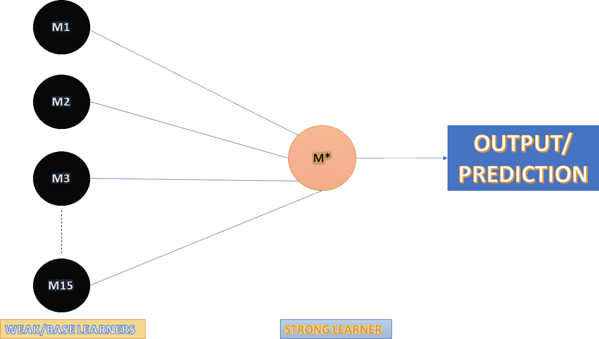
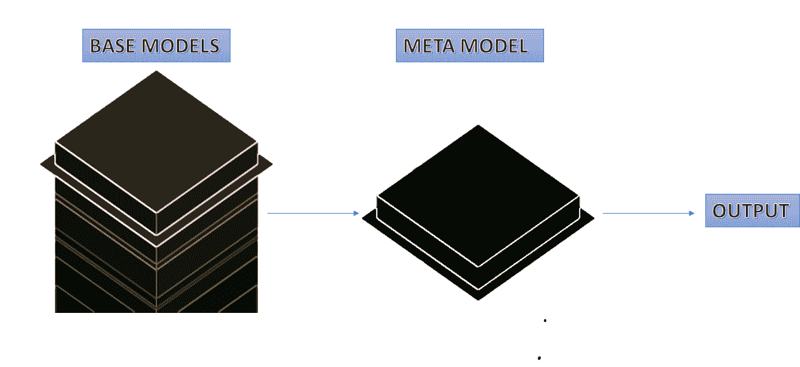

# 揭开集成学习的神秘面纱:一种非正式的方法

> 原文：<https://medium.datadriveninvestor.com/demystifying-ensemble-learning-an-informal-approach-6ed7a4e9b6f1?source=collection_archive---------27----------------------->

在本文中，我将试图揭开集成学习概念的神秘面纱。熟悉机器学习的人都会听说过一个非常流行的算法，叫做随机森林，是集成学习的一个例子。我将尝试提供一些例子，在它们的帮助下，我们将建立集成学习的基础，最后讨论一些算法。

那么，合奏这个词是什么意思呢？根据谷歌的说法，ensemble 被定义为“一组被视为整体而非单独的项目”。这个定义是不言自明的，但是为了机器学习的目的，我们将看一个例子。

说你想学机器学习。你有两个资源，一本书和一个视频课程。这两种资源本身都很好。您需要在这里做出决定，但由于您是初学者，您不知道应该选择哪种资源。所以，你向你大学的教授询问此事。他告诉你去上这门课。同样，你问你的一个朋友，他更喜欢这本书。以同样的方式，你问，说 15 个人，不同的人有不同的意见。你也可以选择。

这个例子还不完整，但是让我们把它和机器学习联系起来。很明显，这是一个分类问题，目标变量有两个选择书或课程。让我们把你问的每个人都想象成从 M1 到 M15 的机器学习模型。每个模型 Mi 将有一个输出，它对应于人们的选择。现在，假设第五个人或模型 M5 是你蒙着眼睛信任的人，你选择他选择的资源。所以，在这种情况下，你只能根据一个模型来选择。

你可以做的不同的是，你可以获得 15 个机器学习模型中每一个的输出或决策，并以某种方式试图总结它们，最后自己做出决定，考虑这 15 个输出。这就是集成学习的核心。你的目标是做出最好的决定。所以，让我们说，当你基于多个输出做出决策时，相对于其他 15 个决策者，你正在成为该领域中更强的决策者。因此，你将被称为强学习者，而你从中获得灵感的 15 个模型将被称为弱或基础学习者。

那么工作流程是什么？首先，弱学习者或基础学习者给出他们的输出。然后，强学习者的目标是基于弱学习者的输出进行预测。最后，强学习者给出它的输出。

所以，让我们从技术角度来看集合学习。下图解释了集成学习的概念。现在你知道什么是基础学习者和强学习者，我们可以继续了。所以，看看下面这张图。左边是一堆圆圈，标记为基础学习者。这是您将从中获取输出的 15 个模型。蓝线表示输出被右边的圆圈接收，这是强学习者。最后，强学习者做出预测。这里需要注意的一件重要事情是，数据集显示给每一个模型，包括强学习者。

那么，为什么要集成学习呢？我什么时候使用集成学习？在回答什么时候的过程中，我们会得到为什么的答案。所以，首先，在我们的日常生活中，如果我们问不止一个人一个问题，我们会得到不同的视角，这有助于我们更好地回答这个问题。如果我们只问一个人，我们只会得到一个观点。所以，通常，我们可以说，获得更多的视角会让我们视野更开阔，总体来说也更好。类似地，使用几个模型的结果比使用一个模型的结果更好，尤其是当模型的精度低于预期时。在这种情况下，集成学习可以组合这些模型来创建具有更高准确度的新模型。集成学习基本上遵循两个原则中的一个或两个——“多样性中的统一”和“统一就是力量”。

你可能会想为什么我们一开始就要用弱学习者而不是强学习者呢？嗯，关于弱学习者的事情是，用外行的话来说，他们对我们要解决的问题的特定部分有把握。因此，公平地说，它们具有低方差和高偏差。因此，他们不会过度拟合训练数据。另一方面，一个强大的基础学习者可能会过度拟合数据，这将导致测试阶段任何指标的更差性能。因此，为了避免这个问题，我们使用弱学习者作为基础学习者。

让我们看看一些基本的集成学习技术。

**随机森林**

就像现实生活中的森林是树的集合一样，机器学习中的随机森林是决策树的集合。这是最常用的集成学习技术之一。基本上，通过引导原始数据集来创建新数据集，然后将这些新数据集传递给多个决策树。您可以从这里的文档中查看许多超参数。

 [## 机器学习和人工智能如何改变电子商务的面貌？|数据驱动…

### 电子商务开发公司，现在，整合先进的客户体验到一个新的水平…

www.datadriveninvestor.com](https://www.datadriveninvestor.com/2020/11/19/how-machine-learning-and-artificial-intelligence-changing-the-face-of-ecommerce/) 

因此，每个决策树为一个测试用例给出一个输出，最后模型根据所有决策树的输出决定输出。

**投票**

其中一个想法是在做出预测之前对所有模型进行投票。一般来说，有两种投票方式——硬投票和软投票。

硬投票通常用于分类问题。它采用所有模型给出的大部分预测，并给出某个数据点的大部分类别作为预测。假设我们有 5 个模型，对于一个测试案例，如果 4 个模型说是，1 个模型说不是，输出将是一个是，因为它有最多的投票。

另一方面，软投票可以用于回归和分类问题。我们知道，对于任何分类任务，任何机器学习模型实际上都给出了某个测试用例属于某个类的概率。在软投票中，我们取所有这些概率的平均值，最后给出具有最高概率的类作为输出。对于回归任务，预测的平均值作为最终输出。

也可以应用诸如将权重分配给一些模型的预测，然后采用加权投票或加权平均的方法。

**堆叠**

堆叠是用于提高任何指标(回归的均方根误差和分类任务的准确性)性能的方法之一。堆叠与其他技术是分开的，因为它使用了一个额外的元模型，这就是元模型。元模型的任务基本上是学习如何最好地组合前一步中基础模型所做的预测。通常，如果投票方法在某个指标上表现不佳，就会使用堆叠。

这些是一些集成学习方法。还有许多其他的没有在这篇文章中讨论，比如 bagging 和 boosting。这篇文章的主要目的是向读者介绍集成学习的概念，为什么需要集成学习，以及一些基本的集成学习技术，我希望这些已经实现了。

## 获得专家视图— [订阅 DDI 英特尔](https://datadriveninvestor.com/ddi-intel)