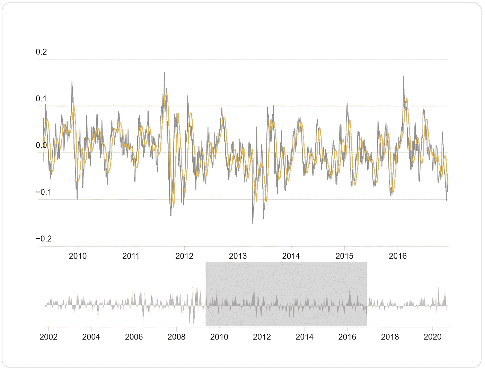
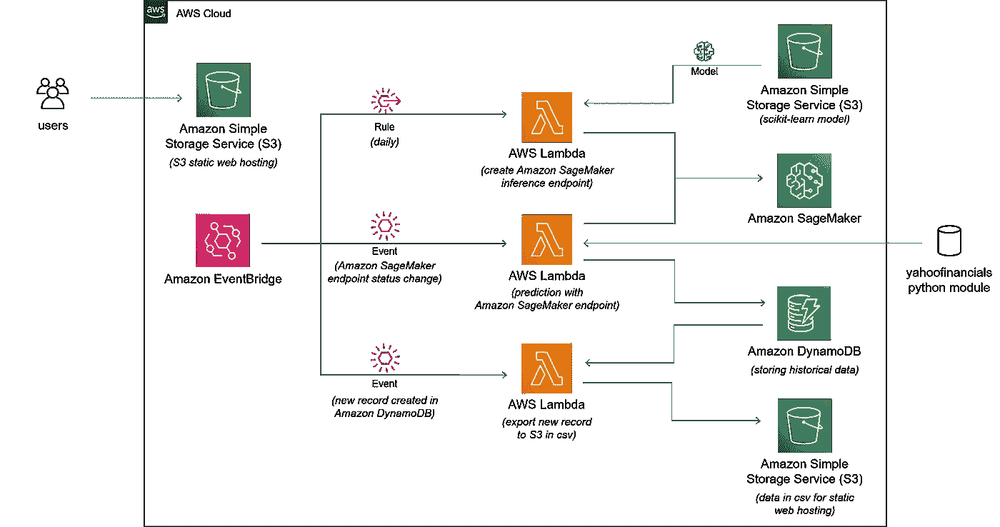

# 以经济高效的方式部署和可视化机器学习模型

> 原文：<https://medium.datadriveninvestor.com/deploy-and-visualize-machine-learning-model-in-a-cost-effective-manner-9f9654e93058?source=collection_archive---------6----------------------->

在 AWS 无服务器平台下构建、训练、部署和可视化黄金价格预测的机器学习模型


这篇文章的目的是演示如何在机器学习中使用 AWS 无服务器平台。在这个 [web 应用](http://kylui.com)中，从构建、训练、部署和可视化机器学习模型性能到黄金价格预测，全程使用 AWS 服务。

无服务器计算允许您构建和运行应用程序和服务，而无需考虑服务器。使用无服务器计算，您的应用程序仍然在服务器上运行，但是所有的服务器管理都由 Amazon Web Services (AWS)完成。使用 AWS 及其无服务器平台，您可以在经济高效的服务上构建和部署应用程序，这些服务提供内置的应用程序可用性和灵活的伸缩能力。这使您可以专注于您的应用程序代码，而不是担心供应、配置和管理服务器。

# **建了什么**

已经构建了一个 [web 应用](http://kylui.com)来可视化机器学习模型在亚马逊 S3 静态托管下使用 D3 进行黄金价格预测的性能。D3.js 是一个 Javascript 库，帮助您使用 HTML、SVG 和 CSS 将数据变成现实。亚马逊 S3 是一个对象存储，带有一个简单的 web 服务接口，可以从 web 上的任何地方存储和检索任何数量的数据。要使用 S3 的静态网站，你只需上传文件到 S3 桶，并配置您的 S3 桶为虚拟主机。

在 [web 应用](http://kylui.com)中，一些用 D3.js 制作的简单图表，用来可视化使用 AWS SageMaker 构建的机器学习模型的性能。你可以在我的[网络应用](http://kylui.com)中找到 20 天远期回报的图表。灰色线代表实际市场价值，而橙色线是预测价值。



我喜欢 D3 的一个特性是画笔和缩放，使用交互性可以让你更详细地探索数据的内容。在 [web 应用程序](http://kylui.com)中，您可以通过移动或调整灰色框的大小来缩放 X 轴的一部分。下图是以美元计算的黄金价格。


interactive chart for gold price prediction with D3

世界市场上的黄金价格是非常不稳定的，并且取决于许多不容易建模的外部因素。当前的模型并不完美，但希望你发现使用 AWS 无服务器平台构建应用程序的方法是有用的，并帮助你开始使用自己的应用程序。

由于 AWS S3 只能向您的网站访问者提供 HTML、JavaScript、图像、视频和其他文件，并且不包含服务器端应用程序代码，所以所有需要的服务器端逻辑都必须构建在后端。我将在接下来的小节中进一步阐述应用程序架构。

[](https://www.datadriveninvestor.com/2020/08/27/what-is-a-data-catalog-and-how-does-it-enable-machine-learning-success/) [## 什么是数据目录，它如何使机器学习取得成功？数据驱动的投资者

### 数据目录是机器学习和数据分析的燃料。没有它，你将不得不花费很多…

www.datadriveninvestor.com](https://www.datadriveninvestor.com/2020/08/27/what-is-a-data-catalog-and-how-does-it-enable-machine-learning-success/) 

# 看看引擎盖下面

[web 应用](http://kylui.com)使用亚马逊 SageMaker、AWS Lambda、亚马逊 DynamoDB、亚马逊简单存储服务(S3)、AWS Cloud9 和亚马逊 EventBridge。



application architecture

**构建、训练和调优机器学习模型** : Scikit-Learn 隶属于 AWS SageMaker，用于构建和训练黄金价格预测模型。AWS SageMaker 是一个完全托管的服务，为每个开发人员和数据科学家提供快速构建、训练和部署机器学习(ML)模型的能力。SageMaker 从机器学习过程的每个步骤中移除了繁重的工作，从而更容易开发高质量的模型。具体情况你可以参考我之前发表的一篇[的文章](https://medium.com/@ryankylui/prediction-gold-price-using-machine-learning-eba28313227d)。

[](https://medium.com/@ryankylui/prediction-gold-price-using-machine-learning-eba28313227d) [## 利用机器学习预测黄金价格

### 在 AWS Sagemaker 下使用 Scikit-Learn

medium.com](https://medium.com/@ryankylui/prediction-gold-price-using-machine-learning-eba28313227d) 

**(Lambda 1)使用 Lambda 部署机器学习模型:** AWS Lambda 是 AWS 无服务器平台的关键组件之一，它允许您通过触发器运行代码，而无需供应或管理服务器。在后端，我大量使用 AWS Lambda 来准备所有数据，以方便 [web 应用](http://kylui.com)。

在我构建的 web 应用程序中，黄金价格预测每天只需要一次。一种更具成本效益的方法是构建一个 AWS Lambda 函数，通过每天创建一次 Amazon SageMaker 端点来部署一个存储在 AWS S3 中的经过训练的 Scikit-Learn 模型，该端点将在所有必需的任务完成后被删除。

虽然 AWS Lambda 是关键组件之一，但处理外部库可能很棘手，压缩代码的 50MB 大小限制使事情有点复杂。在我的 web 应用程序中，AWS Lambda 应用程序是 Lambda 函数、事件源和其他一起执行任务的资源的组合，是用 AWS Cloud9 开发的。

在 AWS Cloud9 终端中，运行这个命令来安装所需的模块。安装模块后，它们会填充 Lambda 函数的父文件夹。

```
python -m pip install --target=./ ModuleName
```

现在，它已经准备好进行编码，以使用存储在 AWS S3 中的 Scikit-Learn 训练模型和配置来部署机器学习模块。下面的 Lambda 函数的代码只是部署了一个机器学习模型作为 AWS SageMaker 端点，用于进一步的黄金价格预测。

```
from sagemaker.sklearn.model import SKLearnModel

EXECUTION_ROLE = 'YOUR_EXECUTION_ROLE'
FRAMEWORK_VERSION = '0.23-1'
artifact = 'S3_LOCATION_FOR_SCIKIT_MODEL'def create_endpoint(endpoint_name, config_name):
    try:
        model = SKLearnModel(model_data=artifact, role=EXECUTION_ROLE, entry_point='script_model.py', framework_version=FRAMEWORK_VERSION)
        predictor = model.deploy(endpoint_name=endpoint_name, instance_type='ml.c5.large', initial_instance_count=1)
        return 'Success'
    except Exception as e:
        print(e)
        raise(e)def lambda_handler(event, context):
    endpoint_name = 'NAME_OF_YOUR_ENDPOINT'
    config_name = 'ENDPOINT_CONFIG_IN_SAGEMAKER'
    create_endpoint(endpoint_name, config_name)
```

一旦 AWS Lambda 函数通过 AWS Cloud9 发布，就必须创建一个触发器来调用该函数。通过 Amazon EventBridge 控制台创建一个每天触发的 EventBridge 规则在我的例子中，指定一个 cron 表达式来定义何时触发 AWS Lambda 函数。

下面的 cron 表达式在我的应用程序中用于创建一个 AWS Sagemaker 端点，每天 05:00 am (UTC)进行黄金预测，该预测由另一个 AWS Lambda 函数处理。

```
cron(0 05 ? * MON-SAT *)
```

**(Lambda 2)用新创建的端点执行预测:**现在我们要开发另一个 AWS Lambda 函数，使用前面的 AWS Lambda 函数创建的 AWS SageMaker 端点来执行黄金价格预测。

同样，AWS Cloud9 环境用于部署 AWS Lambda 功能。首先从 yahoofinancials 模块中检索当天黄金价格和美元指数，然后使用 SKLearnPredictor 做预测并将预测数据放入 Amazon DynamoDB 中，最后删除 AWS SageMaker 端点。用于预测的特征包括黄金价格和美元指数的 20、50 和 200 天移动平均线。预测值将存储在 AWS DynamoDB 中。

```
#import all required libraries such as csv, numpy...
import boto3
from yahoofinancials import YahooFinancials
from datetime import datetime, timezone, timedelta
from sagemaker.sklearn.model import SKLearnModel, SKLearnPredictorticker = ["GC=F", "DX-Y.NYB"]
names = ["Gold", "USDX"]sagemaker = boto3.client('sagemaker')
runtime= boto3.client('runtime.sagemaker')
dydb = boto3.client('dynamodb')
EXECUTION_ROLE = 'YOUR_EXECUTION_ROLE'
FRAMEWORK_VERSION = '0.23-1'
artifact = 'SCIKIT_MODEL_IN_S3'
bucket = 'S3_BUCKET'
endpoint_name = 'SAGEMAKER_ENDPOINT_NAME'
config_name = 'SAGEMAKER_ENDPOINT_CONFIG'
table_name = 'DYNAMODB_TABLE_NAME'#get the current day gold price
def get_yf_data(start_date, end_date):
    date_range = pd.bdate_range(start=start_date,end=end_date)
    values = pd.DataFrame({ 'Date': date_range})
    values['Date']= pd.to_datetime(values['Date'])

    for i in ticker:
        raw_data = YahooFinancials(i)
        raw_data = raw_data.get_historical_price_data(start_date, end_date, "daily")
        df = pd.DataFrame(raw_data[i]['prices'])[['formatted_date','adjclose']]
        df.columns = ['Date1', names[ticker.index(i)]]
        df['Date1']= pd.to_datetime(df['Date1'])
        values = values.merge(df,how='left',left_on='Date',right_on='Date1')
        values = values.drop(labels='Date1',axis=1)current_date = datetime.now(timezone.utc)
    if values.iloc[-1, 0].strftime('%Y-%m-%d') >= current_date.date().strftime('%Y-%m-%d'):
        values.drop(values.tail(1).index,inplace=True)

    values = values.fillna(method="ffill",axis=0)
    values = values.fillna(method="bfill",axis=0)
    cols=values.columns.drop('Date')
    values[cols] = values[cols].apply(pd.to_numeric,errors='coerce').round(decimals=1)
    return values#prepare input data for the prediction model
def prepare_predict_data(raw_data):
    raw_data['Gold/20SMA'] = raw_data[names[0]].rolling(window=20).mean()
    raw_data['Gold/50SMA'] = raw_data[names[0]].rolling(window=50).mean()
    raw_data['Gold/200SMA'] = raw_data[names[0]].rolling(window=200).mean()
    raw_data['USDX/20SMA'] = raw_data[names[1]].rolling(window=20).mean()
    raw_data['USDX/50SMA'] = raw_data[names[1]].rolling(window=50).mean()
    raw_data['USDX/200SMA'] = raw_data[names[1]].rolling(window=200).mean()
    return raw_datadef lambda_handler(event, context):
    # TODO implement
    #current_date = datetime.now(timezone.utc) + timedelta(days=1)
    current_date = datetime.now(timezone.utc)
    days_200_before = current_date - timedelta(days=300)
    raw_data = get_yf_data(days_200_before.date().strftime('%Y-%m-%d'), current_date.date().strftime('%Y-%m-%d'))

    predict_x = prepare_predict_data(raw_data)

    # get only the current date figure
    new_dydb_record = predict_x.tail(1)
    predict_x = predict_x.tail(1)
    predict_x = predict_x.drop(['Date', 'Gold', 'USDX'], axis=1)

    predictor = SKLearnPredictor(endpoint_name)

    predict_x_array = predict_x.to_numpy()
    label_predict = predictor.predict(predict_x_array)

    new_dydb_record['nextday'] = float(label_predict[0])

    vDate = new_dydb_record['Date'].iloc[0]
    strDate = vDate.strftime('%Y-%m-%d')
    numGold = float(new_dydb_record['Gold'].iloc[0])
    numUSDX = float(new_dydb_record['USDX'].iloc[0])
    numG20SMA = float(new_dydb_record['Gold/20SMA'].iloc[0])
    numG50SMA = float(new_dydb_record['Gold/50SMA'].iloc[0])
    numG200SMA = float(new_dydb_record['Gold/200SMA'].iloc[0])
    numU20SMA = float(new_dydb_record['USDX/20SMA'].iloc[0])
    numU50SMA = float(new_dydb_record['USDX/50SMA'].iloc[0])
    numU200SMA = float(new_dydb_record['USDX/200SMA'].iloc[0])
    numnextday = float(new_dydb_record['nextday'].iloc[0])

    print('new record:')
    print('strDate' + strDate)
    print('numGold' + str(numGold))
    print('numUSDX' + str(numUSDX))
    print('numG20SMA' + str(numG20SMA))
    print('numG50SMA' + str(numG50SMA))
    print('numG200SMA' + str(numG200SMA))
    print('numU20SMA' + str(numU20SMA))
    print('numU50SMA' + str(numU50SMA))
    print('numU200SMA' + str(numU200SMA))
    print('numnextday' + str(numnextday))

    try:
        response = dydb.put_item(
            TableName = table_name,
            Item={
                'date' : {'S':str(strDate)},
                'gold' : {'N':str(numGold)},
                'usdx' : {'N':str(numUSDX)},
                'gold/20sma' : {'N':str(numG20SMA)},
                'gold/50sma' : {'N':str(numG50SMA)},
                'gold/200sma' : {'N':str(numG200SMA)},
                'usdx/20sma' : {'N':str(numU20SMA)},
                'usdx/50sma' : {'N':str(numU50SMA)},
                'usdx/200sma' : {'N':str(numU200SMA)},
                'nextdaygold' : {'N':str(numnextday)},
                }
        )
    except Exception as e:
        print(e)    

    # Deleting Endpoint
    predictor.delete_endpoint(delete_endpoint_config=True)
```

Amazon EventBridge 是一个无服务器的事件总线，它使得使用来自您自己的应用程序的数据将应用程序连接在一起变得很容易。EventBridge 从事件源(如本例中的 AWS SageMaker)交付实时数据流，并将该数据路由到 AWS Lambda 等目标。

在第一个 AWS Lambda 函数成功创建 AWS SageMaker 端点后，此 AWS Lambda 函数将通过创建具有以下事件模式的 EventBridge 规则来传递和捕获“SageMaker 端点状态更改”事件。

```
{
"source": ["aws.sagemaker"],
"detail-type": ["SageMaker Endpoint State Change"],
"detail.EndpointName": ["ENDPOINT_NAME"],
"detail.EndpointStatus": ["IN_SERVICE"]
}
```

**(Lambda 3)将 DynamoDB 数据导出到 csv 进行静态 Web 托管:**为了简化前端开发，创建了另一个 AWS Lambda 函数，将 Amazon DynamoDB 中新追加的记录导出到 AWS S3 中的 CSV 文件。首先，在表上启用 DynamoDB 流，并将流 Amazon 资源名称(ARN)与您编写的 AWS Lambda 函数相关联。由于不需要外部库，这个 AWS Lambda 函数直接在 AWS 控制台中创建。这就容易多了。

DynamoDB 流将通过事件对象发送新记录，下面的 AWS Lambda 函数将获取记录信息并更新存储在 AWS S3 中的 csv 文件，该文件用于 web 应用程序。

```
import json
import io
import boto3def lambda_handler(event, context):
    bucket_name = 'S3_BUCKET_NAME'
    file_name = 'CSV_FILE_NAME'
    new_record = ''

    for record in event.get('Records'):
        if record.get('eventName') in ('INSERT'):
            date = record['dynamodb']['NewImage']['date']['S']
            gold = record['dynamodb']['NewImage']['gold']['N']
            usdx = record['dynamodb']['NewImage']['usdx']['N']
            gold20sma = record['dynamodb']['NewImage']['gold/20sma']['N']
            gold50sma = record['dynamodb']['NewImage']['gold/50sma']['N']
            gold200sma = record['dynamodb']['NewImage']['gold/200sma']['N']
            usdx20sma = record['dynamodb']['NewImage']['usdx/20sma']['N']
            usdx50sma = record['dynamodb']['NewImage']['usdx/50sma']['N']
            usdx200sma = record['dynamodb']['NewImage']['usdx/200sma']['N']
            nextdaygold = record['dynamodb']['NewImage']['nextdaygold']['N']
            new_record = date + ',' + gold + ',' + usdx + ',' + gold20sma + ',' + gold50sma + ',' + gold200sma + ',' + usdx20sma+ ',' + usdx50sma + ',' + usdx200sma + ',' + nextdaygold + '\n' 
            print('add new record to S3: ')
            print(new_record)

    s3 = boto3.resource('s3')
    bucket = s3.Bucket(bucket_name)
    with io.BytesIO() as data:
        bucket.download_fileobj(file_name, data)
        # add new record
        data.write(new_record.encode('utf-8'))
        data.seek(0)
        # then write back to s3
        bucket.upload_fileobj(data, file_name, ExtraArgs={'ACL':'public-read'})
```

现在，静态 web 应用程序开发已经做好了一切准备，可以可视化机器学习模型在黄金价格预测方面的性能。当前的模型可能需要进一步优化，但希望您发现使用 AWS 无服务器平台构建应用程序的方法是有用的，并帮助您开始使用自己的应用程序。

## 访问专家视图— [订阅 DDI 英特尔](https://datadriveninvestor.com/ddi-intel)