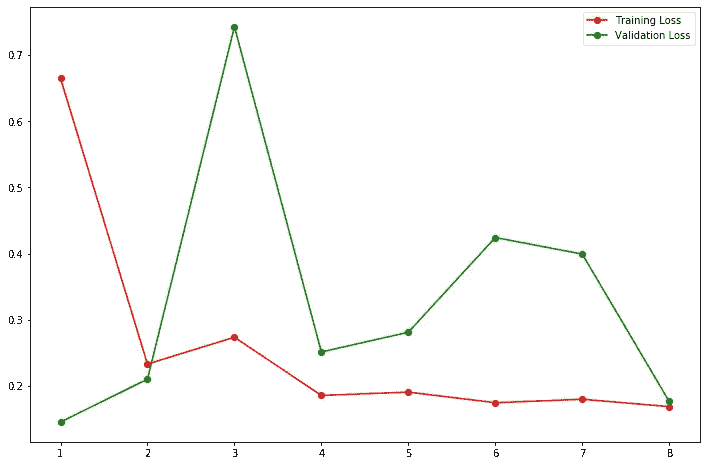
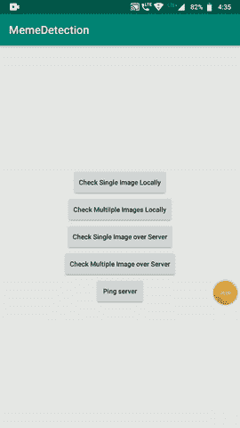

# 将 MobileNet 模型部署到 Android 平台

> 原文：<https://medium.datadriveninvestor.com/deploy-mobilenet-model-to-android-platform-2886789a7628?source=collection_archive---------0----------------------->

这篇博客是之前博客名“ [Memes Detection Android App 使用深度学习](https://medium.com/@pranaysawant22/memes-detection-android-app-using-deep-learning-d2c65347e6f3?sk=e2cf91901751bdf74512250483f3602e)”的延续。在这篇博客中，我们将在 android 环境中部署这个模型。

请浏览我之前的[博客](https://medium.com/@pranaysawant22/memes-detection-android-app-using-deep-learning-d2c65347e6f3?sk=e2cf91901751bdf74512250483f3602e)了解商业问题和这个问题的机器学习公式。

# 第二部分

在前一篇博客中，我们构建了 VGG19 模型，在这里我们将微调一个预先训练好的 MobileNet Keras 模型。

我们将从这个博客中学到什么？

*   将 Keras 模型转换为 TFLite 模型
*   在 android 平台上部署模型

下面是微调 MobileNet 模型的代码片段。

```
keras.backend.clear_session()

IMG_SIZE = 224
IMG_SHAPE = (IMG_SIZE, IMG_SIZE, 3)

mobilenet_v1 = keras.applications.mobilenet.MobileNet(include_top=False, input_shape=IMG_SHAPE, )

prediction_layer = keras.layers.Dense(2, activation=**'**softmax**'**)

flatter = keras.layers.Flatten()

model = keras.Sequential([

    mobilenet_v1,
    flatter,
    prediction_layer
])

forlayer inmodel2.layers:
    print(layer, layer.trainable)

model.summary()

model.compile(loss='binary_crossentropy',optimizer=keras.optimizers.Adamax(0.0005),
               metrics=['accuracy'])earliStop = EarlyStopping(monitor=**'**val_loss**'**, mode=**'**min**'**, verbose=1, patience=2)

history = model.fit_generator(
    train_batch,
    steps_per_epoch=20,
    epochs=13,
    validation_data=validate_batch,
    callbacks=[earliStop],
    validation_steps=10,
)
```



MobileNet graph; training loss vs validation loss

# 结果

训练 LogLoss = 0.13648
训练准确率= 96.644 %

验证 LogLoss = 0.18804
验证准确率= 95.446 %

测试 LogLoss = 0.22778
测试准确度= 95.323 %

## 将 Keras 模型转换为 TFLite 模型

```
converter=tf.lite.TFLiteConverter.from_keras_model(model)tflite_model = converter.convert()
```

然后我们可以使用下面的代码保存模型。

```
open("/content/drive/My Drive/mobilenet/best_model3.tflite", "wb").write(tflite_model)
```

注意:我们已经使用**保存了模型。tflite** 文件扩展名。

如果你知道 android 开发的基础知识，那么部署“TF-Lite”模型是微不足道的。

我们不得不欣赏[这个](https://codelabs.developers.google.com/codelabs/recognize-flowers-with-tensorflow-on-android/#6)谷歌 codelab 代码片段。


image borrow: [https://medium.com/tensorflow/using-tensorflow-lite-on-android-9bbc9cb7d69d](https://medium.com/tensorflow/using-tensorflow-lite-on-android-9bbc9cb7d69d)

## 在 android 平台上部署模型

下面的步骤会对你有帮助。

*   如上图所示，将 Keras 模型转换为 TFlite 模型后，将文件另存为。tflite 文件扩展名。
*   使用 android Studio 创建一个简单的 Android 项目。
*   在 android 项目目录下，创建一个名为‘Assets’的文件夹。
*   将“model.tflite”文件存储到“Assets”文件夹中。
*   创建一个“class_labels.txt”文件，在其中输出类别文件。在我们的例子中，它应该包含两个类别标签，即“迷因”和“非迷因”。如果你正在处理 1000 个分类问题，那么“class_labels.txt”将包含 1000 个分类标签。
*   在 google codelab 项目中有“图像分类器”。“Java”文件。供参考。它是 google codelab 案例中的解释器。**口译员**之间会谈。tflite 模型和 android /java/ c++客户端。

在 Android 中，“build.gradle”文件添加在下面几行。添加依赖关系。

```
android {
.......aaptOptions {
        noCompress "tflite"
        noCompress "lite"
    }
}dependencies {
implementation **'org.tensorflow:tensorflow-lite:+'** }
```

最后一步，只是增加了解释器类。

[](https://www.datadriveninvestor.com/2019/01/23/deep-learning-explained-in-7-steps/) [## 深度学习用 7 个步骤解释-更新|数据驱动的投资者

### 在深度学习的帮助下，自动驾驶汽车、Alexa、医学成像-小工具正在我们周围变得超级智能…

www.datadriveninvestor.com](https://www.datadriveninvestor.com/2019/01/23/deep-learning-explained-in-7-steps/) 

先来了解一下我们的**解释器**类。我们的翻译班名是 MemesClassifier.java，可以在这里找到[。](https://github.com/pranaysawant/Memes-Classification-Model-End-to-End-Solution/blob/master/AndroidApp/app/src/main/java/com/example/memedetection/MemeClassifier.java)

```
private static final String *MODEL_PATH* = "model.tflite";private static final String *LABEL_PATH* = "labels.txt";
```

低于代码负载。tflite 型号。

```
## Load .tflite model/**
     * Memory-map the model file in Assets.
     */
    private MappedByteBuffer loadModelFile(Context activity) throws IOException {
        AssetFileDescriptor fileDescriptor = activity.getAssets().openFd(**MODEL_PATH**);
        FileInputStream inputStream = new FileInputStream(fileDescriptor.getFileDescriptor());
        FileChannel fileChannel = inputStream.getChannel();
        long startOffset = fileDescriptor.getStartOffset();
        long declaredLength = fileDescriptor.getDeclaredLength();
        return fileChannel.map(FileChannel.MapMode.READ_ONLY, startOffset, declaredLength);
    }
```

下面的代码加载类名。

```
*/**
 * Reads label list from Assets.
 */* private List<String> loadLabelList(Context activity) throws IOException {
    List<String> labelList = new ArrayList<String>();
    BufferedReader reader =
            new BufferedReader(new InputStreamReader(activity.getAssets().open(***LABEL_PATH***)));
    String line;
    while ((line = reader.readLine()) != null) {
        labelList.add(line);
    }
    reader.close();
    return labelList;
}
```

以下方法对图像进行分类。

```
*/**
 * Classifies a frame from the preview stream.
 */* public String classifyImages(Bitmap bitmap) {
    if (tflite == null) {
        Log.*e*(*TAG*, "Image classifier has not been initialized; Skipped.");
        return "Uninitialized Classifier.";
    }
    convertBitmapToByteBuffer(bitmap);
    *// Here's where the magic happens!!!* long startTime = SystemClock.*uptimeMillis*();
    tflite.run(imgData, labelProbArray);
    long endTime = SystemClock.*uptimeMillis*();
    Log.*d*(*TAG*, "Timecost to run model inference: " + Long.*toString*(endTime - startTime));

    float findProba0 = labelProbArray[0][0];
    float findProba1 = labelProbArray[0][1];

    String result;
    if (findProba1 < findProba0) {
        result = *IMAGE_STATUS_MEME*;
    } else {
        result = *IMAGE_STATUS_NOT_MEME*;
    }
    return result;
}
```

*   convertBitmapToByteBuffer:该方法用于将图像转换为数组。

就是这样。

运行 android studio 项目，并向“classifyFrame”方法提供测试图像。它将返回一个图像是迷因还是非迷因。

源代码可以在[这里](https://github.com/pranaysawant/Memes-Classification-Model-End-to-End-Solution/tree/master/AndroidApp/app/src/main/java/com/example/memedetection)找到。

另外，不要错过将 Keras 模型部署到 [flask 应用](https://medium.com/@pranaysawant22/deploy-keras-model-to-flask-app-rest-apis-f9f4e834e3bd?sk=d8f7c429f0c1410e9f0be236a7e5b487)中。

# 输出

Android 应用程序登录页面


## 1.在本地检查单个图像

这意味着 **Mobile-Net tflite** 模型正在本地运行，并且只测试一个图像。



Single Image Locally test

## 2.在本地检查多个图像

这意味着 **Mobile-Net tflite** 模型正在本地运行，我们正在测试多个映像。

被标记为模因的图像使用该印章图像来表示。


Meme STAMP


multiple images check locally

# 参考

*   [https://code labs . developers . Google . com/code labs/recognize-flowers-with-tensor flow-on-Android/# 6](https://codelabs.developers.google.com/codelabs/recognize-flowers-with-tensorflow-on-android/#6)
*   [https://medium . com/tensor flow/using-tensor flow-lite-on-Android-9 BBC 9 CB 7d 69d](https://medium.com/tensorflow/using-tensorflow-lite-on-android-9bbc9cb7d69d)

另外，不要错过将 Keras 模型部署到 flask app[**part 3**](https://medium.com/@pranaysawant22/deploy-keras-model-to-flask-app-rest-apis-f9f4e834e3bd?sk=d8f7c429f0c1410e9f0be236a7e5b487)

如果你喜欢这个博客，请欣赏我们的努力。


谢谢你的时间。

你可以看看类似的有趣博客[这里](https://medium.com/@passionatedevs/taxi-demand-prediction-on-time-series-data-with-holt-winter-forecasting-loss-0-02-2bcdeec48499)和[这里](https://medium.com/@pranaysawant22/zomato-restaurant-rate-prediction-2093cb685430)。

这个项目的 Github repo 在这里是。

特别感谢应用人工智能。

[https://www.appliedaicourse.com/](https://www.appliedaicourse.com/)